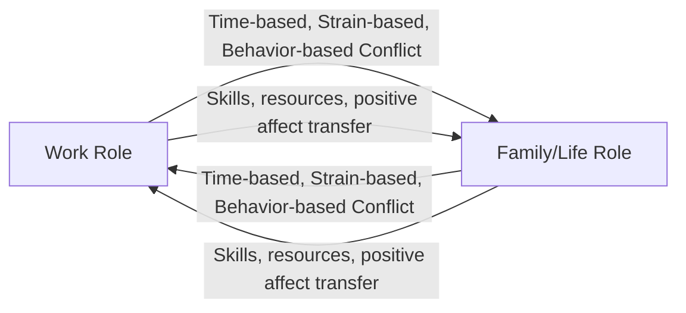

## Work-Life Balance and Boundary Management

### Definitional Landscape and Terminology Shift

"Work-life balance" is the popular umbrella term for the broader academic domain more precisely termed **work-nonwork interface research**, referring to how individuals manage the relationship, resources, and boundaries between their work role and other life domains (family, personal, community, leisure). Scholars have raised several critiques of the term itself:

**Key Points**

- The word "balance" implies a zero-sum, equally-weighted scale between two domains, which many researchers argue misrepresents the actual dynamic — work and nonwork domains can be mutually enriching (not merely competing for finite resources) or can conflict in ways that are not symmetrical for every individual.
- Alternative and increasingly preferred terms in the academic literature include **work-life integration** (implying blending rather than division), **work-nonwork interface** (a more neutral, umbrella term encompassing conflict, enrichment, and balance research), and **work-family conflict/enrichment** (used specifically when the nonwork domain of interest is family, as opposed to broader "life" which may include non-family personal domains).
- "Work-life balance" remains the dominant term in organizational practice and popular usage despite these academic critiques, and this content uses it as the umbrella term while noting the more precise underlying constructs below.

### Two Core Theoretical Traditions: Conflict and Enrichment

**Work-Family/Work-Life Conflict**

Grounded in a **scarcity hypothesis** of resources (time, energy, attention are finite), conflict theory holds that participation in the work role and the family/life role are, to some degree, mutually incompatible, such that participation in one makes participation in the other more difficult. Greenhaus and Beutell's (1985) influential typology identifies three forms:

1. **Time-based conflict**: time devoted to one role makes it physically impossible to devote time to the other (e.g., overtime hours preventing attendance at a family event)
2. **Strain-based conflict**: strain (fatigue, anxiety, irritability) generated in one role carries over and impairs functioning in the other role
3. **Behavior-based conflict**: behaviors required or reinforced in one role are incompatible with behavioral expectations in the other (e.g., an emotionally detached, authoritative managerial style carried into a home context expecting warmth and openness)

Conflict is further understood as **bidirectional**: **Work-to-Family Conflict (WFC)** — work interfering with family — and **Family-to-Work Conflict (FWC)** — family interfering with work — are distinct constructs with somewhat different antecedents and consequences, not simply mirror images of one another.

**Work-Family/Work-Life Enrichment**

Grounded in a **resource-generation (expansionist) hypothesis**, enrichment theory (formalized by Greenhaus and Powell, 2006) holds that experiences and resources gained in one role (skills, perspectives, social capital, positive affect, psychological resources) can improve the quality of functioning in the other role. Like conflict, enrichment operates bidirectionally: **Work-to-Family Enrichment (WFE)** and **Family-to-Work Enrichment (FWE)**.

**[Inference]** The relative empirical weight given to conflict versus enrichment research has shifted over time; earlier work-family research (1980s–1990s) concentrated heavily on conflict, while enrichment research has grown substantially since the mid-2000s, though conflict remains the more heavily studied of the two constructs in cumulative volume.

### Diagram: Conflict and Enrichment as Bidirectional Constructs

### Boundary Theory and Border Theory

**Key Points**

- **Boundary Theory** (Ashforth, Kreiner, & Fugate, 2000) proposes that individuals create and maintain mental, physical, and behavioral boundaries to organize their work and nonwork roles, and that these boundaries vary along a continuum from **segmentation** (strict separation between roles) to **integration** (high blending between roles).
- **Border Theory** (Clark, 2000) similarly examines the boundaries between work and family "worlds," emphasizing the concept of **border-crossers** — individuals who move daily between domains — and the role of **border-keepers** (e.g., a supervisor influencing the work border, a spouse influencing the family border) in shaping how permeable and flexible those borders are.
- Both frameworks reject a one-size-fits-all prescription: high segmentation is not universally superior to high integration or vice versa; the frameworks instead focus on **fit** between an individual's preferred boundary management style and the boundary conditions their actual work and life circumstances allow.

### The Segmentation-Integration Continuum

| Dimension | Segmentation (Low Integration) | Integration (High Integration) |
| --- | --- | --- |
| **Boundary permeability** | Low — work stays at work, home stays at home | High — work and nonwork roles blend throughout the day |
| **Psychological transition cost** | Higher discrete "switching" effort at boundary crossings (e.g., commute as a transition ritual) | Lower discrete switching effort, but higher risk of role blurring and constant partial attention to both domains |
| **Typical enabling conditions** | Fixed work location/hours, limited after-hours contact expectations | Remote/flexible work, always-on digital connectivity, autonomy over scheduling |
| **Risk if mismatched to preference** | Frustration if the individual prefers integration but is forced into rigid segmentation (e.g., no flexibility for family emergencies) | Exhaustion and role blurring if the individual prefers segmentation but is expected to remain constantly available |

**[Inference]** The rise of remote and hybrid work arrangements has generally shifted the *feasible* range of boundary management toward higher integration by default (given always-available digital connectivity), which some researchers argue has made active, deliberate boundary-setting skill more necessary than in eras when physical workplace separation provided boundary structure automatically; the degree to which this shift has net-positive or net-negative wellbeing effects appears to depend heavily on whether the increased integration is voluntary/autonomous or organizationally imposed.

### Diagram: Boundary Management Continuum

<svg xmlns="http://www.w3.org/2000/svg" viewBox="0 0 700 260">
<text x="350" y="30" text-anchor="middle" font-size="17" font-weight="bold" fill="#1a1a1a">Segmentation-Integration Continuum (svg_diagram)</text>
<line x1="80" y1="140" x2="620" y2="140" stroke="#374151" stroke-width="3" />
<rect x="80" y="90" width="200" height="100" rx="10" fill="#dbeafe" stroke="#2563eb" stroke-width="2" />
<text x="180" y="125" text-anchor="middle" font-size="14" font-weight="bold" fill="#1e3a8a">Segmentation</text>
<text x="180" y="145" text-anchor="middle" font-size="10" fill="#1e3a8a">Strict role separation</text>
<text x="180" y="160" text-anchor="middle" font-size="10" fill="#1e3a8a">Fixed hours/location</text>
<rect x="420" y="90" width="200" height="100" rx="10" fill="#fce7f3" stroke="#db2777" stroke-width="2" />
<text x="520" y="125" text-anchor="middle" font-size="14" font-weight="bold" fill="#831843">Integration</text>
<text x="520" y="145" text-anchor="middle" font-size="10" fill="#831843">Blended roles</text>
<text x="520" y="160" text-anchor="middle" font-size="10" fill="#831843">Flexible, always-on</text>

<text x="350" y="220" text-anchor="middle" font-size="12" font-style="italic" fill="`#374151`">Optimal point depends on individual preference-context fit, not a universal ideal</text>

</svg>

### Organizational Antecedents and Enablers

**Structural/Policy Factors**

- Flexible work arrangements (flextime, compressed workweeks, remote/hybrid work options)
- Paid family/parental leave policies and their duration/generosity
- Dependent care support (on-site childcare, subsidies, backup care programs)
- Formal right-to-disconnect policies limiting after-hours communication expectations

**Cultural/Climate Factors**

- **Family-supportive organizational perceptions (FSOP)** and **family-supportive supervisor behaviors (FSSB)**: the degree to which employees perceive that the organization and their direct supervisor genuinely value and support their nonwork responsibilities, as distinct from merely having formal policies on paper
- **Work-family culture**: the shared assumptions within an organization about the extent to which work demands should take priority over family/personal responsibilities, and whether utilizing available work-life policies carries a perceived career penalty

**Key Points**

- A well-documented finding in this literature is the **policy-culture gap**: organizations with generous formal work-life policies (parental leave, flexible scheduling) often see low utilization if the underlying culture stigmatizes taking advantage of them (e.g., an implicit norm that "ideal workers" never use flexible arrangements), meaning policy existence alone is a weak predictor of actual employee work-life outcomes without corresponding cultural and supervisory support.

### Individual-Level Boundary Management Tactics

- **Temporal tactics**: designating specific hours as work-only or nonwork-only, using calendar blocking
- **Physical/spatial tactics**: maintaining separate physical workspaces, particularly relevant in remote-work contexts where physical segmentation cues are otherwise absent
- **Communicative tactics**: setting explicit expectations with colleagues/supervisors about availability windows, using status indicators or auto-responses to signal boundary status
- **Behavioral/psychological tactics**: transition rituals (e.g., a specific end-of-workday routine functioning as a psychological "closing" cue in the absence of a commute)

### Worked Example: Boundary Management in a Remote Work Context

**Example**

An employee shifts to fully remote work and initially experiences role blurring — checking email throughout evenings and weekends, difficulty psychologically "leaving" work.

1. **Diagnosis**: Using Boundary Theory's segmentation-integration framework, the employee identifies a mismatch: their stated preference is for moderate segmentation, but the new remote arrangement has defaulted them into high, unintentional integration due to the loss of a commute-based transition ritual and constant device accessibility.
2. **Temporal tactic**: The employee blocks a fixed "end of workday" time on their calendar and communicates this availability window explicitly to their team.
3. **Physical tactic**: A dedicated home office space is established, with the specific behavioral rule of physically closing the door or covering the laptop at day's end as a segmentation cue replacing the lost commute ritual.
4. **Communicative tactic**: The employee proactively discusses expectations with their supervisor, confirming that after-hours email response is not actually expected despite an ambiguous prior assumption that instant responsiveness was required — directly addressing a perceived (but, on clarification, inaccurate) work-family culture expectation.
5. **Outcome**: Reduced strain-based conflict is expected as the mismatch between preferred and enacted boundary management is corrected, though the employee's individual tactics alone would not resolve the issue if the supervisor's actual expectations had genuinely required after-hours availability — underscoring that individual tactics operate within organizationally set constraints.

**[Inference]** This is a synthesized illustrative scenario rather than a documented case study.

### Measurement Approaches

- **Work-Family Conflict Scale** (Netemeyer, Boles, & McMurrian, 1996) and its extensions: the most widely used validated instrument distinguishing WFC and FWC as separate subscales
- **Work-Family Enrichment Scale** (Carlson et al., 2006): parallel validated instrument for the enrichment construct
- **Boundary/segmentation preference and enactment scales**: instruments measuring both an individual's *preferred* position on the segmentation-integration continuum and their *actual enacted* boundary management, allowing researchers to calculate preference-enactment fit/misfit as a predictor of strain

### Consequences of Work-Life Conflict and Enrichment

**Conflict-Associated Outcomes**

- Increased psychological strain, burnout risk, and job dissatisfaction
- Reduced family/relationship satisfaction and increased family-domain strain
- Increased turnover intention and absenteeism
- **[Inference]** Some research links chronic, high work-family conflict to physical health outcomes over time, though this evidence base, like much occupational-health research relying on self-report and correlational designs, faces the standard limitation that causal directionality (does conflict cause strain, does pre-existing strain amplify perceived conflict, or both) is difficult to fully establish outside longitudinal or experimental designs.

**Enrichment-Associated Outcomes**

- Higher job and family satisfaction, higher life satisfaction generally
- Better psychological wellbeing and lower depressive symptoms
- Positive spillover of skills (e.g., communication, organization, patience) developed in one domain benefiting performance in the other

### Common Failure Modes in Organizational Work-Life Approaches

- **Policy without culture change**: implementing generous flexible-work or leave policies without addressing underlying career-penalty perceptions or supervisor behaviors, resulting in low utilization and persistent conflict
- **One-size-fits-all boundary prescriptions**: mandating either strict segmentation (e.g., banning all after-hours email) or full integration (expecting constant availability) without accounting for genuine individual differences in preferred boundary management style
- **Treating work-life balance as solely a "women's issue" or parental issue**: research indicates work-nonwork interface concerns are relevant across genders, caregiving statuses, and life domains (not exclusively childcare-related), and framing programs too narrowly can under-serve large portions of the workforce
- **Ignoring supervisor-level behavior**: investing in formal organizational policy while neglecting front-line supervisor training in family-supportive behaviors, given FSSB's demonstrated influence on actual employee experience independent of policy availability
- **Boundary-management responsibility placed solely on individuals**: framing work-life balance purely as an individual time-management skill, without addressing organizationally imposed demands (understaffing, always-on cultural norms) that structurally constrain the individual's actual boundary-setting options

### Relationship to Broader Occupational Health Frameworks

- **Job Demands-Resources Model** — work-life conflict functions as a job demand (or a consequence of job demands like excessive workload/hours) within JD-R's health-impairment pathway; family-supportive resources function as buffering job resources within the same framework
- **Burnout and Its Prevention** — chronic work-family conflict is a well-established antecedent contributing to the emotional exhaustion dimension of burnout, and boundary-management skill-building is frequently incorporated into secondary-prevention burnout programming
- **Positive Organizational Behavior and Psychological Capital** — PsyCap's resilience and hope components are studied as personal resources that can buffer the negative effects of work-family conflict and enhance work-family enrichment
- **Large-Scale Organizational Transformation** — the shift toward remote/hybrid work models represents a structural transformation with direct, first-order implications for boundary management norms and work-life culture, often requiring deliberate policy and cultural redesign rather than emerging automatically from the technology shift alone

### Related Topics

- Job Demands-Resources Model
- Family-Supportive Supervisor Behaviors (FSSB)
- Remote and Hybrid Work Design
- Flexible Work Arrangements: Policy and Utilization Gaps
- Role Theory and Multiple Role Occupancy
- Gender and the Work-Family Interface
- Right-to-Disconnect Policies
- Burnout and Its Prevention
- Organizational Culture and Climate for Work-Life Support
- Telecommuting and Psychological Detachment from Work