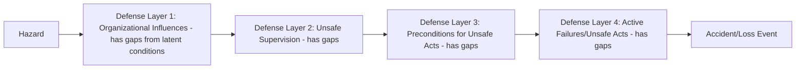

## Workplace Safety and Accident Prevention

### Definitional Scope and Field Overview

Workplace safety and accident prevention, within Organizational Psychology, focuses on the psychological, behavioral, and organizational-climate determinants of occupational accidents and injuries, distinguished from the purely engineering/ergonomic and regulatory-compliance dimensions of occupational safety (which fall more within industrial engineering and occupational medicine). This domain draws heavily on **safety climate/culture research**, **human error theory**, and **behavior-based safety** methodologies.

### Heinrich's Accident Triangle and Its Legacy

Herbert Heinrich's early (1931) research proposed a ratio between minor incidents, near-misses, and serious/fatal accidents — commonly depicted as a triangle or pyramid, suggesting that a large base of minor unsafe acts and near-misses underlies a smaller number of serious injuries. The original claimed ratio (approximately 300 no-injury incidents : 29 minor injuries : 1 major injury) is one of the most frequently cited heuristics in the field's history.

**Key Points**

- Heinrich's original ratio has been substantially criticized in later safety-science scholarship: the underlying methodology (a 1930s analysis of insurance claims data) has been questioned for its rigor, generalizability across industries, and the assumption of a fixed, universal ratio applicable to all workplace contexts.
- **[Inference]** Despite these methodological critiques, the triangle's core conceptual insight — that minor incidents and near-misses share common causal roots with serious accidents, and that intervening at the base (reducing minor unsafe acts/conditions) can reduce the likelihood of severe outcomes — remains broadly influential in safety practice, even as the specific numerical ratio is treated with more caution in contemporary academic safety science than in earlier practitioner literature.
- Heinrich's original work also proposed that the majority of accidents (a commonly cited figure around 88%) result from "unsafe acts" (human error/behavior) rather than "unsafe conditions" (physical/mechanical hazards) — this heavy weighting toward individual behavioral causation has been particularly contested by later researchers who argue it understates the role of organizational and systemic factors, discussed further below.

### Diagram: Accident Triangle (Heinrich's Model)

<svg xmlns="http://www.w3.org/2000/svg" viewBox="0 0 700 400">
<text x="350" y="30" text-anchor="middle" font-size="17" font-weight="bold" fill="#1a1a1a">Heinrich's Accident Triangle (svg_diagram)</text>
<polygon points="350,70 480,180 220,180" fill="#fee2e2" stroke="#dc2626" stroke-width="2" />
<text x="350" y="140" text-anchor="middle" font-size="12" font-weight="bold" fill="#7f1d1d">1 Major Injury</text>
<polygon points="220,180 480,180 530,270 170,270" fill="#fef3c7" stroke="#d97706" stroke-width="2" />
<text x="350" y="230" text-anchor="middle" font-size="12" font-weight="bold" fill="#78350f">29 Minor Injuries</text>
<polygon points="170,270 530,270 590,370 110,370" fill="#dcfce7" stroke="#16a34a" stroke-width="2" />
<text x="350" y="325" text-anchor="middle" font-size="12" font-weight="bold" fill="#14532d">300 No-Injury Incidents / Near-Misses</text>

<text x="350" y="390" text-anchor="middle" font-size="11" font-style="italic" fill="`#374151`">Original ratio contested in later safety science; conceptual logic remains widely referenced</text>

</svg>

### Human Error Theory: Reason's Swiss Cheese Model

James Reason's Swiss Cheese Model reframes accidents as the result of failures across multiple organizational defense layers aligning, rather than a single unsafe act. Key concepts:

- **Active failures**: unsafe acts committed by individuals at the point of operation (slips, lapses, mistakes, violations) — the immediately visible, proximal cause
- **Latent conditions**: underlying organizational weaknesses (poor design, inadequate training, understaffing, production pressure, deficient maintenance) that lie dormant within the system, sometimes for extended periods, until they combine with an active failure to produce an accident
- **Defensive layers**: the barriers, safeguards, and controls (procedures, supervision, physical safeguards, alarms) intended to prevent latent conditions and active failures from resulting in an actual accident

The model's central metaphor: each defensive layer contains "holes" (weaknesses) that shift and vary over time; an accident occurs only when the holes in multiple layers momentarily align, allowing a hazard trajectory to pass through all defenses.

**Key Points**

- Reason's model is widely credited with shifting safety-science emphasis away from a purely individual-blame ("who made the unsafe act") orientation toward a **systemic** orientation examining why the organizational conditions allowed that act to result in harm — directly relevant to critiquing Heinrich's heavy weighting toward individual "unsafe acts" as the dominant accident cause.
- This systemic reframing underlies the widely adopted **"Just Culture"** approach to safety investigation, which distinguishes between honest human error (which should be addressed through system redesign, not punishment), at-risk behavior (addressed through coaching), and reckless behavior (which may warrant disciplinary action) — treating uniform punitive responses to all errors as counterproductive to genuine safety improvement.

### Diagram: Swiss Cheese Model

### Safety Climate and Safety Culture

**Key Points**

- **Safety climate** refers to employees' shared perceptions of the priority placed on safety within their organization at a given point in time — typically measured through survey instruments assessing perceived management commitment to safety, safety communication, safety training adequacy, and the perceived balance between production pressure and safety priorities.
- **Safety culture** is generally understood as a broader, deeper, and more temporally stable construct than safety climate — encompassing shared underlying values, assumptions, and norms about safety that persist over time and shape organizational behavior even without explicit safety messaging, whereas climate is often described as a more surface-level, more readily measurable "snapshot" manifestation of the underlying culture.
- **[Inference]** The precise conceptual boundary between safety climate and safety culture is not fully standardized across the literature; some researchers treat them as points on the same continuum (climate as the measurable surface layer of a deeper culture) while others maintain a sharper conceptual distinction, and this terminological variation should be noted when comparing findings across studies.

### Zohar's Safety Climate Model and Levels of Analysis

Dov Zohar's foundational safety climate research established several enduring principles:

- Safety climate perceptions are shaped heavily by **perceived management priorities**, specifically whether employees perceive that safety is prioritized even when it conflicts with production speed or cost pressures — this perceived priority, more than the mere existence of safety policies, is one of the most consistently replicated predictors of safety climate strength across studies
- Safety climate operates at **multiple organizational levels**: organization-level climate (perceptions of top management) and **group-level (supervisor-level) climate** — perceptions specific to one's immediate supervisor's safety priorities — with research indicating supervisor-level climate can have particularly proximal influence on frontline safety behavior, sometimes independent of organization-level climate perceptions
- **Climate strength**: the degree of agreement/consensus among employees about safety climate perceptions is itself a meaningful construct — a strong, consensual climate (whether positive or negative) tends to predict behavior more reliably than a weak, fragmented climate with high perceptual variance across employees

### Behavior-Based Safety (BBS)

Behavior-Based Safety is an applied intervention approach grounded in behavioral psychology (operant conditioning principles), focused on identifying and modifying specific, observable safety-related behaviors through structured observation and feedback:

1. **Identify critical behaviors**: pinpoint specific, observable, safety-critical behaviors relevant to the workplace (e.g., proper lifting technique, PPE usage, lockout/tagout procedure adherence)
2. **Develop a behavioral checklist**: create a structured observation instrument covering the identified critical behaviors
3. **Peer observation**: trained employee observers (not solely management/safety staff) conduct structured, non-punitive observations of coworkers performing these behaviors
4. **Feedback**: observers provide immediate, specific, non-judgmental feedback to the observed employee, reinforcing safe behaviors and constructively addressing at-risk behaviors
5. **Data aggregation and trend analysis**: observation data is aggregated (without individual attribution used punitively) to identify systemic behavioral trends and inform broader safety interventions

**Key Points**

- BBS is explicitly designed to be **non-punitive** at the point of observation and feedback — using observation data to identify systemic patterns and reinforce safe behavior, rather than as a disciplinary mechanism — since punitive use of BBS data is widely cited as undermining the trust required for the peer-observation process to function and can drive underreporting of both unsafe behaviors and near-misses.
- **[Unverified]** BBS effectiveness evidence is mixed in the broader safety-science literature: while individual organizational case studies and some meta-analyses report meaningful injury-rate reductions following BBS implementation, critics argue that BBS's behavioral focus can, if implemented without attention to Reason's latent-conditions/systemic factors, over-emphasize individual behavior correction at the expense of addressing upstream organizational and design-level safety deficiencies — a critique structurally similar to concerns raised about Heinrich's original unsafe-acts emphasis.

### Worked Example: Diagnosing a Recurring Injury Pattern

**Example**

A warehouse experiences a recurring pattern of minor back strain injuries among order-picking staff.

1. **Heinrich-triangle-informed base-level attention**: Rather than waiting for another major injury, near-miss reports and minor strain incidents (the wide base of the triangle) are systematically logged and analyzed rather than dismissed as inconsequential.
2. **Swiss Cheese analysis**: Investigation reveals the active failure (improper lifting technique) is consistently linked to a latent condition — shelving heights requiring awkward reach angles that were never redesigned after a product-line change increased typical item weight — and a second latent condition: staffing levels that create time pressure discouraging use of proper, slower lifting technique.
3. **Safety climate diagnosis**: A brief climate survey reveals staff perceive that supervisors implicitly prioritize picking speed over lifting technique compliance, despite formal training materials stating the opposite — a mismatch between stated policy and perceived supervisor priority.
4. **Systemic intervention (addressing latent conditions)**: Shelving is redesigned to reduce awkward reach angles; staffing levels are reviewed to reduce the time pressure driving technique shortcuts.
5. **Behavioral reinforcement (BBS component)**: Trained peer observers provide structured, non-punitive feedback on lifting technique, reinforcing correct technique now that the physical and time-pressure barriers have been addressed rather than applying BBS feedback to a workforce still facing genuine structural obstacles to compliance.

**[Inference]** This is a synthesized illustrative scenario demonstrating the integration of triangle, systemic, climate, and behavioral frameworks rather than a documented case; sequencing systemic fixes before or alongside behavioral intervention (rather than behavioral intervention alone) reflects the field's general critique of purely individual-behavior-focused approaches.

### Measurement Instruments

- **Nordic Safety Climate Questionnaire (NOSACQ-50)**: a widely used, cross-nationally validated instrument measuring safety climate across multiple dimensions (management safety priority, safety communication, workers' safety commitment, among others)
- **Zohar's Safety Climate Questionnaire (SCQ)**: one of the original validated instruments, available in organization-level and supervisor-level versions
- **Near-miss and incident reporting systems**: quantitative behavioral/outcome data (not a survey instrument per se) used to triangulate against climate survey findings, since a gap between reported climate perceptions and actual incident/near-miss trends can itself be diagnostically informative

### Organizational and Leadership Factors

- **Management commitment and visible leadership involvement**: safety walk-throughs, leadership participation in safety meetings, and visible resource allocation to safety initiatives are consistently associated with stronger safety climate
- **Transformational safety leadership**: supervisor behaviors that inspire and engage employees around safety as a shared value (rather than purely transactional compliance-monitoring) show associations with stronger safety climate and safety behavior in the research literature
- **Psychological safety for incident reporting**: employees' confidence that reporting a near-miss or error will not result in punitive consequences is a critical precondition for the accurate incident data needed to identify latent conditions before they combine into a major accident
- **Production pressure management**: explicit organizational mechanisms (staffing buffers, realistic scheduling, empowerment to slow down or stop work when safety is at risk) to prevent the perceived production-safety trade-off that undermines safety climate

### Common Failure Modes in Workplace Safety Programs

- **Individual-blame investigation culture**: defaulting to disciplinary action following incidents rather than systemic Swiss-Cheese-style investigation, which suppresses future reporting and leaves latent conditions unaddressed
- **Safety theater**: visible but substantively hollow safety initiatives (posters, slogans, one-time training) without corresponding investment in addressing actual latent organizational conditions or genuine management prioritization
- **Punitive misuse of behavioral observation data**: using BBS observation records for disciplinary purposes, undermining the trust the peer-observation methodology depends on
- **Overreliance on lagging indicators**: managing safety purely through after-the-fact injury-rate metrics rather than leading indicators (near-miss reporting rates, safety climate survey trends, safety training completion) that can flag latent risk before a serious accident occurs
- **Climate-culture mismatch**: formal safety policy and training that contradicts the actual perceived priorities communicated by supervisor behavior and production pressure, producing the policy-perception gap that undermines genuine safety climate

### Relationship to Broader Occupational Health Frameworks

- **Job Demands-Resources Model** — production pressure and understaffing function as job demands directly implicated as latent conditions in accident causation; safety climate and supervisor support function as job resources buffering safety-related strain
- **Burnout and Its Prevention** — fatigue and exhaustion (core burnout symptoms) are established contributors to human error and active failures in Reason's model, linking burnout prevention directly to accident-prevention outcomes
- **Organizational Culture** — safety culture is often studied as a specific sub-domain or manifestation of broader organizational culture, sharing measurement and intervention logic with general culture-change literature
- **The Change Agent and Consulting Role** — safety culture transformation initiatives typically require sustained change-management approaches (contracting, diagnosis, coalition-building) rather than one-time training interventions, drawing directly on broader OD change methodology

### Related Topics

- Reason's Swiss Cheese Model and Systemic Accident Causation
- Just Culture and Non-Punitive Incident Investigation
- Safety Climate Measurement (NOSACQ-50, Zohar's SCQ)
- Behavior-Based Safety Program Design
- High Reliability Organizations (HRO) Theory
- Human Factors and Ergonomics in Accident Prevention
- Near-Miss Reporting Systems and Leading Indicators
- Transformational Leadership and Safety Outcomes
- Job Demands-Resources Model
- Fatigue Risk Management in High-Hazard Industries