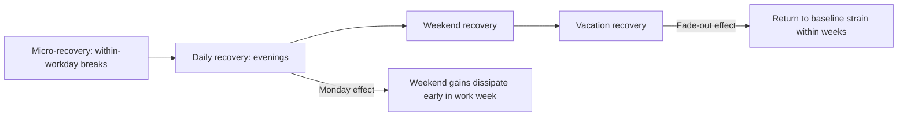

## Resilience and Recovery from Work

### Definitional Overview: Two Related but Distinct Constructs

This topic spans two related but conceptually distinct literatures within occupational health psychology:

- **Recovery from work** refers to the process by which an individual's functional systems (psychological, physiological) that were taxed during work return to their pre-stressor state during non-work time (evenings, weekends, vacations). It is fundamentally about *replenishing depleted resources* after work-related effort expenditure.
- **Resilience** (in the occupational context) refers to the capacity to maintain or quickly regain functioning in the face of adversity, setbacks, or significant stressors — a broader construct spanning both the ability to withstand strain and the ability to bounce back afterward, distinct from routine day-to-day recovery from ordinary work exertion.

**Key Points**

- Recovery research is grounded primarily in **Effort-Recovery Theory** (Meijman & Mulder) and the closely related **Conservation of Resources (COR) Theory** (Hobfoll); resilience research draws on a broader interdisciplinary base including clinical/developmental psychology and, within organizational psychology specifically, overlaps substantially with Positive Organizational Behavior's PsyCap resilience component.
- These two constructs are complementary rather than competing: routine recovery processes address everyday effort expenditure, while resilience becomes especially relevant during acute or chronic adversity beyond the scope of ordinary daily recovery needs (major organizational change, significant setbacks, crisis events).

### Effort-Recovery Theory and the Recovery Paradox

Effort-Recovery Theory proposes that expending effort at work activates physiological and psychological load reactions; if adequate recovery time follows, these reactions subside and resources return to baseline. If recovery is systematically insufficient, load reactions can accumulate over time, contributing to sustained strain and eventually chronic health problems — providing a mechanistic link between insufficient recovery and burnout's health-impairment pathway.

**Key Points**

- The **recovery paradox** describes a well-documented phenomenon: individuals experiencing the highest job demands and greatest need for recovery often engage in the *least* effective recovery behaviors (e.g., continuing to think about work, remaining digitally connected, skipping vacation, or replacing recovery activities with additional obligations), precisely when recovery would be most beneficial — a self-reinforcing pattern that can deepen strain over time.

### The Four Recovery Experiences (Sonnentag & Fritz)

Sabine Sonnentag and Charlotte Fritz's widely used framework identifies four qualitatively distinct experiences during non-work time associated with effective recovery, each operating through a somewhat different mechanism:

1. **Psychological Detachment**: mentally disengaging from work during non-work time — not merely being physically away from the workplace, but ceasing to think about work-related issues, tasks, or problems
2. **Relaxation**: a state of low activation and increased positive affect, achieved through activities that reduce physiological and psychological arousal (e.g., leisurely activities, light exercise, restful pursuits)
3. **Mastery Experiences**: engaging in challenging, non-work activities that provide opportunities to learn or achieve something outside the work domain (e.g., learning a new skill, pursuing a hobby with a growth component), theorized to build new resources rather than merely restoring depleted ones
4. **Control**: the sense of being able to decide for oneself how to spend one's non-work time, as opposed to having leisure time dictated or constrained by external obligations

**Key Points**

- **Psychological Detachment** is generally identified in this literature as the most consistently and strongly supported predictor of recovery and reduced strain among the four experiences, though all four show independent associations with wellbeing outcomes in the research base.
- These four experiences are not mutually exclusive and often co-occur within a single activity (e.g., a hobby involving physical movement in a natural setting might simultaneously provide relaxation, mastery, and psychological detachment).

### Diagram: The Four Recovery Experiences

<svg xmlns="http://www.w3.org/2000/svg" viewBox="0 0 700 400">
<text x="350" y="30" text-anchor="middle" font-size="17" font-weight="bold" fill="#1a1a1a">Sonnentag &amp; Fritz's Four Recovery Experiences (svg_diagram)</text>
<rect x="50" y="70" width="280" height="130" rx="10" fill="#dbeafe" stroke="#2563eb" stroke-width="2" />
<text x="190" y="105" text-anchor="middle" font-size="14" font-weight="bold" fill="#1e3a8a">Psychological Detachment</text>
<text x="190" y="130" text-anchor="middle" font-size="11" fill="#1e3a8a">Mentally disengaging</text>
<text x="190" y="150" text-anchor="middle" font-size="11" fill="#1e3a8a">from work concerns</text>
<text x="190" y="175" text-anchor="middle" font-size="10" font-style="italic" fill="#1e3a8a">Most consistently supported</text>
<rect x="370" y="70" width="280" height="130" rx="10" fill="#dcfce7" stroke="#16a34a" stroke-width="2" />
<text x="510" y="105" text-anchor="middle" font-size="14" font-weight="bold" fill="#14532d">Relaxation</text>
<text x="510" y="130" text-anchor="middle" font-size="11" fill="#14532d">Low activation state</text>
<text x="510" y="150" text-anchor="middle" font-size="11" fill="#14532d">Increased positive affect</text>
<rect x="50" y="230" width="280" height="130" rx="10" fill="#fef3c7" stroke="#d97706" stroke-width="2" />
<text x="190" y="265" text-anchor="middle" font-size="14" font-weight="bold" fill="#78350f">Mastery Experiences</text>
<text x="190" y="290" text-anchor="middle" font-size="11" fill="#78350f">Challenging, non-work</text>
<text x="190" y="310" text-anchor="middle" font-size="11" fill="#78350f">learning/achievement</text>
<rect x="370" y="230" width="280" height="130" rx="10" fill="#fce7f3" stroke="#db2777" stroke-width="2" />
<text x="510" y="265" text-anchor="middle" font-size="14" font-weight="bold" fill="#831843">Control</text>
<text x="510" y="290" text-anchor="middle" font-size="11" fill="#831843">Autonomy over how</text>
<text x="510" y="310" text-anchor="middle" font-size="11" fill="#831843">non-work time is spent</text>
</svg>

### Recovery Timescales and Contexts

- **Micro-recovery**: brief within-workday breaks (short pauses, lunch breaks) that can partially replenish resources during the workday itself
- **Daily recovery**: evening/after-work recovery, the primary focus of most recovery-experience research (Sonnentag & Fritz's framework was developed principally in this context)
- **Weekend recovery**: recovery accumulated over non-work days, generally showing a distinguishable pattern from single-evening recovery, including a well-documented **"Monday effect"** where wellbeing gains accrued over a weekend tend to dissipate within the early part of the following work week
- **Vacation recovery**: longer-duration recovery periods, associated with more pronounced but also frequently **more transient** wellbeing gains — research has found vacation-related wellbeing improvements often fade within a few weeks of returning to work, a finding sometimes called the **fade-out effect**

**[Inference]** The specific duration of the fade-out effect varies across studies and depends heavily on post-vacation working conditions (e.g., whether workload immediately spikes upon return); it is not a fixed universal timeline but a well-replicated general pattern.

### Diagram: Recovery Timescales

### Barriers to Effective Recovery

- **Technology-enabled availability expectations**: smartphone-enabled constant connectivity, making psychological detachment more difficult to achieve even when physically away from work, directly relevant to boundary-management and work-life integration research
- **Rumination and work-related worry**: cognitive processes (particularly affective rumination — repetitive negative emotional processing of work events) that actively prevent psychological detachment even in the physical absence of work demands
- **High job demands carrying over**: workload and time pressure that consume non-work time directly (working late, weekend work) or indirectly (fatigue limiting the capacity to engage in restorative activities)
- **The recovery paradox itself**: as noted above, the tendency for those most in need of recovery to engage in the fewest effective recovery behaviors, sometimes linked to a sense that stepping away is not permissible given workload, or to guilt/anxiety about disengaging

### Resilience: Definitions and Trait-Process Debate

**Key Points**

- A long-standing debate in resilience research concerns whether resilience is better conceptualized as a relatively stable **trait** (an individual's baseline capacity for adaptation, present prior to any given adversity) or as a **dynamic process** (an outcome that emerges through the interaction of the individual, their environment, and the specific adversity encountered, and which can therefore vary across different stressor episodes for the same individual).
- Most contemporary organizational-psychology treatments (including the PsyCap conceptualization) favor a **state-like, developable process view** of resilience — consistent with POB's inclusion criteria discussed elsewhere — over a fixed trait view, since a purely fixed-trait conceptualization would place resilience outside the scope of workplace intervention.
- Resilience is generally distinguished from mere absence of negative outcomes (not being harmed) — the more precise definition emphasizes **positive adaptation despite significant adversity**, implying that some genuine challenge or disruption to normal functioning must be present for resilience to be meaningfully demonstrated.

### Individual and Organizational Resilience-Building Factors

**Individual-Level**

- Cognitive reappraisal and reframing skills (viewing setbacks as manageable and temporary rather than catastrophic and permanent)
- Strong social support networks, both within and outside the workplace
- PsyCap's HERO components (hope, efficacy, resilience itself as a component, optimism), which mutually reinforce broader resilience capacity
- Physical health behaviors (sleep, exercise) that support the physiological substrate underlying psychological resilience capacity

**Organizational-Level**

- Psychological safety, enabling employees to acknowledge struggle and seek support without stigma
- Manager support behaviors during setbacks (constructive, developmental response to failure rather than purely punitive response)
- Structural buffers (adequate staffing, realistic workload) that prevent chronic overload from depleting the baseline resources resilience draws upon
- Formal resilience-training programs, though these carry the same critique noted in the burnout-prevention literature: individual-level resilience training should complement, not substitute for, organizational-level structural intervention addressing root-cause stressors

### Worked Example: Applying Recovery and Resilience Concepts to a High-Intensity Role

**Example**

A management consultant working on an extended, high-pressure client engagement reports difficulty "switching off" in the evenings and has begun skipping planned weekend activities to remain available for client emails.

1. **Recovery diagnosis**: The pattern reflects the recovery paradox directly — the period of highest demand is producing the lowest engagement in Psychological Detachment (the most robustly supported recovery experience), replaced by continued cognitive engagement with work (affective rumination about client deliverables).
2. **Targeted recovery intervention**: Rather than a generic "take more time off" recommendation, the intervention specifically targets detachment: establishing a firm boundary (e.g., no client email checking after 8pm except pre-defined emergency contact protocol), directly restoring the specific recovery experience diagnosed as most deficient.
3. **Resilience consideration**: Because the engagement is time-limited and unusually demanding (an acute adversity context beyond ordinary daily workload), resilience-specific support is also introduced — a structured debrief with the engagement manager after the project concludes, explicitly processing what was learned and reframing the experience constructively, consistent with resilience's "positive adaptation despite adversity" definition rather than simply returning to baseline once the pressure ends.
4. **Organizational-level component**: The firm reviews staffing ratios for similarly intensive engagements to address the structural root cause, rather than relying solely on individual boundary-setting and post-hoc resilience support to manage what is, in part, a workload design problem.

**[Inference]** This is a synthesized illustrative scenario rather than a documented case study.

### Measurement Instruments

- **Recovery Experience Questionnaire (REQ)** (Sonnentag & Fritz, 2007): the standard validated instrument measuring the four recovery experiences (detachment, relaxation, mastery, control)
- **Connor-Davidson Resilience Scale (CD-RISC)**: a widely used general resilience measure, though not organization-specific, frequently adapted for occupational research
- **PsyCap Questionnaire (PCQ-24)** resilience subscale: the organization-specific resilience measure most directly integrated into the broader POB/PsyCap framework covered elsewhere in this chapter

### Common Failure Modes in Recovery and Resilience Programming

- **Confusing time-off with recovery**: providing vacation time or reduced hours without addressing psychological detachment specifically — an employee can be physically absent from work while remaining cognitively engaged through rumination or continued digital connectivity, undermining the actual recovery benefit
- **Ignoring the recovery paradox in program design**: designing voluntary, opt-in recovery/wellness programs that are, by the paradox's own logic, least likely to be used by the highest-demand employees who need them most, without addressing the structural or cultural barriers preventing uptake
- **Individualizing resilience while ignoring structural root causes**: as with burnout and PsyCap critiques, framing resilience purely as a personal skill to be trained, while sustained organizational conditions (chronic understaffing, unrealistic deadlines) continuously deplete the very resources resilience depends on
- **Underestimating fade-out effects**: treating a single vacation or wellness intervention as a durable fix without attention to post-intervention working conditions that determine whether gains are sustained or rapidly dissipate

### Relationship to Broader Occupational Health Frameworks

- **Conservation of Resources Theory** — provides the broader theoretical mechanism (resource loss/gain spirals) underlying both effort-recovery dynamics and resilience's capacity to draw upon and rebuild psychological resources after depletion
- **Job Demands-Resources Model** — insufficient recovery is a direct mechanism through which sustained job demands translate into the health-impairment pathway toward exhaustion and burnout; effective recovery and resilience function as buffering personal processes/resources within this model
- **Burnout and Its Prevention** — chronic recovery deficits are a well-established proximal antecedent of burnout's exhaustion dimension, making recovery-focused intervention a natural component of burnout prevention programming
- **Positive Organizational Behavior and Psychological Capital** — resilience as a PsyCap HERO component directly overlaps with this topic's broader resilience literature, with PsyCap providing the more intervention-oriented, workplace-specific operationalization
- **Work-Life Balance and Boundary Management** — psychological detachment and boundary segmentation are closely related constructs, both concerned with the individual's capacity to disengage from work during non-work time, though recovery research emphasizes the wellbeing/resource-restoration function specifically while boundary research emphasizes broader role-management dynamics

### Related Topics

- Conservation of Resources Theory (Hobfoll)
- Effort-Recovery Theory (Meijman & Mulder)
- Recovery Experience Questionnaire and Its Applications
- Affective Rumination and Work-Related Worry
- Positive Organizational Behavior and Psychological Capital
- Burnout and Its Prevention
- Work-Life Balance and Boundary Management
- Sleep and Occupational Health
- Vacation Research and the Fade-Out Effect
- Psychological Safety and Organizational Support for Recovery