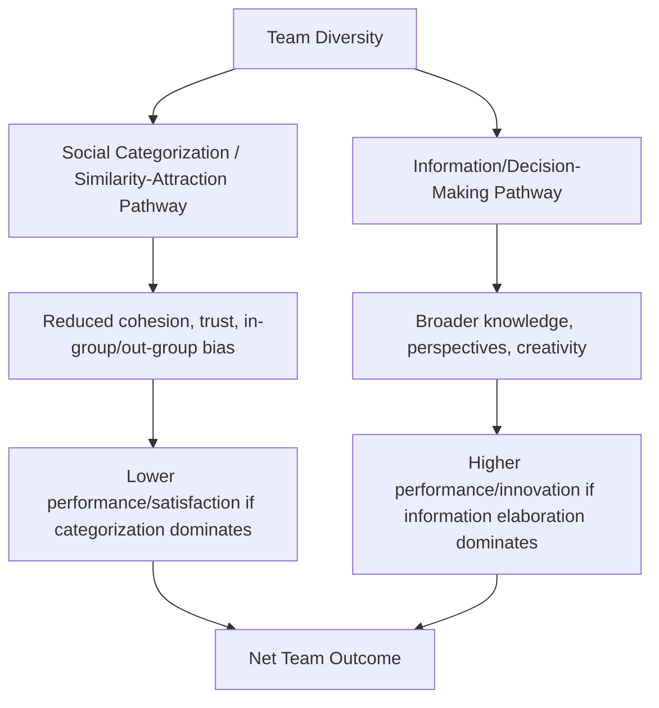
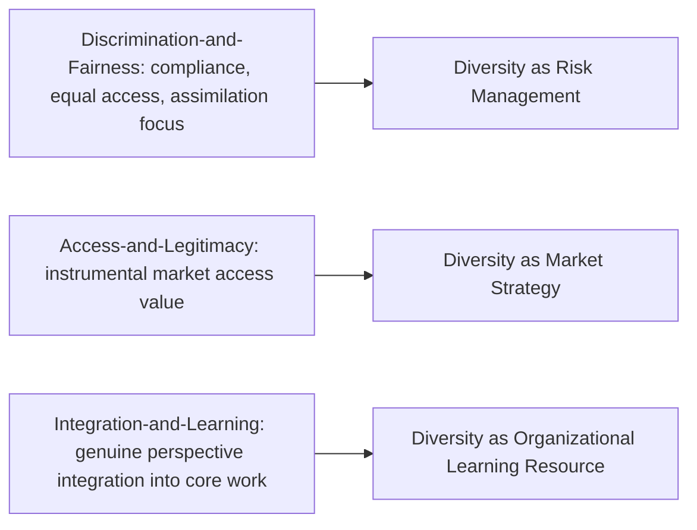

## Theories of Diversity in Organizations

### Definitional Scope and Types of Diversity

Organizational diversity theory examines how differences among organizational members influence individual, group, and organizational outcomes. A foundational conceptual distinction organizes most of the field:

- **Surface-level (demographic) diversity**: readily observable characteristics such as age, race/ethnicity, gender, and physical ability
- **Deep-level diversity**: less immediately observable characteristics such as values, attitudes, personality, beliefs, and cognitive/informational differences, which typically become apparent only through interaction over time

**Key Points**

- A well-replicated finding across diversity research is that the influence of surface-level diversity on group processes and outcomes tends to **diminish over time as group members interact**, while deep-level diversity's influence tends to **increase over time** as members learn more about each other's actual values, attitudes, and perspectives — meaning demographic diversity's effects are not fixed but shift as relationships develop (Harrison, Price, & Bell, 1998).

### Major Theoretical Perspectives on Diversity's Effects

**Social Categorization Theory / Social Identity Theory**

Grounded in Tajfel and Turner's Social Identity Theory, this perspective proposes that individuals categorize themselves and others into social groups (based on demographic or other salient characteristics), and that this categorization process produces **in-group favoritism** and **out-group bias**, even on the basis of minimal or arbitrary distinctions. Applied to organizational diversity, this perspective predicts that surface-level diversity can trigger categorization processes that reduce group cohesion, trust, and cooperation, particularly when demographic fault lines align with other organizational divisions (e.g., all members of one demographic group also sharing a functional department or tenure cohort).

**Similarity-Attraction Paradigm**

Byrne's similarity-attraction theory proposes that individuals are attracted to and prefer interacting with others who are similar to themselves (in attitudes, values, or demographic characteristics), predicting that diverse groups may experience lower interpersonal attraction, cohesion, and communication quality compared to homogeneous groups, at least initially.

**Information/Decision-Making Perspective**

This perspective, in contrast to the categorization-based theories above, proposes that diversity is a valuable resource: diverse groups possess a broader range of task-relevant knowledge, skills, perspectives, and networks, which can improve decision-making quality, creativity, and problem-solving — provided the group can effectively integrate and process this diversity of information rather than experiencing it as purely divisive.

**Key Points**

- These perspectives are not mutually exclusive competing theories so much as complementary lenses explaining **different, sometimes opposing, mechanisms** through which diversity can influence outcomes simultaneously — this is central to why diversity's empirical relationship with team performance has been famously inconsistent across studies (see the Categorization-Elaboration Model below, which attempts to reconcile this inconsistency).

### Diagram: Competing Theoretical Mechanisms

### The Categorization-Elaboration Model (CEM)

Van Knippenberg, De Dreu, and Homan's Categorization-Elaboration Model was developed explicitly to reconcile the conflicting predictions of the categorization/similarity-attraction perspectives and the information/decision-making perspective. Its central proposition: **diversity's effect on performance is conditional**, depending on whether **elaboration of task-relevant information** (deep processing, discussion, and integration of diverse perspectives) occurs, versus whether **social categorization processes** dominate group interaction instead.

**Key Points**

- CEM identifies several **moderating conditions** that determine which pathway dominates: task characteristics (complex, non-routine tasks requiring information elaboration benefit more from diversity than simple, routine tasks), group processes (psychological safety and constructive task conflict promote elaboration; while identity threat and destructive relationship conflict promote categorization), and the degree to which diversity dimensions are made salient versus de-emphasized in the group's functioning.
- This model represented a significant theoretical advance because it moved the field away from asking "does diversity help or hurt performance" (a question that produced inconsistent findings across decades of research) toward asking "**under what conditions** does diversity help or hurt performance" — a more nuanced and empirically tractable framing.

### Diagram: Categorization-Elaboration Model

<svg xmlns="http://www.w3.org/2000/svg" viewBox="0 0 700 380">
<text x="350" y="30" text-anchor="middle" font-size="16" font-weight="bold" fill="#1a1a1a">Categorization-Elaboration Model (svg_diagram)</text>
<rect x="270" y="60" width="160" height="60" rx="8" fill="#e0e7ff" stroke="#4338ca" stroke-width="2" />
<text x="350" y="95" text-anchor="middle" font-size="13" font-weight="bold" fill="#312e81">Team Diversity</text>
<line x1="350" y1="120" x2="350" y2="160" stroke="#374151" stroke-width="2" />
<rect x="80" y="165" width="220" height="90" rx="8" fill="#fee2e2" stroke="#dc2626" stroke-width="2" />
<text x="190" y="195" text-anchor="middle" font-size="12" font-weight="bold" fill="#7f1d1d">Social Categorization</text>
<text x="190" y="215" text-anchor="middle" font-size="10" fill="#7f1d1d">Favored when: identity threat,</text>
<text x="190" y="230" text-anchor="middle" font-size="10" fill="#7f1d1d">low psych. safety, simple tasks</text>
<rect x="400" y="165" width="220" height="90" rx="8" fill="#dcfce7" stroke="#16a34a" stroke-width="2" />
<text x="510" y="195" text-anchor="middle" font-size="12" font-weight="bold" fill="#14532d">Information Elaboration</text>
<text x="510" y="215" text-anchor="middle" font-size="10" fill="#14532d">Favored when: psych. safety,</text>
<text x="510" y="230" text-anchor="middle" font-size="10" fill="#14532d">complex tasks, task conflict</text>
<line x1="190" y1="255" x2="190" y2="290" stroke="#374151" stroke-width="2" />
<line x1="510" y1="255" x2="510" y2="290" stroke="#374151" stroke-width="2" />
<rect x="80" y="295" width="220" height="55" rx="8" fill="#fef3c7" stroke="#d97706" stroke-width="2" />
<text x="190" y="325" text-anchor="middle" font-size="11" font-weight="bold" fill="#78350f">Negative Performance Effect</text>
<rect x="400" y="295" width="220" height="55" rx="8" fill="#fef3c7" stroke="#d97706" stroke-width="2" />
<text x="510" y="325" text-anchor="middle" font-size="11" font-weight="bold" fill="#78350f">Positive Performance Effect</text>
</svg>

### Faultline Theory

Lau and Murnighan's Faultline Theory proposes that the key predictor of diversity's negative effects is not diversity per se but **the alignment of multiple diversity dimensions into coherent subgroups** — "faultlines" — within a team. A team with high overall diversity but no aligned faultlines (e.g., diversity dimensions cross-cut rather than correlate) is theorized to function differently than a team with the same aggregate diversity level but strong faultlines (e.g., all women on a team also share the same functional background and tenure, creating a clearly demarcated subgroup boundary against the rest of the team).

**Key Points**

- Strong faultlines are associated with increased subgroup conflict, reduced information sharing across the faultline boundary, and lower team performance and cohesion compared to weak or absent faultlines, even holding overall diversity levels constant.
- This theory has practical implications for team composition: deliberately cross-cutting diversity dimensions (ensuring demographic diversity does not align neatly with functional, tenure, or other salient groupings) can reduce faultline strength even when overall diversity is high.

### Relational Demography Theory

Relational demography examines an individual's demographic similarity or dissimilarity **relative to their immediate work group or organization**, rather than diversity as an aggregate group-level property. This individual-level focus predicts that being demographically dissimilar from one's immediate coworkers or supervisor (regardless of the group's overall diversity level) is associated with outcomes such as lower perceived inclusion, lower psychological attachment, and higher turnover intention for the dissimilar individual — a distinct unit of analysis from the group-level theories above.

### Diversity Management Paradigms (Ely & Thomas)

Robin Ely and David Thomas's influential framework identifies distinct organizational **paradigms** or rationales underlying diversity management approaches, each with different implications for how diversity is expected to translate into outcomes:

1. **Discrimination-and-Fairness Paradigm**: diversity is pursued primarily as a matter of equal opportunity, fair treatment, and compliance; success is measured by proportional representation, and the underlying assumption is that differences should be minimized/assimilated once fair access is achieved
2. **Access-and-Legitimacy Paradigm**: diversity is valued instrumentally for its ability to help the organization access and effectively serve diverse markets/constituencies; this paradigm risks confining diverse employees to roles seen as leveraging their demographic background specifically (e.g., a bilingual employee assigned only to that market segment) rather than fully integrating their broader capabilities
3. **Integration-and-Learning Paradigm**: diversity is valued for the genuinely different perspectives, knowledge, and ways of working that members bring, which are actively integrated into the organization's core work processes and decision-making, not merely tolerated or instrumentally leveraged — this paradigm aligns most closely with the information/decision-making theoretical perspective and with CEM's elaboration pathway

**[Inference]** Ely and Thomas's own research suggested the Integration-and-Learning paradigm was associated with the most positive functional outcomes from diversity among the three; this remains a frequently cited but not universally replicated finding, and the practical difficulty of genuinely operationalizing an integration-and-learning approach (versus merely aspiring to it rhetorically) is a recurring theme in later critical commentary on the framework's application.

### Diagram: Ely and Thomas's Diversity Paradigms

### Worked Example: Applying Multiple Theories to a Product Team Composition Decision

**Example**

An organization is forming a new cross-functional product team and must decide how to compose it.

- **Faultline-aware composition**: Rather than grouping by convenience (e.g., all engineers from one office, all marketers from another, creating an office-based faultline that could align with functional and possibly demographic differences), the team is deliberately composed to cross-cut potential faultlines — mixing office locations, tenure levels, and functional backgrounds so no single alignment creates a coherent subgroup boundary.
- **CEM-informed process design**: Given the team's task (new product development) is complex and non-routine, conditions are deliberately created to favor the information-elaboration pathway: psychological safety is emphasized in team norms, and structured processes (e.g., requiring each function's perspective to be explicitly solicited before decisions are finalized) promote genuine integration of diverse viewpoints rather than premature consensus that would bypass the information/decision-making benefits diversity could offer.
- **Paradigm alignment**: Leadership frames the team's diversity using Integration-and-Learning language — team members' different functional perspectives are explicitly positioned as core inputs to the product decisions, not merely as compliance boxes checked or as instrumental access to particular customer segments.

**[Inference]** This is a synthesized illustrative scenario integrating multiple theoretical frameworks rather than a documented case study.

### Measurement and Research Design Considerations

- **Diversity indices**: common quantitative measures include Blau's index of heterogeneity (categorical diversity, e.g., racial/ethnic composition) and coefficient of variation (for diversity on continuous variables, e.g., age or tenure spread)
- **Faultline strength measures**: specialized indices (e.g., Fau, Fline) that quantify the degree of alignment across multiple diversity dimensions within a group, distinct from simple aggregate diversity indices
- **[Unverified]** The diversity-performance research literature as a whole has faced longstanding methodological critique regarding inconsistent operationalization of "diversity" across studies (different dimensions measured, different indices used, different levels of analysis), which is part of why meta-analytic findings on the overall diversity-performance relationship have historically been modest and heterogeneous rather than showing a single strong, consistent effect in either direction.

### Common Misapplications of Diversity Theory

- **Treating diversity as uniformly positive or negative**: given CEM's conditional-effects finding, blanket claims that "diversity improves performance" or "diversity harms cohesion" both oversimplify a genuinely conditional relationship dependent on task type and group process conditions
- **Ignoring faultlines while managing aggregate diversity metrics**: an organization can achieve strong aggregate demographic diversity numbers while inadvertently creating strong faultlines through team-composition practices, undermining the functional benefits diversity theory suggests are achievable
- **Defaulting to Discrimination-and-Fairness framing exclusively**: organizations that frame diversity purely in compliance/representation terms, per Ely and Thomas, may fail to realize the performance and innovation benefits associated with the Integration-and-Learning paradigm, even while achieving representational goals
- **Neglecting deep-level diversity**: diversity initiatives focused solely on visible, surface-level demographic categories may overlook deep-level (values, cognitive style, informational) diversity, which the Harrison et al. findings suggest becomes increasingly influential on group dynamics over time

### Relationship to Broader Organizational Behavior Topics

- **Team-Building Interventions** — faultline-aware and CEM-informed team composition and process design directly inform team-building practice, particularly the goal-setting and interpersonal-relationship intervention areas
- **Organizational Culture and Change** — the Ely and Thomas paradigms represent, in effect, different underlying organizational-culture stances toward difference, connecting diversity theory to broader culture-change and OD literature
- **Psychological Safety** — a central moderating condition in CEM determining whether information elaboration or social categorization dominates group processing of diversity
- **Positive Organizational Behavior** — the information/decision-making perspective on diversity aligns conceptually with POS/POB's broader emphasis on identifying and leveraging positive organizational resources and strengths (in this case, cognitive and experiential diversity) rather than framing organizational differences solely as risk to be managed

### Related Topics

- Categorization-Elaboration Model: Extended Applications
- Faultline Theory and Team Composition Strategy
- Social Identity Theory in Organizational Contexts
- Ely and Thomas's Diversity Paradigms: Practical Application
- Relational Demography and Individual Inclusion Outcomes
- Psychological Safety and Team Diversity Processes
- Unconscious Bias and Organizational Decision-Making
- Inclusive Leadership Behaviors
- Diversity Climate Measurement
- Team Composition and Performance Research