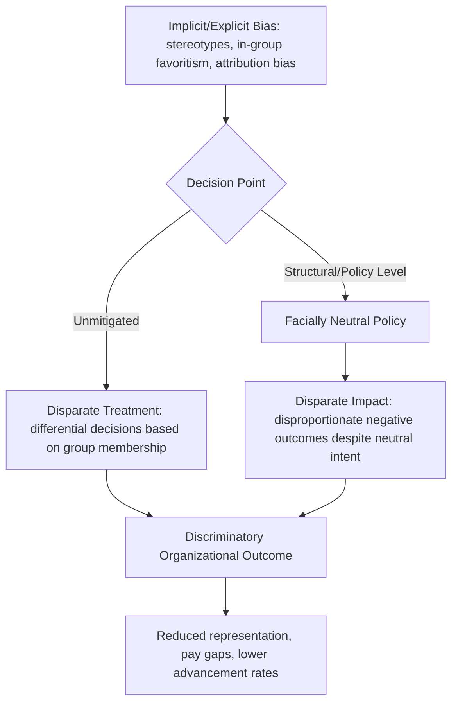

## Discrimination and Bias in the Workplace

### Definitional Framework: Discrimination Versus Bias

**Bias** refers to a systematic tendency in judgment or perception that favors or disfavors particular groups or individuals, existing at the cognitive level (a mental process). **Discrimination** refers to the behavioral manifestation — differential treatment of individuals based on group membership that results in disparate outcomes (in hiring, promotion, compensation, or treatment). Bias does not always translate into discrimination (a biased judgment may be corrected before it affects behavior), but sustained, unaddressed bias is a primary theorized mechanism underlying much organizational discrimination.

**Key Points**

- Discrimination is legally and conceptually distinguished into **disparate treatment** (intentional differential treatment of an individual because of a protected characteristic) and **disparate impact** (a facially neutral policy or practice that produces disproportionately negative outcomes for a protected group, regardless of intent) — this distinction, originating in U.S. employment law (Title VII), is widely used as an analytical framework in organizational research even outside strictly legal contexts.

### Explicit Versus Implicit Bias

- **Explicit bias**: consciously held, deliberately expressed attitudes or beliefs about a group, which the individual is typically aware of and could self-report if willing
- **Implicit bias**: automatic, unconscious associations that influence judgment and behavior outside conscious awareness or control, even among individuals who explicitly and sincerely disavow prejudiced beliefs

**Key Points**

- The **Implicit Association Test (IAT)**, developed by Greenwald, McGhee, and Schwartz, is the most widely known measurement approach for implicit bias, measuring the relative speed of associating concepts (e.g., racial group, gender) with positive/negative or stereotype-congruent/incongruent attributes.
- **[Unverified]** The IAT's predictive validity for actual discriminatory behavior — as distinct from its ability to measure the underlying implicit association construct itself — has been a matter of substantial and ongoing methodological debate in the psychological literature; meta-analyses have found the correlation between IAT scores and behavioral outcomes to be modest, and this is an area of active scientific contention rather than settled consensus, notably including debate over the test-retest reliability of individual IAT scores.
- Despite this measurement debate, the broader theoretical claim that unconscious, automatic cognitive processes can influence workplace judgments independent of consciously held egalitarian beliefs is supported by a wider body of research beyond the IAT specifically (e.g., audit studies, described below).

### Cognitive Mechanisms Underlying Workplace Bias

- **Stereotyping**: application of generalized beliefs about a social category to individual members of that category, used as a cognitive shortcut that can bias judgments of individual competence, fit, or likely behavior independent of actual individual characteristics
- **In-group favoritism**: preferential treatment of individuals perceived as belonging to one's own social group, grounded in Social Identity Theory, operating even without explicit hostility toward out-groups
- **Attribution bias**: systematic differences in how behavior is explained depending on group membership — for example, research on the **fundamental attribution error** interacting with group membership shows a documented pattern where identical behaviors or outcomes may be attributed to internal, dispositional causes for out-group members' failures and external, situational causes for their successes, with the reverse asymmetric pattern often observed for in-group members
- **Confirmation bias**: the tendency to notice, interpret, and recall information in ways that confirm pre-existing stereotypes, while discounting or explaining away disconfirming evidence
- **Homophily / similarity-attraction**: a tendency to favor those similar to oneself (directly relevant to hiring and mentoring decisions), connecting bias research to the similarity-attraction paradigm covered in broader diversity theory

### Diagram: From Cognitive Bias to Organizational Discrimination

### Documented Domains of Workplace Discrimination Research

**Hiring and Selection**

- **Audit/correspondence studies**: a well-established research methodology sending matched, fictitious resumes differing only in a signal of group membership (e.g., a name statistically associated with a particular racial or ethnic group, or a listed characteristic signaling gender) to real job postings, measuring differential callback rates as a direct behavioral measure of hiring discrimination — this methodology is notable for measuring actual behavioral outcomes rather than self-reported attitudes or laboratory judgments, addressing some of the IAT-related measurement debate noted above
- **[Inference]** Findings from audit studies have been broadly consistent in documenting differential callback rates associated with racially or ethnically distinctive names across many studies and contexts spanning several decades, though specific effect-size magnitudes vary by study, industry, labor market conditions, and time period, and should not be treated as a single fixed universal figure

**Performance Evaluation**

- Research has documented systematic patterns in performance evaluation where identical work or behavior can be evaluated differently depending on the evaluated individual's group membership (e.g., research on gendered evaluation of identical work samples, and research on racioethnic differences in performance ratings after controlling for objective performance indicators)
- **Attribution asymmetries** (described above) are frequently implicated as a specific mechanism: identical outcomes may be attributed differently depending on the employee's group membership, systematically affecting resulting evaluations

**Promotion and Advancement**

- The **"glass ceiling"** metaphor describes documented patterns of underrepresentation of certain groups (historically studied most extensively regarding women and racial/ethnic minorities) at progressively higher organizational levels, despite comparable qualifications at lower levels
- The **"glass cliff"** phenomenon describes a related, more specific pattern in which members of underrepresented groups are disproportionately promoted into leadership positions during periods of organizational crisis or high risk of failure, potentially setting them up for disproportionate blame if the (already elevated-risk) situation does not improve

**Compensation**

- Persistent, well-documented pay gaps associated with gender and race/ethnicity remain even after statistical controls for measurable factors such as education, experience, industry, and role, though the interpretation of unexplained "residual" gaps (whether they reflect unmeasured legitimate factors, discrimination, or some combination) remains a subject of ongoing methodological and disciplinary debate between economics and organizational psychology research traditions

### Microaggressions

**Key Points**

- Coined initially by Chester Pierce and substantially developed by Derald Wing Sue and colleagues, **microaggressions** refers to brief, everyday verbal, behavioral, or environmental slights, snubs, or insults — whether intentional or unintentional — that communicate hostile, derogatory, or negative messages toward individuals based on their group membership.
- Sue's typology distinguishes **microassaults** (explicit, deliberate discriminatory acts, closest to traditional overt discrimination), **microinsults** (communications that convey rudeness or insensitivity demeaning a person's identity, often unconsciously), and **microinvalidations** (communications that exclude, negate, or nullify the psychological experiences of a person from a marginalized group, e.g., denying that discrimination occurred).
- **[Unverified]** The microaggression construct, while widely adopted in organizational DEI practice, has also faced academic critique regarding measurement rigor, definitional consistency across studies, and the challenge of empirically establishing cumulative harm from repeated subtle incidents as distinct from more overt discriminatory events; this remains an area of active scholarly discussion rather than a fully settled construct.

### Structural and Systemic Discrimination

Distinguished from interpersonal-level bias/discrimination, **structural** or **systemic discrimination** refers to discriminatory outcomes embedded in organizational policies, practices, and systems that may operate independently of any individual decision-maker's conscious or unconscious bias in a given instance — for example, a job requirement (e.g., a specific credential or physical requirement) that is facially neutral but has a disparate exclusionary effect on a protected group without being genuinely job-relevant (the disparate impact concept noted above), or historically embedded network-based recruiting practices that perpetuate existing demographic patterns in a workforce independent of any single hiring manager's individual bias.

### Worked Example: Diagnosing a Promotion Rate Disparity

**Example**

An organization's HR analytics team identifies that women are promoted to senior management at a lower rate than men, despite comparable performance ratings at the individual-contributor level.

1. **Distinguish disparate treatment from disparate impact**: Investigation examines whether specific promotion decisions show direct differential treatment (disparate treatment) versus whether a facially neutral promotion criterion (e.g., a requirement for uninterrupted tenure, which may disproportionately disadvantage employees who take parental leave) is producing the disparity (disparate impact) — these require different diagnostic and remedial approaches.
2. **Examine performance evaluation processes upstream of promotion decisions**: A review of evaluation language across genders finds patterns consistent with documented attribution-asymmetry research — ambiguous performance outcomes are more frequently attributed to situational/team factors for women and to individual skill for men in written evaluation comments, a subtler bias mechanism than any single overt promotion decision.
3. **Glass cliff check**: The team also examines whether women who are promoted are disproportionately placed into higher-risk divisions or turnaround situations, which could independently affect subsequent advancement and evaluation, compounding the disparity through a distinct mechanism from either straightforward disparate treatment or disparate impact.
4. **Intervention targeting the diagnosed mechanism**: Rather than a generic bias-training rollout, the intervention specifically addresses the identified attribution-language pattern (structured evaluation rubrics reducing free-text subjective narrative, evaluator calibration sessions) and reviews the tenure-based promotion criterion for genuine job-relevance versus disparate impact risk.

**[Inference]** This is a synthesized illustrative scenario constructed to demonstrate diagnostic methodology rather than a documented case study.

### Measurement and Research Methodologies

- **Implicit Association Test (IAT)**: measures implicit bias, with the reliability and predictive-validity caveats noted above
- **Audit/correspondence studies**: behavioral field-experiment methodology measuring actual discriminatory outcomes (callback rates, response rates) rather than self-reported attitudes
- **Organizational climate surveys for discrimination/inclusion**: self-report instruments capturing employees' perceived experiences of discrimination or exclusion, subject to standard self-report limitations (underreporting due to fear of retaliation, social desirability)
- **HR analytics/adverse impact analysis**: statistical analysis of organizational outcome data (hiring, promotion, pay, termination rates) disaggregated by group membership, often using formal statistical thresholds (e.g., the "four-fifths rule" commonly referenced in U.S. employment law contexts) to flag potential disparate impact for further investigation

### Common Failure Modes in Anti-Discrimination and Bias Reduction Efforts

- **Overreliance on one-time diversity/bias training**: a substantial body of organizational research has found that single-session, mandatory unconscious-bias training programs frequently show limited durable effects on actual behavior or organizational outcomes, and in some documented cases have been associated with null or even counterproductive effects (e.g., backlash or reduced voluntary diversity program engagement) when implemented as an isolated, compliance-driven intervention rather than integrated into broader structural change
- **Focusing on individual bias while ignoring structural/systemic mechanisms**: interventions addressing only interpersonal-level bias awareness while leaving disparate-impact-producing policies, evaluation systems, or structural barriers unexamined and unchanged
- **Treating microaggressions and overt discrimination identically**: given the differing severity, intent-ambiguity, and cumulative-versus-acute nature of these phenomena, applying uniform responses without accounting for these distinctions can be both under- and over-responsive depending on the specific incident
- **Confusing measurement of bias with measurement of discriminatory behavior**: given the IAT-behavior correlation debate noted above, relying solely on implicit-bias assessment scores as evidence of an organization's discrimination risk, without complementary behavioral/outcome data (audit-style testing, adverse-impact analysis), risks an incomplete or misleading diagnostic picture
- **Legal-compliance-only framing**: addressing discrimination purely as legal risk management (avoiding liability) rather than genuine organizational culture and systems change, which research on the Ely and Thomas diversity paradigms suggests limits realization of the broader functional and inclusion benefits available through deeper structural approaches

### Relationship to Broader DEI and Organizational Behavior Topics

- **Theories of Diversity in Organizations** — bias and discrimination represent the negative-mechanism pathway (social categorization, in-group favoritism) that diversity theories like CEM identify as one of two competing processes shaping diversity's actual organizational effects
- **Organizational Justice** — discrimination is a direct violation of both distributive justice (fair outcomes) and procedural justice (fair processes), connecting this topic to the broader organizational justice literature
- **Psychological Safety and Inclusion** — repeated experiences of bias or discrimination, including cumulative microaggressions, are well-documented antecedents of reduced psychological safety and sense of inclusion for affected employees
- **Selection and Performance Appraisal Systems (I/O Psychology)** — structured, criterion-referenced selection and evaluation processes are among the most consistently recommended structural interventions for reducing the influence of individual rater bias, connecting this topic directly to personnel-selection best-practice literature

### Related Topics

- Theories of Diversity in Organizations
- Organizational Justice: Distributive, Procedural, and Interactional
- Structured Interviews and Bias-Resistant Selection Design
- The Glass Ceiling and Glass Cliff Phenomena
- Microaggressions: Typology and Organizational Response
- Implicit Association Test: Validity Debates
- Audit Studies in Labor Market Discrimination Research
- Adverse Impact Analysis and the Four-Fifths Rule
- Inclusive Leadership and Allyship Behaviors
- Diversity Training Efficacy Research