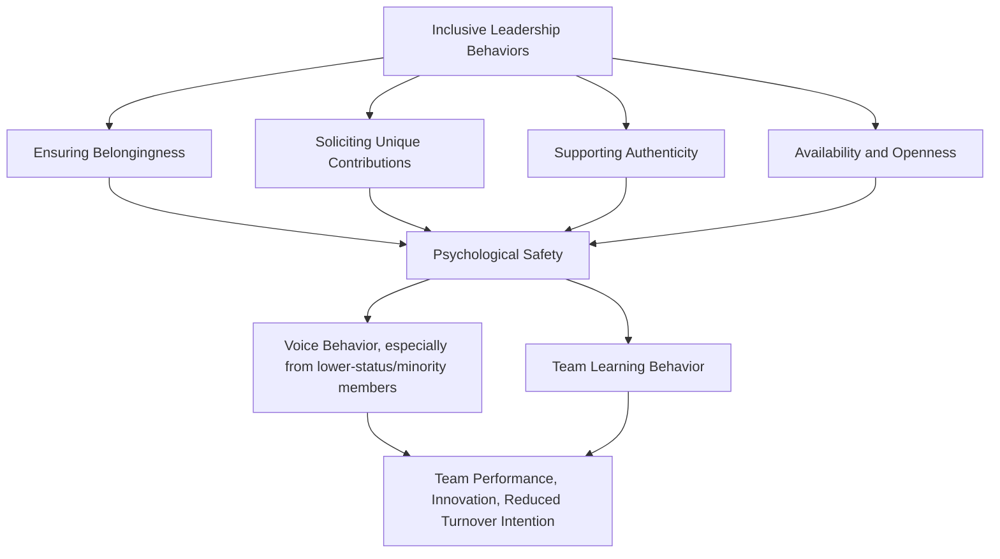

## Inclusive Leadership Practices

### Definition and Conceptual Positioning

Inclusive leadership refers to leader behaviors and practices that ensure group members perceive that they are treated as valued, respected members of the group who belong, while simultaneously being encouraged and enabled to retain and contribute their unique perspectives, identities, and ways of working. It is distinguished from general diversity management (organizational-level policy and representation efforts) by its specific focus on **leader-level, day-to-day interpersonal behaviors** that shape whether diversity actually translates into inclusion at the team and individual level.

**Key Points**

- Inclusive leadership is theoretically and empirically grounded substantially in **Shore et al.'s Optimal Distinctiveness / Inclusion Framework**, which defines inclusion as the satisfaction of two simultaneous needs: **belongingness** (feeling accepted and part of the group) and **uniqueness** (feeling that one's individual, distinctive characteristics and perspectives are valued rather than requiring suppression or assimilation to fit in).
- This two-need framework explicitly distinguishes true inclusion from two related but distinct organizational states: **assimilation** (high belongingness but low uniqueness — individuals are accepted only if they conform and suppress distinctive characteristics) and **differentiation/exclusion** (individuals' unique characteristics may be acknowledged but they are not treated as full, valued in-group members).

### The Belongingness-Uniqueness Framework (Shore et al.)

| Quadrant | Belongingness | Uniqueness | Description |
| --- | --- | --- | --- |
| **Exclusion** | Low | Low | Individual is treated as an outsider; neither accepted as a group member nor valued for distinctive contributions |
| **Assimilation** | High | Low | Individual is accepted as an in-group member only on the condition of conforming to dominant group norms, suppressing distinctive characteristics |
| **Differentiation** | Low | High | Individual's unique value or expertise is recognized and utilized, but they are not treated as a genuine, socially accepted in-group member |
| **Inclusion** | High | High | Individual is both treated as a valued, belonging in-group member and encouraged/enabled to retain and contribute unique perspectives and identity |

### Diagram: The Belongingness-Uniqueness Model of Inclusion

<svg xmlns="http://www.w3.org/2000/svg" viewBox="0 0 700 420">
<text x="350" y="30" text-anchor="middle" font-size="16" font-weight="bold" fill="#1a1a1a">Shore et al.'s Inclusion Framework (svg_diagram)</text>
<line x1="120" y1="360" x2="620" y2="360" stroke="#374151" stroke-width="2" />
<line x1="120" y1="360" x2="120" y2="70" stroke="#374151" stroke-width="2" />
<text x="370" y="395" text-anchor="middle" font-size="12" fill="#374151">Uniqueness →</text>
<text x="60" y="215" text-anchor="middle" font-size="12" fill="#374151" transform="rotate(-90 60 215)">Belongingness →</text>
<rect x="120" y="70" width="250" height="145" fill="#fef3c7" stroke="#d97706" stroke-width="2" />
<text x="245" y="130" text-anchor="middle" font-size="14" font-weight="bold" fill="#78350f">Assimilation</text>
<text x="245" y="150" text-anchor="middle" font-size="10" fill="#78350f">High Belonging / Low Uniqueness</text>
<text x="245" y="170" text-anchor="middle" font-size="10" fill="#78350f">Accepted only if conforming</text>
<rect x="370" y="70" width="250" height="145" fill="#dcfce7" stroke="#16a34a" stroke-width="2" />
<text x="495" y="130" text-anchor="middle" font-size="14" font-weight="bold" fill="#14532d">Inclusion</text>
<text x="495" y="150" text-anchor="middle" font-size="10" fill="#14532d">High Belonging / High Uniqueness</text>
<text x="495" y="170" text-anchor="middle" font-size="10" fill="#14532d">Valued as member AND for distinctiveness</text>
<rect x="120" y="215" width="250" height="145" fill="#fee2e2" stroke="#dc2626" stroke-width="2" />
<text x="245" y="275" text-anchor="middle" font-size="14" font-weight="bold" fill="#7f1d1d">Exclusion</text>
<text x="245" y="295" text-anchor="middle" font-size="10" fill="#7f1d1d">Low Belonging / Low Uniqueness</text>
<text x="245" y="315" text-anchor="middle" font-size="10" fill="#7f1d1d">Treated as outsider</text>
<rect x="370" y="215" width="250" height="145" fill="#dbeafe" stroke="#2563eb" stroke-width="2" />
<text x="495" y="275" text-anchor="middle" font-size="14" font-weight="bold" fill="#1e3a8a">Differentiation</text>
<text x="495" y="295" text-anchor="middle" font-size="10" fill="#1e3a8a">Low Belonging / High Uniqueness</text>
<text x="495" y="315" text-anchor="middle" font-size="10" fill="#1e3a8a">Valued for expertise, not as member</text>
</svg>

### Core Inclusive Leadership Behaviors

Synthesizing across the primary inclusive-leadership research literature (Carmeli, Reiter-Palmon, and Ziv; Randel et al.; Nembhard and Edmondson), the following behavioral categories are most consistently identified:

1. **Ensuring group belongingness**: actively fostering a sense that all members are valued, respected, and treated fairly, including visibly correcting exclusionary dynamics when observed
2. **Soliciting and valuing unique contributions**: explicitly inviting diverse perspectives, particularly from members who might otherwise remain silent due to status differences or minority-position dynamics, and demonstrably incorporating that input into decisions rather than merely inviting it symbolically
3. **Supporting group members' authenticity**: encouraging members to bring their genuine identities, communication styles, and perspectives to work rather than requiring assimilation to a dominant cultural norm
4. **Availability and openness**: being accessible to team members, particularly those who may be less likely to proactively approach a leader due to status or power distance concerns, and demonstrating openness to input, including dissenting or critical feedback
5. **Fair and equitable treatment**: applying consistent standards, opportunities, and resource allocation across group members regardless of demographic or identity characteristics
6. **Humility**: acknowledging one's own limitations and mistakes, and explicitly valuing others' expertise and contributions, associated with reduced status-based inhibition among team members in voicing perspectives

**Key Points**

- Nembhard and Edmondson's research specifically emphasizes leader **inclusiveness** as words and actions by leaders that invite and appreciate others' contributions, finding this behavior particularly consequential for lower-status team members' willingness to engage in voice behavior and speak up, especially in contexts (e.g., healthcare teams) where status hierarchies might otherwise strongly suppress input from junior or lower-status members.

### Diagram: Inclusive Leadership Behavior Pathway to Outcomes

### The Central Mediating Role of Psychological Safety

**Key Points**

- Psychological safety — a shared team belief that the team is safe for interpersonal risk-taking (Edmondson) — is consistently identified across the inclusive leadership literature as a central mechanism through which inclusive leader behaviors translate into positive downstream outcomes (voice behavior, learning behavior, engagement, and performance).
- This positions inclusive leadership as substantially operating through the same psychological-safety mechanism identified as a key moderating condition in the Categorization-Elaboration Model of diversity (covered under diversity theory) — inclusive leader behaviors are one of the primary organizational levers for shifting a diverse team's processing toward the information-elaboration pathway rather than the social-categorization pathway.

### Distinguishing Inclusive Leadership from Related Leadership Styles

| Leadership Style | Primary Focus | Relationship to Inclusive Leadership |
| --- | --- | --- |
| **Transformational Leadership** | Inspiring shared vision, individualized consideration, intellectual stimulation | Overlaps with inclusive leadership's individualized-consideration component, but does not specifically center belongingness-uniqueness dynamics or diversity-related status differentials |
| **Servant Leadership** | Prioritizing followers' growth and wellbeing above leader self-interest | Shares inclusive leadership's emphasis on humility and follower-centered orientation, but is not specifically theorized around diversity/inclusion dynamics |
| **Authentic Leadership** | Leader self-awareness, relational transparency, consistency between values and action | Inclusive leadership's authenticity-support behavior is follower-directed (supporting followers' authenticity), distinct from authentic leadership's leader-directed self-authenticity focus |
| **Ethical Leadership** | Modeling normatively appropriate conduct, fair treatment, ethical decision-making | Overlaps with inclusive leadership's fairness/equitable-treatment behavior, but ethical leadership is broader in scope, not specifically centered on identity-based belonging/uniqueness dynamics |

**[Inference]** These leadership styles are conceptually distinct but empirically correlated in the literature, since they share underlying behavioral components (fairness, individualized attention, humility); inclusive leadership is best understood as a construct with meaningful conceptual overlap with these established styles while retaining a distinctive focus specifically on the belongingness-uniqueness dynamic relevant to diverse and identity-heterogeneous teams.

### Worked Example: Inclusive Leadership in a Cross-Functional Meeting Context

**Example**

A team lead notices that in cross-functional meetings, input consistently comes from the same two or three senior, tenured members, while newer and more junior team members (who also happen to represent the team's demographic diversity) rarely speak up.

1. **Diagnosis using the Belongingness-Uniqueness framework**: The pattern suggests possible assimilation dynamics — junior/diverse members may feel accepted as team members (belongingness) but are not perceiving that their distinct perspectives are genuinely solicited or valued (low uniqueness), or alternatively may not feel sufficient belongingness/psychological safety to risk voicing a dissenting or novel view given status differentials.
2. **Behavioral intervention — soliciting unique contributions**: The lead restructures meeting process to explicitly solicit input from each member by name/role before senior members dominate discussion, and implements a structured round-robin format for key decisions rather than open-floor discussion that tends to favor confident, high-status speakers.
3. **Behavioral intervention — availability and humility**: The lead explicitly acknowledges uncertainty on a technical question and asks a junior team member's opinion directly, modeling that expertise (not tenure or status) is the basis for valued input, and demonstrably incorporates the resulting input into the final decision, visibly closing the loop.
4. **Expected mechanism**: Per the psychological-safety-mediation pathway, these behaviors are theorized to increase junior/diverse members' sense that voicing input is safe and valued, increasing voice behavior over time — though a single meeting intervention would not be expected to fully resolve an established status-based participation pattern without sustained reinforcement.

**[Inference]** This is a synthesized illustrative scenario rather than a documented case study.

### Measurement Instruments

- **Carmeli, Reiter-Palmon, and Ziv's Inclusive Leadership Scale**: one of the most widely cited validated measures, assessing leader openness, availability, and accessibility as core dimensions
- **Randel et al.'s Inclusive Leadership Scale**: measures behaviors more directly mapped to the belongingness-uniqueness framework, including facilitating employee contributions and supporting group members' authentic identity expression
- Inclusive leadership is also frequently assessed indirectly through downstream measures (team psychological safety scales, voice behavior measures, diversity climate perceptions) as evidence of inclusive leadership's functional effects rather than relying solely on direct leader-behavior self-report or subordinate-report scales

### Organizational Enablers and Barriers

**Enablers**

- Leadership development programs explicitly incorporating inclusive-behavior training and structured practice (e.g., facilitation techniques for soliciting balanced input) rather than only awareness-level content
- Performance management systems that formally recognize and reward inclusive leadership behaviors, rather than evaluating leaders solely on output metrics disconnected from team process quality
- Organizational-level psychological safety and diversity climate that reinforces and does not undermine individual leaders' inclusive behavior attempts

**Barriers**

- Status hierarchies and power distance norms (organizational or culturally embedded) that structurally inhibit lower-status voice regardless of individual leader behavior, limiting how much a single leader's inclusive practices can overcome systemic status effects alone
- Time and process pressure that leads leaders to default to efficient, but exclusionary, decision-making shortcuts (e.g., relying only on the most readily available or vocal input rather than structured solicitation)
- Leader skepticism or lack of genuine buy-in, resulting in performative inclusive behaviors (visibly soliciting input without genuinely incorporating it) that can be perceived by team members as inauthentic and may undermine trust more than an absence of any inclusive gesture

### Common Failure Modes in Inclusive Leadership Practice

- **Performative solicitation without genuine incorporation**: asking for input from diverse or junior members without visibly acting on or acknowledging that input, which research on authenticity and trust suggests can be more damaging to psychological safety than not soliciting input at all
- **Conflating availability with genuine openness**: being physically or digitally accessible without actually being receptive to dissenting or critical input when it is offered
- **Uniformly applying inclusive behaviors without addressing individual/team-specific barriers**: applying generic inclusive-leadership techniques without diagnosing the specific belongingness-versus-uniqueness gap or status dynamic present in a given team, per the differentiated diagnostic logic in the worked example above
- **Overburdening leaders without organizational support**: expecting individual leaders to fully offset structural or organizational-level exclusionary dynamics (compensation inequity, biased evaluation systems) through interpersonal behavior alone, without addressing the systemic factors covered under broader discrimination and bias research

### Relationship to Broader DEI and Organizational Behavior Topics

- **Theories of Diversity in Organizations** — inclusive leadership functions as a key organizational-level lever activating the Categorization-Elaboration Model's information-elaboration pathway rather than the social-categorization pathway, directly connecting leader behavior to diversity's functional team-level outcomes
- **Discrimination and Bias in the Workplace** — inclusive leadership behaviors (soliciting balanced input, applying consistent standards) function as an interpersonal-level countermeasure to some of the cognitive bias mechanisms (in-group favoritism, attribution asymmetry) covered in bias research, though inclusive leadership alone cannot resolve structural/systemic discrimination independent of broader organizational-system change
- **Psychological Safety** — the central mediating mechanism connecting inclusive leader behavior to team-level outcomes across most of the literature reviewed here
- **Team-Building Interventions** — inclusive leadership behaviors (structured input solicitation, fairness, authenticity support) overlap substantially with process-focused team-building intervention techniques, particularly those targeting interpersonal relationships and procedural functioning

### Related Topics

- Shore et al.'s Belongingness-Uniqueness Inclusion Framework
- Psychological Safety (Edmondson) — Extended Treatment
- Voice Behavior and Status Dynamics in Teams
- Theories of Diversity in Organizations
- Discrimination and Bias in the Workplace
- Transformational and Authentic Leadership Compared
- Team Learning Behavior in Healthcare and High-Stakes Teams
- Leadership Development Program Design for Inclusion
- Diversity Climate Measurement
- Categorization-Elaboration Model of Team Diversity