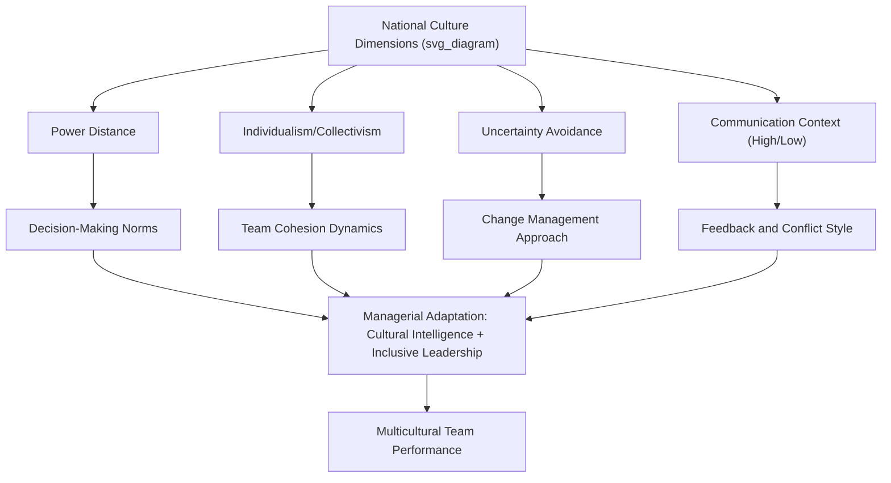

## Managing a Multicultural Workforce

### Definition and Conceptual Overview

Managing a multicultural workforce refers to the set of organizational strategies, managerial practices, and interpersonal competencies required to lead and coordinate employees who differ in national culture, ethnicity, language, and culturally-informed values, norms, and communication styles. This domain sits at the intersection of cross-cultural psychology, organizational behavior, and diversity management, and is distinct from (though related to) general workforce diversity management, which also encompasses non-cultural dimensions such as gender, age, and disability.

**[Inference]** As globalization and remote/distributed work arrangements have expanded, multicultural workforce management has shifted from a concern primarily relevant to expatriate assignments and multinational corporations toward a near-universal managerial competency relevant even to domestically-based teams with culturally diverse membership.

### Theoretical Foundations: Cultural Dimensions Frameworks

**Hofstede's Cultural Dimensions Theory**

The most widely cited framework for understanding systematic national-culture variation relevant to workplace behavior. Original and extended dimensions include:

- **Power distance**: The degree to which unequal power distribution is accepted/expected within a society
- **Individualism vs. collectivism**: The degree to which people prioritize personal goals/identity versus group loyalty and belonging
- **Uncertainty avoidance**: Tolerance for ambiguity and unstructured situations
- **Masculinity vs. femininity**: Emphasis on competition/achievement versus cooperation/quality of life
- **Long-term vs. short-term orientation**: Emphasis on future rewards (perseverance, thrift) versus tradition and immediate obligations
- **Indulgence vs. restraint**: Degree to which gratification of desires is permitted versus regulated by social norms

**Key Points**

- Hofstede's dimensions were derived from large-scale survey data (originally IBM employees across ~40+ countries) and have been highly influential, but face ongoing methodological criticism, including concerns about treating nations as culturally homogeneous units, the dated nature of some original data, and ecological-fallacy risk when applying national-level scores to predict individual behavior
- **[Inference]** Despite these criticisms, the framework remains a practically useful heuristic starting point for anticipating likely value differences across national groups, provided it is not applied deterministically to any specific individual

**GLOBE Study (House et al.)**

A more contemporary, expanded framework (Global Leadership and Organizational Behavior Effectiveness) that examined culture and leadership across ~62 societies, adding dimensions such as performance orientation, humane orientation, and assertiveness, and distinguishing between cultural **practices** ("as is") and **values** ("should be")—a distinction Hofstede's original model did not fully capture.

**Trompenaars' Model of National Culture Differences**

A complementary framework emphasizing dimensions such as universalism vs. particularism (rule-based vs. relationship-based reasoning) and specific vs. diffuse relationships (task-focused vs. holistic relationship boundaries), often applied in cross-cultural negotiation training.

### Core Managerial Challenges

**Communication Style Differences**

- **High-context vs. low-context communication** (Hall): High-context cultures (e.g., many East Asian, Middle Eastern, Latin American cultures) rely heavily on implicit, contextual, non-verbal cues; low-context cultures (e.g., many Northern European, North American cultures) favor explicit, direct verbal communication. Misalignment can produce misunderstanding around directness, feedback delivery, and conflict signaling
- Differences in preferred feedback style (direct/blunt vs. indirect/face-saving) can affect performance management effectiveness if not adapted

**Decision-Making and Authority Norms**

Power-distance differences influence expectations regarding hierarchical deference, willingness to challenge a supervisor's decision, and preferred decision-making structure (top-down vs. participative).

**Time Orientation**

Cultural variation in **monochronic** (linear, schedule-driven) versus **polychronic** (fluid, relationship-driven) time orientation affects expectations around deadlines, meeting punctuality, and multitasking norms.

**In-Group/Out-Group Dynamics and Faultlines**

Culturally homogeneous subgroups within a larger diverse team can create **faultlines**—hypothetical dividing lines that split a group into subgroups based on alignment of multiple attributes (e.g., nationality plus language plus tenure)—which research links to increased intragroup conflict and reduced team cohesion if not actively managed.

### Managerial Competencies and Frameworks

**Cultural Intelligence (CQ)**

A well-established multidimensional construct (Earley & Ang) describing an individual's capability to function effectively across culturally diverse settings, comprising four facets:

- **Metacognitive CQ**: Awareness and control of one's own cultural assumptions during cross-cultural interactions
- **Cognitive CQ**: Knowledge of cultural norms, practices, and conventions across cultures
- **Motivational CQ**: Interest and confidence in functioning effectively in culturally diverse situations
- **Behavioral CQ**: Capability to exhibit appropriate verbal and nonverbal actions when interacting cross-culturally

**Key Points**

- CQ is generally distinguished from general cognitive ability and emotional intelligence, though it correlates modestly with both
- CQ has demonstrated predictive validity for expatriate adjustment, cross-cultural negotiation effectiveness, and multicultural team performance in the research literature

**Cross-Cultural Training**

Common organizational interventions include:

- **Cultural awareness/general orientation training**: Broad exposure to cultural dimension frameworks and self-awareness exercises
- **Culture-specific training**: Focused preparation for interacting with a particular target culture (language basics, etiquette, business norms)
- **Cultural assimilator training**: Scenario-based training using critical incidents where trainees select and receive feedback on culturally appropriate interpretations of ambiguous cross-cultural situations
- **Experiential/simulation training**: Immersive exercises (e.g., cross-cultural simulations, role-plays) designed to build behavioral CQ

### Organizational-Level Strategies

- **Inclusive leadership practices**: Actively soliciting input from culturally diverse members, explicitly legitimizing diverse perspectives in decision-making, and adapting communication/feedback style to individual preferences
- **Structural accommodations**: Language support (translation resources, language training), flexible scheduling around culturally significant holidays/observances, accommodating religious practices
- **Diversity climate**: Organizational-level perceptions of fairness and inclusion for culturally diverse employees, distinct from mere demographic diversity, shown in the literature to moderate whether cultural diversity translates into positive (information elaboration) or negative (conflict, turnover) outcomes
- **Boundary-spanning roles and cultural brokers**: Designating individuals who can translate norms and facilitate understanding across cultural subgroups within a team

### The Diversity-Performance Relationship: A Contingency View

**Key Points**

- Cultural diversity's effect on team performance is not uniformly positive or negative in the research literature; rather, it functions as a **double-edged sword**
- Potential benefits: broader informational/perspective diversity, enhanced creativity and problem-solving on complex, non-routine tasks (supported by the **information/decision-making perspective** on diversity)
- Potential costs: increased process losses, communication difficulty, and relational conflict, particularly on tasks with tight coordination demands or short timelines (supported by the **social categorization/similarity-attraction perspective**)
- **[Inference]** Whether cultural diversity nets out as beneficial or costly appears to depend heavily on moderating factors including task complexity/type, team tenure, diversity climate, and the presence of skilled inclusive leadership—meaning managerial practice, not diversity itself, substantially determines the outcome

### Illustrative Example

**Example**

A global software company forms a cross-border product team spanning members from Germany (typically lower power distance, more direct communication, monochronic time orientation) and South Korea (typically higher power distance, more indirect/high-context communication, greater deference to hierarchy). Early in the project, junior Korean team members are hesitant to voice disagreement with a technical decision made by a German team lead during open video calls, not because they lack concerns but because doing so publicly conflicts with hierarchical norms they've internalized. A manager with strong metacognitive and behavioral CQ recognizes this pattern and introduces an anonymous pre-meeting input channel alongside the open discussion, allowing concerns to surface without requiring members to violate deeply held norms around public deference—illustrating an inclusive-leadership adaptation grounded in cultural-dimension awareness rather than assuming a single "correct" communication norm for the whole team.

### Cultural Dimensions and Managerial Levers Diagram

### Conclusion

Effectively managing a multicultural workforce requires grounding practice in established cross-cultural frameworks (Hofstede, GLOBE, Trompenaars) while recognizing their limitations as probabilistic heuristics rather than deterministic individual predictors. Success depends on developing managerial cultural intelligence, adapting communication and leadership style to team composition, and proactively shaping a strong diversity climate—since cultural diversity's effect on performance is contingent rather than automatically positive or negative. Organizations that combine structural accommodations with genuinely inclusive leadership practices are best positioned to capture the informational and creative benefits of cultural diversity while mitigating its coordination and conflict costs.

**Related Topics**

- Hofstede's Cultural Dimensions in Depth
- Cultural Intelligence (CQ) Assessment and Development
- High-Context vs. Low-Context Communication in Negotiation
- Team Faultlines and Subgroup Formation
- Expatriate Adjustment and Global Mobility
- Diversity Climate and Inclusion Metrics
- Cross-Cultural Conflict Resolution Styles
- Global Virtual Teams and Distributed Multicultural Collaboration