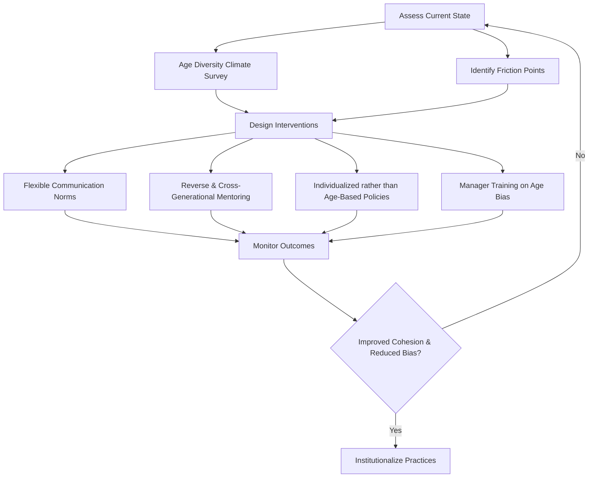

## Age and Generational Diversity in the Workforce

### Definition and Scope

Age and generational diversity refers to the presence of individuals from multiple age cohorts — commonly grouped as Traditionalists/Silent Generation, Baby Boomers, Generation X, Millennials, and Generation Z — within a single workforce, along with the organizational practices needed to manage the variation in values, work styles, technological fluency, and career-stage needs that accompany this age range.

This construct sits within the broader field of workforce diversity management but is distinct from other diversity dimensions in one key respect: age is a dynamic, universal category. Every employee ages through the workforce over time, meaning generational identity is not a fixed demographic trait in the way that, for example, national origin is. This has implications for how organizations design interventions — generational cohorts shift in workplace composition over time rather than remaining static.

### Generational Cohorts: Definitions and Boundaries

| Cohort | Approximate Birth Years | Approximate 2026 Age Range |
| --- | --- | --- |
| Traditionalists / Silent Generation | 1928–1945 | 81–98 |
| Baby Boomers | 1946–1964 | 62–80 |
| Generation X | 1965–1980 | 46–61 |
| Millennials (Generation Y) | 1981–1996 | 30–45 |
| Generation Z | 1997–2012 | 14–29 |
| Generation Alpha | 2013–present | Entering workforce ~2029+ |

[Unverified] Exact cohort boundary years vary by research source (e.g., Pew Research Center, Gallup, and academic labor economists do not use identical cutoffs), so these ranges should be treated as approximations rather than fixed definitions.

### Theoretical Foundations

**Generational Cohort Theory**

Developed from the work of Karl Mannheim and later popularized by Strauss and Howe, this theory holds that individuals who come of age during the same historical period (roughly ages 17–23) develop shared values, attitudes, and worldviews shaped by common formative experiences (economic conditions, major political events, technological shifts).

**Social Identity Theory Applied to Age**

Age cohort can function as an in-group/out-group identity marker (Tajfel & Turner's Social Identity Theory), which explains phenomena such as age-based stereotyping, generational in-group favoritism, and intergenerational conflict in mixed-age teams.

**Life-Span/Life-Course Perspective**

An alternative to generational cohort theory, this perspective (associated with Baltes and later organizational scholars) argues that many apparent "generational differences" are actually **age effects** (differences due to life stage, which every cohort experiences and grows out of) or **period effects** (differences due to a shared historical moment affecting all cohorts simultaneously) rather than true **cohort effects** (lasting differences unique to a generation).

**Key Point:** This life-course critique is central to current academic debate. [Inference] A meaningful portion of what is popularly attributed to "generational differences" in workplace behavior may instead reflect career stage, age-related life circumstances, or broader economic/technological conditions affecting all workers at a given time — this remains a contested empirical question rather than settled consensus.

### Empirical Status of Generational Differences

This is one of the more actively disputed areas in I-O psychology.

**Evidence for meaningful generational differences:**

- Documented shifts in average tenure expectations and job-hopping frequency across cohorts (labor statistics show declining average tenure among younger workers)
- Differences in technology-native fluency, particularly around digital-first communication norms
- Survey-reported differences in stated preferences (e.g., work-life integration, feedback frequency)

**Evidence against strong generational differences (or for life-course explanations):**

- Meta-analyses (e.g., Costanza et al., 2012, *Journal of Business and Psychology*) found generational cohort explained very little variance in key work outcomes (job satisfaction, organizational commitment, intent to turnover) once age itself was statistically controlled for
- Many "generational value differences" reported in popular press and consulting literature rely on cross-sectional surveys that cannot separate cohort effects from age/life-stage effects
- Within-generation variance on most attitudinal measures is typically larger than between-generation variance

[Speculation] Some organizational psychologists argue that "generational differences" narratives persist in management practice partly because they provide an intuitively appealing, low-cost heuristic for HR communication, even where the underlying empirical support is thin.

**Practical implication:** Organizations should treat generational frameworks as a useful *communication and awareness tool* rather than a scientifically validated basis for segmenting HR policy (e.g., designing entirely separate benefits or management approaches "for Millennials" versus "for Boomers").

### Common Points of Intergenerational Friction

- **Communication channel preferences** — synchronous (phone/in-person) versus asynchronous (email/chat/text) defaults
- **Feedback cadence expectations** — annual review cycles versus continuous/real-time feedback
- **Authority and hierarchy norms** — deference-based versus flatter, more consultative expectations
- **Technology adoption speed** — differences in comfort with new digital tools, though this gap narrows substantially with tenure and training
- **Work-life boundary expectations** — differing norms around after-hours availability and flexible scheduling
- **Career trajectory assumptions** — linear, single-employer career paths versus portfolio/multi-employer career models

### Age Diversity Climate and Organizational Outcomes

Research on **age diversity climate** (the shared perception among employees that age diversity is valued and fairly managed) has found more consistent effects than research on generational cohorts themselves.

$$\text{Age Diversity Climate} \rightarrow \text{Reduced Age-Based Discrimination} \rightarrow \text{Improved Team Cohesion \& Performance}$$

[Inference] Organizations with a strong, positive age diversity climate tend to show better cross-age knowledge transfer and lower age-related conflict than those with a weak or absent climate, based on converging findings from diversity climate research more broadly (Kunze, Boehm, & Bruch, 2011, and related studies), though this remains an area with fewer large-scale longitudinal studies than mainstream diversity climate research.

### Age-Related Stereotyping and Discrimination

**Common stereotype content (Stereotype Content Model applied to age):**

- Older workers: often stereotyped as high in warmth/reliability but lower in competence with new technology, or as less adaptable to change
- Younger workers: often stereotyped as high in technological competence but lower in reliability, loyalty, or professionalism

**Legal and policy context (U.S.):**

- The Age Discrimination in Employment Act (ADEA) of 1967 protects workers aged 40 and older from employment discrimination in the United States
- [Unverified] Equivalent protections and their specific age thresholds vary considerably by country (e.g., many EU member states, the UK's Equality Act 2010, and other jurisdictions have their own frameworks), so this section should not be treated as exhaustive legal guidance for any specific jurisdiction.

**Reverse ageism:** Discrimination against younger workers (perceived as inexperienced, entitled, or non-committal) is increasingly documented in the literature, though it receives comparatively less legal protection and organizational attention than discrimination against older workers.

### Managing Multigenerational Teams: Practical Framework

### Evidence-Based Interventions

**1. Cross-generational and reverse mentoring**

Pairs younger employees (often stronger in newer digital tools) with older employees (often stronger in institutional knowledge/domain expertise) in bidirectional mentoring relationships. [Inference] This approach shows more consistent positive outcomes in the literature than most other age-diversity interventions, likely because it directly targets knowledge transfer rather than relying on abstract awareness training alone.

**2. Individualized HR practices over cohort-based segmentation**

Rather than designing benefits or management approaches around generational labels, evidence favors idiosyncratic deals (i-deals) and flexible, individually negotiated work arrangements (flexible scheduling, benefits selection, career pathing) that accommodate within-cohort variance.

**3. Structured, age-diverse team composition**

Deliberately mixing age groups on project teams to leverage complementary strengths (e.g., pairing technological fluency with domain experience), supported by team process interventions (clear role definition, structured communication norms) to prevent faultline formation.

**4. Bias-awareness training targeting age stereotypes specifically**

General diversity training often under-addresses age as a protected category relative to race and gender. Targeted training addressing both "older worker" and "younger worker" stereotypes has shown better results than generic diversity training.

**5. Succession planning and knowledge retention**

Structured knowledge-capture processes (documentation, communities of practice, exit interviews with senior retiring employees) to mitigate the loss of institutional knowledge as Baby Boomers and older Gen X employees retire.

### Example: Diagnostic Vignette

**Example:** A software company notices that a cross-functional project team — composed of two Gen Z engineers, one Millennial product manager, and two Gen X senior architects — is experiencing repeated friction. The Gen Z engineers report frustration that decisions are made in unscheduled hallway conversations they're excluded from; the Gen X architects report frustration that the engineers "don't respond to email" and prefer async chat tools.

**Diagnosis:** This is a **communication channel and decision-transparency mismatch**, not necessarily a values conflict. The underlying issue (informal, non-documented decision-making) would likely create friction in any team regardless of age composition, but is exacerbated here because channel preferences correlate with generational cohort.

**Intervention:** Establish a single documented decision log accessible to all members, and set an explicit norm that any decision made informally gets posted to the shared channel within 24 hours. This addresses the structural cause rather than treating it as an immutable "generational values" problem.

### Diagram: Sources of Apparent Generational Difference (svg_diagram)

<svg xmlns="http://www.w3.org/2000/svg" viewBox="0 0 720 360">
<text x="360" y="30" text-anchor="middle" font-size="16" font-weight="bold" fill="#1a1a1a">Sources of Apparent Generational Difference (svg_diagram)</text>
<rect x="30" y="70" width="190" height="100" rx="8" fill="#e8f0fe" stroke="#4a6fa5" stroke-width="1.5" />
<text x="125" y="100" text-anchor="middle" font-size="13" font-weight="bold" fill="#1a1a1a">Cohort Effects</text>
<text x="125" y="122" text-anchor="middle" font-size="11" fill="#333">Lasting values formed</text>
<text x="125" y="138" text-anchor="middle" font-size="11" fill="#333">during coming-of-age</text>
<text x="125" y="154" text-anchor="middle" font-size="11" fill="#333">(true generational trait)</text>
<rect x="265" y="70" width="190" height="100" rx="8" fill="#fdf1e8" stroke="#c17d3a" stroke-width="1.5" />
<text x="360" y="100" text-anchor="middle" font-size="13" font-weight="bold" fill="#1a1a1a">Age / Life-Stage Effects</text>
<text x="360" y="122" text-anchor="middle" font-size="11" fill="#333">Differences tied to career</text>
<text x="360" y="138" text-anchor="middle" font-size="11" fill="#333">stage, that fade as the</text>
<text x="360" y="154" text-anchor="middle" font-size="11" fill="#333">person ages</text>
<rect x="500" y="70" width="190" height="100" rx="8" fill="#eaf6ec" stroke="#3f8f52" stroke-width="1.5" />
<text x="595" y="100" text-anchor="middle" font-size="13" font-weight="bold" fill="#1a1a1a">Period Effects</text>
<text x="595" y="122" text-anchor="middle" font-size="11" fill="#333">Shared historical moment</text>
<text x="595" y="138" text-anchor="middle" font-size="11" fill="#333">affecting all cohorts</text>
<text x="595" y="154" text-anchor="middle" font-size="11" fill="#333">at once (e.g., a recession)</text>
<line x1="125" y1="170" x2="360" y2="230" stroke="#888" stroke-width="1.2" />
<line x1="360" y1="170" x2="360" y2="230" stroke="#888" stroke-width="1.2" />
<line x1="595" y1="170" x2="360" y2="230" stroke="#888" stroke-width="1.2" />
<rect x="230" y="230" width="260" height="90" rx="8" fill="#f5f0fa" stroke="#7a5ea8" stroke-width="1.5" />
<text x="360" y="258" text-anchor="middle" font-size="13" font-weight="bold" fill="#1a1a1a">Observed "Generational</text>
<text x="360" y="276" text-anchor="middle" font-size="13" font-weight="bold" fill="#1a1a1a">Difference" in Survey Data</text>
<text x="360" y="298" text-anchor="middle" font-size="10.5" fill="#333">(often a blend of all three)</text>

<text x="360" y="345" text-anchor="middle" font-size="10.5" fill="#555" font-style="italic">Disentangling these three requires longitudinal, not cross-sectional, data</text>

</svg>

### Measurement Approaches

- **Age Diversity Climate Scale** — survey-based measure of perceived fairness and inclusion across age groups
- **Faultline strength indices** — statistical measures of how strongly age aligns with other demographic or functional divisions within a team (stronger alignment predicts more subgroup conflict)
- **Cross-sectional vs. longitudinal/cohort-sequential designs** — methodologically, cohort-sequential designs (tracking multiple cohorts over multiple time points) are required to properly separate age, period, and cohort effects; single cross-sectional surveys cannot do this validly

### Common Pitfalls in Practice

- Treating generational labels as deterministic (assuming all members of a cohort share the trait) rather than as population-level tendencies with substantial individual variation
- Designing HR policy exclusively around generational segments rather than individualized flexibility
- Conflating age discrimination law compliance with genuine age-inclusive culture-building
- Ignoring within-generation diversity (e.g., socioeconomic background, national culture) that often explains more variance than cohort membership alone

### Related Topics

- Diversity Climate and Inclusion Climate (general construct)
- Faultline Theory in Team Composition
- Age Discrimination Law and the ADEA
- Idiosyncratic Deals (i-deals) and Individualized HR
- Reverse and Cross-Generational Mentoring Programs
- Knowledge Management and Succession Planning
- Stereotype Content Model
- Person-Environment Fit Across Career Stages
- Cohort-Sequential Research Design in Organizational Research