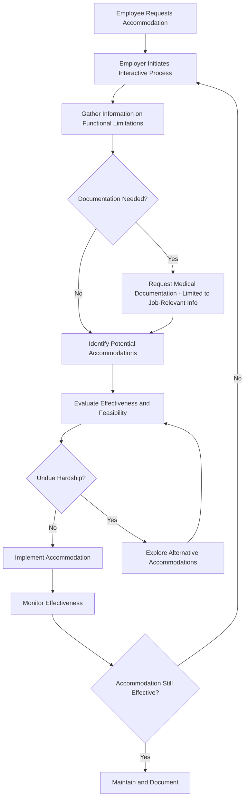

## Disability and Accessibility Inclusion

### Definition and Scope

Disability and accessibility inclusion refers to the organizational policies, practices, and cultural norms aimed at ensuring individuals with physical, sensory, cognitive, intellectual, psychiatric, or chronic health-related disabilities can access equitable employment opportunities, perform their roles effectively, and participate fully in organizational life. This encompasses both **compliance-driven accommodation** (meeting legal obligations) and **proactive inclusive design** (building systems, spaces, and cultures that minimize the need for individual accommodation in the first place).

Disability is distinct from most other diversity dimensions studied in organizational psychology in several respects: it is highly heterogeneous (spanning visible and invisible, permanent and episodic, stable and progressive conditions), it can be acquired at any point in a career, and individuals frequently choose not to disclose it — making it one of the most under-reported dimensions in organizational demographic data.

### The Two Dominant Models of Disability

**Medical Model**

Frames disability as a deficit residing within the individual — a condition to be diagnosed, treated, or accommodated on a case-by-case basis. This model historically dominated HR and occupational health practice and underlies most legal accommodation frameworks (the employee must demonstrate a qualifying impairment to receive accommodation).

**Social Model**

Frames disability as arising from the interaction between an individual's impairment and a poorly designed environment — the "disability" is produced by inaccessible buildings, inflexible processes, and exclusionary norms, not solely by the impairment itself. Under this model, organizational responsibility shifts from reactive accommodation toward proactive, universal design.

**Key Point:** Most contemporary I-O psychology and DEI practice now favors a **biopsychosocial model** (used in the WHO's International Classification of Functioning, Disability and Health, or ICF), which integrates both perspectives — recognizing genuine functional limitations while emphasizing that environmental and attitudinal barriers are often the larger determinant of workplace exclusion.

### Legal and Regulatory Frameworks

**United States**

- **Americans with Disabilities Act (ADA), 1990**, amended by the **ADA Amendments Act (ADAAA), 2008** — prohibits discrimination against qualified individuals with disabilities and requires "reasonable accommodation" unless it imposes "undue hardship" on the employer
- **Rehabilitation Act of 1973 (Section 501/503)** — applies to federal employers and contractors, with more stringent affirmative obligations
- **Family and Medical Leave Act (FMLA)** — intersects with disability accommodation for serious health conditions

**Other jurisdictions**

[Unverified] Specific statutory language, definitions of disability, and employer obligations vary considerably outside the U.S. — for example, the UK's Equality Act 2010, Canada's Accessible Canada Act, and EU directives each define "disability" and "reasonable accommodation" differently, so this section should not be treated as exhaustive multi-jurisdictional legal guidance.

**Key legal concepts:**

| Concept | Definition |
| --- | --- |
| Qualified individual | A person who, with or without accommodation, can perform the essential functions of the job |
| Reasonable accommodation | A modification to the job, environment, or process enabling equal employment opportunity |
| Undue hardship | An accommodation that would impose significant difficulty or expense given the employer's resources and operations |
| Essential functions | The fundamental, as opposed to marginal, duties of a position |
| Interactive process | The legally required, collaborative dialogue between employer and employee to identify effective accommodations |

### Disclosure Dynamics

Disability disclosure is one of the most extensively studied processes in this domain because, unlike most demographic categories, disability status is frequently invisible and disclosure is discretionary.

**Factors influencing disclosure decisions (drawing on stigma and social identity theory):**

- Perceived visibility and concealability of the condition
- Anticipated stigma or competence-based stereotyping
- Trust in supervisor and organizational disability climate
- Necessity (whether accommodation is required to perform the job)
- Career stage and perceived career risk

[Inference] Disclosure is more likely in organizations with a demonstrated track record of accommodation requests being handled supportively and confidentially, based on findings from stigma disclosure research more broadly (Clair, Beatty, & MacLean's work on workplace identity management, among others) — though individual disclosure decisions remain highly context-dependent and this should not be treated as a guaranteed predictor for any specific employee.

**Note on prevalence data:** Because disclosure is voluntary and many disabilities are non-apparent (e.g., chronic pain, mental health conditions, learning disabilities, autoimmune disorders), self-reported workforce disability statistics substantially undercount actual prevalence. This has direct implications for how organizations interpret representation metrics.

### Categories of Disability Relevant to Workplace Design

- **Physical/mobility** — conditions affecting movement, strength, or dexterity
- **Sensory** — vision, hearing, or dual sensory impairments
- **Cognitive/learning** — conditions affecting information processing, memory, or learning (e.g., dyslexia, ADHD)
- **Psychiatric/mental health** — conditions such as depression, anxiety disorders, PTSD, bipolar disorder
- **Chronic health/episodic** — conditions with fluctuating symptom severity (e.g., multiple sclerosis, autoimmune conditions, chronic fatigue conditions)
- **Neurodivergence** — increasingly treated as a related but conceptually distinct category (see Related Topics); includes autism, ADHD, dyslexia, and other neurological variations, often framed through a strengths-based rather than deficit lens

### Accommodation Process: Standard Workflow

### Common Categories of Workplace Accommodation

**Physical/environmental:**

- Ergonomic furniture, adjustable workstations
- Accessible building features (ramps, elevators, accessible restrooms)
- Modified lighting or sensory environment adjustments

**Technological:**

- Screen readers, screen magnification software
- Speech-to-text and text-to-speech tools
- Alternative input devices (e.g., switch access, eye-tracking)

**Process/scheduling:**

- Flexible or modified work schedules
- Remote or hybrid work arrangements
- Modified break schedules
- Extended deadlines or modified performance evaluation timelines where appropriate

**Job restructuring:**

- Reassignment of marginal (non-essential) job functions
- Job carving or role modification
- Modified supervisory communication methods

**Example:** An employee with generalized anxiety disorder requests permission to attend meetings via video from a private space rather than an open-plan conference room, and to receive meeting agendas 24 hours in advance rather than same-day. **Analysis:** This is a low-cost, low-complexity accommodation targeting a specific functional limitation (difficulty processing verbal information under time pressure and in high-stimulation environments) rather than a blanket policy exemption — it illustrates how accommodations are typically function-specific rather than diagnosis-specific.

### Universal Design and Proactive Inclusion

**Universal Design (UD)** — originally an architectural and product-design concept (Ronald Mace, 1980s), later adapted to organizational and instructional contexts — refers to designing environments, processes, and systems to be usable by the widest possible range of people without requiring individual retrofitting.

**Seven Principles of Universal Design (Mace et al., 1997):**

1. Equitable use
2. Flexibility in use
3. Simple and intuitive use
4. Perceptible information
5. Tolerance for error
6. Low physical effort
7. Size and space for approach and use

**Application to organizational contexts:**

- Universal Design for Learning (UDL) applied to corporate training design
- Accessible digital infrastructure (see WCAG below)
- Flexible work policies available to all employees by default, rather than disability-specific exceptions requiring disclosure

**Key Point:** Universal design does not eliminate the need for individualized accommodation — some functional needs remain too specific to be solved through general design — but it substantially reduces the volume and stigma associated with individual accommodation requests.

### Digital Accessibility Standards

For any workplace technology, software, or digital communication:

- **Web Content Accessibility Guidelines (WCAG)**, currently at version 2.2 as of this writing — organized around four principles: **P**erceivable, **O**perable, **U**nderstandable, **R**obust (POUR)
- **Section 508** (U.S. federal accessibility standard for information and communication technology)
- **EN 301 549** (EU accessibility standard)

[Unverified] WCAG version currency should be verified at time of implementation, as the standard is periodically updated (e.g., WCAG 2.2 was finalized in 2023, with ongoing work toward WCAG 3.0).

### Attitudinal and Climate-Level Barriers

Beyond physical and procedural accommodation, research identifies attitudinal barriers as a persistent driver of disability-related workplace exclusion:

- **Warmth-competence stereotyping** — under the Stereotype Content Model, individuals with disabilities are frequently stereotyped as high in warmth but low in competence, which predicts patronizing rather than hostile forms of bias — a pattern with distinct behavioral consequences (e.g., being excluded from stretch assignments "for their own good")
- **"Disability paradox" bias** — the tendency of non-disabled colleagues to underestimate the reported quality of life and job satisfaction of colleagues with disabilities, based on projected rather than actual experience
- **Accommodation stigma** — the perception (often inaccurate) among coworkers that accommodations represent unfair advantage rather than equalized opportunity, which can generate resentment absent clear communication about the equity rationale

$$\text{Perceived Fairness of Accommodation} = f(\text{Transparency of Process}, \text{Perceived Need Legitimacy}, \text{Organizational Justice Climate})$$

[Inference] This relationship is a reasonable synthesis grounded in organizational justice theory (Colquitt's dimensions of procedural and informational justice) applied to accommodation contexts, but it has not been validated as a formal, universally-tested model in the disability accommodation literature specifically.

### Manager and Team-Level Practice

- **Manager training on the interactive process** — many organizations under-train frontline managers on ADA obligations, leading to inconsistent or legally risky ad hoc handling of accommodation requests
- **Confidentiality protocols** — disability-related medical information must generally be kept separate from personnel files and disclosed only on a need-to-know basis
- **Avoiding "benevolent exclusion"** — the well-intentioned but harmful practice of protecting employees with disabilities from challenging assignments without consulting them
- **Psychological safety for disclosure** — team climates where accommodation requests are normalized reduce the disclosure penalty

### Measurement and Organizational Assessment

- **Disability Equality Index (DEI)** — a benchmarking tool (distinct from the "DEI" diversity/equity/inclusion acronym) used by organizations such as Disability:IN to assess disability inclusion practices
- **Climate surveys with disability-specific items** — measuring perceived fairness of accommodation processes, psychological safety around disclosure, and manager responsiveness
- **Representation and retention metrics** — tracked with the caveat that underreporting due to non-disclosure limits the reliability of raw representation percentages as a standalone metric

### Common Organizational Pitfalls

- Treating accommodation as a one-time transaction rather than an ongoing, monitored process (conditions and job demands both change over time)
- Requiring excessive or overly invasive medical documentation beyond what is needed to establish job-relevant functional limitation
- Applying a uniform accommodation "menu" rather than individualized assessment (accommodations are functionally, not diagnostically, determined)
- Failing to train managers, resulting in inconsistent handling across teams within the same organization
- Conflating disability inclusion metrics with general DEI metrics, obscuring disability-specific gaps
- Underestimating episodic and fluctuating conditions, which require accommodation flexibility rather than a fixed, one-time solution

### Related Topics

- Universal Design and Universal Design for Learning (UDL)
- Neurodiversity and Neuroinclusive Workplace Design
- Stigma Management and Identity Disclosure Theory
- Organizational Justice Theory (Procedural, Distributive, Informational)
- Stereotype Content Model
- Mental Health Accommodation and Psychological Safety
- WCAG and Digital Accessibility Compliance
- Return-to-Work and Disability Case Management Programs
- Intersectionality in DEI (disability combined with other identity dimensions)