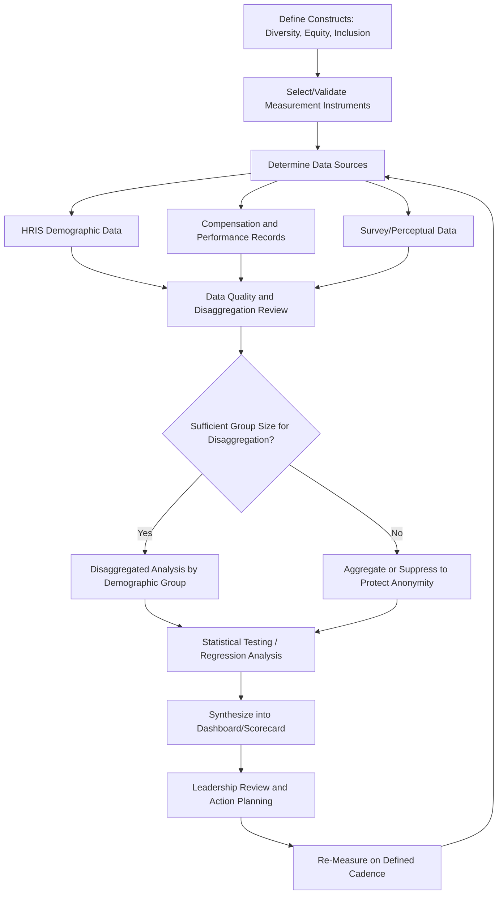

## Measuring Diversity, Equity, and Inclusion Outcomes

### Definition and Scope

Measuring DEI outcomes refers to the systematic collection, analysis, and interpretation of quantitative and qualitative data to assess the state of diversity (representation across demographic groups), equity (fairness in processes and outcomes), and inclusion (the degree to which individuals feel valued, respected, and able to participate fully) within an organization. This discipline sits at the intersection of I-O psychology, HR analytics, and organizational research methodology, and is distinguished by a persistent challenge: diversity is relatively straightforward to quantify (headcount by demographic category), while equity and inclusion are psychological and procedural constructs that are considerably harder to operationalize and measure validly.

### The Three Constructs, Operationally Defined

| Construct | Core Question | Typical Data Type |
| --- | --- | --- |
| Diversity | Who is represented in the organization? | Demographic/headcount data |
| Equity | Are processes and outcomes fair across groups? | Comparative outcome data (pay, promotion, attrition) |
| Inclusion | Do people feel they belong and can contribute fully? | Survey/perceptual data |

**Key Point:** A common measurement error is treating these three as interchangeable or assuming that improvements in diversity metrics automatically indicate improvements in equity or inclusion. An organization can increase representation (diversity) while still having significant pay gaps (equity failure) or low psychological safety for underrepresented groups (inclusion failure). Rigorous measurement treats them as related but distinct constructs requiring different data and methods.

### Diversity Metrics

**Representation metrics:**

- Headcount and percentage representation by demographic category, broken down by level (individual contributor, manager, senior leadership, board)
- Representation trends over time (not just point-in-time snapshots)
- Representation by function/department (to detect occupational segregation)

**Pipeline metrics:**

- Applicant pool diversity relative to relevant labor market availability
- Conversion rates at each hiring stage (application → interview → offer → acceptance), broken down by demographic group, to identify where drop-off concentrates
- Internal mobility and promotion rates by demographic group

**Key Point:** Representation at the top level of an organization (e.g., "30% of our workforce identifies as X") can mask severe underrepresentation at senior levels — this is why **level-disaggregated** reporting is considered a minimum standard in rigorous DEI measurement, often visualized as a "pipeline" or "leaky pipeline" analysis.

### Equity Metrics

**Compensation equity:**

- Adjusted pay gap analysis (controlling for legitimate factors such as role, level, tenure, and performance) versus unadjusted/raw pay gap (which reflects representation issues, not necessarily discriminatory pay-setting)
- Regression-based pay equity audits, typically conducted by or with legal counsel to preserve attorney-client privilege given litigation sensitivity

$$\text{Adjusted Pay Gap} = \beta_{\text{demographic group}} \text{ from a regression controlling for } \{\text{role, level, tenure, performance, location}\}$$

**Process equity:**

- Promotion rate parity across demographic groups, controlling for tenure and performance ratings
- Performance rating distribution analysis (checking for systematic rating differences across groups that cannot be explained by actual performance)
- Termination/involuntary attrition rate parity
- Access to high-visibility assignments, sponsorship, and development opportunities (harder to quantify but increasingly tracked via manager surveys or assignment-tracking systems)

[Inference] Performance rating distribution analysis is one of the more methodologically contested areas in this domain — detecting a statistical disparity in ratings does not, by itself, establish that rating bias (rather than legitimate performance variance) is the cause, so most rigorous approaches pair statistical analysis with qualitative calibration review rather than relying on the numbers alone.

### Inclusion Metrics

Inclusion is measured almost exclusively through **perceptual/survey data**, since it is a subjective, felt experience rather than an observable organizational fact.

**Common validated survey constructs:**

- **Psychological safety** (Edmondson's construct — perceived safety to take interpersonal risks, voice dissent, and admit error without fear of punishment)
- **Belongingness/inclusion climate** — perceived acceptance and value as one's authentic self
- **Voice and psychological empowerment** — perceived ability to influence decisions and be heard
- **Fairness perceptions** — perceived procedural and interactional justice in day-to-day treatment

**Common survey instruments and frameworks:**

- Custom organizational inclusion indices (many large employers build proprietary indices combining several validated subscales)
- Gallup Q12 (engagement-focused, with some overlap into inclusion-adjacent items)
- Academic scales for psychological safety (Edmondson, 1999) and belongingness

**Key Point:** Survey-based inclusion metrics require sufficiently large group sizes to report disaggregated results without compromising respondent anonymity — a persistent tension in inclusion measurement, since the groups most important to disaggregate (small underrepresented populations) are often the groups where anonymity is hardest to preserve.

### Common Measurement Frameworks

**Diversity Scorecards / Dashboards**

Composite dashboards combining representation, equity, and inclusion metrics into a unified reporting structure, typically reviewed quarterly or annually by leadership and, increasingly, disclosed publicly or to institutional investors (e.g., ESG-linked disclosure).

**Diversity Climate Surveys**

Distinct from general engagement surveys — specifically designed to assess perceived fairness and value placed on diversity, often benchmarked against external normative databases.

**Utility Analysis Applied to DEI**

Adapting classic I-O utility analysis (typically used for selection system validity) to estimate the financial or performance impact of DEI interventions — methodologically contested due to difficulty isolating DEI-specific causal effects from confounding organizational changes.

### Measurement Process Workflow

### Methodological Challenges

**Self-report and disclosure limitations**

Many demographic categories relevant to DEI measurement (disability status, sexual orientation, gender identity, veteran status) are voluntarily self-reported, leading to systematic undercounting and non-response bias that complicates trend interpretation.

**Small sample sizes**

Underrepresented groups are, by definition, smaller in headcount — this creates statistical power problems for equity analyses and anonymity problems for survey disaggregation, often requiring data suppression or multi-year aggregation.

**Causal attribution**

Observed disparities in outcomes (pay, promotion, attrition) are frequently multiply determined. Rigorous equity analysis requires controlling for legitimate business factors (tenure, performance, role) before attributing a gap to inequitable treatment — failure to do so risks both false positives (flagging legitimate differences as bias) and false negatives (masking real bias behind uncontrolled confounds).

**Reverse causality and selection effects**

[Inference] Low inclusion scores for a particular group could reflect either (a) genuinely worse treatment, or (b) a selection effect where only employees with negative experiences remain vocal in one direction while others have already exited (survivor bias in attrition-adjusted samples) — distinguishing these typically requires longitudinal rather than cross-sectional survey design, though the specific mechanism at play in any given dataset requires case-by-case investigation.

**Legal and regulatory sensitivity**

[Unverified] The legal landscape around DEI measurement, goal-setting, and disclosure has been actively shifting in the U.S. and elsewhere in recent years (e.g., post-*Students for Fair Admissions* litigation risk considerations affecting how some organizations frame DEI metrics and goals), so organizations should treat this as a domain requiring current legal counsel review rather than relying on historical practice alone.

### Example: Interpreting a Composite Metric

**Example:** An organization reports that women hold 45% of individual contributor roles but only 18% of senior leadership roles, while its overall inclusion survey score for women is statistically indistinguishable from men.

**Analysis:** This pattern indicates a **pipeline/equity problem** (representation attrition at senior levels) that is **not currently showing up as an inclusion/climate problem** in survey data. This is a common and instructive pattern: it suggests the barrier is more likely structural (promotion criteria, sponsorship access, career pathing) than a broadly felt climate issue — pointing measurement follow-up toward promotion-rate and sponsorship-access analysis rather than general culture-survey deep dives.

### Reporting Cadence and Governance

- **Internal dashboards** — typically reviewed monthly or quarterly by HR/People Analytics and leadership
- **Annual DEI reports** — increasingly published externally, ranging from high-level representation percentages to detailed equity analyses, depending on organizational risk tolerance and regulatory environment
- **Board-level reporting** — growing trend of DEI metrics being included in board governance and, in some jurisdictions/exchanges, in mandatory or voluntary ESG disclosures
- **Data governance** — equity-sensitive analyses (especially pay equity) are frequently conducted under attorney-client privilege to manage litigation risk, which can create tension with transparency goals

### Common Organizational Pitfalls

- Reporting only aggregate/top-line representation numbers without level or functional disaggregation
- Treating diversity metrics as a proxy for inclusion or equity without direct measurement of either
- Setting numeric representation targets without corresponding process/equity measurement to verify fair underlying mechanisms
- Conducting one-time equity audits rather than establishing an ongoing measurement cadence
- Insufficient sample size planning, leading to either suppressed disaggregated data or compromised respondent anonymity
- Failing to pair quantitative metrics with qualitative data (focus groups, listening sessions) that explain the "why" behind a statistical pattern

### Related Topics

- People Analytics and HR Metrics Design
- Psychological Safety (Edmondson's Framework)
- Organizational Justice Theory (Distributive, Procedural, Interactional)
- Pay Equity Analysis and Regression-Based Auditing
- Adverse Impact Analysis in Selection (four-fifths rule and related methods)
- Survey Design and Validation in Organizational Research
- Diversity Climate versus Inclusion Climate
- Legal Frameworks Governing DEI Data Collection and Disclosure