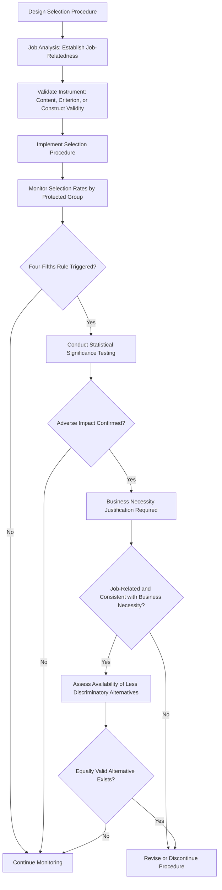

## Employment Law Fundamentals

### Definition and Scope

Employment law fundamentals encompass the body of statutory, regulatory, and case law governing the relationship between employers and employees — covering hiring, compensation, working conditions, discrimination, termination, and workplace safety. For organizational psychologists, this domain is essential not as a substitute for legal counsel, but as a foundational literacy that shapes the design of legally defensible selection systems, performance management processes, compensation structures, and workplace policies.

[Unverified] Employment law is highly jurisdiction-specific, and the content below primarily reflects U.S. federal frameworks (the most extensively documented in I-O psychology literature) with the explicit caveat that state/local law, and law in other countries, frequently impose additional or different requirements. This should not be treated as legal advice for any specific situation or jurisdiction.

### Employment Relationship Fundamentals

**Employment-at-will doctrine**

The default legal presumption in most U.S. states that either the employer or employee may terminate the employment relationship at any time, for any reason or no reason, provided the reason is not illegal (e.g., discriminatory, retaliatory, or in violation of public policy).

**Key exceptions to at-will employment:**

- Implied contract (e.g., statements in employee handbooks or verbal assurances that a court interprets as creating contractual job security expectations)
- Public policy exception (termination cannot violate a clearly established public policy, e.g., firing someone for refusing to commit an illegal act, or for filing a workers' compensation claim)
- Covenant of good faith and fair dealing (recognized in a minority of states)
- Statutory protections (discrimination, retaliation, and other specific protected-activity statutes override at-will presumption)

**Independent contractor vs. employee classification**

A critical distinction with significant legal and tax consequences. Common tests include:

- **IRS Common Law Test** — evaluates behavioral control, financial control, and relationship type
- **Economic Realities Test** (used under the Fair Labor Standards Act) — evaluates the degree of economic dependence on the employer
- **ABC Test** (used in some states, e.g., California's AB5) — presumes employee status unless the employer proves all three prongs (independence from control, work outside the usual course of business, independently established trade)

[Inference] Misclassification is one of the most litigated and financially consequential employment law issues for organizations, given that the applicable test — and therefore the correct classification outcome — can differ significantly depending on jurisdiction and the specific statute being applied (tax law, wage law, and benefits law do not always use identical tests).

### Major U.S. Federal Anti-Discrimination Statutes

| Statute | Year | Protected Basis | Employer Coverage Threshold |
| --- | --- | --- | --- |
| Title VII of the Civil Rights Act | 1964 | Race, color, religion, sex, national origin | 15+ employees |
| Age Discrimination in Employment Act (ADEA) | 1967 | Age (40+) | 20+ employees |
| Americans with Disabilities Act (ADA) | 1990 | Disability | 15+ employees |
| Equal Pay Act (EPA) | 1963 | Sex-based pay discrimination | Most employers (no minimum threshold) |
| Pregnancy Discrimination Act | 1978 | Pregnancy, childbirth, related conditions | 15+ employees (amendment to Title VII) |
| Genetic Information Nondiscrimination Act (GINA) | 2008 | Genetic information | 15+ employees |

[Unverified] Coverage thresholds and specific provisions are subject to periodic amendment and judicial interpretation; current figures should be verified against the EEOC or current legal sources at time of application.

**Key Point:** These statutes are enforced primarily by the **Equal Employment Opportunity Commission (EEOC)**, and most require exhaustion of the EEOC administrative charge process before an individual can file a private lawsuit.

### Theories of Discrimination

**Disparate treatment**

Intentional discrimination — an employer treats an individual less favorably specifically because of a protected characteristic. Requires proof of discriminatory intent, often established through the **McDonnell Douglas burden-shifting framework**:

1. Plaintiff establishes a prima facie case
2. Employer articulates a legitimate, nondiscriminatory reason for the action
3. Plaintiff must show the stated reason is pretextual

**Disparate impact**

Facially neutral policies or practices that have a disproportionately negative effect on a protected group, regardless of intent. This is the theory most directly relevant to I-O psychology, since it governs the legal scrutiny of selection tests, physical ability requirements, and other assessment tools.

$$\text{Adverse Impact Ratio} = \frac{\text{Selection Rate for Protected Group}}{\text{Selection Rate for Reference Group}}$$

The **four-fifths rule** (from the Uniform Guidelines on Employee Selection Procedures, 1978) is a common rule-of-thumb screening indicator: a selection rate for any group that is less than four-fifths (80%) of the rate for the group with the highest selection rate is generally regarded as evidence of adverse impact, though it functions as an investigatory trigger rather than a definitive legal conclusion.

[Inference] Courts and the EEOC generally treat the four-fifths rule as a practical screening heuristic rather than a strict statistical or legal standard — statistical significance testing is often applied alongside or instead of the four-fifths ratio in actual litigation, particularly with larger sample sizes where the ratio can be a misleading indicator.

**Employer defenses:**

- **Business necessity** — the challenged practice is job-related and consistent with business necessity (the primary defense to disparate impact claims)
- **Bona fide occupational qualification (BFOQ)** — a narrow defense allowing consideration of otherwise-protected characteristics (e.g., sex, religion) when reasonably necessary to the normal operation of the business; notably, BFOQ is *not* available as a defense to race discrimination under Title VII

### Selection System Legal Defensibility Workflow

### Harassment Law

**Hostile work environment** — unwelcome conduct based on a protected characteristic that is severe or pervasive enough to alter the conditions of employment and create an abusive working environment, judged by both subjective (the victim's actual perception) and objective (a reasonable person's perception) standards.

**Quid pro quo harassment** — conditioning employment benefits or continued employment on submission to unwelcome conduct, typically of a sexual nature.

**Employer liability standards** — under *Faragher v. City of Boca Raton* and *Burlington Industries v. Ellerth* (1998), employer liability for supervisor harassment differs depending on whether a tangible employment action occurred, and employers may raise an affirmative defense (the *Faragher-Ellerth* defense) by demonstrating reasonable preventive/corrective measures and unreasonable failure by the employee to take advantage of them.

### Retaliation

Retaliation claims — punishing an employee for engaging in protected activity (filing a complaint, participating in an investigation, opposing discriminatory practice) — are among the most frequently filed charge types with the EEOC. [Unverified] Exact year-over-year EEOC charge statistics fluctuate and should be verified against current EEOC annual reports rather than assumed static.

**Key elements typically required:**

1. Employee engaged in protected activity
2. Employer took a materially adverse action
3. A causal connection exists between the two

### Wage and Hour Law

**Fair Labor Standards Act (FLSA), 1938** — establishes federal minimum wage, overtime pay requirements (time-and-a-half for hours worked beyond 40 in a workweek for non-exempt employees), and child labor restrictions.

**Exempt vs. non-exempt classification** — governed by a combination of salary level, salary basis, and duties tests (e.g., executive, administrative, professional exemptions). Misclassifying non-exempt employees as exempt is a common and costly compliance failure.

[Unverified] Specific salary thresholds for exemption status are periodically updated by the Department of Labor and subject to legal challenge; current thresholds should be verified at time of application rather than assumed from prior years.

### Leave and Accommodation Laws

- **Family and Medical Leave Act (FMLA)** — provides eligible employees up to 12 weeks of unpaid, job-protected leave for specified family and medical reasons, applicable to employers with 50+ employees within a 75-mile radius
- **Americans with Disabilities Act (ADA)** — requires reasonable accommodation for qualified individuals with disabilities (see also the Disability and Accessibility Inclusion topic)
- **State and local paid leave laws** — an expanding and highly variable patchwork, given no federal paid leave mandate currently exists [Unverified — subject to legislative change]

### Labor Relations Fundamentals

**National Labor Relations Act (NLRA), 1935** — protects employees' rights to organize, engage in collective bargaining, and participate in "concerted activity" for mutual aid or protection, enforced by the **National Labor Relations Board (NLRB)**. Notably, many NLRA protections around concerted activity apply to non-union as well as union employees.

### Enforcement Agencies (U.S.)

| Agency | Primary Jurisdiction |
| --- | --- |
| Equal Employment Opportunity Commission (EEOC) | Discrimination, harassment, retaliation |
| Department of Labor (DOL) | Wage/hour, FMLA, OSHA (via sub-agency), federal contractor compliance |
| National Labor Relations Board (NLRB) | Union organizing, collective bargaining, concerted activity |
| Office of Federal Contract Compliance Programs (OFCCP) | Affirmative action and nondiscrimination among federal contractors |

### Example: Applying the Framework

**Example:** An organization implements a physical fitness test as a selection requirement for a warehouse role. Post-implementation data shows a 45% pass rate for male applicants and 30% for female applicants.

**Analysis:** $30/45 = 0.667$, which falls below the four-fifths threshold ($0.80$), triggering adverse impact scrutiny under disparate impact theory. The employer's defense would require demonstrating the test is job-related and consistent with business necessity (i.e., validated against actual physical job demands through proper job analysis) and that no less discriminatory alternative test exists that would achieve comparable predictive validity — this is precisely the intersection where I-O psychology's validation methodology and employment law converge.

### Common Organizational Pitfalls

- Assuming employment-at-will provides unlimited termination discretion without accounting for statutory and public-policy exceptions
- Implementing selection tools without job analysis or validation evidence, creating disparate impact exposure
- Misclassifying employees as independent contractors or as exempt from overtime without applying the correct jurisdiction-specific test
- Treating the four-fifths rule as a definitive legal safe harbor rather than a screening heuristic
- Failing to document the business rationale for employment decisions, weakening pretext defenses in disparate treatment claims
- Assuming federal law alone governs, when state and local law frequently impose additional or more stringent requirements

### Related Topics

- Adverse Impact Analysis and the Uniform Guidelines on Employee Selection Procedures
- Job Analysis and Validity (Content, Criterion, Construct)
- EEOC Charge Process and Investigation Procedures
- Affirmative Action and OFCCP Compliance for Federal Contractors
- Wrongful Termination and At-Will Employment Exceptions
- Harassment Prevention Training and Employer Liability
- Wage and Hour Compliance (FLSA Exemption Classification)
- Labor Relations and Collective Bargaining