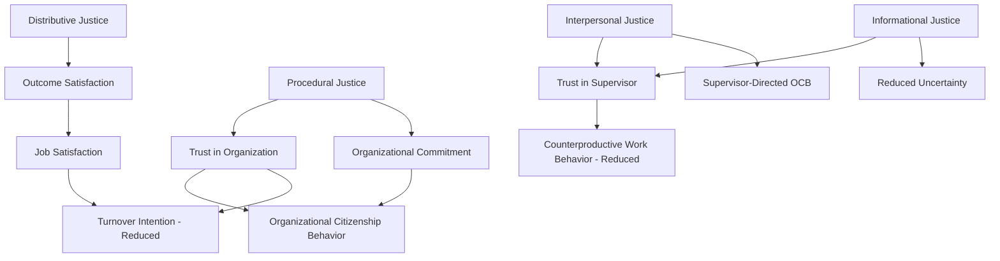

## Organizational Justice and Its Dimensions

### Definition and Scope

Organizational justice refers to employees' perceptions of fairness within the workplace and their behavioral and attitudinal reactions to those perceptions. Unlike employment law, which governs objective legal compliance, organizational justice is fundamentally a **perceptual construct** — what matters for predicting employee attitudes and behavior is not whether a decision was "actually" fair by some external standard, but whether employees *perceive* it as fair. This makes organizational justice one of the most heavily researched constructs in I-O psychology, given its consistent predictive relationships with outcomes such as trust, commitment, citizenship behavior, and counterproductive work behavior.

### Historical Development

**Equity Theory (Adams, 1965)** — the foundational precursor to organizational justice research, proposing that individuals compare their ratio of inputs (effort, skill, time) to outcomes (pay, recognition) against a referent other's ratio, and experience distress (and corrective motivation) when the ratios are perceived as unequal.

$$\frac{O_{\text{self}}}{I_{\text{self}}} \; \text{vs.} \; \frac{O_{\text{other}}}{I_{\text{other}}}$$

Where perceived inequity in either direction (under-reward or over-reward) motivates behavior aimed at restoring balance — either through changing actual inputs/outcomes or through cognitive distortion of perceived inputs/outcomes.

**Key Point:** Equity theory focused narrowly on outcome fairness. Organizational justice theory subsequently expanded this into a multidimensional framework recognizing that fairness perceptions arise not only from *what* outcome one receives, but from *how* that outcome was determined and *how* one was treated during the process.

### The Four Dimensions of Organizational Justice

**1. Distributive Justice**

Perceived fairness of outcomes themselves (pay, promotions, workload, resource allocation), typically evaluated against allocation norms such as equity (outcomes proportional to contribution), equality (equal outcomes regardless of contribution), or need (outcomes based on need).

**2. Procedural Justice**

Perceived fairness of the *processes* used to determine outcomes, independent of the outcome itself. Grounded in Thibaut and Walker's (1975) work on procedural justice in legal contexts, later extended to organizational settings by Leventhal (1980).

**Leventhal's six procedural justice rules:**

- Consistency (applied the same way across people and time)
- Bias suppression (decision-maker free from personal self-interest)
- Accuracy (based on accurate information)
- Correctability (opportunities to appeal or modify decisions)
- Representativeness (input from all affected parties)
- Ethicality (consistent with prevailing moral and ethical standards)

**3. Interpersonal Justice**

Perceived fairness of the interpersonal treatment received during the enactment of procedures — specifically, whether one is treated with dignity, respect, and propriety by the authority figure implementing a decision.

**4. Informational Justice**

Perceived adequacy of the explanations provided for decisions — whether communication is honest, timely, and provides sufficient rationale.

[Inference] Interpersonal and informational justice were originally combined under a broader "interactional justice" construct (Bies & Moag, 1986) before being empirically and conceptually separated into two distinct dimensions by Colquitt (2001); some researchers and practitioners still use the two-dimensional "interactional justice" framing, particularly in older literature, so both framings may be encountered depending on the source.

### Colquitt's Four-Factor Model and Measurement

Jason Colquitt's 2001 paper, "On the Dimensionality of Organizational Justice: A Construct Validation of a Measure," is widely regarded as the field's defining empirical contribution, providing a validated 20-item scale measuring all four dimensions distinctly and establishing them as empirically separable (rather than a single unidimensional "fairness" construct).

| Dimension | Sample Item Focus | Typical Referent |
| --- | --- | --- |
| Distributive | "Does your outcome reflect your effort?" | The outcome itself |
| Procedural | "Are you able to express views during procedures?" | The decision-making process |
| Interpersonal | "Does your supervisor treat you with respect?" | The authority figure's conduct |
| Informational | "Does your supervisor explain procedures thoroughly?" | The communication/explanation |

### Theoretical Mechanisms Explaining Justice Effects

**Instrumental/self-interest model** — fair procedures matter because they help ensure favorable long-term outcomes (control-based explanation, rooted in Thibaut and Walker's original legal-context work)

**Group value / relational model (Lind & Tyler, 1988)** — fair treatment, particularly procedural and interpersonal justice, signals one's standing and status within a valued group, independent of any instrumental outcome benefit; this explains why procedural fairness matters even when it doesn't change the final outcome

**Fairness heuristic theory (Lind, 2001)** — individuals use early fairness cues (often procedural, since they are experienced before outcomes are known) as a heuristic to decide how much to trust an authority, which then colors interpretation of subsequent events

**Deonance/moral mandate perspective** — some justice reactions (particularly to third-party unfairness, i.e., observing unfairness toward others) are driven by moral obligation rather than self-interest or social identity concerns

### Justice Dimensions and Their Outcome Relationships

**Key Point:** A well-established finding is that distributive justice tends to be the stronger predictor of outcome-specific attitudes (e.g., pay satisfaction), while procedural, interpersonal, and informational justice tend to be stronger predictors of system-level and person-level attitudes (organizational commitment, trust in supervisor, discretionary behavior). [Inference] This pattern is broadly consistent across multiple meta-analyses (e.g., Colquitt et al., 2001; Cohen-Charash & Spector, 2001), though the precise relative magnitude of effects varies somewhat by study and outcome measured.

### The "Justice Effect" in Organizational Change and Layoffs

Organizational justice theory has particularly robust application in contexts of negative outcomes — layoffs, pay cuts, denied promotions — where research consistently finds that **how** a negative outcome is delivered substantially affects employee reactions, independent of the outcome's severity.

**Example:** Two organizations both conduct layoffs of 10% of their workforce. Organization A provides advance notice, a clear and honest explanation of the business rationale (informational justice), consistent selection criteria applied transparently (procedural justice), and delivers the news through respectful, dignified individual conversations (interpersonal justice). Organization B announces layoffs abruptly via a mass email with no rationale given.

**Analysis:** Even though the outcome (job loss) is identical, remaining employees ("survivors") at Organization A are likely to show substantially higher post-layoff trust, commitment, and lower turnover intention than those at Organization B — a well-documented pattern in the layoff/survivor literature, illustrating that procedural, interpersonal, and informational justice have effects that extend beyond the directly affected individuals to the broader observing workforce.

### Justice Climate

Beyond individual-level perceptions, **justice climate** refers to shared, group-level perceptions of fairness — the degree to which members of a team or unit collectively agree that they are treated fairly. This is a distinct level-of-analysis construct from individual justice perceptions and has been shown to predict team-level outcomes (team performance, team cohesion) beyond what individual-level justice perceptions predict alone.

[Inference] The existence of meaningful justice climate effects, separate from individual-level perceptions, is reasonably well-supported in the multilevel organizational justice literature (e.g., Naumann & Bennett, 2000, and subsequent work), though this remains a less extensively replicated area than individual-level justice research.

### Third-Party and Overall Justice Perceptions

**Third-party justice reactions** — individuals form fairness judgments not only about events affecting themselves, but about how others are treated, with implications for bystander reactions, whistleblowing, and organizational reputation

**Overall justice perceptions** — some researchers (Ambrose & Schminke, 2009) argue that individuals form a holistic, overall fairness judgment that mediates the relationship between the four specific dimensions and outcomes, rather than each dimension independently and additively predicting outcomes — an ongoing area of theoretical and empirical debate regarding whether the four-dimension model or an overall-justice model better represents the underlying psychological process

### Practical Applications for Organizational Design

**Performance management:**

- Ensure rating criteria are applied consistently across raters and employees (procedural)
- Provide clear rationale for ratings and calibration decisions (informational)
- Train managers in respectful delivery of performance feedback, particularly negative feedback (interpersonal)

**Compensation systems:**

- Communicate the rationale behind pay-setting methodology, not just the outcome (informational)
- Ensure consistent application of compensation criteria across similar roles (procedural)
- Provide avenues for employees to voice concerns or seek clarification about pay decisions (procedural — "voice" is a specific sub-element)

**Organizational change and restructuring:**

- Provide advance notice and honest explanation of rationale (informational)
- Apply selection criteria (e.g., for layoffs) consistently and transparently (procedural)
- Train those delivering difficult news in respectful, dignified communication (interpersonal)

**Grievance and appeal systems:**

- Build in correctability (Leventhal's principle) — a mechanism for employees to challenge and potentially reverse decisions
- Ensure decision-makers are, and are perceived to be, free of personal conflicts of interest (bias suppression)

### Measurement Considerations

- Colquitt's (2001) 20-item four-factor scale remains the dominant validated instrument in academic research
- Organizational justice surveys should specify a clear referent (justice from whom — direct supervisor, senior leadership, the organization as a system) since perceptions can vary meaningfully by referent
- Distinguishing justice climate (aggregated, shared team perception) from individual justice perceptions requires appropriate multilevel measurement and aggregation statistics (e.g., ICC(1), ICC(2), $r_{wg}$) to justify aggregation to the group level

### Common Organizational Pitfalls

- Assuming that a "fair" outcome (by objective/legal standards) is sufficient without attention to how the outcome was reached or communicated
- Applying procedures inconsistently across teams or managers, undermining procedural justice even when intentions are good
- Treating interpersonal and informational justice as "soft skills" rather than measurable, trainable managerial competencies with documented business impact
- Failing to provide voice or appeal mechanisms, which are core to perceived procedural fairness independent of outcome favorability
- Overlooking justice climate effects by focusing exclusively on individual-level perceptions in survey design and intervention

### Related Topics

- Equity Theory and Social Exchange Theory
- Psychological Contract Theory and Breach
- Organizational Citizenship Behavior (OCB)
- Counterproductive Work Behavior (CWB)
- Trust in Leadership and Trust Repair
- Layoff Survivor Syndrome and Change Management
- Measuring Diversity, Equity, and Inclusion Outcomes
- Ethical Decision-Making Frameworks in Organizations