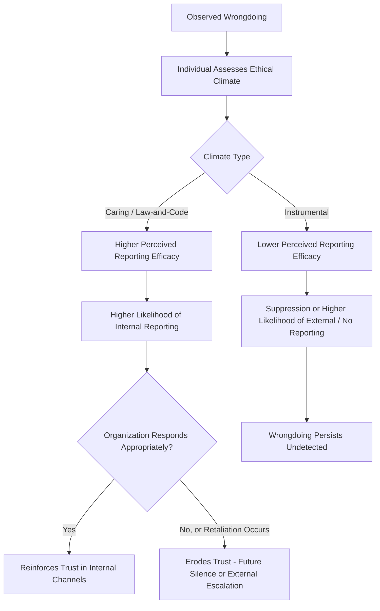

## Whistleblowing and Ethical Climate

### Definition and Scope

Whistleblowing refers to the disclosure by an organizational member (current or former employee) of illegal, unethical, or illegitimate practices under the control of their employer to parties who may be able to effect action — either internally (supervisors, ethics hotlines, compliance departments) or externally (regulators, media, law enforcement). Ethical climate refers to the shared perceptions among organizational members of what constitutes ethically appropriate behavior and how ethical issues should be handled — the normative, socially constructed "rules" governing ethical decision-making within a given work unit. These two constructs are treated together because ethical climate is one of the most consistently documented predictors of whether employees choose to report wrongdoing at all.

### Defining Whistleblowing: Core Elements

Near and Miceli's (1985) foundational definition, still widely used, specifies four elements:

1. **Disclosure** of information
2. By an **organizational member** (current or former)
3. Regarding **illegal, immoral, or illegitimate practices**
4. That are **under the control of the employer**
5. **To persons or organizations that may be able to effect action**

**Internal vs. external whistleblowing:**

- **Internal whistleblowing** — reporting through organizational channels (direct supervisor, ethics hotline, compliance/legal department, ombudsperson)
- **External whistleblowing** — reporting to parties outside the organization (regulatory agencies, media, law enforcement)

**Key Point:** Research consistently finds that most whistleblowers attempt internal channels first, and only escalate to external reporting when internal channels are perceived as ineffective, retaliatory, or when the organization fails to act on the initial disclosure. [Inference] This sequential pattern is well-supported across the whistleblowing literature (e.g., Near & Miceli's body of work), though the specific threshold at which any individual escalates to external reporting depends heavily on situational and individual factors that vary case by case.

### Theoretical Models of the Whistleblowing Decision

**Near and Miceli's Whistleblowing Process Model**

Proposes that whistleblowing unfolds through a sequence: (1) an individual perceives a questionable practice, (2) judges it to be wrong, (3) decides whether to act, (4) chooses a reporting channel, and (5) the organization responds — with organizational response strongly shaping whether further action (including retaliation avoidance behavior or external escalation) follows.

**Prosocial Behavior Framework**

Frames whistleblowing as a form of prosocial organizational behavior, distinct from typical organizational citizenship behavior in that it often involves direct personal risk and can create conflict with peers or superiors rather than goodwill.

**Cost-Benefit / Rational Choice Models**

Model the whistleblowing decision as weighing perceived costs (retaliation risk, social ostracism, career damage) against perceived benefits (correcting wrongdoing, moral satisfaction, potential legal reward in some regulatory frameworks) and perceived probability that reporting will actually result in corrective action.

$$P(\text{Reporting}) = f(\text{Perceived Severity of Wrongdoing}, \text{Perceived Efficacy of Reporting}, -\text{Perceived Retaliation Risk})$$

[Inference] This functional relationship is a reasonable synthesis of consistently replicated predictors across the whistleblowing literature, but it should be read as a conceptual summary rather than a formally validated single equation — actual empirical models in the literature use varied operationalizations and additional moderating variables.

### Individual and Situational Predictors of Whistleblowing

**Individual-level predictors:**

- Moral judgment/development level (individuals at higher stages of moral reasoning per Kohlberg-derived frameworks are more likely to report)
- Locus of control (internal locus of control associated with higher likelihood of reporting)
- Tenure and organizational commitment (findings are mixed — commitment can increase willingness to report to protect the organization, or decrease it due to loyalty-based reluctance)
- Perceived personal responsibility to act

**Situational/organizational predictors:**

- Seriousness of the observed wrongdoing (stronger predictor than most individual traits)
- Strength of evidence available to the observer
- Status and power of the wrongdoer (higher-status wrongdoers associated with lower reporting rates — sometimes termed the "power distance" barrier to reporting)
- Presence and perceived effectiveness of formal reporting channels
- Ethical climate and culture (see below)

### Ethical Climate: Theoretical Foundation

Victor and Cullen's (1988) **Ethical Climate Theory** is the dominant framework, proposing that ethical climates vary along two dimensions:

**Ethical criterion** (the basis for ethical reasoning used):

- **Egoism** — self-interest as the guiding criterion
- **Benevolence** — concern for the welfare of others
- **Principle** — adherence to rules, codes, or laws

**Locus of analysis** (whose interests are the reference point):

- **Individual** — one's own interests
- **Local** — the immediate organization/team's interests
- **Cosmopolitan** — society or profession-wide standards

Crossing these dimensions theoretically yields nine climate types, though empirical research has most consistently identified five recurring climate types in practice:

| Climate Type | Criterion × Locus | Typical Characteristics |
| --- | --- | --- |
| Instrumental | Egoism × Individual/Local | Self-interest and organizational self-interest prioritized |
| Caring | Benevolence × Local/Cosmopolitan | Concern for the welfare of coworkers and broader stakeholders |
| Independence | Principle × Individual | Personal moral beliefs guide decisions |
| Rules | Principle × Local | Strict adherence to organizational rules and procedures |
| Law and Code | Principle × Cosmopolitan | Adherence to external legal/professional codes |

[Inference] The reduction from nine theoretical types to five commonly observed empirical types reflects a well-replicated pattern across multiple studies using Victor and Cullen's Ethical Climate Questionnaire (ECQ), though exact factor structures have varied somewhat by sample and industry across studies.

### Ethical Climate and Whistleblowing Likelihood

**Key Point:** Instrumental climates (where self-interest is the dominant ethical criterion) are consistently associated with lower rates of internal whistleblowing and higher rates of either silence or external escalation, while caring and law-and-code climates are associated with higher internal reporting rates — a pattern with direct practical significance for organizations seeking to detect and correct wrongdoing before it requires external, reputationally costly intervention.

### Retaliation

Retaliation against whistleblowers — demotion, termination, exclusion, harassment, or more subtle forms such as reduced assignments or social ostracism — is one of the most consistently documented risks associated with whistleblowing and a primary deterrent to reporting.

**Legal protections (U.S., illustrative, non-exhaustive):**

- **Sarbanes-Oxley Act (SOX), 2002** — protects employees of publicly traded companies who report certain types of fraud
- **Dodd-Frank Act, 2010** — provides both protection and, notably, financial incentive/reward provisions for reporting securities law violations directly to the SEC
- **False Claims Act (qui tam provisions)** — allows private individuals to sue on behalf of the government for fraud against federal programs, with financial reward provisions
- **Occupational Safety and Health Act (OSHA) Section 11(c)** — protects employees reporting workplace safety violations

[Unverified] Whistleblower protection statutes are numerous, sector-specific, and vary considerably by jurisdiction and industry (e.g., separate statutes often govern financial services, healthcare, environmental, and government-contractor whistleblowing); this list is illustrative rather than exhaustive, and specific legal protection should be verified against current statute and counsel for any real situation.

### Bystander Effect and Diffusion of Responsibility in Wrongdoing Observation

[Inference] Whistleblowing research has drawn on classic bystander intervention literature (Latané & Darley) to explain why individuals who observe wrongdoing often fail to report it even when they privately disapprove — diffusion of responsibility increases as the number of other observers/potential reporters increases, reducing any single individual's perceived personal obligation to act. This application of bystander theory to whistleblowing is a reasonably well-established theoretical extension, though it represents one contributing explanation among several rather than the complete account of reporting failure.

### Example: Applying the Framework

**Example:** An employee observes a colleague falsifying safety inspection records. The organization has a caring/law-and-code ethical climate, a well-publicized anonymous reporting hotline, and a documented history of taking reports seriously without retaliation. Contrast this with an otherwise identical scenario at an organization with an instrumental climate where a prior whistleblower was quietly demoted after reporting a similar issue.

**Analysis:** In the first scenario, the combination of strong perceived reporting efficacy (trusted channel, track record of action) and a climate emphasizing rule-adherence over self-interest predicts a substantially higher likelihood of prompt internal reporting. In the second scenario, the documented retaliation precedent directly suppresses perceived reporting efficacy regardless of the formal existence of a hotline — illustrating that **formal reporting mechanisms are necessary but not sufficient**; perceived psychological safety and track record of non-retaliation are the stronger proximal predictors of actual reporting behavior.

### Organizational Design Implications

**Building effective internal reporting systems:**

- Multiple reporting channels (direct supervisor, skip-level, anonymous hotline, ombudsperson) to accommodate varying trust levels and power-distance concerns
- Clear, consistently enforced non-retaliation policies, with visible follow-through when violations occur
- Timely investigation and communication back to reporters (where legally and practically feasible) to reinforce perceived reporting efficacy
- Leadership modeling of ethical decision-making, since ethical climate is substantially shaped by perceived leader behavior (tone at the top)

**Building a supportive ethical climate:**

- Embedding ethical considerations explicitly into performance management and decision-making processes rather than treating ethics as a separate, annual-training-only topic
- Ensuring formal codes of conduct are reinforced by informal norms and actual practice (a mismatch between stated code and lived climate undermines both)
- Training managers specifically on how to receive and respond to reports without defensive or retaliatory reactions

### Measurement

- **Victor and Cullen's Ethical Climate Questionnaire (ECQ)** — the dominant validated instrument for assessing ethical climate type
- **Whistleblowing intention scales** — typically vignette-based measures assessing likelihood of reporting under varied hypothetical conditions (varying severity, channel, and anticipated consequences)
- **Ethics hotline utilization and outcome tracking** — organizational-level metrics (report volume, substantiation rate, time-to-resolution, retaliation complaint rate) used as indirect indicators of both ethical climate and reporting system trust

### Common Organizational Pitfalls

- Implementing a formal reporting hotline without addressing the underlying trust and retaliation-risk perceptions that actually drive reporting behavior
- Failing to visibly and consistently enforce non-retaliation policies, which undermines perceived reporting efficacy more than any single hotline feature
- Treating ethics training as a compliance checkbox rather than an ongoing element of climate-building
- Ignoring power-distance barriers that suppress reporting of wrongdoing by high-status individuals
- Overlooking the diffusion-of-responsibility effect in team or unit settings where wrongdoing is observed by multiple people, none of whom feels sole responsibility to report

### Related Topics

- Ethical Climate Theory (Victor & Cullen) and the Ethical Climate Questionnaire
- Organizational Justice and Its Dimensions
- Psychological Safety in Teams
- Retaliation Law and Employer Liability
- Prosocial and Extra-Role Organizational Behavior
- Moral Development Theory (Kohlberg) Applied to Organizations
- Corporate Compliance Program Design
- Bystander Intervention Theory