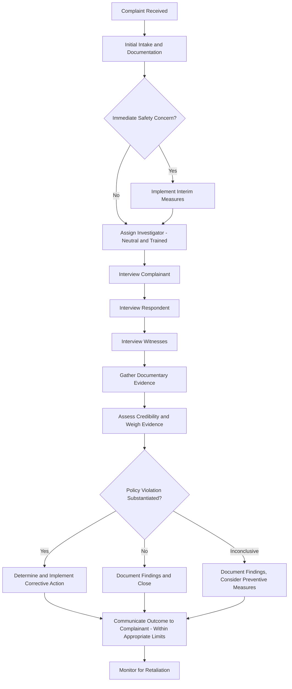

## Harassment Policy and Prevention

### Definition and Scope

Workplace harassment policy and prevention encompasses the legal definitions, organizational policies, training methodologies, and cultural interventions designed to prevent unwelcome conduct based on protected characteristics and to respond effectively when it occurs. This domain sits at the intersection of employment law and organizational behavior: the legal definitions establish minimum compliance obligations, while I-O psychology research addresses the organizational and psychological factors that determine whether prevention efforts actually change behavior versus merely satisfying documentation requirements.

### Legal Definitions and Standards

**Hostile work environment harassment**

Unwelcome conduct based on a protected characteristic (sex, race, religion, national origin, age, disability, and others depending on jurisdiction) that is sufficiently **severe or pervasive** to alter the conditions of employment and create an abusive working environment. Evaluated under both:

- **Subjective standard** — whether the victim actually perceived the environment as hostile or abusive
- **Objective standard** — whether a reasonable person in the victim's position would perceive it as such

**Quid pro quo harassment**

Conditioning tangible employment benefits (hiring, promotion, continued employment, favorable assignments) on submission to unwelcome conduct, typically sexual in nature. Unlike hostile work environment claims, a single incident can be sufficient to establish quid pro quo harassment if a tangible employment action results.

**Key Point:** The "severe or pervasive" standard for hostile work environment claims means that a single offensive remark generally does not create legal liability, but a pattern of conduct — or a single sufficiently severe incident (e.g., physical assault) — can. [Inference] Courts generally apply a totality-of-circumstances test weighing frequency, severity, whether the conduct was physically threatening or humiliating, and whether it unreasonably interfered with work performance, though the precise weighting of these factors varies by case and jurisdiction.

### Employer Liability Frameworks

**Faragher-Ellerth Affirmative Defense**

Established by the U.S. Supreme Court in *Faragher v. City of Boca Raton* and *Burlington Industries v. Ellerth* (1998), this framework distinguishes employer liability based on harasser status and outcome:

| Scenario | Employer Liability Standard |
| --- | --- |
| Supervisor harassment resulting in tangible employment action | Strict liability (no affirmative defense available) |
| Supervisor harassment, no tangible employment action | Vicarious liability, subject to affirmative defense |
| Coworker or non-supervisory harassment | Negligence standard (employer liable only if it knew or should have known and failed to act) |

**The affirmative defense** (available only in the second scenario above) requires the employer to demonstrate both:

1. It exercised reasonable care to prevent and promptly correct harassing behavior (e.g., maintained and enforced a policy, provided training, responded appropriately to complaints)
2. The employee unreasonably failed to take advantage of preventive or corrective opportunities provided (e.g., failed to report through available channels)

**Key Point:** This legal framework directly incentivizes the specific organizational practices covered below — written policy, training, and accessible reporting channels are not merely best practices but components of a recognized legal defense.

### Anti-Harassment Policy Design Elements

**Core components of a legally defensible policy:**

- Clear definition of prohibited conduct, with illustrative (non-exhaustive) examples
- Multiple reporting channels (direct supervisor, HR, alternative contact for cases where the supervisor is the alleged harasser, anonymous hotline where available)
- Explicit non-retaliation provisions
- Defined investigation process with reasonable timelines
- Confidentiality provisions (balanced against the practical needs of investigation)
- Clearly stated consequences for policy violations
- Regular dissemination and acknowledgment (not merely a one-time handbook inclusion)

### Harassment Reporting and Investigation Workflow

[Inference] The specific sequencing and documentation practices shown reflect commonly recommended investigation practice drawn from employment law and HR investigation literature, but actual investigation protocols vary by organization, jurisdiction, and the specific circumstances of each case, and should be designed in consultation with employment counsel.

### Training Effectiveness Research

This is an area where I-O psychology research has produced findings that meaningfully complicate the common assumption that mandatory training alone prevents harassment.

**Findings on training limitations:**

- [Inference] A substantial body of research suggests that traditional, compliance-focused, one-time annual harassment training shows limited evidence of producing lasting behavior change, and some studies have found such training can produce reactance effects (particularly among individuals already holding attitudes tolerant of harassment) rather than attitude improvement — this remains an active area of research with some methodological disagreement about effect sizes and measurement approaches across studies.
- Bystander intervention training approaches (training coworkers to recognize and interrupt problematic situations, rather than focusing solely on defining prohibited conduct) have shown more promising evidence for behavior change than purely definitional/compliance training
- Training effectiveness appears to interact strongly with organizational climate — training embedded within a genuinely supportive ethical and inclusion climate shows better outcomes than identical training delivered in an unsupportive climate

**Key Point:** This body of research suggests a shift in best practice away from training as a standalone, checkbox compliance activity and toward training as one component of a broader climate-and-accountability system — consistent with the *Faragher-Ellerth* framework's emphasis on effective prevention, not merely documented prevention.

### Organizational and Climate-Level Risk Factors

Research (notably work associated with the U.S. Equal Employment Opportunity Commission's Select Task Force on the Study of Harassment in the Workplace, 2016) has identified organizational risk factors that predict elevated harassment prevalence:

- **Homogeneous workforces** with significant power differentials (e.g., large gender or demographic imbalances within a hierarchy)
- **Workplaces with "outlier" status employees** (isolated individuals differing demographically from the majority of their work group)
- **Cultures that tolerate or reward "alpha" or aggressive interpersonal styles**
- **Significant power disparities** combined with reliance on subjective decision-making (e.g., in performance evaluation, scheduling, or assignment)
- **Decentralized workplaces** with limited oversight (e.g., remote or dispersed work sites)
- **Workforces with significant use of alcohol** in work-related settings
- **Climates of tolerance** — perceived organizational indifference to harassment complaints, which is one of the strongest predictors of harassment prevalence identified in this research stream

[Unverified] These risk factors originate from the EEOC Select Task Force's synthesis of available research as of its 2016 report; subsequent research may have refined or added to this list, and the relative weight of each factor varies by industry and organizational context.

### Bystander Intervention Models

**The 5 D's / 4 D's frameworks** (used in various bystander intervention training programs, with specific naming varying by source):

- **Direct** — directly addressing the behavior in the moment
- **Distract** — creating a diversion to interrupt the situation
- **Delegate** — involving a third party (supervisor, security, HR)
- **Delay** — checking in with the affected person after the fact
- **Document** — recording what occurred for potential later reporting

[Inference] Bystander intervention frameworks are adapted from broader sexual violence prevention research (e.g., campus-based bystander programs) and applied to organizational contexts; the specific "D" framework terminology and number of categories vary somewhat across different training providers and programs.

### Example: Applying the Legal and Prevention Framework Together

**Example:** A manager repeatedly makes sexually suggestive comments to a direct report over several months. The employee never formally reports it but mentions discomfort to a coworker. The coworker witnesses one particularly explicit comment directly.

**Analysis:** Because the harasser is a supervisor and no tangible employment action has yet occurred, the employer's liability depends on the *Faragher-Ellerth* affirmative defense — meaning the outcome hinges substantially on whether the organization had reasonable prevention mechanisms in place AND whether reporting channels were genuinely accessible (a policy that technically exists but is not psychologically safe to use may not satisfy the "reasonable care" prong). The coworker's role illustrates the bystander dimension: under a bystander-trained climate, this coworker would be equipped to delegate the concern to HR or encourage the affected employee to report, rather than remaining a passive witness — directly relevant to whether "reasonable care" was exercised at the point closest to the actual conduct, not just at the policy-document level.

### Measurement and Monitoring

- **Climate surveys with harassment-specific items** — measuring perceived organizational tolerance, reporting confidence, and witnessed (not just experienced) harassment rates
- **Reporting and investigation metrics** — report volume, substantiation rate, average time-to-resolution, and retaliation complaint rate as organizational health indicators
- **Exit interview data** — harassment-related themes in voluntary departures, often underreported in formal complaint channels but sometimes surfaced in exit conversations
- **Training completion vs. training effectiveness** — organizations frequently track only completion rates; more rigorous evaluation requires pre/post attitude or knowledge measurement and, ideally, behavioral or climate-outcome tracking over time

### Common Organizational Pitfalls

- Treating training completion rates as evidence of effective prevention, rather than measuring actual climate or behavior change
- Designing reporting channels that are formally available but practically inaccessible (e.g., requiring reports to go through the harasser's own chain of command)
- Failing to train managers specifically on how to respond to disclosures, resulting in inconsistent or inadequate initial responses that discourage further reporting
- Under-investing in bystander intervention approaches relative to definitional/compliance-only training, despite the comparatively stronger evidence base for the former
- Overlooking organizational risk factors (power imbalance, decentralized oversight, tolerance climate) in favor of individual-focused prevention efforts alone
- Failing to monitor for retaliation after a complaint is resolved, undermining the credibility of the reporting system for future complainants

### Related Topics

- Employment Law Fundamentals (Faragher-Ellerth and Employer Liability)
- Ethical Climate Theory and Whistleblowing
- Bystander Intervention Theory
- Organizational Justice and Its Dimensions (particularly procedural and interpersonal justice in investigations)
- Power Dynamics and Abusive Supervision
- Psychological Safety in Teams
- HR Investigation Methodology and Documentation Practices