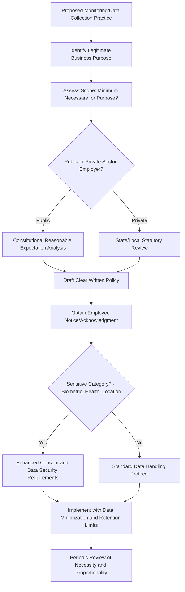

## Employee Rights and Workplace Privacy

### Definition and Scope

Employee rights and workplace privacy encompasses the legal, ethical, and organizational-practice considerations governing the boundary between an employer's legitimate business interests (security, productivity, risk management) and an employee's reasonable expectation of privacy and personal autonomy. This domain has expanded substantially in recent decades with the proliferation of workplace monitoring technology, remote work arrangements, and data collection tools, making it an increasingly active area of legal development and organizational policy design.

### Foundational Legal Concept: Reasonable Expectation of Privacy

The core legal concept governing most workplace privacy analysis (originating from Fourth Amendment jurisprudence, e.g., *O'Connor v. Ortega*, 1987, for public-sector employees, and extended through common-law tort principles for private-sector employment) is whether an employee has a **reasonable expectation of privacy** in a given space, communication, or piece of information.

**Key factors affecting reasonable expectation of privacy:**

- Whether the employer has communicated a clear policy stating the area/system is subject to monitoring (a stated policy substantially reduces reasonable expectation)
- Whether the space or system is shared/company-owned versus personal
- Industry and regulatory context (e.g., financial services and healthcare have heightened monitoring norms tied to compliance requirements)
- Public vs. private sector employer (public employers face constitutional constraints private employers generally do not)

[Unverified] The specific legal test and weight given to these factors varies meaningfully across jurisdictions and has evolved significantly with technology; this should be treated as a general conceptual framework rather than current, jurisdiction-specific legal guidance.

### Categories of Workplace Privacy

**1. Electronic Communications and Monitoring**

- **Email and messaging monitoring** — In the U.S., private-sector employers generally have broad latitude to monitor company email systems, particularly when a clear monitoring policy exists; the **Electronic Communications Privacy Act (ECPA), 1986**, includes a "business use" exception and a consent exception that substantially limit employee privacy claims regarding employer-owned systems
- **Internet usage monitoring** — Similarly broad employer latitude on company-owned networks and devices
- **Keystroke logging and screen monitoring** — Increasingly common with remote work; legally permissible in most U.S. jurisdictions with disclosure, though several states have begun requiring advance notice (see State Law Variation below)

**2. Physical Workplace Surveillance**

- **Video surveillance** — Generally permissible in common work areas; legally more restricted (or prohibited) in areas with a strong expectation of privacy (restrooms, locker rooms, breastfeeding/lactation rooms)
- **GPS and location tracking** — Applied to company vehicles and, increasingly, personal devices used for work (BYOD contexts); legal treatment varies by whether tracking is limited to work hours/company property versus continuous/off-duty tracking

**3. Off-Duty Conduct**

- **Social media activity** — A rapidly evolving area; some jurisdictions have enacted "lifestyle discrimination" or off-duty conduct protection statutes limiting employer action based on lawful off-duty activity, while other jurisdictions permit broader employer discretion, particularly where off-duty conduct is deemed to reflect on the employer or violate a legitimate business interest
- **Lawful off-duty activities statutes** — [Unverified] A number of U.S. states have enacted statutes protecting certain lawful off-duty conduct (e.g., legal recreational activities, political activity) from employment action, but coverage and scope vary considerably by state and should be verified against current state law

**4. Medical and Health Information**

- Governed primarily by the ADA (limiting when and what medical inquiries employers can make) and, in relevant contexts, HIPAA (which applies more narrowly to employer-sponsored group health plans than commonly assumed, not to general employment records)
- Medical information obtained through the accommodation process must generally be maintained in files separate from general personnel records with restricted access

**5. Background Checks and Pre-Employment Screening**

- Governed by the **Fair Credit Reporting Act (FCRA)** at the federal level (requiring disclosure, authorization, and adverse action procedures when using third-party consumer reports)
- **Ban-the-box** and salary history inquiry laws — an expanding patchwork of state and local laws restricting when employers may inquire about criminal history or prior salary during the hiring process

**6. Drug and Alcohol Testing**

- Legal treatment varies substantially by state, with particular complexity arising from the conflict between state-level cannabis legalization and continued federal illegality, creating jurisdiction-specific compliance challenges for employers operating across multiple states

### Data Collection and Monitoring Governance Framework

### Emerging Areas: Algorithmic Management and AI Monitoring

A rapidly developing area given the proliferation of AI-driven productivity monitoring, algorithmic scheduling, and automated performance assessment tools.

**Key emerging concerns:**

- **Algorithmic transparency** — growing regulatory interest (e.g., New York City's Local Law 144 governing automated employment decision tools, and various proposed and enacted state AI-employment regulations) in requiring disclosure and bias auditing of algorithmic tools used in employment decisions
- **Biometric privacy** — an increasingly regulated category; [Unverified] several U.S. states (Illinois's Biometric Information Privacy Act being the most litigated example) have enacted specific biometric data statutes with private rights of action, and this area has seen substantial and evolving litigation activity that should be checked against current law
- **Productivity/activity monitoring software** — tools tracking keystrokes, active application time, or webcam activity in remote work settings have prompted several state-level advance-notice requirements (e.g., some states now require written notice before implementing electronic monitoring of remote employees)

[Inference] This is a domain where regulatory activity is moving faster than academic I-O psychology research has been able to establish settled findings on organizational and psychological effects; existing research on monitoring more broadly (see below) is likely informative but algorithmic-management-specific effects remain a comparatively newer and less mature research area.

### Psychological Effects of Workplace Monitoring

I-O psychology research on electronic performance monitoring has identified consistent — if sometimes counterintuitive — effects:

- **Increased perceived stress and reduced autonomy** — monitoring, particularly when perceived as intrusive or used punitively rather than developmentally, is associated with elevated stress and lower perceived autonomy
- **Effects on trust and psychological contract** — monitoring introduced without clear communication of purpose is more likely to be interpreted as a signal of organizational distrust, with corresponding effects on the psychological contract
- **Mixed productivity findings** — [Inference] the relationship between monitoring and actual productivity is not straightforwardly positive; some studies find short-term compliance-driven productivity increases while others find monitoring can reduce intrinsic motivation and increase surface-level "gaming" of monitored metrics rather than genuine performance improvement — the directionality and magnitude of this effect likely depends heavily on how monitoring is implemented and communicated, rather than being a fixed universal effect
- **Justice-framing effects** — monitoring introduced with clear informational justice (explained rationale) and procedural justice (consistent, non-arbitrary application) shows more favorable employee reactions than identical monitoring introduced without such framing, consistent with organizational justice theory more broadly

### Example: Applying the Framework

**Example:** An organization implements webcam-based attention-tracking software for remote employees, activated during work hours without prior employee notification, with data used in performance evaluations.

**Analysis:** This practice raises multiple layers of risk. Legally, several jurisdictions increasingly require advance written notice for this category of electronic monitoring, and lack of notice could both violate specific statutes and strengthen any reasonable-expectation-of-privacy claim. From an organizational justice perspective, the absence of informational justice (no explained rationale) and procedural justice (no advance notice or input opportunity) predicts negative trust and psychological contract effects independent of the monitoring's legality. A better-designed approach — per the governance framework above — would establish a clear legitimate business purpose, minimize scope to what is necessary, provide advance written notice, and frame the practice's rationale transparently, which both improves legal defensibility and predicted employee reactions.

### State Law Variation and the Federal-State Patchwork

**Key Point:** Unlike core anti-discrimination law, which is anchored by substantial federal statutory frameworks, workplace privacy law in the U.S. is disproportionately governed by a rapidly evolving patchwork of state and local statutes (electronic monitoring notice requirements, biometric privacy laws, social media protection laws, salary history bans). [Unverified] This makes workplace privacy one of the higher-maintenance compliance areas for multi-state employers, requiring regular legal review rather than a single static policy framework — the specific current state of this patchwork should always be verified against current legal sources rather than assumed static.

### Organizational Policy Design Recommendations

- Draft clear, specific written policies covering each monitoring category in use (rather than a single vague "monitoring may occur" clause), and obtain documented employee acknowledgment
- Apply data minimization principles — collect only what is necessary for the stated legitimate business purpose
- Provide advance notice before implementing new monitoring practices, consistent with both emerging legal requirements and organizational justice research on informational fairness
- Establish data retention limits and access restrictions, particularly for sensitive categories (biometric, health, location data)
- Separate medical/health information into restricted-access files distinct from general personnel records
- Review multi-state compliance regularly given the fast-moving state-law patchwork

### Common Organizational Pitfalls

- Assuming broad employer monitoring latitude under federal law is sufficient without checking state and local notice/consent requirements
- Implementing new monitoring technology without a documented legitimate business purpose or data minimization analysis
- Failing to communicate monitoring practices transparently, undermining trust and psychological contract even where the practice is legally permissible
- Treating algorithmic/AI-driven monitoring and decision tools as exempt from the same transparency and fairness scrutiny applied to traditional monitoring
- Co-mingling medical/health information obtained through accommodation processes with general personnel files
- Applying a single national monitoring policy without accounting for state-specific notice requirements in a multi-state workforce

### Related Topics

- Employment Law Fundamentals
- Organizational Justice and Its Dimensions (informational and procedural justice applied to monitoring)
- Disability and Accessibility Inclusion (medical information handling)
- Psychological Contract Theory and Breach
- Algorithmic Bias and AI in Employment Decisions
- Remote and Hybrid Work Policy Design
- Data Security and Privacy Governance in HR Systems