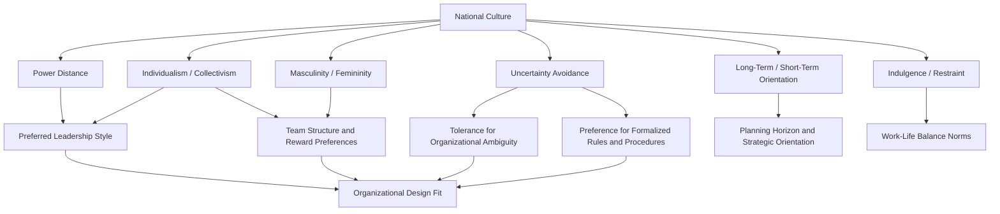

## Hofstede's Cultural Dimensions

### Definition and Scope

Hofstede's Cultural Dimensions Theory is a framework for quantifying and comparing national culture along a set of value-orientation dimensions, developed by Geert Hofstede through statistical analysis of survey data collected from IBM employees across more than 50 countries between 1967 and 1973. It remains one of the most widely cited — and widely critiqued — frameworks in cross-cultural organizational psychology, management, and international business research, providing a foundational vocabulary for discussing how national culture shapes workplace values, leadership expectations, and organizational behavior.

### Origins and Methodology

Hofstede's original dataset derived from over 116,000 survey responses collected from IBM employees in over 50 countries, analyzed using factor analysis to identify underlying dimensions of value variation. Because the sample was drawn from a single multinational corporation, Hofstede argued this effectively controlled for organizational culture and occupational effects, isolating national culture as the primary source of variance — a methodological choice that is also one of the framework's most persistent points of critique (see Critiques section).

**Key Point:** The theory has been progressively extended since its original 1980 publication (*Culture's Consequences*), growing from four original dimensions to six in later work, incorporating additional research (notably the Chinese Culture Connection study, which contributed the long-term orientation dimension) and later collaboration with Michael Minkov, who contributed refined dimension calculations using World Values Survey data.

### The Six Dimensions

**1. Power Distance Index (PDI)**

The degree to which less powerful members of institutions and organizations within a country expect and accept that power is distributed unequally.

- **High PDI** (e.g., Malaysia, Philippines, many Latin American and Arab countries): hierarchical structures accepted as natural; subordinates expect to be told what to do; centralized decision-making
- **Low PDI** (e.g., Austria, Denmark, Israel): flatter organizational structures preferred; consultative and participative management expected; power inequalities minimized

**2. Individualism vs. Collectivism (IDV)**

The degree to which individuals are integrated into groups.

- **Individualist** (e.g., United States, Australia, United Kingdom): loose social ties; self-reliance and individual achievement valued; "I" consciousness
- **Collectivist** (e.g., Guatemala, Ecuador, many East Asian countries): strong, cohesive in-groups (extended family, organization) that offer protection in exchange for loyalty; "We" consciousness

**3. Masculinity vs. Femininity (MAS)**

The degree to which a society values competitive achievement (masculine) versus cooperation, modesty, and quality of life (feminine). [Unverified — terminology note] This dimension's original labeling has drawn sustained criticism for conflating gendered value orientations with the constructs it measures (assertiveness/achievement vs. nurturing/consensus), and some contemporary treatments relabel it (e.g., "achievement vs. relationship orientation") while retaining the underlying scale.

- **High MAS** (e.g., Japan, Hungary, Slovakia): assertiveness, competition, and material success valued; distinct gender role differentiation
- **Low MAS** (e.g., Sweden, Norway, Netherlands): cooperation, modesty, caring for the weak, and quality of life valued; overlapping gender roles

**4. Uncertainty Avoidance Index (UAI)**

The degree to which members of a culture feel threatened by ambiguous or unknown situations and have created beliefs and institutions to avoid them.

- **High UAI** (e.g., Greece, Portugal, Japan): strong preference for rules, structure, and formal procedures; lower tolerance for deviant ideas and behavior; higher anxiety around ambiguity
- **Low UAI** (e.g., Singapore, Denmark, Sweden): greater tolerance for ambiguity and deviation from norms; fewer rules; more comfort with unstructured situations

**5. Long-Term vs. Short-Term Orientation (LTO)**

Added later (originally termed "Confucian Dynamism," derived from the Chinese Culture Connection study, 1987), this dimension reflects the degree to which a society maintains links with its own past while dealing with present and future challenges.

- **Long-term oriented** (e.g., South Korea, Taiwan, Japan): pragmatism, thrift, perseverance, adaptation of tradition to modern context
- **Short-term oriented** (e.g., many Western and African nations, though with substantial variation): respect for tradition, focus on quick results, normative rather than pragmatic thinking

**6. Indulgence vs. Restraint (IVR)**

Added most recently (via collaboration with Michael Minkov, using World Values Survey data), this dimension reflects the degree to which a society allows relatively free gratification of basic human desires related to enjoying life and having fun.

- **Indulgent** (e.g., Mexico, Sweden, Nigeria): relatively free gratification of desires; greater emphasis on leisure, positive emotion expression
- **Restrained** (e.g., Russia, Egypt, many East Asian and Eastern European nations): suppression of gratification, regulated by strict social norms

### Dimension Interaction Framework

### Application to Organizational Practice

**Leadership and management style:**

[Inference] High power-distance cultures are generally associated with better reception of directive, top-down leadership styles, while low power-distance cultures respond more favorably to participative and consultative approaches — this is a well-established application within the cross-cultural leadership literature (e.g., informing frameworks like GLOBE, discussed below), though individual leader effectiveness always depends on additional situational and personal factors beyond national cultural score alone.

**Team and reward system design:**

- Individualist cultures tend to respond better to individual performance-based reward systems and personal recognition
- Collectivist cultures tend to respond better to group-based rewards and practices that preserve group harmony (e.g., avoiding public individual criticism)

**Change management and organizational structure:**

- High uncertainty-avoidance cultures may require more detailed change communication, formalized procedures, and phased implementation
- Low uncertainty-avoidance cultures may tolerate — or even prefer — more ambiguous, iterative change processes

**Example:** A U.S.-headquartered multinational (individualist, moderate power distance, low-to-moderate uncertainty avoidance per Hofstede's country scores) implements a global performance management system built around individual stack-ranking and public leaderboards. When rolled out without modification to its subsidiary in a collectivist, higher power-distance national context, the system generates unexpected resistance and reduced morale. **Analysis:** The design assumes individualist reward preferences and comfort with public individual comparison that may not transfer directly; a culturally adapted approach might substitute group-based recognition and private, manager-mediated feedback rather than public individual ranking — illustrating the framework's practical utility in anticipating (not guaranteeing) friction points before rollout.

### Critiques and Limitations

This is essential content for responsible application of the framework, given how widely (and sometimes uncritically) it is used in practice.

**Methodological critiques:**

- **Single-company sampling** — the original data came exclusively from IBM employees, raising questions about generalizability to entire national populations rather than a specific, relatively homogeneous occupational and organizational subgroup
- **Ecological fallacy risk** — country-level dimension scores describe central tendencies across a national population; applying them to predict any individual's values or behavior risks the ecological fallacy (assuming a group-level statistical pattern applies uniformly to individuals within that group)
- **Temporal validity** — data collected in the late 1960s/early 1970s; [Inference] critics have questioned whether national culture, as measured by these specific dimensions, remains stable enough over subsequent decades of globalization, migration, and generational change for the original scores to retain full validity, though Hofstede and collaborators have argued cultural values change more slowly than surface-level behavior and that the dimensions retain substantial explanatory value — this remains a genuinely contested point in the literature rather than a settled question
- **National boundaries as cultural boundaries** — treating nation-states as culturally homogeneous units is itself contested, given substantial within-country regional, ethnic, and subcultural variation

**Theoretical/conceptual critiques:**

- **McSweeney's critique (2002)** — a widely cited methodological critique arguing the factor-analytic derivation of the dimensions, and their attribution to "national culture" rather than other confounding factors, was less methodologically sound than commonly assumed
- **Masculinity/femininity labeling** — as noted above, the gendered terminology of this dimension has drawn sustained criticism independent of the underlying construct's validity

**Practical/application critiques:**

- Risk of **stereotyping** — using country scores to make deterministic assumptions about individual employees rather than as a probabilistic, population-level starting point for cultural awareness
- Risk of **oversimplification** — reducing complex, multidimensional cultures to a small set of numeric scores can obscure important within-country and intersectional cultural variation

### Relationship to Alternative Frameworks

**GLOBE Study (House et al.)** — a later, large-scale cross-cultural leadership research program that both drew on and extended Hofstede's dimensional approach, adding dimensions (e.g., performance orientation, humane orientation) and directly measuring culturally endorsed leadership prototypes, addressing some of Hofstede's single-company sampling critique through a broader multi-industry research design.

**Trompenaars and Hampden-Turner's Seven Dimensions** — an alternative cultural framework developed independently, with some conceptual overlap (e.g., individualism/communitarianism parallels Hofstede's IDV) but distinct additional dimensions (e.g., universalism vs. particularism, specific vs. diffuse relationships).

[Inference] Despite methodological critiques, Hofstede's framework remains more widely used in both academic citation counts and applied cross-cultural training contexts than these alternatives, likely due to its historical primacy, extensive country coverage, and accessible dimensional structure, though GLOBE is often considered methodologically stronger for leadership-specific applications given its more diverse and contemporary sampling.

### Measurement and Practical Tools

- **Hofstede Insights (formerly Hofstede Centre)** — maintains updated country comparison tools and scores, now incorporating Minkov's World Values Survey-based recalculations for many countries
- **Values Survey Module (VSM)** — the survey instrument developed by Hofstede and colleagues for researchers wishing to measure the dimensions in new samples
- Cross-cultural training programs frequently use country-comparison visualizations derived from these scores as a starting point for expatriate preparation and multinational team-building, generally recommended as a **conversation-starting heuristic** rather than a deterministic prediction tool

### Common Application Pitfalls

- Using national dimension scores to make deterministic predictions about specific individuals (ecological fallacy)
- Treating scores as static and unchanging despite known critiques regarding temporal validity
- Applying the framework without acknowledging significant within-country variation (regional, generational, organizational subculture)
- Uncritically importing the original masculinity/femininity terminology without acknowledging its contested framing
- Using the framework as the sole basis for cross-cultural organizational design decisions rather than one input alongside direct local research and employee input

### Related Topics

- GLOBE Study and Culturally Endorsed Leadership Theory
- Trompenaars and Hampden-Turner's Cultural Dimensions
- Cross-Cultural Leadership and Global Talent Management
- Expatriate Adjustment and Cross-Cultural Training
- Organizational Culture Theory (distinct from national culture)
- Ecological Fallacy and Levels-of-Analysis Issues in Cross-Cultural Research

**Next Steps**

- Compare Hofstede's dimensions against GLOBE's culturally endorsed leadership prototypes for a leadership-specific cross-cultural application
- Explore expatriate adjustment theory as a direct organizational application of cultural distance concepts derived from these dimensions