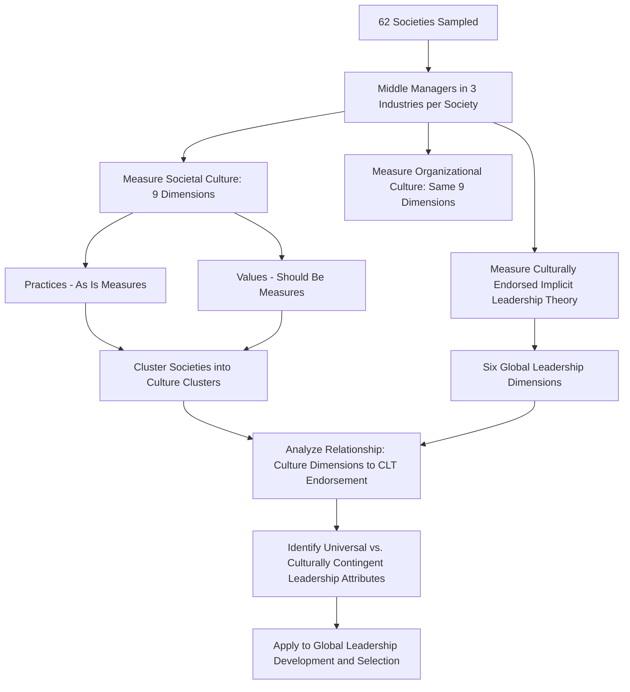

## The GLOBE Study of Leadership and Culture

### Definition and Scope

The GLOBE (Global Leadership and Organizational Behavior Effectiveness) study is a large-scale, multi-phase, multi-national research program investigating the relationship between national/societal culture, organizational culture, and effective leadership. Led by Robert J. House and a large international team of collaborating researchers beginning in the early 1990s, GLOBE was explicitly designed to build upon and address methodological limitations of Hofstede's earlier work — particularly its single-company (IBM) sampling — through a broader, multi-industry, multi-organization research design spanning approximately 62 societies.

### Origins and Methodological Design

GLOBE surveyed middle managers across three industries (food processing, financial services, and telecommunications) in each participating country, rather than employees of a single multinational corporation. Data collection occurred primarily during the 1990s, with results published in major volumes beginning with *Culture, Leadership, and Organizations: The GLOBE Study of 62 Societies* (House, Hanges, Javidan, Dorfman, & Gupta, 2004).

**Key methodological distinctions from Hofstede's approach:**

- Multi-organizational, multi-industry sampling (versus single-company)
- Distinguished between **"as is" (practices)** and **"should be" (values)** measures for each cultural dimension — asking respondents both how their society currently operates and how they believe it ideally should operate, a distinction Hofstede's original framework did not systematically capture
- Directly measured **culturally endorsed implicit leadership theories (CLTs)** — what behaviors and traits are believed to characterize effective leaders within a given culture — rather than inferring leadership implications from general cultural value dimensions alone

**Key Point:** The practices/values distinction is one of GLOBE's most methodologically significant contributions, since it allows researchers to identify societies where actual practice and aspirational values diverge substantially (e.g., a society that practices high power distance but expresses a value preference for lower power distance) — a nuance the original Hofstede framework's single-score-per-dimension approach could not capture.

### GLOBE's Nine Cultural Dimensions

GLOBE both retained conceptual overlap with several Hofstede dimensions and split/added others, yielding nine dimensions total:

| Dimension | Definition | Relationship to Hofstede |
| --- | --- | --- |
| Power Distance | Degree to which power is (and should be) distributed unequally | Direct conceptual parallel to PDI |
| Uncertainty Avoidance | Reliance on social norms and procedures to alleviate unpredictability | Direct conceptual parallel to UAI |
| Institutional Collectivism | Degree to which societal institutions encourage collective resource distribution and collective action | Split from Hofstede's single IDV dimension |
| In-Group Collectivism | Degree to which individuals express pride, loyalty, and cohesiveness in their families/organizations | Split from Hofstede's single IDV dimension |
| Gender Egalitarianism | Degree to which a society minimizes gender role differences | Reframes/replaces Hofstede's masculinity-femininity |
| Assertiveness | Degree to which individuals are assertive, confrontational, and aggressive in relationships | Partially derived from Hofstede's masculinity-femininity |
| Future Orientation | Degree to which a society engages in future-oriented behaviors (planning, investing, delaying gratification) | Conceptually related to Hofstede's long-term orientation |
| Performance Orientation | Degree to which a society encourages and rewards performance improvement and excellence | New dimension, not directly derived from Hofstede |
| Humane Orientation | Degree to which a society encourages and rewards fairness, altruism, generosity, and kindness | New dimension, not directly derived from Hofstede |

**Key Point:** GLOBE's split of Hofstede's single individualism-collectivism dimension into **institutional collectivism** and **in-group collectivism** addressed a recognized limitation — a society can score differently on collective orientation toward broad institutions versus toward one's immediate family or organization, a distinction with meaningful practical implications for organizational design that a single combined score obscures.

### Culturally Endorsed Implicit Leadership Theory (CLT)

GLOBE's most distinctive contribution is its direct empirical measurement of implicit leadership theories — the shared beliefs within a culture about what traits and behaviors distinguish outstanding leaders from ineffective ones — building on implicit leadership theory more broadly (Lord & Maher and related work) but extending it explicitly to the cross-cultural level.

**GLOBE's Six Global Leadership Dimensions:**

1. **Charismatic/Value-Based** — ability to inspire, motivate, and expect high performance based on strongly held core values
2. **Team-Oriented** — emphasis on effective team building and implementing a common purpose among team members
3. **Participative** — degree to which leaders involve others in making and implementing decisions
4. **Humane-Oriented** — supportive, considerate, compassionate leadership
5. **Autonomous** — independent and individualistic leadership attributes
6. **Self-Protective** — leadership focused on ensuring the safety and security of the leader and the group through status-consciousness, face-saving, and procedural behavior

### Universal vs. Culturally Contingent Leadership Attributes

One of GLOBE's most widely cited findings is the distinction between leadership attributes that are **universally endorsed** across nearly all studied cultures versus those whose endorsement is **culturally contingent**.

**Findings pattern (illustrative, not exhaustive):**

- Attributes such as trustworthiness, honesty, and fairness showed near-universal positive endorsement across the 62 societies studied
- Attributes associated with the "Self-Protective" dimension (status-consciousness, self-centeredness) showed the most cross-cultural variation, and in some societies were viewed neutrally or even somewhat positively, while in others they were viewed negatively as leadership impediments
- The Charismatic/Value-Based dimension showed strong (though not perfectly uniform) positive endorsement across most studied cultures, suggesting inspirational, values-driven leadership has broader cross-cultural appeal than sometimes assumed, though the specific behaviors interpreted as "charismatic" varied by cultural context

[Inference] This universal/contingent distinction is among GLOBE's most consistently cited and replicated findings, though the precise boundary between which specific attributes are "universal" versus "culturally contingent" has been refined somewhat across subsequent GLOBE publications and reanalyses (e.g., the later GLOBE 2020 volume), so the exact classification of any single attribute should be checked against current GLOBE publications rather than treated as fixed since the original 2004 volume.

### GLOBE Research Process Overview

### Societal Culture Clusters

GLOBE grouped the 62 studied societies into culture clusters based on similarity across the nine cultural dimensions, commonly cited clusters including (illustrative, non-exhaustive): Anglo, Latin Europe, Nordic Europe, Germanic Europe, Eastern Europe, Latin America, Sub-Saharan Africa, Arab, Southern Asia, Confucian Asia. [Unverified] Exact cluster composition and boundary assignments have been described somewhat differently across various GLOBE publications and secondary sources, so specific country-cluster assignments should be verified against the primary GLOBE volumes for precise application.

**Practical application:** These clusters are frequently used in applied cross-cultural training and global leadership development as a more empirically grounded starting point for regional generalization than ad hoc geographic or linguistic groupings, though — consistent with the ecological fallacy caveat discussed under Hofstede's framework — cluster membership should inform, not replace, direct assessment of any specific organizational or national context.

### Application to Organizational Practice

**Global leadership selection and development:**

[Inference] GLOBE's universal leadership attribute findings support prioritizing traits like integrity and trustworthiness in global leadership competency models as having broad cross-cultural applicability, while attributes tied to the Self-Protective and Autonomous dimensions likely warrant more context-specific calibration when selecting or developing leaders for assignments in a specific cultural context — this is a reasonable practical application consistent with GLOBE's core findings, though specific competency-model design should be validated against direct research in the target context rather than GLOBE findings alone.

**Expatriate leadership preparation:**

CLT profiles for a target country can help anticipate which leadership behaviors are likely to be well-received versus which may require adaptation — for example, a highly participative leadership style that is strongly endorsed in a low power-distance, low in-group-collectivism culture may be perceived as weak or indecisive in a culture with high power-distance and high in-group-collectivism CLT profiles.

**Example:** A global technology firm prepares a manager for a leadership assignment in a country with GLOBE profile data indicating high in-group collectivism, high power distance, and strong endorsement of team-oriented and humane-oriented leadership dimensions, alongside comparatively lower endorsement of highly autonomous/individualistic leadership styles. **Analysis:** A leadership approach emphasizing individual accountability and autonomous decision-making — effective in the manager's home country context — may be perceived as impersonal or insufficiently attentive to team cohesion in the new context. GLOBE's CLT data would suggest emphasizing visible team-building behaviors and demonstrating humane, relationship-oriented concern alongside any directive elements more consistent with the host culture's higher power-distance expectations — illustrating how CLT profiles can inform (though not fully determine) leadership adaptation strategy.

### Relationship to Hofstede's Framework

GLOBE is best understood as both a **validation and an extension** of Hofstede's foundational work rather than a wholesale replacement:

- Several GLOBE dimensions showed meaningful correlation with corresponding Hofstede dimensions, providing a degree of cross-validation using an independent, more methodologically robust sample
- GLOBE's practices/values distinction and CLT measurement represent genuine theoretical advances not present in the original Hofstede framework
- [Inference] GLOBE is generally regarded within the cross-cultural I-O psychology literature as methodologically stronger for leadership-specific applications given its purpose-built design and more diverse sampling, while Hofstede's framework retains broader recognition and simpler applied accessibility in general cross-cultural training contexts — this relative positioning reflects a reasonably common view in the literature rather than a universally agreed ranking between the two frameworks.

### Critiques and Limitations

- **Complexity** — nine dimensions plus six leadership dimensions plus the practices/values distinction create a considerably more complex framework than Hofstede's, which can limit accessibility for applied practitioner use relative to Hofstede's simpler model
- **Middle-manager sampling** — while broader than Hofstede's single-company sample, GLOBE still sampled a specific occupational stratum (middle managers) rather than general populations, retaining some generalizability limitations of a similar type to Hofstede's critique, albeit less severe given the multi-organization, multi-industry design
- **Implicit theory vs. actual effectiveness** — CLT measures capture what leadership behaviors are *culturally endorsed as effective*, which is conceptually distinct from what leadership behaviors are *empirically most effective* at producing organizational outcomes in a given culture; GLOBE's subsequent phases have investigated actual CEO effectiveness relationships, but this distinction is important when interpreting core CLT findings
- **Cross-national equivalence of survey measurement** — as with any large-scale cross-national survey research, measurement invariance (whether survey items mean the same thing and are interpreted comparably across languages and cultures) remains a methodological consideration for any specific dimension's cross-country comparability

### Measurement and Ongoing Research

GLOBE has continued through multiple phases beyond the original 2004 volume, including subsequent work directly linking CLT profiles to actual senior executive (CEO) leadership behavior and firm-level outcomes, and a more recent major volume (*GLOBE 2020: Culture, Leadership and Organizations*) incorporating updated analyses and additional societies.

### Common Application Pitfalls

- Treating GLOBE's nine dimensions as a simple drop-in replacement for Hofstede's six without recognizing the distinct practices/values measurement structure
- Applying CLT "universal" attribute findings as guaranteeing leadership success in any specific cultural context, rather than as a starting probabilistic guide
- Overlooking the practices/values distinction, which can reveal important gaps between how a culture currently operates and what it aspires toward — a nuance lost if only a single score is used
- Using culture cluster assignments as a substitute for direct research into a specific target country or organization
- Conflating "culturally endorsed as effective" (CLT) with "empirically proven to produce better organizational outcomes" — these are related but distinct claims

### Related Topics

- Hofstede's Cultural Dimensions
- Implicit Leadership Theory
- Charismatic and Transformational Leadership Theory
- Expatriate Adjustment and Cross-Cultural Training
- Cross-Cultural Leadership Development and Global Talent Management
- Measurement Invariance in Cross-Cultural Research