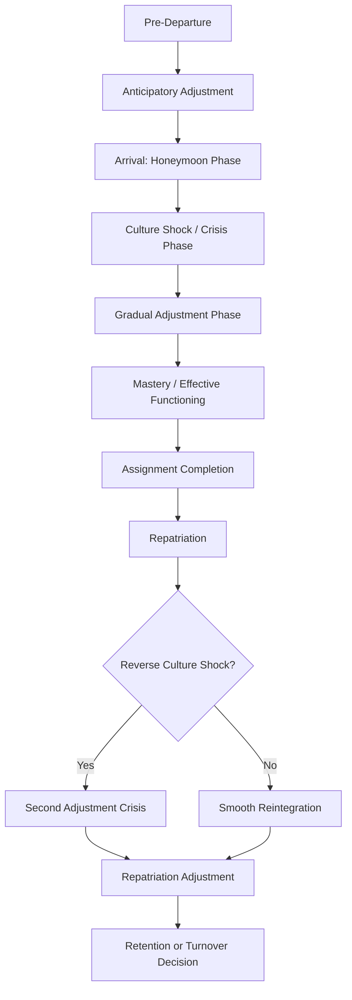

## Expatriate Adjustment and Management

### Definition and Scope

Expatriate adjustment and management encompasses the psychological processes by which individuals relocated to a foreign country for work adapt to their new cultural, work, and interaction environments, along with the organizational practices (selection, preparation, support, and repatriation) designed to maximize the success of international assignments. This is a well-established subfield within cross-cultural and global organizational psychology, distinguished by its focus on the individual-level adjustment process rather than the national-culture-level comparison frameworks (Hofstede, GLOBE) that inform it.

### Defining Expatriate Adjustment

Expatriate adjustment is most commonly conceptualized (following Black, Mendenhall, and Oddou's influential 1991 framework) as a multidimensional psychological construct comprising three distinct facets:

**1. Work Adjustment** — comfort with new job tasks, performance standards, and work-related role expectations in the host country context

**2. Interaction Adjustment** — comfort interacting with host-country nationals, both in general social situations and within the workplace

**3. General/Cultural Adjustment** — comfort with the broader non-work living environment (food, climate, healthcare, general living conditions, cost of living)

**Key Point:** These three facets are empirically distinguishable and do not necessarily develop at the same rate — an expatriate may achieve strong work adjustment relatively quickly (given structured organizational role expectations) while general and interaction adjustment lag considerably, or vice versa, depending on individual and contextual factors.

### The U-Curve and W-Curve Adjustment Models

**U-Curve Hypothesis (Lysgaard, 1955; popularized by Oberg's culture shock concept)**

Proposes that expatriate psychological adjustment follows a characteristic pattern over time:

1. **Honeymoon phase** — initial excitement and fascination with the new culture
2. **Culture shock/crisis phase** — declining mood as novelty wears off and cultural friction accumulates (miscommunication, homesickness, frustration with unfamiliar systems)
3. **Adjustment phase** — gradual recovery as coping mechanisms and cultural understanding develop
4. **Mastery phase** — stable, effective functioning in the host culture

**W-Curve Extension**

Extends the U-curve to include the **repatriation** experience — proposing that returning "home" after an assignment can trigger a second, often underestimated, adjustment crisis (**reverse culture shock**), since returning expatriates and their home organization/culture have both changed during the assignment period, and returnees frequently underestimate the degree of readjustment required.

[Inference] The U-curve and W-curve models remain widely referenced in applied training and orientation contexts, but empirical support for the specific stage-based, universally-timed pattern has been notably mixed in subsequent research — several studies have found individual adjustment trajectories vary too substantially in shape and timing to support a single universal curve, leading many contemporary researchers to treat the U/W-curve as a useful heuristic and training aid rather than an empirically validated universal process.

### Adjustment Trajectory Overview

### Predictors of Successful Expatriate Adjustment

**Individual-level predictors:**

- **Cultural intelligence (CQ)** — an individual's capability to function effectively across culturally diverse settings, typically operationalized (Ang & Van Dyne's widely used framework) across four facets: metacognitive, cognitive, motivational, and behavioral CQ
- **Personality factors** — traits associated with the Big Five, particularly Openness to Experience and Emotional Stability, have shown consistent positive relationships with adjustment across multiple studies
- **Prior international experience** — generally associated with faster and more effective adjustment, though effects can be attenuated when prior experience was in a culturally similar context to the current assignment
- **Language proficiency** — host-country language ability facilitates interaction adjustment specifically, with less consistent direct effects on work adjustment

**Contextual/organizational predictors:**

- **Cross-cultural training** — pre-departure preparation covering cultural norms, practical logistics, and (in more sophisticated programs) experiential or simulation-based cultural skill-building
- **Organizational support** — logistical support (housing, schooling for dependents, relocation services) and ongoing mentoring/check-in structures during the assignment
- **Spouse/family adjustment** — [Inference] consistently identified across the expatriate literature as one of the strongest predictors of overall assignment success and premature return, since family adjustment difficulties (particularly a "trailing spouse" struggling with the transition) are frequently cited as a leading cause of early assignment termination — this is one of the more robustly replicated findings in the expatriate management literature
- **Role clarity and role novelty** — clearer host-role expectations, and roles that are not excessively novel relative to the expatriate's home-country role, are associated with faster work adjustment
- **Perceived organizational support and psychological contract fulfillment** — expatriates who perceive their organization is providing adequate support show stronger adjustment and lower premature-return intentions

### Cultural Intelligence (CQ) Framework

| CQ Facet | Definition |
| --- | --- |
| Metacognitive CQ | Awareness and control over one's own cultural assumptions and thinking during cross-cultural interactions |
| Cognitive CQ | Knowledge of norms, practices, and conventions in different cultures |
| Motivational CQ | Interest, drive, and confidence to function effectively in culturally diverse situations |
| Behavioral CQ | Capability to exhibit appropriate verbal and nonverbal actions when interacting with people from different cultures |

**Key Point:** Cultural intelligence is distinguished from general cognitive intelligence and emotional intelligence by its specific domain focus on cross-cultural functioning, and has become one of the more empirically supported individual-difference predictors of expatriate adjustment in recent decades, complementing (rather than replacing) broader personality-based predictors.

### Expatriate Selection Practices

**Common selection criteria (with varying empirical support):**

- Technical/managerial competence (necessary but, per extensive research, insufficient alone — technical competence does not reliably predict cross-cultural adjustment)
- Cross-cultural adaptability indicators (often assessed via structured interviews, CQ assessments, or prior international experience review)
- Family situation and spouse/family willingness and readiness (given the strong predictive relationship noted above)
- Language aptitude and willingness to learn host-country language

[Inference] A well-documented historical pattern in the expatriate management literature is that organizations have often over-weighted technical/managerial competence and under-weighted cross-cultural adaptability and family factors in selection decisions, contributing to premature return rates — though the degree to which this pattern has improved with growing organizational awareness of CQ-based selection likely varies considerably by organization and has not been comprehensively re-benchmarked across all industries in recent years.

### Cross-Cultural Training Design

**Training rigor typology (commonly following Black and Mendenhall's framework):**

- **Low-rigor training** — informational/lecture-based approaches (cultural briefings, area studies)
- **Moderate-rigor training** — includes some experiential elements (role-play, case studies, cultural assimilator exercises)
- **High-rigor training** — extensive experiential and immersive methods (simulations, field experiences, sensitivity training), generally recommended for assignments involving greater novelty and cultural distance from the expatriate's home culture

**Key Point:** Research generally supports matching training rigor to assignment demands — higher cultural novelty and greater required interaction with host-country nationals warrant higher-rigor training investment, while training rigor matching is a more consistently supported principle than any single specific training method being universally superior.

### Repatriation Management

Repatriation is frequently under-managed relative to the outbound assignment, despite research consistently identifying it as a high-risk period for both individual distress and organizational talent loss.

**Common repatriation challenges:**

- Reverse culture shock (see W-curve above)
- **Career and role mismatch** — returning expatriates frequently report role ambiguity or perceived undervaluing of international experience upon return, sometimes termed the "out of sight, out of mind" problem
- **Reduced autonomy** — expatriates often held greater autonomy and decision-making authority abroad, and adjustment to reduced autonomy in home-office structures can be a distinct adjustment challenge
- **Elevated turnover risk** — [Unverified] Some studies have found notably elevated voluntary turnover rates among repatriated employees within the first one to two years following return, attributed to poor repatriation planning and perceived organizational undervaluation of the international experience gained; specific turnover statistics vary by study and era and should be checked against current sources rather than assumed fixed.

**Repatriation best practices:**

- Pre-departure career planning that explicitly addresses the post-assignment role
- Mentoring relationships maintained with the home office throughout the assignment
- Structured debriefing and knowledge-transfer processes upon return
- Deliberate use of repatriated expertise (e.g., in subsequent global assignments, cross-cultural training roles, or international business development) to signal organizational value placed on the experience gained

### Example: Applying the Framework

**Example:** An engineering firm selects a high-performing domestic manager for a three-year assignment leading a manufacturing facility in a culturally distant country, based primarily on strong technical performance reviews. The manager's spouse, who has left a career behind, struggles significantly with the transition, and the manager receives minimal structured cross-cultural training beyond a two-day logistics briefing.

**Analysis:** This selection and preparation pattern reflects several well-documented risk factors: technical competence was prioritized without corresponding weight given to cross-cultural adaptability or family readiness, spousal adjustment difficulty (one of the strongest predictors of assignment failure) was not proactively assessed or supported, and training rigor (low-rigor logistics briefing) was likely mismatched to the cultural distance and interaction demands of the assignment. A revised approach — informed by the predictors above — would include CQ-based assessment, family-inclusive predeparture planning and support, and training rigor scaled to the cultural distance involved, alongside an explicit repatriation and career-integration plan established before departure rather than addressed reactively at assignment end.

### Measurement

- **Black, Mendenhall, and Oddou's three-facet adjustment scale** — a widely used instrument measuring work, interaction, and general adjustment separately
- **Cultural Intelligence Scale (CQS)** — Ang and Van Dyne's validated instrument measuring the four CQ facets
- **Expatriate assignment success metrics** — typically combining premature return rate, assignment performance ratings, and post-assignment retention as a composite success indicator, given that any single metric alone can be misleading (e.g., low premature-return rates can mask poor performance if expatriates remain but underperform)

### Common Organizational Pitfalls

- Selecting expatriates primarily on domestic technical/managerial performance without adequately weighting cross-cultural adaptability or family readiness
- Under-investing in cross-cultural training rigor relative to actual assignment cultural distance and interaction demands
- Treating pre-departure preparation as the primary or sole intervention point, neglecting ongoing in-assignment support and repatriation planning
- Failing to proactively plan post-assignment roles, contributing to elevated repatriation-phase turnover
- Overlooking spouse/family adjustment as a formal selection and support consideration despite its strong predictive relationship with assignment success

### Related Topics

- Hofstede's Cultural Dimensions
- The GLOBE Study of Leadership and Culture
- Cultural Intelligence (CQ) Theory and Measurement
- Global Talent Management and International Assignment Strategy
- Psychological Contract Theory Applied to International Assignments
- Cross-Cultural Training Design and Evaluation