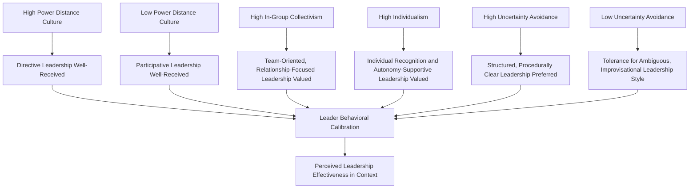

## Cross-Cultural Leadership

### Definition and Scope

Cross-cultural leadership is the study of how leadership processes, effectiveness, and the enactment of leadership behavior vary across, and are shaped by, national and societal culture. It integrates general leadership theory (trait, behavioral, contingency, transformational, and implicit leadership approaches) with cross-cultural psychology frameworks (Hofstede, GLOBE) to address a central applied question: does effective leadership look the same everywhere, or must leadership style and behavior be adapted to cultural context — and if adaptation is needed, along which dimensions and to what degree?

### The Universal vs. Culturally Contingent Leadership Debate

This is the foundational theoretical tension organizing the entire field.

**The universalist position**

Argues that certain leadership behaviors and attributes are effective, and are perceived as effective, across most or all cultures — often termed **near-universal leadership attributes**. This position draws heavily on GLOBE's empirical findings (see the GLOBE Study topic), which identified attributes such as trustworthiness, honesty, foresight, and encouragement as showing broadly positive endorsement across the 62 societies studied.

**The culturally contingent position**

Argues that leadership effectiveness is substantially culture-bound — behaviors that enhance a leader's perceived effectiveness in one cultural context may be neutral or actively counterproductive in another. This position draws on implicit leadership theory (the idea that followers hold culturally shaped prototypes of what a leader "should" look like and behave like) and on contingency-style leadership theories more broadly.

**Key Point:** Contemporary scholarship generally treats these as complementary rather than competing positions — a substantial body of research, most notably GLOBE, supports the existence of both a core of near-universal effective leadership attributes AND a substantial layer of culturally contingent attributes and behavioral expressions layered on top of that core. The practical question for global leaders becomes less "should I be universal or culturally adapted" and more "which specific behaviors require cultural calibration, and which do not."

### Theoretical Foundations

**Implicit Leadership Theory (ILT) — Lord and Maher**

Proposes that individuals hold cognitive schemas or prototypes of what leaders look like and how they behave, developed through socialization and experience, which they use to recognize and evaluate leadership. Cross-cultural leadership theory extends ILT to the societal level, proposing that these prototypes are substantially shaped by shared cultural values (formalized empirically by GLOBE as **culturally endorsed implicit leadership theory**, or CLT).

**Contingency and Situational Leadership Theories Applied Cross-Culturally**

Classic contingency frameworks (e.g., Fiedler's contingency model, path-goal theory) were largely developed and validated within Western, predominantly North American samples; cross-cultural leadership research has examined whether their core propositions (e.g., the relative effectiveness of directive versus participative leadership under varying conditions) hold consistently across cultural contexts, with the general finding that the *underlying situational logic* often transfers, while the specific behavioral expressions and follower reactions are culturally moderated.

**Transformational and Charismatic Leadership Cross-Culturally**

Transformational leadership theory (Bass) has received substantial cross-cultural investigation, with GLOBE's Charismatic/Value-Based leadership dimension showing comparatively strong (though not perfectly uniform) endorsement across most studied cultures — supporting the idea that inspirational, values-driven leadership has broad cross-cultural resonance, even as the specific behaviors interpreted as "charismatic" (e.g., degree of emotional expressiveness, public visibility) vary by cultural context.

### Culture Dimensions and Leadership Style Fit

[Inference] This mapping represents a reasonable synthesis of consistently replicated findings linking cultural dimensions to leadership style reception across the cross-cultural leadership literature (drawing especially on GLOBE), but actual leader effectiveness in any specific context depends on numerous additional factors (industry, organizational culture, follower individual differences, leader skill in execution) beyond national cultural dimension scores alone.

### Key Leadership Behaviors Requiring Cultural Calibration

**Decision-making style:**

- Directive vs. participative/consultative decision-making reception varies substantially with power distance
- [Inference] In high power-distance contexts, excessive consultation can sometimes be perceived as a sign of weak or indecisive leadership rather than inclusive strength, while the opposite pattern (directive decision-making perceived as autocratic or disrespectful) tends to hold in low power-distance contexts — this represents a well-supported general pattern in the literature, though individual and organizational variation within any culture remains substantial

**Feedback delivery:**

- Direct, explicit feedback norms common in low-context, individualist cultures (e.g., much of Northern Europe, North America) can be perceived as harsh or face-threatening in high-context, collectivist cultures, where indirect feedback delivery and face-preservation are often more strongly normed
- This intersects with Hall's high-context/low-context communication framework, frequently used alongside Hofstede and GLOBE in applied cross-cultural leadership training

**Recognition and reward:**

- Public individual recognition, well-received in individualist contexts, can create discomfort or perceived unfairness in collectivist contexts where group harmony and modesty are more strongly valued
- Group-based recognition approaches may be more effective in high in-group-collectivism contexts

**Conflict management style:**

- Direct confrontation of disagreement, more normalized in some cultural contexts, can be perceived as face-threatening or relationship-damaging in others, where indirect or third-party-mediated conflict resolution approaches may be preferred

### Global Leadership Competency Frameworks

Beyond the academic theoretical frameworks above, applied global leadership development has produced various competency models attempting to specify the skill sets required for effective cross-cultural leadership:

- **Cultural intelligence (CQ)** — as discussed under Expatriate Adjustment, CQ (metacognitive, cognitive, motivational, behavioral facets) is widely incorporated into global leadership competency and selection models
- **Global mindset** — a related but distinct construct referring to a leader's cognitive orientation toward openness and articulation of multiple cultural and strategic perspectives, sometimes measured and developed alongside CQ in global leadership programs
- **Behavioral flexibility/repertoire** — the capacity to draw on a wider range of leadership behaviors and select the culturally appropriate one for a given context, as opposed to rigidly applying a single leadership style regardless of context

[Inference] While these applied competency frameworks are widely used in corporate global leadership development programs, they generally have a less extensive independent empirical validation base than the core academic frameworks (GLOBE, Hofstede, established CQ measurement) from which they draw, and specific competency model claims should be evaluated on their own evidentiary merits rather than assumed to carry the same empirical weight as the foundational research.

### Example: Applying the Framework

**Example:** A Western-trained executive known for a highly participative, consensus-seeking leadership style (regularly soliciting open floor input in meetings, minimizing visible hierarchy) is assigned to lead a newly acquired subsidiary in a national context with high GLOBE power-distance scores and strong in-group collectivism.

**Analysis:** Applying an unmodified participative approach risks two distinct cultural misalignments: subordinates in a high power-distance context may interpret open solicitation of dissenting views as the leader lacking clear direction or confidence (rather than as inclusive strength, as it might be read at home), and may be reluctant to offer public disagreement regardless of the leader's invitation, given norms discouraging direct challenge to authority. A culturally calibrated approach — informed by GLOBE's CLT findings for the specific culture cluster involved — might retain core universal attributes (transparency, fairness, competence signaling) while shifting specific behavioral expression: seeking input through smaller private conversations rather than open floor solicitation, and providing clearer initial direction while still incorporating gathered input into subsequent decisions — illustrating cultural calibration of behavioral expression rather than wholesale abandonment of the leader's underlying values.

### Leadership Development for Global Contexts

**Selection considerations:**

- Cultural intelligence and behavioral flexibility indicators, alongside traditional leadership competency assessment
- Prior successful cross-cultural leadership experience as a predictive indicator

**Development approaches:**

- Exposure to GLOBE and related cultural-dimension frameworks as a cognitive foundation (the "cognitive CQ" facet)
- Experiential and simulation-based training for behavioral skill-building (the "behavioral CQ" facet), consistent with the higher-rigor training approaches discussed under expatriate management
- Structured mentoring or coaching from leaders with successful cross-cultural track records in the relevant context
- Ongoing feedback mechanisms during actual cross-cultural leadership assignments, since classroom-based cultural knowledge alone has shown limited standalone effect on actual behavioral adaptation without accompanying practical application and feedback

### Measurement and Assessment

- **GLOBE's CLT dimension scores** — used as a foundational reference for anticipating culturally endorsed leadership expectations in a specific target culture or cluster
- **Cultural Intelligence Scale (CQS)** — as discussed under Expatriate Adjustment, frequently incorporated into global leadership assessment and development program design
- **360-degree feedback adapted for cross-cultural contexts** — requires careful design given that rating norms themselves (e.g., willingness to provide critical upward feedback) vary culturally, meaning raw cross-cultural 360 score comparisons can be confounded by rating-style differences rather than true performance differences

### Common Organizational Pitfalls

- Assuming a leadership style effective in the home-country context will transfer without modification to a different cultural context
- Over-applying the culturally-contingent position and assuming leadership must be entirely reinvented for each culture, neglecting the substantial evidence base for near-universal effective leadership attributes
- Under-investing in experiential, behavioral-skill-building leadership development relative to purely cognitive/informational cultural training
- Interpreting cross-cultural 360-degree feedback scores at face value without accounting for cultural variation in rating norms and willingness to provide critical feedback
- Treating national-level cultural dimension data as deterministic of any individual follower's leadership expectations (ecological fallacy, as discussed under Hofstede's framework)

### Related Topics

- Hofstede's Cultural Dimensions
- The GLOBE Study of Leadership and Culture
- Expatriate Adjustment and Management
- Implicit Leadership Theory
- Transformational and Charismatic Leadership Theory
- Cultural Intelligence (CQ) Theory and Measurement
- High-Context vs. Low-Context Communication (Hall)