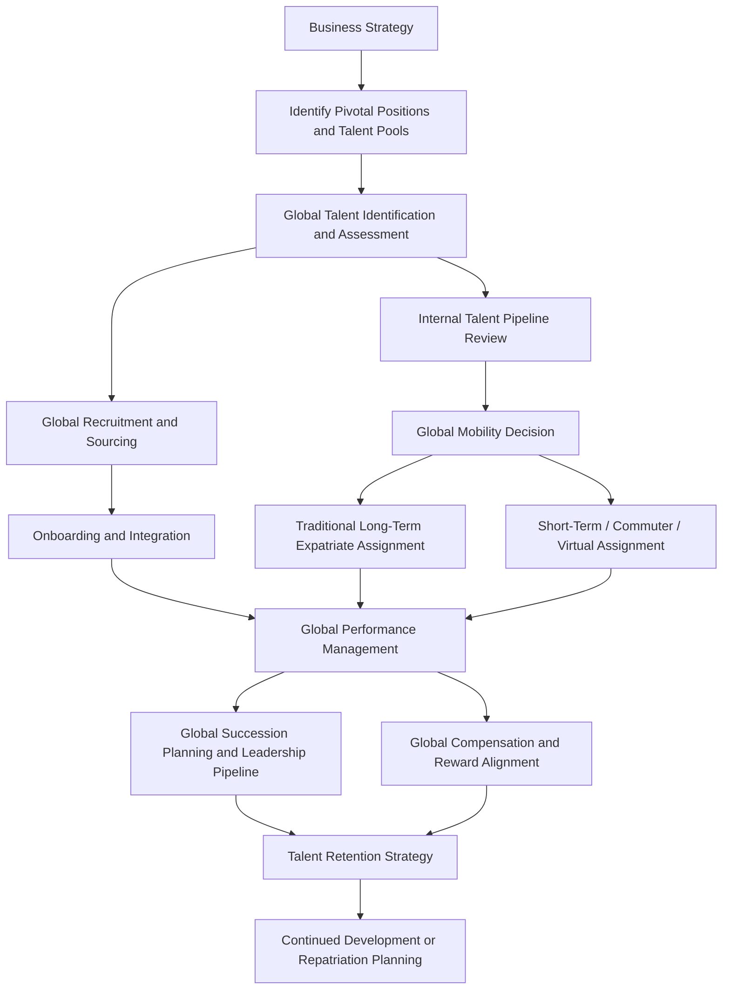

## Global Talent Management

### Definition and Scope

Global talent management (GTM) refers to the systematic, organization-wide processes of attracting, identifying, developing, deploying, and retaining talent across an organization's global operations, designed to build a pipeline of individuals capable of filling key strategic positions internationally. GTM is distinguished from domestic talent management primarily by the added complexity of operating across multiple national labor markets, legal jurisdictions, and cultural contexts simultaneously, and from purely local/subsidiary-level HR by its emphasis on cross-border coordination and enterprise-wide strategic alignment.

### Defining Talent Management vs. Global Talent Management

**Talent management (general)** — an integrated set of processes, programs, and cultural norms in an organization designed to attract, develop, deploy, and retain talent in service of current and future business priorities (drawing on Collings and Mellahi's widely cited 2009 conceptualization emphasizing identification of pivotal talent pools and positions).

**Global talent management (GTM)** — extends this to the multinational context, requiring organizations to balance **global integration** (consistent, centrally coordinated talent processes and standards across all locations) against **local responsiveness** (adaptation to local labor market conditions, legal requirements, and cultural expectations) — a tension frequently framed using the **global integration–local responsiveness (I-R) framework** originating in international business strategy literature (Bartlett and Ghoshal).

**Key Point:** This I-R tension is arguably the central organizing challenge of the entire GTM field — nearly every specific practice area below (recruitment, performance management, compensation, succession planning) requires organizations to make explicit choices about how much to standardize globally versus adapt locally, and those choices have direct implications for both organizational coherence and local market/cultural fit.

### Core GTM Processes

**1. Talent Identification and Pivotal Position Analysis**

Following Collings and Mellahi's influential framework, GTM emphasizes identifying **pivotal talent pools** and **pivotal positions** — roles with disproportionate impact on organizational strategic capability and competitive advantage — rather than attempting uniform intensive talent management investment across all roles and locations.

**2. Global Recruitment and Sourcing**

- Employer branding strategies that function across diverse labor markets and cultural contexts
- Navigating varied recruitment norms, channels, and candidate expectations across regions
- Compliance with jurisdiction-specific employment and immigration law during cross-border hiring

**3. Global Mobility and International Assignments**

Encompasses traditional long-term expatriate assignments (see Expatriate Adjustment and Management topic) as well as an expanding range of **alternative international assignment types**:

- **Short-term assignments** — typically under one year, often for specific project or knowledge-transfer purposes
- **Commuter assignments** — regular travel between home and host location without permanent relocation
- **Virtual/remote international assignments** — leading or coordinating cross-border teams without physical relocation, an increasingly significant category given post-pandemic remote work normalization
- **Rotational/developmental assignments** — shorter, development-focused international moves aimed at building global leadership capability rather than filling a specific operational need

[Inference] The relative proportion of traditional long-term expatriate assignments versus these alternative forms has likely shifted toward greater use of alternative assignment types in recent years, given widely discussed cost pressures associated with traditional expatriation and the normalization of remote/virtual collaboration tools, though the precise magnitude of this shift across industries is not something that can be stated with high confidence without current survey data specific to the relevant time period and sector.

**4. Global Performance Management**

Designing performance management systems that maintain sufficient consistency for cross-border comparability (necessary for global succession planning and equitable reward decisions) while accommodating legitimate cultural variation in feedback norms, goal-setting styles, and rating tendencies (see the cross-cultural 360-feedback caveat discussed under Cross-Cultural Leadership).

**5. Global Compensation and Reward**

- Balancing internal equity (fairness perceptions within a single location or across the global organization) against external/local market competitiveness (compensation benchmarked to local labor market conditions, which can vary enormously across regions)
- Managing expatriate compensation specifically, historically often using **balance sheet approaches** (designed to maintain the expatriate's home-country purchasing power and standard of living while abroad) though alternative approaches (e.g., local-plus, host-based) have grown in use, particularly for longer-term or localized assignments

**6. Global Succession Planning**

Building leadership pipelines that span multiple countries and business units, requiring cross-border visibility into talent pools and standardized (or at least cross-comparable) assessment approaches to identify and develop successors for pivotal global positions.

### GTM Process Integration

### The Global Integration–Local Responsiveness Framework Applied to GTM

| Organizational Approach | Global Integration | Local Responsiveness | Typical GTM Implication |
| --- | --- | --- | --- |
| Global/Centralized | High | Low | Standardized worldwide talent processes; strong consistency, weaker local market fit |
| Multi-domestic/Localized | Low | High | Fully localized HR practices per country; strong local fit, weak cross-border coordination |
| Transnational/Hybrid | High | High | Globally consistent core framework with structured local adaptation; higher implementation complexity |

[Inference] The transnational/hybrid approach is generally regarded in the GTM literature as the most theoretically desirable but also the most organizationally demanding to execute well, requiring sophisticated HR infrastructure and cross-border coordination capability — this reflects a broadly shared view in the international HRM literature rather than a universally settled empirical ranking of approach effectiveness across all organizational contexts.

### Talent Analytics and GTM Decision-Making

Contemporary GTM increasingly incorporates **global people analytics** — using standardized (or cross-comparable) HR data across geographies to support talent identification, mobility planning, and retention risk analysis. Key methodological considerations include ensuring data comparability across jurisdictions with varying HR system maturity, and navigating cross-border data privacy regulation (notably the EU's GDPR and similar frameworks emerging in other jurisdictions) when centralizing employee data for global analytics purposes.

### Key Challenges in Global Talent Management

**Legal and regulatory complexity:**

- Varying employment law, tax law, and immigration requirements across every jurisdiction of operation (see also Employment Law Fundamentals)
- Data privacy regulation affecting cross-border HR data transfer and centralized talent analytics
- Compliance costs and complexity scale with the number of jurisdictions involved, often disproportionately affecting mid-sized multinational organizations with less mature global HR infrastructure than large multinationals

**Talent pipeline visibility:**

- Achieving genuine cross-border visibility into talent pools (rather than fragmented, subsidiary-siloed talent data) remains a persistent practical challenge, particularly in organizations that grew through acquisition and retain disparate legacy HR systems

**Equity and fairness perceptions across borders:**

- Global compensation and opportunity decisions can create cross-border equity perception challenges — employees in different locations may become aware of compensation or development-opportunity disparities across the global organization, with implications for organizational justice perceptions (see Organizational Justice and Its Dimensions) even when disparities are locally market-justified

**Cultural and leadership adaptation:**

- Integrating cross-cultural leadership and expatriate adjustment considerations (see related topics) into the broader GTM system rather than treating them as separate concerns

### Example: Applying the Framework

**Example:** A multinational manufacturing firm identifies a critical shortage of qualified plant leadership talent across its Southeast Asian operations, historically filled through expensive traditional long-term expatriate assignments from headquarters, which have shown high premature-return rates and repatriation-phase turnover (see Expatriate Adjustment and Management).

**Analysis:** Applying the GTM framework, several structural alternatives merit consideration beyond continuing the current traditional-expatriate-heavy approach: investing in local talent identification and accelerated leadership development pipelines (building local pivotal-position succession capability rather than perpetual expatriate reliance), using shorter-term rotational or virtual assignments for targeted knowledge transfer rather than long-term relocation, and reviewing whether current compensation and career-path structures are creating perceived inequity that undermines local talent retention relative to expatriate treatment. This reflects the broader GTM principle that sustainable global talent capability typically requires building genuine local pipeline depth rather than perpetual reliance on cross-border assignment to fill the same recurring gaps.

### Measurement and Evaluation

- **Talent pipeline strength metrics** — bench depth for pivotal positions across regions, internal fill rate for key roles
- **Global mobility ROI metrics** — assignment cost versus business impact and retention outcomes, increasingly scrutinized given the substantial cost of traditional long-term expatriate assignments
- **Retention metrics disaggregated by region and talent segment** — aggregate global retention figures can mask significant regional variation requiring distinct intervention
- **Engagement and inclusion metrics across the global workforce** — often requiring culturally validated survey instruments rather than direct translation of a single home-market survey (given potential measurement invariance issues, as discussed under Cross-Cultural Leadership)

### Common Organizational Pitfalls

- Applying a fully standardized global talent management approach without adaptation, creating poor local market and cultural fit
- Applying a fully localized approach without sufficient global coordination, undermining enterprise-wide succession planning and cross-border talent visibility
- Over-relying on traditional long-term expatriate assignments without evaluating alternative mobility approaches for cost-effectiveness and success rates
- Neglecting cross-border equity perception effects when designing region-specific compensation and opportunity structures
- Treating global talent analytics as a purely technical data problem without addressing underlying data privacy compliance and cross-jurisdictional comparability challenges
- Underinvesting in local talent pipeline development in favor of perpetual reliance on cross-border assignment to fill recurring critical roles

### Related Topics

- Expatriate Adjustment and Management
- Cross-Cultural Leadership
- Hofstede's Cultural Dimensions and The GLOBE Study
- Succession Planning and Leadership Pipeline Development
- Organizational Justice and Its Dimensions (cross-border equity perceptions)
- People Analytics and Global HR Data Governance
- Employment Law Fundamentals (cross-jurisdictional compliance)