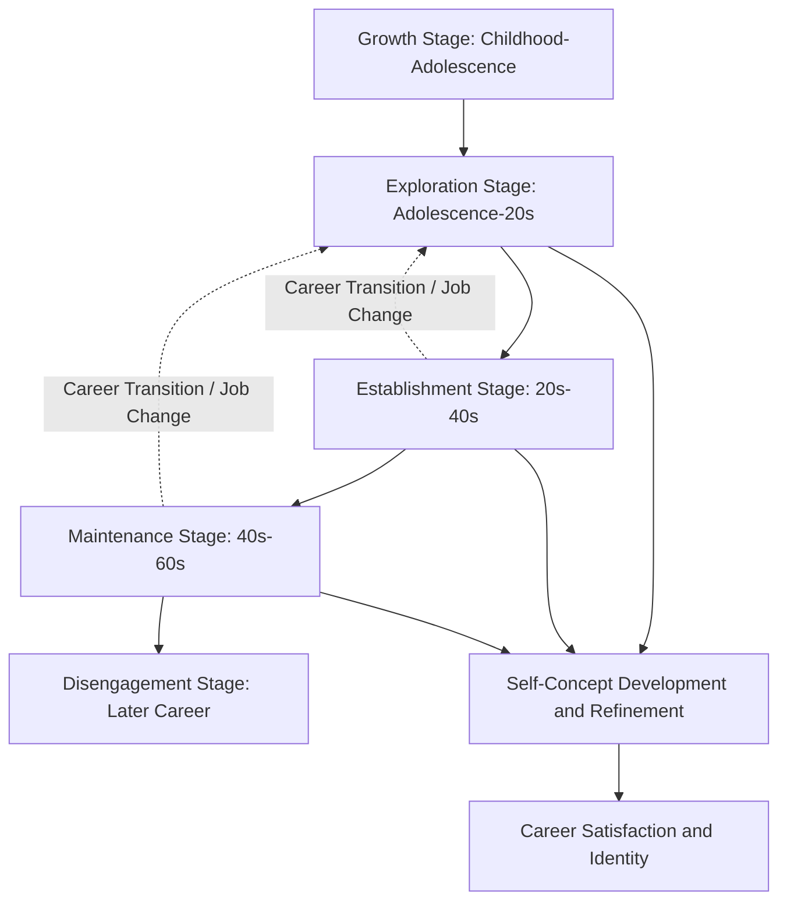

## Career Development Theories

### Definition and Scope

Career development theories comprise the psychological frameworks explaining how individuals choose, enter, progress through, and derive meaning from careers across the lifespan. This domain spans several distinct theoretical traditions — trait-based matching theories, developmental/lifespan theories, social-cognitive theories, and contemporary boundaryless/protean career theories — reflecting both the field's disciplinary roots in vocational psychology and its evolution alongside changing labor market realities (from stable, single-employer careers toward more fluid, self-directed career patterns).

### Trait-and-Factor / Person-Environment Fit Theories

**Parsons' Trait-and-Factor Theory (1909)**

The historical foundation of vocational psychology, proposing that successful career choice results from achieving a good match between an individual's traits (abilities, interests, values) and the requirements/rewards of a given occupation — a deceptively simple three-step model (understand self, understand occupational requirements, reason to a fitting match) that established the basic logic underlying most subsequent person-environment fit approaches.

**Holland's Theory of Vocational Personalities and Work Environments (RIASEC)**

The most extensively applied and empirically supported person-environment fit theory in contemporary practice, proposing six vocational personality/environment types arranged in a hexagonal structure:

| Type | Characteristic Orientation |
| --- | --- |
| Realistic (R) | Practical, hands-on, mechanical activities |
| Investigative (I) | Analytical, scientific, intellectual problem-solving |
| Artistic (A) | Creative, expressive, unstructured activities |
| Social (S) | Helping, teaching, interpersonal service |
| Enterprising (E) | Persuading, leading, business-oriented activities |
| Conventional (C) | Organized, detail-oriented, data-management activities |

**Key Point:** Holland's hexagonal arrangement is theoretically significant, not merely descriptive — adjacent types on the hexagon (e.g., Realistic and Investigative) are theorized to be more psychologically compatible than opposite types (e.g., Realistic and Social), and the degree of **congruence** (fit between an individual's dominant type profile and their work environment's type profile) is the theory's central predictor of job satisfaction, stability, and achievement. [Inference] Congruence has shown reasonably consistent, though modest in effect size, relationships with career satisfaction and persistence across a substantial body of validation research, making it one of the better empirically supported constructs in vocational psychology, though effect sizes and the degree to which congruence predicts outcomes beyond satisfaction (e.g., objective performance) have varied across studies and remain an area of ongoing refinement.

### Career Development / Lifespan Theories

**Super's Life-Span, Life-Space Theory**

Donald Super's theory (developed across several decades starting in the 1950s) represented a significant departure from static trait-matching approaches by framing career development as a lifelong process unfolding through a sequence of developmental stages, with the **self-concept** (an individual's understanding of their own abilities, values, and interests, which evolves over time) as the central organizing construct.

**Super's Five Career Development Stages:**

1. **Growth** (childhood through early adolescence) — developing self-concept, attitudes, and general work-relevant capacities
2. **Exploration** (adolescence to mid-20s) — trying out roles, gathering information, tentative choice-making
3. **Establishment** (mid-20s to mid-40s) — settling into a chosen field, building competence and stability
4. **Maintenance** (mid-40s to mid-60s) — sustaining achieved position, updating skills, potential for stagnation or renewal
5. **Disengagement/Decline** (later career) — reduced involvement, planning for retirement

[Inference] Super's later work substantially revised the rigid, age-linked staging of this model, introducing the concept of "recycling" through stages at any career transition point (e.g., a mid-career job change can trigger a fresh exploration-establishment cycle regardless of chronological age) — this revision is an important refinement often underemphasized in simplified secondary presentations of the theory, which sometimes present the five stages as a strictly age-bound linear sequence rather than the more flexible, recursive model Super's later work actually proposed.

**Life-Space dimension:** Super also emphasized that career is only one of several life roles (others including student, citizen, spouse/partner, parent, leisurite) occupied simultaneously across the "life-career rainbow," with the relative salience of each role shifting across the lifespan — a notably holistic framing relative to more narrowly occupation-focused theories.

### Career Development Stage Model

### Social Cognitive Career Theory (SCCT)

Developed by Lent, Brown, and Hackett (1994), drawing directly on Bandura's Social Cognitive Theory, SCCT emphasizes the interplay of three core cognitive-personal variables in shaping career behavior:

**1. Self-Efficacy Beliefs** — an individual's confidence in their ability to successfully perform tasks required in a given career domain (directly derived from Bandura's self-efficacy construct)

**2. Outcome Expectations** — beliefs about the likely consequences of pursuing a particular career path (e.g., "if I pursue this field, will it lead to the outcomes I value?")

**3. Personal Goals** — an individual's intentions to engage in a particular activity or achieve a particular future outcome, which mediate the relationship between self-efficacy/outcome expectations and actual career behavior

**Key Point:** SCCT's major theoretical contribution over trait-matching approaches is its dynamic, learning-based account of how career interests and choices actually develop and change over time (through mastery experiences, vicarious learning, social persuasion, and physiological states — Bandura's four sources of self-efficacy), rather than treating vocational interests as a relatively fixed trait to be measured and matched. This has made SCCT particularly influential in research on career barriers and underrepresentation (e.g., explaining how limited early self-efficacy-building opportunities in a domain, rather than lack of inherent interest or ability, can suppress career pursuit in that domain for particular demographic groups).

### Contemporary Career Theories: Boundaryless and Protean Careers

Developed substantially in response to the erosion of traditional single-employer, linear career paths characteristic of much of the 20th century labor market.

**Protean Career Theory (Hall, 1976; substantially revisited in later decades)**

Describes a career orientation driven by the individual's own values and self-directed goals (rather than organizational career management), characterized by two core dimensions:

- **Values-driven** — the individual, not the organization, is the primary source of direction and evaluation of career success
- **Self-directed** — the individual actively manages their own career development and adaptation, rather than relying on organizational career pathing

**Boundaryless Career Theory (Arthur and Rousseau, 1996)**

Describes careers unfolding across multiple employers, organizations, and even occupational fields, in contrast to the traditional bounded, single-organization career trajectory. [Inference] "Boundaryless" is frequently misinterpreted as implying literally unlimited career mobility without constraint; the original theoretical formulation is more precisely understood as describing careers not bound to a single organizational structure, while still operating within real structural, economic, and social constraints — this clarification is a commonly noted point in more careful treatments of the theory, distinguishing the nuanced original formulation from looser popular usage of the term.

**Key Point:** Both protean and boundaryless career theories reflect a broader theoretical shift in the field — from careers as something primarily managed and structured by organizations, toward careers as something primarily constructed and managed by individuals across a more fluid, multi-employer landscape. [Inference] This theoretical shift is widely regarded as reflecting genuine, well-documented changes in labor market structure (declining average organizational tenure, growth of contract and gig-economy work arrangements) rather than purely academic reconceptualization, though the degree to which any individual career actually exhibits "boundaryless" or "protean" characteristics varies considerably by occupation, industry, and broader economic conditions.

### Career Construction Theory (Savickas)

A more recent integrative theory (Mark Savickas, developed substantially through the 2000s and 2010s) building on Super's foundational work but reframing career development through a narrative, constructivist lens — proposing that individuals actively construct their careers through the stories they tell about their work lives, rather than simply discovering a pre-existing fit or progressing through fixed developmental stages.

**Career adaptability** — a central construct in this theory, comprising four dimensions (the "4 Cs"): **Concern** (orientation toward the future), **Control** (sense of responsibility for shaping one's own career), **Curiosity** (exploration of possible selves and future scenarios), and **Confidence** (belief in one's ability to pursue aspirations and solve career problems).

[Inference] Career adaptability has become one of the more actively researched constructs in contemporary vocational psychology, with reasonably consistent evidence linking it to career-related outcomes such as employability and career satisfaction, though as with any relatively newer construct relative to the decades-long research base behind Holland's or Super's frameworks, its measurement and theoretical boundaries continue to be refined in ongoing research.

### Comparing the Major Theoretical Traditions

| Theory | Core Unit of Analysis | Primary Mechanism | Best Suited to Explain |
| --- | --- | --- | --- |
| Holland's RIASEC | Person-environment fit | Congruence between type and environment | Occupational choice and satisfaction |
| Super's Life-Span | Developmental stage | Self-concept evolution over time | Career progression and transitions across the lifespan |
| SCCT | Cognitive-social process | Self-efficacy and outcome expectations shaping goals | Development of interests and career barriers |
| Protean/Boundaryless | Individual agency vs. organizational structure | Self-direction across multiple employers | Contemporary, non-linear career patterns |
| Career Construction (Savickas) | Narrative identity | Career adaptability and meaning-making | Career transitions and constructing coherent career narrative |

### Practical Applications for Organizational Practice

**Career counseling and coaching:**

- Holland's RIASEC remains the most widely used framework in practical career assessment tools (e.g., the Self-Directed Search and related instruments), given its accessibility and strong applied validation base
- SCCT informs interventions targeting self-efficacy-building (e.g., mastery-experience-focused development programs) for individuals facing career barriers or underrepresentation in a given field

**Organizational career development program design:**

- Recognizing that employees increasingly hold protean, self-directed career orientations has implications for how organizations structure internal mobility, career pathing communication, and development investment — programs assuming employee passivity and organizational-driven career management may be misaligned with contemporary employee expectations
- Career adaptability-building interventions (aligned with Savickas's framework) are increasingly incorporated into organizational development programming, particularly around major transitions (restructuring, role changes, layoffs)

**Example:** An organization notices declining engagement with its traditional, linear career-ladder communication materials among younger employees, who increasingly describe career goals in terms of skill acquisition and cross-functional experience rather than a fixed upward trajectory within the organization. **Analysis:** This pattern is consistent with a broader shift toward protean and boundaryless career orientations rather than necessarily reflecting reduced ambition or commitment. A redesigned approach might shift from prescriptive career ladders toward flexible internal mobility frameworks, skill-based career "lattices," and increased employee agency in shaping development paths — aligning organizational career architecture with the self-directed orientation the theory predicts is increasingly prevalent, rather than assuming the traditional linear-ladder model remains the default employee expectation.

### Measurement

- **Self-Directed Search (SDS)** and related RIASEC-based instruments — widely used validated assessments of vocational interest type
- **Career Adapt-Abilities Scale (CAAS)** — Savickas and Porfeli's validated instrument measuring the four career adaptability dimensions
- **Career Self-Efficacy scales** — various instruments measuring domain-specific self-efficacy consistent with SCCT
- **Protean Career Attitudes Scale** — measuring values-driven and self-directed career orientation dimensions

### Common Application Pitfalls

- Applying trait-matching frameworks (Holland) as the sole basis for career guidance without accounting for developmental stage or self-efficacy factors that SCCT and Super's theory address
- Treating Super's stages as strictly age-bound rather than recognizing the recursive, transition-triggered "recycling" refinement in his later work
- Designing organizational career programs around traditional linear-ladder assumptions without accounting for the well-documented shift toward protean and boundaryless career orientations
- Overlooking self-efficacy and structural barrier factors (central to SCCT) when addressing underrepresentation in particular career paths, in favor of assuming purely interest-based explanations
- Treating "boundaryless" career theory as implying unconstrained mobility rather than its more precise original formulation regarding organizational (not structural or economic) boundaries specifically

### Related Topics

- Person-Environment Fit Theory (broader organizational application)
- Self-Efficacy Theory (Bandura)
- Career Adaptability and Career Construction Theory
- Succession Planning and Internal Mobility Design
- Global Talent Management
- Mentoring and Career Development Support Systems