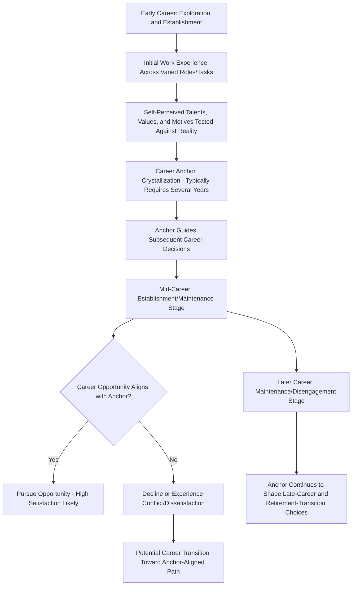

## Career Anchors and Career Stages

### Definition and Scope

Career anchors and career stages are two complementary but conceptually distinct frameworks for understanding individual career development. **Career stages** (introduced under Career Development Theories via Super's work) describe the sequential developmental phases individuals typically move through across a career lifespan. **Career anchors**, developed by Edgar Schein, describe the relatively stable, self-perceived core values, talents, and motives that guide and constrain an individual's career choices once developed — functioning as a "gyroscope" that keeps career decisions oriented around what the person most fundamentally cannot give up, even as external opportunities and career stage change over time.

### Schein's Career Anchor Theory: Origins and Core Concept

Edgar Schein developed the career anchor concept through longitudinal research (initially tracking MIT Sloan School graduates over more than a decade, beginning in the 1960s and 1970s) observing that as individuals gained real work experience, their self-concept regarding career crystallized around a dominant, stable pattern of self-perceived talents, values, and motives — the **career anchor** — which then functioned to constrain and guide subsequent career choices, often becoming more apparent to the individual only after several years of actual work experience rather than being knowable in advance through interest testing alone.

**Key Point:** This is a critical distinction from trait-matching theories like Holland's RIASEC — Schein's framework proposes that career anchors are not simply identifiable through early-life aptitude or interest assessment, but crystallize through the interaction of self-perceived talents, values, and motives *as tested against actual work experience* over time. This makes career anchors a fundamentally different type of construct: less a predictive matching tool for initial career choice, and more a diagnostic and self-understanding tool most useful once an individual has accumulated meaningful work experience.

### Schein's Eight Career Anchors

| Anchor | Core Orientation |
| --- | --- |
| Technical/Functional Competence | Building deep expertise and mastery in a specific technical or functional domain; resists moves into general management if it means leaving the area of expertise |
| General Managerial Competence | Motivated by the challenge of managing and integrating the efforts of others across functions; seeks broad responsibility and advancement toward senior general management |
| Autonomy/Independence | Prioritizes freedom from organizational constraints; prefers to define one's own work pace, methods, and standards |
| Security/Stability | Prioritizes employment security, predictability, and stable long-term employment, sometimes with a particular organization or geographic location |
| Entrepreneurial Creativity | Driven to create new products, services, or organizations through one's own effort; motivated by building something new |
| Service/Dedication to a Cause | Motivated by work that allows pursuit of core values (helping others, improving society, working in a valued field), with career decisions oriented around this value fit rather than status or income |
| Pure Challenge | Motivated by overcoming difficult obstacles, solving hard problems, or competing against tough competition, sometimes seeking increasingly difficult challenges over time |
| Lifestyle Integration | Prioritizes integrating career with total life pattern (family, personal interests), seeking flexibility and balance over pure career advancement |

**Key Point:** Schein's model proposes that most individuals have one **dominant** anchor, though secondary anchors can meaningfully influence career decisions as well; a genuine test of a person's dominant anchor, per Schein's framework, is what they would be most reluctant to give up if forced to choose among competing career opportunities — not simply what they currently enjoy or are good at, both of which could be true across multiple anchors without indicating dominance.

### Career Anchors in Relation to Career Stages

**Key Point:** This diagram illustrates a central integrative insight — career anchors typically crystallize *during* early-to-mid career stages (as Super's framework would describe: the Exploration and early Establishment stages) through accumulated work experience, and then persist as a relatively stable guiding force through subsequent career stages, meaning the two frameworks operate at different points in the career timeline and answer different questions: career stage theory describes *when* and *how* development unfolds, while career anchor theory describes *what stable core* guides an individual's choices once sufficient self-knowledge has developed.

### Application: Anchor-Environment Misalignment

A central practical application of career anchor theory is diagnosing why an individual experiences dissatisfaction despite objective career "success" (promotion, increased compensation, expanded scope) — often explained as **anchor-environment misalignment**, where the career path or role no longer aligns with the individual's dominant anchor even though it represents conventional advancement.

**Example:** A software engineer with a strong Technical/Functional Competence anchor is promoted into an engineering management role after several years of strong individual technical performance — a conventional and often assumed-desirable advancement path. Despite the promotion, compensation increase, and expanded organizational status, the engineer reports declining job satisfaction, missing the deep technical problem-solving the prior role provided, and finding the managerial responsibilities (personnel management, budget oversight, cross-team coordination) unfulfilling relative to hands-on technical work.

**Analysis:** This pattern is a textbook illustration of anchor-environment misalignment as Schein's framework would predict it — the promotion assumed a General Managerial Competence anchor trajectory (the conventional "up-or-out" technical career ladder), while the individual's actual dominant anchor (Technical/Functional Competence) was not accommodated. A well-designed organizational response, informed by this framework, would offer a genuine **dual-ladder career path** — allowing continued advancement in compensation, status, and scope through deepening technical expertise (e.g., Principal Engineer, Distinguished Engineer tracks) as an alternative to the traditional management-track promotion path, rather than assuming management advancement is the only legitimate form of career progression.

### Organizational Applications of Career Anchor Theory

**Career pathing and dual-ladder design:**

Organizations increasingly design **dual-ladder** or **multi-ladder** career architectures (parallel technical/functional and managerial advancement tracks with comparable compensation and status ceilings) directly informed by the recognition that not all high performers share a General Managerial Competence anchor, and forcing advancement exclusively through management tracks risks both individual dissatisfaction and loss of valuable technical expertise from the organization.

**Career counseling and internal mobility:**

Understanding an employee's dominant anchor can inform more effective internal mobility conversations — for example, an employee with a strong Autonomy/Independence anchor may be better served by project-based or consultant-style internal roles than by conventional hierarchical advancement, even if the latter appears as the more prestigious option on paper.

**Retention risk diagnosis:**

Anchor-environment misalignment can serve as a diagnostic lens for understanding otherwise puzzling voluntary turnover among seemingly successful, well-compensated employees — turnover that purely compensation-focused retention analysis might fail to explain.

**Succession planning:**

Incorporating anchor awareness into succession planning can help avoid promoting technically excellent individual contributors into general management roles based solely on strong individual performance, without adequately assessing whether their underlying career anchor and managerial aptitude/interest align with the demands of the target role.

### Relationship to Other Career Frameworks

[Inference] Career anchor theory is generally viewed as complementary to, rather than competing with, Holland's RIASEC framework and Super's life-span theory — RIASEC is typically applied earlier in career decision-making (vocational choice, often before extensive work experience has accumulated), Super's stages describe the developmental timeline across which anchors crystallize and subsequent transitions occur, and career anchors provide a deeper, experience-tested account of core motivational stability once meaningful work history exists. This complementary positioning reflects a reasonably common view among career development practitioners and researchers, though the frameworks emerged from somewhat distinct research traditions and are not always explicitly integrated in a single unified model within the academic literature.

### Measurement

- **Schein's Career Orientations Inventory (COI)** — the original self-assessment instrument developed by Schein for identifying dominant and secondary career anchors, typically used in career coaching, leadership development, and organizational career pathing contexts
- [Unverified] Various adapted and updated versions of career anchor assessment instruments have been developed by different providers since Schein's original work; specific psychometric validation evidence should be reviewed for any particular instrument version being considered for organizational use, since instrument quality can vary across adaptations

### Common Organizational Pitfalls

- Assuming all high-performing individual contributors aspire to (or are well-suited for) management advancement, without accounting for anchor diversity among the workforce
- Designing only a single, management-track career ladder, forcing anchor-misaligned advancement decisions on employees whose dominant anchor is Technical/Functional Competence, Autonomy, or other non-managerial orientations
- Assessing career anchors too early (before an individual has accumulated meaningful work experience), inconsistent with Schein's emphasis on anchor crystallization through tested experience rather than early aptitude testing
- Treating career anchor assessment as a one-time, static exercise rather than recognizing that while anchors are relatively stable once crystallized, career stage transitions can prompt renewed self-reflection worth revisiting
- Failing to distinguish "what an employee currently enjoys" from their true dominant anchor (what they would be most reluctant to sacrifice), leading to superficial rather than diagnostic anchor identification

### Related Topics

- Career Development Theories (Holland's RIASEC, Super's Life-Span Theory, SCCT)
- Dual-Ladder and Multi-Track Career Architecture Design
- Succession Planning and Internal Mobility Design
- Person-Environment Fit Theory
- Retention Analysis and Voluntary Turnover Diagnosis
- Global Talent Management