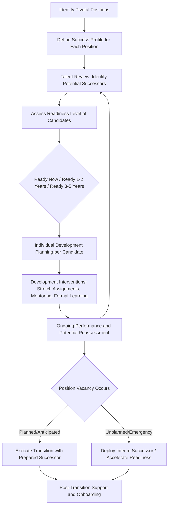

## Succession Planning

### Definition and Scope

Succession planning is the systematic process of identifying and developing internal talent with the potential to fill key leadership and critical positions, ensuring organizational continuity and reducing the risk associated with the loss of individuals in pivotal roles. Distinguished from general talent management (the broader umbrella discipline) and from replacement planning (a narrower, more reactive practice), succession planning is specifically forward-looking, developmental, and strategically prioritized around roles with disproportionate impact on organizational performance and continuity.

### Succession Planning vs. Related Concepts

**Succession planning vs. replacement planning**

Replacement planning is a narrower, more tactical practice — identifying immediate, often interim, backups for specific positions in case of unexpected vacancy, with less emphasis on longer-term development. Succession planning is broader and developmental — building capability over time, often years in advance of an anticipated vacancy, with active investment in candidate readiness rather than simply identifying a list of names.

**Succession planning vs. general talent management**

Succession planning is best understood as a specific, downstream application within the broader talent management system (see Global Talent Management), focused specifically on leadership continuity for pivotal positions, drawing on the broader talent identification, development, and performance management infrastructure the organization maintains.

**Key Point:** A common and consequential conceptual error in practice is treating succession planning as synonymous with high-potential (HiPo) identification alone. Robust succession planning requires connecting HiPo identification to specific pivotal roles and developmental pathways — a strong bench of generally talented individuals does not by itself constitute a succession plan without this connective, role-specific structure.

### Pivotal Position Identification

Drawing on Collings and Mellahi's influential strategic talent management framework (also referenced under Global Talent Management), effective succession planning begins with identifying **pivotal positions** — roles with disproportionate impact on organizational strategic capability, where a vacancy or underperformance would create significant strategic risk — rather than attempting comprehensive succession coverage for every position in the organization.

**Criteria commonly used to identify pivotal positions:**

- Strategic impact and variability in performance across incumbents (roles where the difference between a strong and weak incumbent significantly affects outcomes)
- Difficulty and cost of external replacement (specialized knowledge, relationship capital, scarce skill sets)
- Single points of failure risk (roles with limited internal redundancy)
- Direct linkage to critical organizational capabilities or competitive advantage

### Succession Planning Process

### Readiness Assessment and the 9-Box Grid

A widely used practical tool in succession planning and talent review processes is the **9-box grid**, which plots individuals along two axes — typically **current performance** and **future potential** — to categorize talent into nine resulting segments, informing differentiated development and succession investment decisions.

|  | Low Potential | Moderate Potential | High Potential |
| --- | --- | --- | --- |
| **High Performance** | Solid Professional / Core Talent | Growth Employee / Future Leader | High Potential / Top Talent |
| **Moderate Performance** | Inconsistent Performer | Core Employee | Emerging Talent |
| **Low Performance** | Underperformer / Risk | Questionable Fit | Enigma / Unrealized Potential |

[Inference] While the 9-box grid remains one of the most widely used practical tools in applied talent management and succession planning practice, it has drawn methodological critique in the I-O psychology literature — particularly regarding the reliability and validity of "potential" ratings, which are often based on subjective manager judgment without standardized criteria, introducing risk of rater bias (including bias correlated with demographic characteristics) unless organizations implement calibration processes and clearly defined potential criteria. This is a genuinely contested area between widespread applied usage and more cautious academic assessment of the tool's psychometric rigor as typically implemented.

**Readiness timeframes** — candidates are commonly categorized by anticipated readiness horizon (e.g., "ready now," "ready in 1–2 years," "ready in 3–5 years"), directly informing the urgency and type of development investment appropriate for each candidate.

### Assessing Leadership Potential

Distinguishing genuine "potential" from current performance is a central methodological challenge in succession planning, since strong current performance in a role does not reliably predict success in a different, typically more senior or broader-scope, future role (a pattern related to, though distinct from, the well-known "Peter Principle" concern about promotion based on current-role performance alone).

**Common potential indicators used in more rigorous frameworks:**

- **Learning agility** — the capacity to learn from experience and apply that learning effectively to new, unfamiliar situations; [Inference] learning agility has emerged as one of the more empirically supported potential indicators in contemporary talent management research, generally regarded as offering better predictive validity for future role success than extrapolating from current-role performance alone, though it remains a newer research construct relative to more established individual-difference predictors and its measurement approaches continue to be refined
- **Motivation and drive for advancement** — genuine interest in taking on expanded responsibility, distinct from simply being nominated by others
- **Cognitive ability and strategic thinking capacity** — particularly relevant for roles requiring broader organizational or strategic scope than the candidate's current position
- **Interpersonal and leadership skill indicators** — assessed through structured methods (360-degree feedback, assessment centers, structured behavioral interviews) rather than informal manager impression alone

### Succession Planning Governance Models

**Centralized/HR-driven model** — succession planning process owned and coordinated primarily by corporate HR/talent management functions, with standardized tools and processes applied across the organization

**Decentralized/business-unit-driven model** — succession planning primarily owned by individual business unit or functional leaders, with HR playing a facilitative rather than directive role

**Hybrid model** — centrally coordinated framework and tools (ensuring consistency and cross-business-unit talent visibility) combined with business-unit-level ownership of actual talent review and development execution

[Inference] The hybrid model is generally regarded as best practice in contemporary succession planning literature, balancing the cross-organizational talent visibility benefits of centralization against the more accurate, context-specific judgment that business-unit leaders typically bring to individual candidate assessment — though the specific balance point appropriate for any given organization depends on organizational size, complexity, and culture.

### Board-Level and CEO Succession

CEO and board-level succession planning represents a particularly high-stakes, distinct subcategory, typically governed by formal board governance processes (often a board-level succession or nominating/governance committee) given its direct implications for organizational strategic continuity and, for publicly traded companies, investor and regulatory scrutiny.

**Distinct considerations for CEO succession:**

- **Emergency/interim succession planning** — a distinct, immediate-readiness plan for unexpected CEO incapacity or departure, maintained separately from longer-term planned succession
- **External vs. internal candidate evaluation** — CEO succession planning processes typically formally benchmark internal candidates against the external executive talent market, unlike most other organizational succession planning, which is predominantly internally focused
- **Board involvement and governance** — direct board oversight, often with less day-to-day HR function involvement than typical organizational succession planning

### Example: Applying the Framework

**Example:** A mid-sized manufacturing company's VP of Operations — identified as a pivotal position given its direct impact on production continuity and specialized supply-chain relationship knowledge — announces retirement intent within 18 months. The organization's talent review identifies two internal candidates: one with strong current performance in a related but narrower role and identified as "ready in 1–2 years," and another newer to the organization but showing strong learning agility indicators and identified as "ready in 3–5 years."

**Analysis:** Given the 18-month timeline, the "ready in 1–2 years" candidate represents the more immediately viable succession path, but a well-designed plan (per the process above) would also formalize accelerated development for the second candidate as a longer-term pipeline investment regardless of this specific transition's outcome, and would establish an emergency/interim contingency (given the pivotal-position designation) should the primary candidate's readiness not fully materialize within the 18-month window or should an unplanned earlier departure occur. This illustrates the distinction between succession planning (proactive, developmental, dual-track) and mere replacement planning (identifying a single reactive backup).

### Measurement and Evaluation

- **Succession depth/bench strength metrics** — number of identified, adequately-ready successors per pivotal position
- **Internal fill rate for key positions** — the proportion of pivotal position vacancies filled internally versus requiring external hire, often used as a lagging indicator of succession planning effectiveness
- **Time-to-productivity for successors** — post-transition ramp-up time, informing whether development investment adequately prepared successors for actual role demands
- **9-box distribution tracking over time** — monitoring shifts in talent distribution as an indicator of overall talent pipeline health, while accounting for the calibration and rater-bias caveats noted above

### Common Organizational Pitfalls

- Conflating general high-potential identification with genuine succession planning, absent specific role-linked development pathways
- Relying on unstructured, uncalibrated manager judgment for potential ratings, introducing rater bias risk into 9-box and similar tools
- Focusing succession planning exclusively on the most senior executive roles while neglecting other pivotal positions with significant strategic risk (specialized technical roles, critical relationship-holder roles)
- Treating succession plans as static, point-in-time documents rather than living processes requiring regular reassessment as business needs and candidate readiness evolve
- Insufficient emergency/interim succession planning, leaving the organization exposed to unplanned vacancy in pivotal roles
- Underinvesting in genuine developmental interventions (stretch assignments, structured mentoring) relative to the administrative process of merely identifying and documenting successor names

### Related Topics

- Global Talent Management
- Career Anchors and Career Stages
- Learning Agility and Leadership Potential Assessment
- 9-Box Grid and Talent Review Methodology
- Assessment Centers and Structured Leadership Assessment
- Organizational Justice and Its Dimensions (fairness perceptions in succession and promotion decisions)