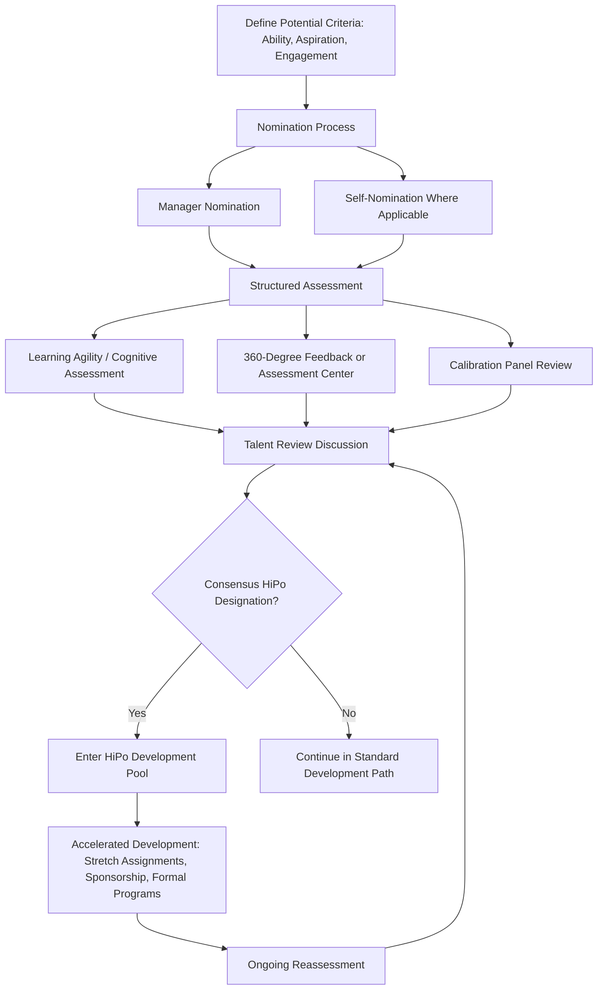

## High-Potential Identification Programs

### Definition and Scope

High-potential (HiPo) identification programs are the systematic organizational processes for identifying employees judged likely to succeed in future, typically broader-scope or more senior, roles beyond their current position — distinguishing "potential" (capacity for future growth) from "performance" (current role effectiveness), and forming the talent pool from which succession planning (see related topic) draws candidates for pivotal position development. This domain sits at the intersection of individual-differences psychology (predicting future performance from measurable indicators) and organizational practice (managing the assessment, investment, and communication processes around a necessarily limited pool of accelerated development resources).

### Distinguishing Potential from Performance

**Key Point:** This distinction is the foundational methodological challenge underlying the entire HiPo identification field. Current performance in a role is a necessary but explicitly insufficient indicator of future potential — an individual can be an outstanding performer in their current role while lacking the capabilities required for a substantially different or broader future role, and conversely, an individual with strong future potential may show only moderate current performance if their current role poorly utilizes their relevant capabilities.

[Inference] This distinction is closely related to, though broader than, the well-known "Peter Principle" observation (the tendency for individuals to be promoted based on current-role performance until reaching a role where they are no longer competent) — HiPo identification frameworks are explicitly designed to counteract this pattern by assessing potential through indicators theoretically distinct from current performance, though the degree to which any specific organizational HiPo process successfully achieves this separation in practice (rather than defaulting to performance as a proxy for potential) varies considerably and is a frequently noted implementation weakness in applied practice.

### Common Frameworks for Defining "Potential"

**The "Three Box" or Foundational Potential Model**

Many contemporary HiPo frameworks (reflecting a synthesis widely used in corporate talent management, drawing on research from organizations such as CEB/Gartner and various academic and consulting sources) organize potential indicators around three broad categories:

1. **Ability** — cognitive capability, learning agility, and the capacity to handle increased complexity
2. **Aspiration** — genuine motivation and desire to advance to more senior or expanded roles (distinguishing authentic aspiration from organizationally-nominated "potential" that the individual may not actually want)
3. **Engagement** — commitment to the organization and willingness to go beyond formal role requirements, theorized as necessary for sustained development investment to translate into realized potential

**Learning Agility Framework**

As introduced under Succession Planning, learning agility — the capacity to learn from experience and apply that learning effectively in new and unfamiliar situations — has become one of the more prominent standalone frameworks for potential assessment, often subdivided into distinct facets:

- **Mental agility** — comfort with complexity and ambiguity; ability to think critically about novel problems
- **People agility** — self-awareness and adaptability in working effectively with diverse people
- **Change agility** — comfort experimenting with new approaches and adapting to change
- **Results agility** — ability to deliver results in first-time, unfamiliar situations

[Inference] Learning agility has accumulated a reasonably favorable evidence base relative to several competing potential frameworks, generally showing better predictive validity for future role success than extrapolation from current performance ratings alone, though as a comparatively newer construct in the individual-differences literature, ongoing research continues to refine both its measurement approach and the boundary between learning agility and related constructs (e.g., general cognitive ability, openness to experience).

### High-Potential Identification Process

### Methodological Risks in HiPo Identification

This is an area of active concern in both academic and applied talent management literature, given the significant career and organizational consequences of HiPo designation.

**Rater bias and subjectivity**

Manager nomination processes, absent structured criteria and calibration, are vulnerable to a range of well-documented rating biases — including similarity bias (rating those similar to oneself more favorably), visibility bias (favoring employees with greater access to senior leaders), and demographic bias correlated with race, gender, age, or other protected characteristics. [Inference] This concern parallels, and directly connects to, the broader methodological critique of the 9-box grid discussed under Succession Planning — since "potential" ratings underlying most 9-box placements are frequently manager-judgment-based, they inherit the same calibration and bias vulnerabilities unless organizations implement structured, criteria-based assessment processes rather than relying on informal manager impression.

**Halo effect from current performance**

Absent deliberate methodological safeguards, HiPo identification processes frequently default to using current performance as a de facto proxy for potential, undermining the theoretical distinction the framework is meant to preserve — a well-documented practical implementation gap between the conceptual ability/aspiration/engagement or learning-agility frameworks and how HiPo nomination actually occurs in many organizations.

**Self-fulfilling prophecy dynamics**

[Inference] Drawing on the broader Pygmalion effect literature (expectation effects on performance), research and practitioner observation suggest that HiPo designation itself — through the additional development investment, visibility, and stretch opportunities it typically triggers — may partly create the very success it purports to merely identify, meaning observed differences in career outcomes between identified HiPos and non-identified employees may reflect differential investment and opportunity as much as (or in addition to) genuinely differential underlying potential. This represents a reasonably well-established theoretical concern in the talent management literature, though isolating the precise magnitude of this self-fulfilling effect from genuine underlying potential differences in any specific organizational dataset is methodologically difficult and remains an area where definitive quantification is elusive.

**Equity and representation concerns**

Given the rater bias risks above, HiPo pools have been documented in various studies and organizational audits to sometimes show demographic skew inconsistent with the broader workforce or applicant pool, raising both fairness and legal/adverse-impact considerations (see also Employment Law Fundamentals and Measuring DEI Outcomes) — a pattern that underscores the practical importance of structured, calibrated assessment processes over informal manager nomination alone.

### Disclosure and Transparency Considerations

A significant and actively debated practical question in HiPo program design is whether and how to disclose HiPo status to identified individuals.

**Arguments for disclosure (transparency approach):**

- Supports the "aspiration" and "engagement" components of potential frameworks, since genuine motivation is difficult to assess or sustain without the individual's awareness of their status and the associated development investment
- Consistent with informational and procedural justice principles (see Organizational Justice and Its Dimensions) — undisclosed processes affecting career opportunity can be perceived as less fair when eventually discovered
- Builds trust and retention motivation among identified individuals, who may otherwise be recruited away without awareness of internal investment being made in them

**Arguments against full disclosure (non-disclosure or partial-disclosure approach):**

- Concerns about entitlement or reduced effort among designated HiPos ("resting on the label")
- Concerns about demotivation, disengagement, or turnover risk among high performers *not* designated HiPo, if the designation and its associated visible investment become widely known
- Concerns about the fluidity of designation — since HiPo status is typically reassessed periodically rather than permanent, premature or overly formalized disclosure can create difficult conversations if status changes

[Inference] There is no clear empirical consensus favoring one approach over the other across the talent management literature — the relative weight of the transparency benefits versus the entitlement/equity-perception risks likely depends substantially on organizational culture, the specific communication approach used, and how consistently the organization manages expectations around the non-permanent, periodically-reassessed nature of the designation, making this more an organizational design choice requiring contextual judgment than a settled best practice with strong empirical backing in either direction.

### Development Investment for Identified HiPos

**Common development approaches:**

- **Stretch assignments** — deliberately assigning responsibilities beyond current role scope to test and build capability under real conditions, generally regarded as one of the most effective development approaches given its alignment with experiential learning principles
- **Formal sponsorship** — distinct from mentoring (which typically focuses on advice and guidance), sponsorship involves a senior leader actively advocating for the individual's visibility and advancement opportunities
- **Structured leadership development programs** — cohort-based formal programs combining classroom learning, experiential components, and networking across the identified HiPo population
- **Rotational assignments** — planned moves across functions or business units to build the breadth of experience often required for more senior, cross-functional future roles

### Example: Applying the Framework

**Example:** An organization's HiPo identification process currently relies entirely on direct-manager nomination with no structured assessment or calibration panel, and subsequent talent review data shows the resulting HiPo pool skews disproportionately toward employees who report to a small subset of senior leaders with high organizational visibility, with underrepresentation of equally tenured, strong-performing employees from less visible functions.

**Analysis:** This pattern is consistent with the documented rater bias and visibility bias risks discussed above — the absence of structured assessment criteria and calibration review has likely allowed manager-level subjectivity and differential organizational visibility (rather than genuine differences in ability, aspiration, or engagement) to substantially shape HiPo pool composition. A revised process — consistent with the workflow outlined above — would incorporate structured learning agility or cognitive assessment components, calibration panel review across multiple senior leaders rather than single-manager nomination alone, and periodic bias-pattern auditing of resulting HiPo pool composition against broader workforce demographics and functional distribution.

### Measurement and Evaluation

- **HiPo pool demographic and functional composition tracking** — auditing for representation patterns inconsistent with the broader eligible workforce, as a bias-detection mechanism
- **Predictive validity tracking** — longitudinally tracking whether identified HiPos actually achieve predicted future role success at meaningfully higher rates than non-identified comparison employees, providing organization-specific evidence of the assessment process's actual predictive value
- **HiPo retention rates** — given the substantial development investment typically made in identified individuals, retention of HiPo-designated employees is a commonly tracked metric, with elevated voluntary turnover among this group representing a particularly costly loss of invested development

### Common Organizational Pitfalls

- Relying on unstructured manager nomination without calibration, introducing significant rater bias risk into HiPo pool composition
- Defaulting to current performance as a proxy for potential, undermining the theoretical distinction the framework is designed to preserve
- Failing to periodically reassess HiPo status, treating a necessarily dynamic, evolving designation as a fixed, permanent label
- Adopting a disclosure or non-disclosure policy without deliberate consideration of the organization's specific culture and the associated trade-offs discussed above
- Underinvesting in genuine developmental interventions (stretch assignments, sponsorship) relative to the administrative act of designation itself
- Neglecting to audit HiPo pool composition for demographic or functional representation patterns that might indicate underlying process bias

### Related Topics

- Succession Planning
- Career Anchors and Career Stages
- Learning Agility and Leadership Potential Assessment
- 9-Box Grid and Talent Review Methodology
- Organizational Justice and Its Dimensions
- Measuring Diversity, Equity, and Inclusion Outcomes
- Mentoring and Sponsorship in Career Development