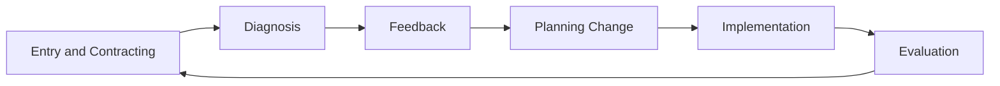

## Entering and Contracting with Client Organizations

### Overview

Entering and contracting represents the foundational phase of the organizational consulting process, encompassing the initial engagement between a consultant (internal or external) and a client system, through to the formal or informal establishment of a working agreement. This phase, drawn primarily from action research and organization development (OD) traditions, is widely regarded as disproportionately influential on eventual consulting success — problems in the entry and contracting phase frequently resurface as engagement failures later, even when technical intervention quality is high.

### The Consulting Process Model Context

Entering and contracting constitutes the first phase of the classic action research/consulting cycle:

### Entry: Establishing Initial Contact

#### Identifying the Client System

A critical early task is clarifying who constitutes "the client" — distinguishing between:

- **Contact client** – the individual who first reaches out to the consultant
- **Intermediate client(s)** – individuals or groups involved in scoping and approving the engagement
- **Primary client** – the person(s) with genuine ownership of the problem and authority to sanction change
- **Ultimate client(s)** – the broader system whose welfare the engagement is ultimately meant to serve (e.g., employees, customers, community)

Failure to correctly identify the primary client — often mistaking a gatekeeper or intermediate sponsor for the true decision-owner — is a well-documented source of later engagement breakdown.

#### The Presenting Problem vs. the Underlying Problem

Clients frequently present an initial problem statement that reflects symptoms rather than root causes (the "presenting problem"), analogous to a clinical presenting complaint. Skilled entry involves exploratory questioning to surface the underlying problem without prematurely committing to a diagnosis before adequate data has been gathered — while still respecting the client's initial framing rather than dismissively overriding it.

#### Assessing Organizational Readiness for Change

Entry-phase assessment typically evaluates:

- Leadership sponsorship strength and clarity of change mandate
- Prior change history and "change fatigue" risk
- Resource availability (time, budget, personnel) relative to stated scope
- Cultural openness to external input and willingness to surface difficult issues

### Diagram: Client System Layers (svg_diagram)

<svg xmlns="http://www.w3.org/2000/svg" viewBox="0 0 700 400">
<text x="350" y="28" font-size="16" font-weight="bold" text-anchor="middle" fill="#1a1a2e">Client System Layers (svg_diagram)</text>
<circle cx="350" cy="230" r="160" fill="#e0f2e9" stroke="#2a9d8f" stroke-width="1.5" />
<circle cx="350" cy="230" r="110" fill="#c8e6d6" stroke="#2a9d8f" stroke-width="1.5" />
<circle cx="350" cy="230" r="60" fill="#a3d5bc" stroke="#2a9d8f" stroke-width="1.5" />

<text x="350" y="230" font-size="12" text-anchor="middle" fill="`#1a1a2e`">Primary</text>

<text x="350" y="245" font-size="12" text-anchor="middle" fill="`#1a1a2e`">Client</text>

<text x="350" y="155" font-size="12" text-anchor="middle" fill="`#1a1a2e`">Intermediate Client(s)</text>

<text x="350" y="85" font-size="12" text-anchor="middle" fill="`#1a1a2e`">Ultimate Client(s) / Broader System</text>

</svg>

### Contracting: Formalizing the Engagement

#### The Psychological Contract in Consulting

Beyond formal legal agreements, effective consulting engagements establish a psychological contract — mutual, often implicit understanding of expectations, roles, and boundaries between consultant and client. Explicitly surfacing and discussing these expectations during contracting reduces later misalignment.

#### Elements of a Formal Consulting Contract

| Element | Purpose |
| --- | --- |
| Scope of work | Defines specific deliverables, boundaries, and exclusions |
| Objectives and success criteria | Establishes measurable definitions of engagement success |
| Timeline and milestones | Sequences deliverables and review points |
| Resources and responsibilities | Clarifies what each party will provide (data access, personnel time, budget) |
| Confidentiality provisions | Protects sensitive organizational and individual data |
| Fees and payment terms | Establishes financial arrangement |
| Roles and decision rights | Clarifies who makes which decisions and who has final approval authority |
| Termination/exit clauses | Establishes conditions for engagement conclusion or early termination |

#### Psychological Contracting Elements (Beyond the Formal Document)

Organization development practitioners (following Block's influential framework) emphasize explicitly discussing and negotiating several dimensions often left implicit:

- **Support** – what resources and access the consultant needs from the client to succeed
- **Time commitment** – realistic time investment required from both parties, avoiding underestimation
- **Feedback mechanisms** – how and when the consultant will share observations, including potentially uncomfortable findings
- **Involvement level** – degree to which client personnel will be active participants versus passive recipients of consultant-driven analysis
- **Confidentiality boundaries** – what will and will not be shared with whom, particularly regarding individually attributable data gathered during diagnosis

### Power Dynamics and Multiple Stakeholder Interests

#### Navigating Competing Stakeholder Agendas

Organizational entry frequently surfaces multiple, sometimes conflicting stakeholder interests (e.g., executive sponsor wants rapid visible results; frontline employees want genuine voice in the process; HR wants risk containment). Effective contracting requires surfacing rather than avoiding these tensions early, establishing realistic expectations about how competing interests will be navigated.

#### Consultant Role Clarity

Contracting should clarify the consultant's intended role along the directive-nondirective spectrum:

- **Expert role** – consultant diagnoses and prescribes solutions
- **Pair-of-hands role** – consultant implements client-specified solutions without independent diagnosis
- **Process consultation role** – consultant facilitates the client system's own problem-solving capability, following Schein's process consultation model, emphasizing that the client retains ownership of both diagnosis and solution

**[Inference]** Ambiguity about which role is being enacted is a commonly cited source of consultant-client friction; explicitly naming the intended role during contracting, even if it evolves over the engagement, tends to reduce misaligned expectations, though the relative effectiveness of different roles is highly contingent on organizational context and problem type rather than universally superior.

### Ethical Considerations in Entry and Contracting

#### Informed Consent and Voluntary Participation

Particularly relevant when the engagement involves data collection from employees who are not themselves the contracting party; ethical practice requires clarity with participants about data use, confidentiality, and voluntariness of participation in interviews, surveys, or focus groups.

#### Value Conflicts and Role Conflicts

Consultants should surface early any potential conflicts between the sponsoring client's interests and the welfare of the broader employee population (the "ultimate client"), a core ethical tension in internal-facing consulting work, and should be transparent about how such conflicts will be managed if they arise.

#### Competence Boundaries

Ethical contracting includes honest disclosure of the consultant's actual competence relative to the presented problem, avoiding overcommitment to work outside genuine expertise, consistent with professional ethical codes in psychology and consulting practice more broadly.

**Key Points**

- Misidentifying the primary client, or failing to surface competing stakeholder interests, is a leading predictor of later engagement breakdown — more so than technical intervention quality.
- The psychological contract (implicit mutual expectations) requires as much deliberate attention during contracting as the formal legal agreement.
- Explicitly naming the intended consultant role (expert, pair-of-hands, process consultation) reduces ambiguity-driven friction later in the engagement.

### Internal vs. External Consultant Considerations

| Factor | Internal Consultant | External Consultant |
| --- | --- | --- |
| Organizational knowledge | High (pre-existing context) | Lower initially, requires ramp-up |
| Perceived objectivity | Potentially lower (embedded relationships) | Typically higher |
| Political risk exposure | Higher (ongoing organizational relationships) | Lower (time-bounded engagement) |
| Contracting formality | Often more informal | Typically requires formal contract |
| Access to sensitive data | Variable, often easier | May require explicit negotiation |

### Practical Example

An external OD consultant is approached by a VP of Operations (contact client) about "communication problems" between two departments.

1. **Client system clarification:** Through initial conversation, the consultant discovers the VP is an intermediate client; the primary client is actually the COO, who commissioned the initiative but delegated initial contact, requiring the consultant to establish direct connection with the true decision-owner before proceeding.
2. **Presenting problem exploration:** Initial framing ("communication problems") is explored through preliminary conversations, surfacing a more specific underlying issue: unclear role boundaries following a recent reorganization, rather than a generic communication deficit.
3. **Psychological contracting conversation:** The consultant explicitly discusses with the COO: expected time commitment from department leaders, how uncomfortable findings will be shared (direct feedback to COO before broader dissemination), and confidentiality boundaries for individual interview data (aggregated, non-attributable reporting).
4. **Formal contract:** A written agreement specifies scope (diagnostic interviews and structured feedback session, not implementation), an 8-week timeline, defined deliverables, and an explicit process-consultation role rather than prescriptive expert recommendations.
5. **Stakeholder mapping:** The consultant identifies and discusses with the COO how competing interests (department leads wanting autonomy preserved vs. COO wanting standardized process) will be surfaced and navigated during diagnosis.

### Common Pitfalls

- Accepting the presenting problem at face value without adequate entry-phase exploration, leading to misdiagnosis
- Contracting with an intermediate client without verifying genuine primary client sponsorship and authority
- Leaving the consultant's role (expert vs. process consultation) undiscussed, producing mismatched expectations mid-engagement
- Underestimating required time commitment from client personnel, leading to resource strain and stalled engagements
- Failing to establish clear confidentiality boundaries before data collection begins, risking participant trust and data validity

### Related Topics

- Organization Development (OD) Process Models
- Process Consultation (Schein's Framework)
- Diagnosis and Data Gathering in Consulting
- Psychological Contract Theory
- Stakeholder Analysis and Power Mapping
- Ethics in Organizational Consulting Practice
- Action Research Methodology
- Change Readiness Assessment
- Internal vs. External Consulting Roles
- Feedback and Data Presentation to Client Systems