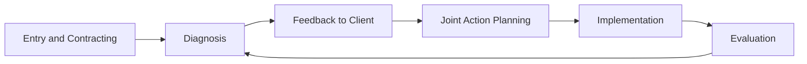

## Organizational Diagnosis Frameworks in Practice

### Overview

Organizational diagnosis frameworks in practice provide structured models for systematically assessing organizational functioning, identifying root causes of performance gaps, and generating actionable insight to guide intervention design. Diagnosis constitutes the second phase of the classic consulting/action research cycle, following entry and contracting, and represents the analytical foundation upon which credible, targeted change interventions are built.

### The Role of Diagnosis in the Consulting Cycle

Diagnosis is distinguished from casual observation by its systematic, theory-grounded, and data-driven approach — applying a structured conceptual model rather than relying solely on consultant intuition or the client's initial problem framing.

### Major Organizational Diagnosis Models

#### Weisbord's Six-Box Model

One of the most widely taught diagnostic frameworks, examining six interrelated organizational domains:

| Box | Core Diagnostic Question |
| --- | --- |
| Purposes | Are goals and mission clear and shared? |
| Structure | Does structure fit the work to be done? |
| Relationships | How do people and units relate; how is conflict managed? |
| Rewards | Are incentives aligned with desired behaviors? |
| Leadership | Does leadership maintain balance across the other boxes? |
| Helpful mechanisms | Are planning, control, and coordination systems adequate? |

The model explicitly frames leadership as a cross-cutting function responsible for maintaining balance across the other five domains rather than a separate, isolated box.

#### McKinsey 7-S Framework

Examines organizational alignment across seven interdependent elements, divided into "hard" (more tangible, easily specified) and "soft" (more difficult to describe, culturally embedded) elements:

**Hard elements:** Strategy, Structure, Systems

**Soft elements:** Shared values, Skills, Style, Staff

The framework's central diagnostic premise is that sustainable organizational effectiveness requires alignment across all seven elements; misalignment between hard and soft elements (e.g., a new strategy unsupported by existing skills or culture) is a common diagnostic finding.

#### Nadler-Tushman Congruence Model

Frames organizational effectiveness as a function of the degree of "fit" or congruence among four core components, given environmental and resource inputs:

$$\text{Organizational Effectiveness} = f(\text{Congruence among Task, Individual, Formal Organization, Informal Organization})$$

- **Task** – the actual work to be done
- **Individual** – the people performing the work, their skills and needs
- **Formal organization** – structures, systems, and processes
- **Informal organization** – culture, norms, and unwritten rules

High incongruence between any pair of components (e.g., formal reward systems misaligned with actual task demands) is treated as a primary diagnostic target.

#### Burke-Litwin Model of Organizational Performance and Change

A more elaborated causal model distinguishing **transformational factors** (external environment, mission/strategy, leadership, culture — associated with fundamental, discontinuous change) from **transactional factors** (structure, systems, management practices, work unit climate — associated with more incremental, day-to-day functioning), linked through a hypothesized causal chain to individual and organizational performance.

$$\text{Individual/Organizational Performance} = f(\text{Transformational Factors}, \text{Transactional Factors}, \text{Motivation})$$

**[Inference]** The Burke-Litwin model's explicit causal-chain structure makes it particularly useful for diagnosing whether a presenting performance problem originates from deeper transformational-level misalignment (e.g., strategy-culture mismatch) versus more surface-level transactional issues (e.g., a specific process bottleneck), though like most organizational diagnosis models it should be treated as a heuristic framework rather than an empirically validated causal structure in the strict scientific sense.

#### Force Field Analysis (Lewin)

A diagnostic and planning tool examining the balance of driving forces (pushing toward desired change) and restraining forces (resisting change) around a current equilibrium state:

$$\text{Change Likelihood} \propto (\text{Driving Forces} - \text{Restraining Forces})$$

Lewin's broader change model (unfreeze-change-refreeze) frequently accompanies force field analysis as a way of identifying which specific forces to strengthen or weaken to shift organizational equilibrium.

### Diagram: Comparative Diagnostic Model Coverage (svg_diagram)

<svg xmlns="http://www.w3.org/2000/svg" viewBox="0 0 780 320">
<text x="390" y="26" font-size="16" font-weight="bold" text-anchor="middle" fill="#1a1a2e">Comparative Diagnostic Model Coverage (svg_diagram)</text>
<rect x="20" y="60" width="170" height="230" fill="#e0f2e9" stroke="#2a9d8f" stroke-width="1.5" rx="6" />
<text x="105" y="82" font-size="12" font-weight="bold" text-anchor="middle">Weisbord 6-Box</text>
<text x="35" y="105" font-size="10">Purposes</text>
<text x="35" y="123" font-size="10">Structure</text>
<text x="35" y="141" font-size="10">Relationships</text>
<text x="35" y="159" font-size="10">Rewards</text>
<text x="35" y="177" font-size="10">Leadership</text>
<text x="35" y="195" font-size="10">Helpful Mechanisms</text>
<rect x="210" y="60" width="170" height="230" fill="#fdeee0" stroke="#e76f51" stroke-width="1.5" rx="6" />
<text x="295" y="82" font-size="12" font-weight="bold" text-anchor="middle">McKinsey 7-S</text>
<text x="225" y="105" font-size="10">Strategy (hard)</text>
<text x="225" y="123" font-size="10">Structure (hard)</text>
<text x="225" y="141" font-size="10">Systems (hard)</text>
<text x="225" y="159" font-size="10">Shared Values (soft)</text>
<text x="225" y="177" font-size="10">Skills (soft)</text>
<text x="225" y="195" font-size="10">Style (soft)</text>
<text x="225" y="213" font-size="10">Staff (soft)</text>
<rect x="400" y="60" width="170" height="230" fill="#e9dff5" stroke="#7b5ea7" stroke-width="1.5" rx="6" />
<text x="485" y="82" font-size="12" font-weight="bold" text-anchor="middle">Nadler-Tushman</text>
<text x="415" y="105" font-size="10">Task</text>
<text x="415" y="123" font-size="10">Individual</text>
<text x="415" y="141" font-size="10">Formal Org.</text>
<text x="415" y="159" font-size="10">Informal Org.</text>
<text x="415" y="180" font-size="10">(Congruence-focused)</text>
<rect x="590" y="60" width="170" height="230" fill="#fff3d6" stroke="#e9c46a" stroke-width="1.5" rx="6" />
<text x="675" y="82" font-size="12" font-weight="bold" text-anchor="middle">Burke-Litwin</text>
<text x="605" y="105" font-size="10">Environment</text>
<text x="605" y="123" font-size="10">Mission/Strategy</text>
<text x="605" y="141" font-size="10">Leadership</text>
<text x="605" y="159" font-size="10">Culture</text>
<text x="605" y="177" font-size="10">Structure/Systems</text>
<text x="605" y="195" font-size="10">Climate</text>
<text x="605" y="213" font-size="10">(Causal chain)</text>
</svg>

### Selecting a Diagnostic Framework

| Consideration | Favors | Alternative |
| --- | --- | --- |
| Presenting problem is broad/unclear | Weisbord Six-Box or 7-S (broad scan) | Narrower framework if problem is already well-defined |
| Concern about strategy-execution gaps | McKinsey 7-S | — |
| Concern about person-role-structure misfit | Nadler-Tushman Congruence Model | — |
| Need to trace deep vs. surface causes | Burke-Litwin causal model | — |
| Planning a specific change initiative | Force Field Analysis | — |

**[Inference]** In practice, experienced consultants frequently blend elements of multiple frameworks rather than applying a single model rigidly, using them as flexible diagnostic lenses rather than mutually exclusive theoretical commitments; framework selection is often as much about communicative fit with a given client audience as about theoretical precision.

### Data Gathering Methods Supporting Diagnosis

#### Qualitative Methods

- **Individual interviews** – in-depth exploration of stakeholder perspectives, useful for surfacing sensitive or complex issues
- **Focus groups** – group-based exploration revealing shared and divergent perspectives, useful for surfacing group norms
- **Document review** – analysis of organizational charts, policies, strategic plans, and performance data
- **Direct observation** – consultant observation of meetings, workflows, or physical work environments

#### Quantitative Methods

- **Employee surveys** – standardized instruments measuring climate, engagement, or specific diagnostic constructs (e.g., Weisbord-based survey instruments)
- **Archival/operational data analysis** – turnover, absenteeism, performance, and productivity metrics
- **Network analysis** – mapping formal and informal relationship and communication patterns (organizational network analysis, ONA)

#### Triangulation

Best practice emphasizes triangulating multiple data sources and methods to increase diagnostic validity, since any single method carries characteristic limitations (e.g., survey data may miss nuance that interviews capture; interview data may be biased by who is willing to speak candidly).

### From Diagnosis to Feedback

#### Data Feedback Principles

Following data collection, effective practice (drawing on survey feedback and action research traditions) emphasizes:

- Presenting data in a way that is descriptive and non-evaluative in initial framing, preserving client ownership of interpretation
- Sequencing feedback appropriately (often top leadership first, then cascading through the organization)
- Structuring feedback sessions to enable joint sense-making rather than one-way presentation
- Protecting confidentiality and anonymity commitments made during contracting

#### Common Diagnostic Traps

- **Premature closure** – converging on a diagnosis before adequate data has been gathered, often driven by pressure to demonstrate quick progress
- **Confirmation bias in framework application** – selectively emphasizing data that confirms an initially favored framework or hypothesis
- **Over-reliance on a single data source** – particularly leadership-only interviews, which can miss frontline perspective and produce an incomplete or distorted diagnostic picture

**Key Points**

- Diagnostic frameworks function as structured lenses for organizing data collection and interpretation, not as mechanical formulas that generate automatic conclusions.
- Triangulating multiple data sources and methods substantially improves diagnostic validity relative to reliance on any single method.
- The transition from diagnosis to feedback is itself a critical, skill-intensive phase; a technically sound diagnosis can still fail to drive change if feedback is poorly sequenced or presented in a way that undermines client ownership.

### Practical Example

An OD consultant is diagnosing declining cross-departmental collaboration in a mid-sized nonprofit organization.

1. **Framework selection:** Given the broad, unclear presenting problem, the consultant selects Weisbord's Six-Box Model as an initial broad-scan framework, supplemented by force field analysis once specific change targets are identified.
2. **Data gathering:** Semi-structured interviews are conducted across three organizational levels (leadership, middle management, frontline staff), supplemented by a structured climate survey and review of interdepartmental project documentation.
3. **Triangulation:** Interview themes around unclear reward structures are cross-validated against survey data showing low scores specifically on the "rewards" dimension and against documented project outcomes showing collaboration incentives were absent from performance review criteria.
4. **Diagnostic synthesis:** Findings converge on a primary root cause in the "Rewards" box (individual performance metrics inadvertently disincentivizing cross-departmental collaboration) rather than the initially presented "communication" framing.
5. **Feedback preparation:** Data is organized into a descriptive, non-evaluative feedback report, sequenced for initial presentation to the leadership team to enable joint interpretation before broader organizational dissemination.

### Common Pitfalls

- Accepting the client's presenting problem as the definitive diagnostic target without independent data-driven verification
- Applying a diagnostic framework mechanically without adapting it to organizational context and available data
- Relying disproportionately on leadership perspectives, producing a diagnosis that misses frontline organizational reality
- Rushing to intervention design before adequate triangulated data supports a confident diagnosis
- Presenting feedback in an evaluative or blame-oriented manner, undermining client ownership and readiness for subsequent action planning

### Related Topics

- Entering and Contracting with Client Organizations
- Weisbord's Six-Box Model
- McKinsey 7-S Framework
- Nadler-Tushman Congruence Model
- Burke-Litwin Model of Organizational Change
- Force Field Analysis and Lewin's Change Model
- Organizational Network Analysis (ONA)
- Survey Feedback Methodology
- Action Research in Organization Development
- Change Readiness Assessment