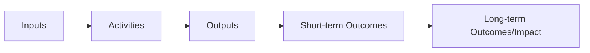

## Program Evaluation

### Overview

Program evaluation is the systematic application of research methods to assess the design, implementation, and outcomes of organizational interventions, initiatives, and programs. Within organizational psychology and consulting practice, program evaluation provides the empirical basis for determining whether interventions (training programs, change initiatives, wellness programs, leadership development efforts) achieve their intended effects, and supports evidence-based decisions about continuation, modification, or discontinuation of organizational investments.

### Purposes of Program Evaluation

| Evaluation Type | Purpose | Timing |
| --- | --- | --- |
| Formative evaluation | Improve program design during development/early implementation | Before and during rollout |
| Process/implementation evaluation | Assess whether the program is being delivered as intended | During implementation |
| Summative/outcome evaluation | Determine whether the program achieved intended outcomes | After completion or at defined intervals |
| Impact evaluation | Assess broader, longer-term, or causal effects attributable to the program | Post-implementation, often longitudinal |
| Economic evaluation | Assess cost-effectiveness or return on investment | Typically alongside outcome/impact evaluation |

### Foundational Evaluation Models

#### Kirkpatrick's Four-Level Training Evaluation Model

The most widely applied framework specifically for training and development program evaluation:

| Level | Focus | Example Measure |
| --- | --- | --- |
| 1. Reaction | Participant satisfaction with the program | Post-training satisfaction survey |
| 2. Learning | Knowledge/skill acquisition | Pre/post knowledge assessment |
| 3. Behavior | On-the-job behavior change | Manager or 360-degree behavior ratings |
| 4. Results | Organizational outcome impact | Productivity, quality, financial metrics |

**[Inference]** While Kirkpatrick's model remains the dominant framework in training evaluation practice due to its intuitive structure, it has been critiqued in the evaluation literature for implying a simple causal chain (reaction causes learning causes behavior causes results) that empirical research does not consistently support — reaction scores, in particular, are often weakly correlated with learning or downstream behavior change, meaning satisfaction data alone provides limited evidence of program effectiveness.

#### Phillips' ROI Methodology (Extension of Kirkpatrick)

Adds a fifth level to Kirkpatrick's model — **Return on Investment (ROI)** — explicitly monetizing program benefits and comparing them against program costs:

$$\text{ROI} (\%) = \frac{\text{Net Program Benefits}}{\text{Program Costs}} \times 100$$

This extension addresses a common limitation of Level 4 (Results) evaluation by requiring explicit isolation of the program's effect from other contributing factors before monetization, a methodologically demanding step often glossed over in practice.

#### CIPP Model (Context, Input, Process, Product)

A comprehensive evaluation model examining four components across the full program lifecycle:

- **Context evaluation** – assessing needs, goals, and the environment the program operates within (often conducted pre-program, informing design)
- **Input evaluation** – assessing program design, resource allocation, and alternative approaches considered
- **Process evaluation** – assessing actual implementation fidelity against intended design
- **Product evaluation** – assessing outcomes, both intended and unintended

The CIPP model's distinguishing feature is its explicit inclusion of context and input evaluation phases, extending assessment upstream of implementation rather than focusing solely on post-hoc outcomes.

#### Logic Models

A visual/conceptual framework mapping the hypothesized causal chain from program resources through to long-term outcomes, commonly used to structure evaluation design and identify appropriate measurement points at each stage:

Logic models are particularly valuable for clarifying evaluation scope early in program design, distinguishing between outputs (what the program directly produces, e.g., "200 employees trained") and outcomes (the resulting change the program aims to produce, e.g., "improved leadership behavior").

### Diagram: Program Evaluation Lifecycle Integration (svg_diagram)

<svg xmlns="http://www.w3.org/2000/svg" viewBox="0 0 780 280">
<text x="390" y="26" font-size="16" font-weight="bold" text-anchor="middle" fill="#1a1a2e">Program Evaluation Lifecycle Integration (svg_diagram)</text>
<rect x="20" y="80" width="160" height="55" rx="8" fill="#264653" />
<text x="100" y="112" font-size="11" text-anchor="middle" fill="white">Context/Needs (CIPP)</text>
<rect x="220" y="80" width="160" height="55" rx="8" fill="#2a9d8f" />
<text x="300" y="112" font-size="11" text-anchor="middle" fill="white">Design/Input (CIPP)</text>
<rect x="420" y="80" width="160" height="55" rx="8" fill="#e9c46a" />
<text x="500" y="105" font-size="11" text-anchor="middle" fill="#333">Process/Implementation</text>
<text x="500" y="122" font-size="11" text-anchor="middle" fill="#333">(Kirkpatrick L1-2)</text>
<rect x="620" y="80" width="140" height="55" rx="8" fill="#e76f51" />
<text x="690" y="105" font-size="11" text-anchor="middle" fill="white">Product/Outcomes</text>
<text x="690" y="122" font-size="11" text-anchor="middle" fill="white">(Kirkpatrick L3-4/ROI)</text>
<line x1="180" y1="107" x2="220" y2="107" stroke="#333" stroke-width="2" />
<line x1="380" y1="107" x2="420" y2="107" stroke="#333" stroke-width="2" />
<line x1="580" y1="107" x2="620" y2="107" stroke="#333" stroke-width="2" />
</svg>

### Evaluation Design and Methodological Rigor

#### Experimental and Quasi-Experimental Designs

| Design | Description | Causal Inference Strength |
| --- | --- | --- |
| Randomized controlled trial (RCT) | Random assignment to treatment/control groups | Strongest |
| Quasi-experimental (non-equivalent control group) | Comparison group without random assignment | Moderate |
| Pre-post single group | Comparison of same group before/after, no control | Weak (confounds with time-based changes) |
| Post-only, no control | Single measurement after program, no baseline | Weakest |

$$\text{Treatment Effect (RCT)} = \bar{Y}_{\text{treatment}} - \bar{Y}_{\text{control}}$$

Randomized designs remain the methodological gold standard for causal attribution but are frequently impractical in organizational contexts due to ethical, logistical, and political constraints on withholding interventions from a control group; quasi-experimental designs represent a common pragmatic compromise.

#### Threats to Internal Validity

Common validity threats particularly relevant to organizational program evaluation include:

- **History** – external events coinciding with the program period that independently affect outcomes
- **Maturation** – natural change in participants over time independent of the program
- **Selection bias** – non-random differences between treatment and comparison groups
- **Regression to the mean** – extreme initial scores naturally moving toward average on remeasurement, mimicking apparent program effect
- **Attrition/mortality** – differential dropout between groups biasing comparison

#### Isolating Program Effects

Techniques for attempting to isolate a program's unique contribution from other simultaneous organizational influences include:

- Control or comparison groups (where feasible)
- Trend line analysis (extrapolating pre-program trends forward for comparison against actual post-program results)
- Participant estimation (asking participants to self-estimate the percentage of improvement attributable to the specific program, used pragmatically in methodologies like Phillips' ROI approach despite inherent self-report limitations)

### Mixed-Methods Approaches in Program Evaluation

Effective program evaluation typically triangulates quantitative outcome data (pre/post metrics, control group comparisons) with qualitative data (participant interviews, open-ended feedback) to both establish whether change occurred and understand why or how it occurred, supporting more actionable interpretation than quantitative data alone.

### Practical and Organizational Considerations

#### Evaluation Feasibility Constraints

Real-world program evaluation frequently operates under significant constraints — limited budget for rigorous measurement, political pressure for positive findings, inability to randomize due to fairness or logistical concerns, and short organizational attention spans favoring rapid results over methodologically ideal longer-term follow-up.

#### Stakeholder Engagement in Evaluation Design

Involving key stakeholders (program sponsors, participants, affected business units) in defining evaluation questions and success criteria early increases both the relevance and eventual organizational uptake of evaluation findings, consistent with utilization-focused evaluation approaches emphasizing that evaluations are only valuable if their findings are actually used.

#### Reporting and Communicating Evaluation Findings

Effective evaluation reporting balances methodological rigor with accessibility for non-technical stakeholders, typically requiring translation of statistical findings into clear, decision-relevant narrative alongside supporting technical detail for those requiring it.

**Key Points**

- Reaction-level (satisfaction) data alone provides weak evidence of program effectiveness; evaluation design should extend to learning, behavior, and results levels where feasible.
- Isolating a program's unique causal contribution from confounding organizational factors is methodologically demanding; evaluators should be transparent about the strength of causal claims their specific design actually supports.
- Evaluation design should be planned during program design (ideally using a logic model), not retrofitted after implementation, to ensure appropriate baseline data and comparison groups are available.

### Practical Example

An organization evaluates a newly implemented manager coaching skills training program.

1. **Logic model development:** Prior to rollout, a logic model is created linking training inputs (workshop content, coaching practice sessions) to outputs (managers trained) to short-term outcomes (increased coaching behavior frequency) to long-term outcomes (improved direct report engagement and performance).
2. **Baseline data collection:** Pre-training measures are collected on coaching behavior frequency (via direct report survey) and team engagement scores, establishing a baseline for later comparison.
3. **Quasi-experimental design:** Given randomization infeasibility, a comparison group of managers scheduled for training in a later cohort serves as a non-equivalent control group.
4. **Multi-level evaluation:** Level 1 (reaction) satisfaction surveys are collected immediately post-training; Level 2 (learning) is assessed via a coaching-scenario knowledge assessment; Level 3 (behavior) is assessed via direct report surveys at 3 months; Level 4 (results) is assessed via team engagement and performance metrics at 6 months, compared against the delayed-cohort control group.
5. **Mixed-methods interpretation:** Quantitative findings showing modest engagement improvement are supplemented with participant interviews revealing that coaching behavior change was strongest among managers who also received post-training peer accountability check-ins, informing program redesign recommendations.

### Common Pitfalls

- Relying solely on Level 1 (satisfaction) data as evidence of program success, given its weak association with actual behavior or results change
- Failing to establish baseline measurement before program implementation, precluding meaningful pre-post comparison
- Overstating causal claims from pre-post designs lacking a comparison group, ignoring plausible alternative explanations (history, maturation)
- Designing evaluation as an afterthought rather than integrating it into program design from the outset via a logic model
- Neglecting stakeholder involvement in defining evaluation success criteria, producing findings that are methodologically sound but organizationally underutilized

### Related Topics

- Kirkpatrick's Four-Level Training Evaluation Model
- Return on Investment (ROI) Methodology
- Logic Models and Theory of Change
- Quasi-Experimental Research Design
- Training Needs Analysis and Design
- Organizational Diagnosis Frameworks in Practice
- Case Study Analysis Methods
- Evidence-Based Management Practice
- Utilization-Focused Evaluation
- Change Management and Intervention Design