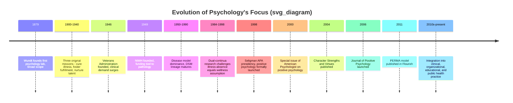

## From Pathology-Focused Psychology to the Science of Flourishing

### Historical Overview

Psychology as a formal discipline emerged in the late 19th century with an initially broad mandate. Wilhelm Wundt's founding of the first experimental psychology laboratory in Leipzig in 1879 encompassed the study of perception, cognition, and consciousness generally, not exclusively dysfunction. Early 20th-century psychology in the United States pursued three explicit missions: curing mental illness, helping all people live more fulfilling lives, and identifying and nurturing high talent.

The trajectory shifted dramatically following World War II. Two structural forces reoriented the field almost entirely toward pathology:

- **Founding of the Veterans Administration (1946)**: Returning veterans with combat trauma created enormous clinical demand, and psychologists found employment prospects tied to treating mental illness.
- **Establishment of the National Institute of Mental Health (1949)**: Federal funding became available specifically for research into diagnosis, treatment, and etiology of mental disorders, incentivizing academic psychology to align with a disease model.

By the latter half of the 20th century, psychology had become, in practice, largely a science of pathology. The prevailing conceptual framework treated mental health as merely the absence of mental illness rather than as a positive state with its own independent structure.

### The Disease Model and Its Limitations

The disease model that dominated mid-century psychology borrowed heavily from medicine's approach to physical illness: identify symptoms, classify disorders, determine causes, and develop treatments. This produced genuine advances, most notably the *Diagnostic and Statistical Manual of Mental Disorders* (DSM) lineage and empirically validated treatments for depression, anxiety, and other conditions.

However, the model carried an implicit assumption worth making explicit: that the absence of negative symptoms is equivalent to the presence of wellbeing. Research beginning in the 1980s and accelerating through the 1990s challenged this assumption directly.

**Key Points**

- Absence of mental illness and presence of mental health are not the same continuum; they behave as related but separable dimensions.
- This finding is associated with what became known as the **dual-continua model** of mental health (Corey Keyes and others), distinguishing psychopathology (present/absent) from flourishing/languishing (a separate axis).
- A person can be free of diagnosable disorder yet still be "languishing" — reporting low life satisfaction, limited purpose, and stagnation.
- Conversely, some individuals with a diagnosed condition can report meaningful degrees of flourishing in other life domains. [Inference: the degree of co-occurrence and its clinical implications remain an active empirical question and vary by population and disorder.]

### The Dual-Continua Model (Illustration)

<svg xmlns="http://www.w3.org/2000/svg" viewBox="0 0 640 420" font-family="Helvetica, Arial, sans-serif">
<text x="320" y="30" font-size="18" font-weight="bold" text-anchor="middle" fill="#1a1a2e">Dual-Continua Model of Mental Health (svg_diagram)</text>

<line x1="100" y1="360" x2="580" y2="360" stroke="#333" stroke-width="2" />
<line x1="100" y1="360" x2="100" y2="60" stroke="#333" stroke-width="2" />

<text x="340" y="395" font-size="14" text-anchor="middle" fill="#333">Mental Illness Continuum (Low → High Symptoms)</text>

<text x="40" y="210" font-size="14" text-anchor="middle" fill="#333" transform="rotate(-90 40 210)">Mental Health Continuum (Languishing → Flourishing)</text>

<polygon points="580,360 570,355 570,365" fill="#333" />
<polygon points="100,60 95,70 105,70" fill="#333" />

<line x1="340" y1="60" x2="340" y2="360" stroke="#999" stroke-dasharray="4,4" />
<line x1="100" y1="210" x2="580" y2="210" stroke="#999" stroke-dasharray="4,4" />

<rect x="110" y="70" width="220" height="130" fill="#c8e6c9" opacity="0.6" rx="8" />
<text x="220" y="130" font-size="14" font-weight="bold" text-anchor="middle" fill="#1b5e20">Complete Mental Health</text>
<text x="220" y="150" font-size="12" text-anchor="middle" fill="#1b5e20">Flourishing, low symptoms</text>
<rect x="350" y="70" width="220" height="130" fill="#fff9c4" opacity="0.7" rx="8" />
<text x="460" y="130" font-size="14" font-weight="bold" text-anchor="middle" fill="#795548">Struggling but Thriving</text>
<text x="460" y="150" font-size="12" text-anchor="middle" fill="#795548">Flourishing despite symptoms</text>
<rect x="110" y="220" width="220" height="130" fill="#ffe0b2" opacity="0.7" rx="8" />
<text x="220" y="280" font-size="14" font-weight="bold" text-anchor="middle" fill="#e65100">Languishing</text>
<text x="220" y="300" font-size="12" text-anchor="middle" fill="#e65100">Low symptoms, low wellbeing</text>
<rect x="350" y="220" width="220" height="130" fill="#ffcdd2" opacity="0.7" rx="8" />
<text x="460" y="280" font-size="14" font-weight="bold" text-anchor="middle" fill="#b71c1c">Complete Mental Illness</text>
<text x="460" y="300" font-size="12" text-anchor="middle" fill="#b71c1c">High symptoms, low wellbeing</text>
</svg>

### The Formal Founding of Positive Psychology

The discipline's reorientation is conventionally dated to **1998**, when Martin Seligman, in his presidential address to the American Psychological Association (APA), designated positive psychology as a central theme for his term. Seligman argued that psychology had become disproportionately concerned with pathology and that a scientifically rigorous study of human strengths, virtues, and optimal functioning was overdue.

**Key Points**

- Seligman's stated goal was not to replace clinical psychology but to complement it: to study what makes life worth living alongside what makes life go wrong.
- The founding was accompanied by academic infrastructure: dedicated conferences (e.g., the Akumal meetings), the *Journal of Positive Psychology* (launched 2006), and university programs, most notably the University of Pennsylvania's Master of Applied Positive Psychology (MAPP), the first program of its kind.
- Early collaborators included Mihaly Csikszentmihalyi (known for flow theory), Christopher Peterson, Ed Diener (subjective wellbeing research), and Barbara Fredrickson (broaden-and-build theory).
- A landmark early publication, Peterson and Seligman's *Character Strengths and Virtues* (2004), was explicitly framed as a "manual of the sanities" — a deliberate counterpart to the DSM's manual of disorders.

### Defining "Flourishing"

Flourishing is the field's technical term for the highest level of human functioning across psychological, emotional, and social dimensions. It is not a single construct but a composite one, and different researchers have proposed overlapping but non-identical operationalizations.

- **Diener's Flourishing Scale**: measures perceived success in areas such as relationships, purpose, and self-esteem.
- **Keyes's model**: flourishing requires high emotional wellbeing plus high psychological and social wellbeing (positive functioning across multiple life domains), not merely positive affect.
- **Seligman's PERMA model** (2011, in *Flourish*): defines wellbeing as a construct with five measurable elements — Positive emotion, Engagement, Relationships, Meaning, and Accomplishment — later sometimes extended with Health as "PERMA-H."

$$\text{Flourishing} \neq \text{Absence of Illness}$$

This is arguably the single most important conceptual claim underlying the entire field's founding: wellbeing has its own architecture, measurable and buildable independent of pathology reduction.

### Comparative Timeline

### Core Conceptual Shift: From Deficit to Asset Framing

| Dimension | Pathology-Focused Model | Flourishing-Focused Model |
| --- | --- | --- |
| Core question | What is wrong and how do we fix it? | What is right and how do we build on it? |
| Unit of measurement | Symptom severity, diagnostic criteria | Wellbeing, strengths, life satisfaction |
| Target population | Clinical/symptomatic individuals | All individuals, including asymptomatic |
| Intervention goal | Return to baseline functioning ("zero point") | Move beyond baseline toward optimal functioning |
| Key metric example | DSM diagnostic thresholds | PERMA scores, flourishing scales |
| Underlying assumption | Health = absence of disease | Health = presence of positive function (separate axis) |

### Example: Applying the Distinction in Practice

Consider two individuals seen by a mental health professional:

- **Person A** reports no diagnosable anxiety or depressive symptoms but describes their days as monotonous, lacks close relationships, and cannot identify a sense of purpose. Under a pure disease model, Person A would be classified as "healthy" because no disorder is present. Under the flourishing framework, Person A would be assessed as **languishing** and would be a candidate for wellbeing-building interventions (e.g., strengths identification, gratitude practices, purpose exploration).
- **Person B** has a diagnosed mood disorder currently in treatment but maintains strong relationships, engages meaningfully with work, and reports a functioning sense of purpose. Under the dual-continua model, Person B could simultaneously be receiving clinical treatment for illness *and* be coached toward higher flourishing on the separate wellbeing axis — these efforts are not mutually exclusive.

### Common Criticisms and Counterarguments

- **Criticism**: Positive psychology risks being unscientific or promoting shallow "happiology."

  **Response**: Proponents emphasize adherence to empirical methodology (randomized controlled trials, psychometric validation, replication), distinguishing the field from earlier "positive thinking" self-help traditions that lacked rigorous evidence.
- **Criticism**: Overemphasis on individual responsibility for wellbeing may neglect systemic, socioeconomic, or structural factors affecting flourishing.

  **Response**: This is a genuinely contested area; many contemporary positive psychology researchers explicitly incorporate social determinants and community-level interventions rather than framing flourishing as purely a matter of individual choice. [Speculation: the degree to which the field has fully resolved this tension is a matter of ongoing scholarly debate.]
- **Criticism**: Early positive psychology may have understated the value of negative emotions.

  **Response**: Later work (e.g., research on post-traumatic growth, and the recognized adaptive functions of emotions like grief or fear) has been incorporated into the field, moving away from a simplistic "positive emotions good, negative emotions bad" framing toward a more integrated view. This is sometimes referred to as **"second wave" positive psychology**, which explicitly addresses the dialectical and context-dependent nature of wellbeing.

### Conclusion

The shift from pathology-focused psychology to the science of flourishing represents a structural rebalancing rather than a rejection of clinical psychology. It rests on the empirically supported claim that mental illness and mental health are related but distinct dimensions, meaning the reduction of suffering and the cultivation of positive function require separate — though potentially complementary — theories, measurement tools, and interventions. The 1998 formal founding by Seligman consolidated decades of scattered prior work into a coordinated research program with its own journals, degree programs, and validated instruments, while later "second wave" developments have worked to integrate rather than oppose the negative and positive dimensions of human experience.

**Related Topics**

- Martin Seligman's PERMA model in depth
- The dual-continua model of mental health (Corey Keyes)
- Character strengths and virtues classification (VIA Classification)
- Subjective wellbeing research (Ed Diener)
- Second-wave positive psychology and the dialectical view of emotion
- Post-traumatic growth theory
- Flow theory (Mihaly Csikszentmihalyi)
- Measurement instruments: Flourishing Scale, Satisfaction with Life Scale, PERMA-Profiler