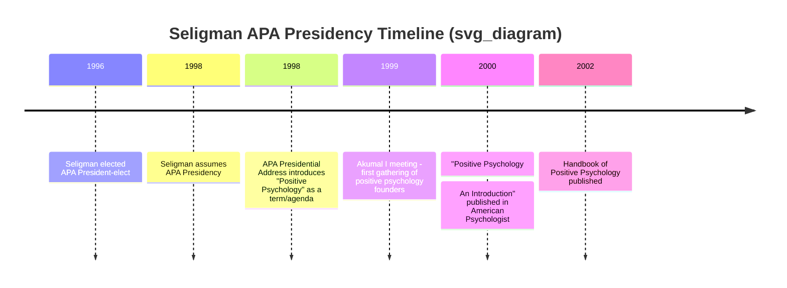
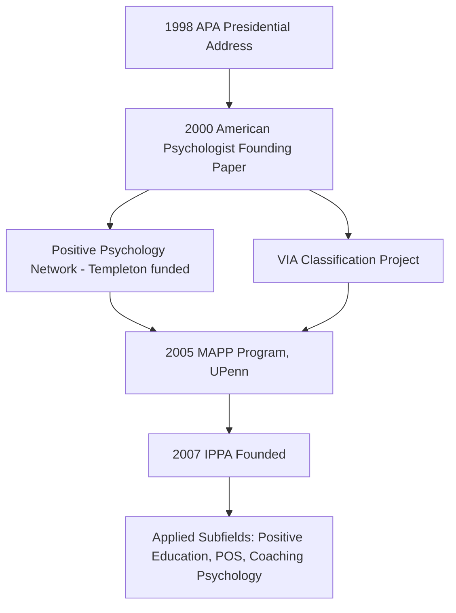

## Martin Seligman's 1998 APA Presidency and the Founding of the Field

### Historical Context Prior to 1998

**Key Points**

- American psychology throughout the 20th century was overwhelmingly oriented toward pathology, deficit, and dysfunction.
- Seligman's own earlier research (learned helplessness, 1967 onward) was itself part of this deficit-focused tradition before his conceptual pivot.
- Post-WWII funding structures (NIMH grants, clinical training pipelines) institutionally rewarded disease-model research over models of thriving.

Three historical forces are commonly cited as shaping psychology's pre-1998 orientation:

1. **The disease model's dominance** — clinical psychology's growth after WWII was tied to treating veterans, cementing pathology as the field's center of gravity.
2. **The "three missions" thesis** — Seligman argued that pre-WWII psychology had three goals: curing mental illness, making the lives of all people more fulfilling, and identifying and nurturing high talent. He contended the latter two were largely abandoned after the war. [Inference — this is Seligman's own historical framing, not an independently verified account of the field's priorities]
3. **Measurement asymmetry** — instruments for diagnosing disorders (DSM-based) vastly outnumbered validated instruments for measuring wellbeing, virtue, or flourishing.

### The 1998 APA Presidency

**Key Points**

- Seligman was elected President of the American Psychological Association (APA) for the 1998 term, reportedly receiving one of the largest vote counts in APA election history at that time. [Unverified — specific vote-count superlatives vary across secondary sources and are difficult to confirm from primary APA records]
- He used the presidency as an institutional platform to formally redirect a portion of the field's research agenda.
- His August 1998 APA presidential address is widely treated as the symbolic founding moment of positive psychology as a named subfield.

**Sequence of events:**

In his presidential address and subsequent writings, Seligman proposed that psychology had become too narrowly a "victimology" and called for equal scientific attention to strengths, virtues, and what makes life worth living. [Inference — paraphrase of Seligman's stated rationale, not a verbatim quotation]

### Defining "Positive Psychology" as a Term and Agenda

Seligman did not claim to have invented the term itself — earlier uses of "positive psychology" as a phrase exist, notably in Abraham Maslow's writing decades prior. What Seligman is credited with is:

- Coining it as the name of an organized, fundable, institutionally backed research program
- Giving it a tripartite structural definition that persists in the literature today

**Seligman's original tripartite framework (as popularized post-1998):**

| Level | Focus | Example Constructs |
| --- | --- | --- |
| Subjective level | Positive subjective experiences | Wellbeing, contentment, satisfaction (past); flow, joy (present); hope, optimism (future) |
| Individual level | Positive individual traits | Capacity for love, courage, perseverance, forgiveness, originality, wisdom |
| Group/societal level | Positive institutions | Civic virtues, responsibility, altruism, tolerance, work ethic |

### Institutional Founding Actions

**Key Points**

- Seligman convened a small group of scholars — most notably Mihaly Csikszentmihalyi, Ray Fowler, and others — to formalize the field's research agenda.
- The 1999 "Akumal I" meeting in Akumal, Mexico, is frequently cited as the informal founding retreat where core figures outlined a shared research program. [Unverified — meeting details are drawn from secondary/retrospective accounts rather than a formal published proceedings]
- Seligman used APA presidential discretionary funds and his convening authority to seed early positive psychology research initiatives, including what became known informally as the "Positive Psychology Network," funded partly through the Templeton Foundation.

**Key early collaborators and their contributions:**

- **Mihaly Csikszentmihalyi** — brought the existing construct of *flow* (optimal experience) into the positive psychology framework, giving the new field an established empirical anchor.
- **Christopher Peterson** — later co-led the Values in Action (VIA) classification project, an attempt to build a "manual of the sanities" as a counterpart to the DSM.
- **Ed Diener** — contributed decades of prior subjective well-being (SWB) research, which positive psychology absorbed as foundational.

### The Foundational 2000 Publication

The January 2000 special issue of *American Psychologist*, titled "Positive Psychology: An Introduction" (Seligman & Csikszentmihalyi), is generally treated as the field's canonical founding document in the peer-reviewed literature, distinct from the presidential address itself.

**Structure of the founding argument in that paper:**

1. Psychology's historical imbalance toward pathology is identified as a problem of scientific completeness, not merely of clinical practice.
2. A call is made for rigorous, empirical (not merely motivational or self-help) study of positive human functioning.
3. The three-level framework (subjective, individual, group) is formally proposed as the field's organizing structure.

### Distinguishing Positive Psychology from Prior "Positive Thinking" Movements

**Key Points**

- Seligman explicitly sought to separate positive psychology from self-help and "positive thinking" traditions (e.g., Norman Vincent Peale) by insisting on empirical methodology, falsifiability, and peer review.
- This distinction became a recurring defensive rhetorical move in early positive psychology writing, since critics frequently conflated the two.

| Dimension | Positive Thinking Movements | Positive Psychology (Seligman's framing) |
| --- | --- | --- |
| Epistemic basis | Anecdote, motivational rhetoric | Peer-reviewed empirical research |
| Falsifiability | Not typically testable | Explicit hypothesis testing |
| Institutional home | Self-help publishing, seminars | Academic psychology departments, APA |
| Founding figures | Peale, Carnegie, etc. | Seligman, Csikszentmihalyi, Diener, Peterson |

### Criticisms and Contested Aspects of the Founding Narrative

- Some historians of psychology note that humanistic psychology (Maslow, Rogers, 1950s–60s) had already pursued similar goals — the study of self-actualization and human potential — decades before 1998, raising questions about how much of positive psychology's founding was genuinely novel versus a rebranding with more rigorous methodology. [Inference — this is a recurring critique found in academic commentary, not a settled historical judgment]
- Critics have also argued the "psychology is 3x more focused on pathology than positive states" statistic, sometimes attributed to early positive psychology rhetoric, is difficult to verify against a consistent methodology. [Unverified]

### Long-Term Institutional Legacy of the 1998 Presidency

**Key Points**

- Founding of the International Positive Psychology Association (IPPA) in 2007
- Establishment of the Master of Applied Positive Psychology (MAPP) program at the University of Pennsylvania (2005), the first program of its kind
- Proliferation of positive psychology research centers, journals (e.g., *Journal of Positive Psychology*, launched 2006), and applied fields (positive education, positive organizational scholarship, coaching psychology)

**Next Steps**

- The tripartite model of pleasant/engaged/meaningful life (later expanded into PERMA)
- Christopher Peterson and Martin Seligman's VIA Classification of Character Strengths and Virtues
- Mihaly Csikszentmihalyi's concept of Flow
- The distinction between hedonic and eudaimonic wellbeing traditions
- Criticisms of positive psychology's early WEIRD-sample bias and later replication concerns