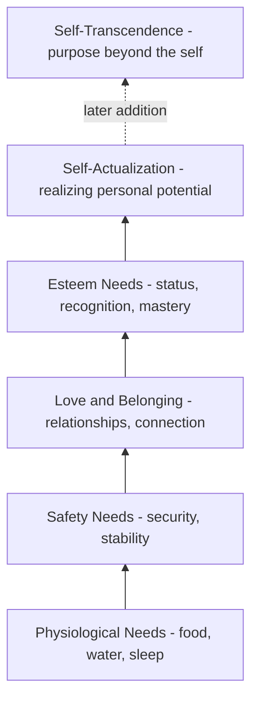
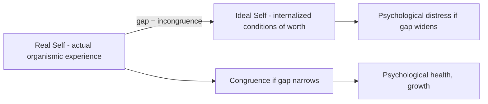

## Humanistic Psychology Precursors: Maslow, Rogers, and Self-Actualization

### Historical Positioning: The "Third Force"

**Key Points**

- Humanistic psychology emerged in the 1950s–1960s as a deliberate reaction against the two dominant paradigms of the time: behaviorism and psychoanalysis.
- It is commonly labeled the "Third Force" in psychology, positioned against behaviorism's mechanistic determinism and psychoanalysis's pathology-centered determinism.
- Abraham Maslow and Carl Rogers are the two figures most consistently credited as its principal architects.

| Force | Core Assumption | Primary Unit of Analysis | Key Figures |
| --- | --- | --- | --- |
| First Force (Behaviorism) | Behavior is shaped by conditioning and environment | Observable stimulus-response | Watson, Skinner |
| Second Force (Psychoanalysis) | Behavior is driven by unconscious conflict | Intrapsychic drives, defense mechanisms | Freud, later ego psychologists |
| Third Force (Humanistic) | Behavior is driven by innate growth tendency and self-determination | Subjective experience, potential | Maslow, Rogers, Rollo May |

Humanistic psychology's core claim was that both prior forces treated humans as either machines to be conditioned or patients to be diagnosed, and neither adequately accounted for agency, meaning-making, or growth toward positive potential. [Inference — this is the standard historiographical framing used in textbooks, not a direct quotation from a single founding document]

### Abraham Maslow: Hierarchy of Needs

**Key Points**

- Maslow proposed a motivational theory organizing human needs into an ascending hierarchy, most famously depicted as a pyramid (a visual convention Maslow himself did not use in his original 1943 paper — the pyramid diagram was a later popularization). [Unverified — widely repeated claim in secondary literature about the pyramid's origin, difficult to source to a single definitive account]
- The theory was first published in "A Theory of Human Motivation" (Psychological Review, 1943).
- Lower-level (deficiency) needs are theorized to require substantial satisfaction before higher-level (growth) needs become motivationally salient.

**The five/eight-level hierarchy:**

- Maslow later added self-transcendence as a need beyond self-actualization in his later writings (particularly in work published posthumously), reflecting his growing interest in peak experiences and spirituality. [Inference — the exact placement and Maslow's final intended structure is debated among scholars, as this revision was less systematically formalized than the original hierarchy]

**Deficiency needs vs. growth needs:**

| Category | Needs Included | Motivational Dynamic |
| --- | --- | --- |
| Deficiency (D-needs) | Physiological, safety, love/belonging, esteem | Motivate via absence — reduce tension when satisfied |
| Growth (B-needs / "Being" needs) | Self-actualization, self-transcendence | Motivate via presence — increase engagement as pursued, do not "run out" |

### Self-Actualization: Maslow's Central Construct

**Key Points**

- Self-actualization is defined as the full realization of one's potential, talents, and capabilities.
- Maslow studied self-actualization inductively, by biographically analyzing individuals he considered exemplary (including Abraham Lincoln, Eleanor Roosevelt, and Albert Einstein), rather than through controlled experimentation. [Inference — described as a methodological characterization common in critiques of Maslow's approach]
- This method has been criticized for selection bias, since Maslow chose subjects he already believed were self-actualized, which limits falsifiability.

**Characteristics Maslow attributed to self-actualizing individuals:**

- Accurate perception of reality
- Acceptance of self, others, and nature
- Spontaneity and naturalness
- Problem-centering rather than self-centering
- Need for privacy and solitude
- Autonomy and independence from culture
- Continued freshness of appreciation
- Frequency of peak experiences
- Deep interpersonal relationships (often few but intense)
- Democratic character structure
- Strong ethical sense
- Philosophical, non-hostile sense of humor
- Creativity
- Resistance to enculturation

**Peak experiences** — a related Maslow construct describing transient moments of intense joy, unity, or transcendence, often reported during self-actualization-adjacent activities (creative work, nature, love, aesthetic experience). Peak experiences are theorized as brief glimpses of self-actualized functioning even in individuals not otherwise chronically self-actualized. [Inference — Maslow's own theoretical framing]

### Carl Rogers: Person-Centered Theory

**Key Points**

- Rogers developed **client-centered therapy** (later renamed **person-centered therapy**), which became foundational to humanistic clinical practice.
- Rogers proposed that all organisms possess an innate **actualizing tendency** — a drive toward growth, autonomy, and fulfillment of inherent potential, conceptually parallel to but independently developed from Maslow's self-actualization.
- Rogers's theory is more explicitly relational/therapeutic than Maslow's, focusing on the conditions under which growth occurs rather than cataloging traits of already-actualized individuals.

**Rogers's "Core Conditions" for therapeutic growth:**

| Condition | Definition | Function |
| --- | --- | --- |
| Unconditional positive regard | Accepting the client without judgment or conditions | Removes threat, allows authentic self-exploration |
| Empathic understanding | Accurately sensing the client's internal frame of reference | Validates subjective experience |
| Congruence (genuineness) | Therapist's authentic alignment between inner experience and outward expression | Models integrated selfhood |

**The Self-Concept and Incongruence:**

Rogers distinguished between:

- **Real self** — one's actual organismic experience
- **Ideal self** — the self one believes one should be, often shaped by external "conditions of worth" imposed by others (parents, society)

**Incongruence** arises when the gap between real and ideal self widens, theorized by Rogers as the root of psychological distress.

### Comparing Maslow and Rogers

| Dimension | Maslow | Rogers |
| --- | --- | --- |
| Primary domain | Motivation theory, personality | Clinical/therapeutic practice |
| Core construct | Self-actualization (hierarchy-dependent) | Actualizing tendency (present from birth, not hierarchy-gated) |
| Methodology | Biographical/inductive case study of exemplars | Clinical case observation, later some empirical (Q-sort) validation |
| View of pathology | Failure to progress up the hierarchy | Incongruence between real and ideal self |
| Legacy institution | Association for Humanistic Psychology (co-founded 1961) | Person-Centered Approach institutes worldwide |

### Direct Influence on Positive Psychology's Founding

**Key Points**

- Abraham Maslow is credited by some historians with coining the phrase "positive psychology" itself, in the final chapter of his 1954 book *Motivation and Personality*, decades before Seligman's 1998 usage. [Unverified — widely cited claim in secondary/tertiary sources; the exact phrase's first documented use is contested]
- Seligman and colleagues explicitly acknowledged humanistic psychology's prior emphasis on growth and potential but argued it had failed to establish a rigorous empirical research program, remaining largely theoretical/clinical rather than experimentally testable.
- This critique became a recurring justification for positive psychology's insistence on empirical methodology as its key point of differentiation from humanistic psychology.

**Point of continuity vs. rupture:**

| Aspect | Humanistic Psychology | Positive Psychology |
| --- | --- | --- |
| Interest in growth/potential | Yes — central | Yes — central |
| Methodological approach | Largely theoretical, clinical case-based, phenomenological | Explicitly empirical, quantitative, hypothesis-driven |
| Institutional backing | Association for Humanistic Psychology | APA-endorsed, Templeton-funded networks |
| Falsifiability emphasis | Limited | Explicit priority |

### Criticisms of the Humanistic Precursor Tradition

- **Lack of falsifiability**: Concepts like self-actualization and the actualizing tendency were difficult to operationalize for empirical testing during the mid-20th century, limiting their scientific uptake at the time. [Inference — standard critique found across personality psychology textbooks]
- **Cultural bias**: Maslow's exemplars and the individualist framing of self-actualization have been critiqued as reflecting Western, particularly American, cultural values about autonomy and individual achievement, with limited cross-cultural validation in the original formulations. [Inference — a recurring critique in cross-cultural psychology literature]
- **Hierarchical rigidity**: Empirical tests of Maslow's strict sequential hierarchy (that lower needs must be substantially satisfied before higher ones motivate) have found mixed support, with some studies suggesting needs can be pursued in parallel or out of order. [Inference — reflects general findings summarized in motivation psychology literature; specific study citations would require further verification]

**Next Steps**

- Rollo May and existential psychology's contribution to the Third Force
- The Association for Humanistic Psychology (1961) and its institutional relationship to later positive psychology bodies
- Mihaly Csikszentmihalyi's Flow theory as a bridge between humanistic and positive psychology traditions
- Critiques of positive psychology's empirical rigor relative to its humanistic precursors
- Cross-cultural validity of self-actualization and Western individualist assumptions in wellbeing science