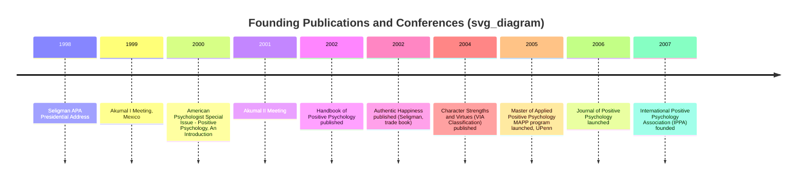
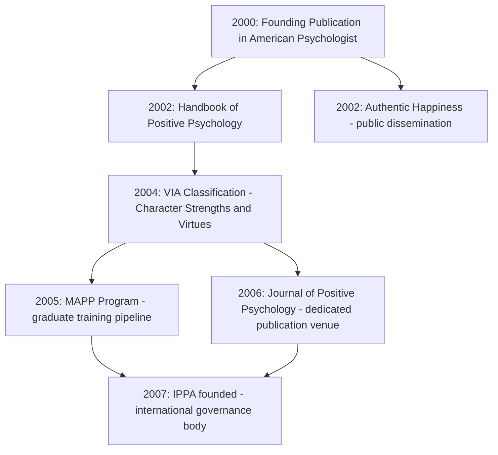

## Landmark Publications and Founding Conferences

### Chronological Overview

**Key Points**

- The field's founding is documented through a traceable sequence of publications and small-group conferences spanning roughly 1998–2005.
- Unlike many scientific fields, positive psychology's founding artifacts are unusually well-documented because they were deliberately created as institution-building efforts, not organic accumulations of independent research.

### The Founding Conferences

**Akumal I (1999)**

**Key Points**

- Held in Akumal, a coastal town in Quintana Roo, Mexico.
- Widely cited as the first formal gathering convened specifically to define positive psychology's research agenda, distinct from Seligman's 1998 presidential address which was a solo institutional announcement.
- Attendees are generally described as a small invited group of psychologists Seligman recruited to help build the field's theoretical and empirical foundations. [Unverified — the complete attendee list and formal agenda are not consistently documented in primary published sources; most accounts are retrospective]

Commonly cited attendees/contributors associated with this early network include Mihaly Csikszentmihalyi, Christopher Peterson, Ed Diener, Barbara Fredrickson, and Ray Fowler, though exact attendance at Akumal I specifically versus later meetings varies across secondary accounts. [Unverified]

**Akumal II (2001)**

- A follow-up meeting, generally described as expanding the network and refining the classification project that would become the VIA Classification of Strengths.
- Functioned as a continuation of the working-group model established at Akumal I, allowing incremental development of shared constructs and measurement priorities. [Inference — based on the pattern typical of such recurring small-group scientific planning meetings]

**Function of the Akumal meetings within the field's founding:**

| Meeting | Approximate Focus | Output Trajectory |
| --- | --- | --- |
| Akumal I (1999) | Establishing shared vocabulary, core research priorities | Seeded the 2000 American Psychologist special issue |
| Akumal II (2001) | Refining classification of strengths and virtues | Seeded the 2004 VIA Classification (Peterson & Seligman) |

### Landmark Publication 1: The 2000 American Psychologist Special Issue

**Key Points**

- Full citation context: Seligman, M. E. P., & Csikszentmihalyi, M. (2000). Positive psychology: An introduction. *American Psychologist*, 55(1), 5–14.
- This is treated as the field's canonical founding paper in the peer-reviewed literature — distinct from the 1998 presidential address, which was an institutional/rhetorical act rather than a peer-reviewed publication.
- The issue was a special themed issue, not a single article — it included multiple contributions from early collaborators, establishing positive psychology as a multi-author collaborative program rather than a single individual's research agenda.

**Core content of the introductory paper:**

1. Historical critique of psychology's post-WWII shift toward pathology
2. Proposal of the three-level organizing framework (subjective experience, individual traits, positive institutions)
3. Explicit call for empirical rigor to distinguish the field from prior self-help and positive-thinking traditions

### Landmark Publication 2: Handbook of Positive Psychology (2002)

**Key Points**

- Edited by C.R. Snyder and Shane J. Lopez.
- Functioned as the field's first comprehensive academic reference text, consolidating research areas into a single edited volume.
- Structurally significant because it demonstrated the field had accumulated enough distinct research programs (hope theory, optimism, flow, wisdom, emotional intelligence, resilience, etc.) to warrant a handbook-style synthesis only two years after the founding special issue.

**Illustrative structure (organizing categories used across positive psychology handbooks generally):**

| Section Type | Example Topics Covered |
| --- | --- |
| Emotion-focused | Positive emotions, subjective well-being, happiness |
| Cognition-focused | Optimism, hope, wisdom |
| Trait/virtue-focused | Character strengths, courage, forgiveness |
| Relational/social-focused | Close relationships, altruism, gratitude |
| Applied/interventions | Positive psychotherapy, coaching, education applications |

### Landmark Publication 3: Authentic Happiness (2002)

**Key Points**

- Written by Seligman as a trade (popular, non-academic) book rather than a peer-reviewed publication.
- Functioned as the field's primary public-facing introduction, translating the academic research agenda into an accessible format for general readers.
- Introduced Seligman's early "Authentic Happiness Theory," organized around three components: the Pleasant Life, the Good Life (engagement), and the Meaningful Life. [Inference — Seligman's own theoretical framing, later superseded]
- This model was later revised and expanded by Seligman himself into the PERMA model (2011, in *Flourish*), reflecting his own stated dissatisfaction with "happiness" as an adequately comprehensive construct. [Inference — Seligman has publicly discussed this revision as a deliberate theoretical evolution]

### Landmark Publication 4: Character Strengths and Virtues (2004)

**Key Points**

- Authored by Christopher Peterson and Martin Seligman.
- Explicitly designed as a positive counterpart to the DSM (Diagnostic and Statistical Manual of Mental Disorders), sometimes informally described by its authors as a "manual of the sanities."
- Proposed six core virtues, each operationalized through specific measurable character strengths (24 strengths total across the six virtues).

**The VIA (Values in Action) structure:**

| Virtue | Example Constituent Strengths |
| --- | --- |
| Wisdom and Knowledge | Creativity, curiosity, judgment, love of learning, perspective |
| Courage | Bravery, perseverance, honesty, zest |
| Humanity | Love, kindness, social intelligence |
| Justice | Teamwork, fairness, leadership |
| Temperance | Forgiveness, humility, prudence, self-regulation |
| Transcendence | Appreciation of beauty, gratitude, hope, humor, spirituality |

This publication is significant methodologically because it represented the field's first large-scale attempt at building a validated, cross-culturally tested measurement instrument (the VIA Inventory of Strengths), moving positive psychology beyond theory into standardized assessment.

### Institutional Consolidation: 2005–2007

**Key Points**

- **2005**: The University of Pennsylvania launched the Master of Applied Positive Psychology (MAPP) program, the first graduate-level program explicitly dedicated to the field, directed by Seligman.
- **2006**: The *Journal of Positive Psychology* was launched, providing the field's first dedicated peer-reviewed journal outlet (prior work had been published in general psychology journals like *American Psychologist*).
- **2007**: The International Positive Psychology Association (IPPA) was founded, later organizing the World Congress on Positive Psychology as a recurring international conference series.

**Institutional consolidation sequence:**

### Distinguishing Institutional vs. Scholarly Milestones

| Type | Examples | Function |
| --- | --- | --- |
| Rhetorical/institutional founding | 1998 APA Presidential Address | Announces the agenda, mobilizes institutional attention |
| Working conferences | Akumal I & II | Builds shared theoretical vocabulary among core researchers |
| Peer-reviewed founding literature | 2000 American Psychologist issue | Establishes the field's first citable scholarly foundation |
| Reference consolidation | 2002 Handbook | Demonstrates field has enough content for synthesis |
| Public dissemination | Authentic Happiness (2002) | Builds public/practitioner awareness and demand |
| Measurement infrastructure | VIA Classification (2004) | Enables standardized empirical research |
| Training infrastructure | MAPP (2005) | Produces trained practitioners and researchers |
| Ongoing scholarly infrastructure | Journal of Positive Psychology (2006), IPPA (2007) | Sustains the field beyond its founding generation |

### Notes on Source Reliability for This Topic

Several details commonly repeated about the Akumal meetings (exact attendee lists, specific agenda items, meeting dates beyond the year) circulate primarily through retrospective conference talks, obituaries, and field histories written years later, rather than through contemporaneous published proceedings. Where such details are used in scholarly or educational contexts, cross-referencing against primary interviews or Seligman's own retrospective accounts (e.g., in *Flourish*, 2011) is recommended rather than relying on secondary summaries alone. [Inference — general methodological caution regarding oral-history-dependent institutional narratives]

**Next Steps**

- The VIA Classification of Strengths and Virtues in depth
- Seligman's PERMA model (2011) as a successor to Authentic Happiness Theory
- The role of the Templeton Foundation in funding early positive psychology research
- The International Positive Psychology Association and the World Congress series
- Comparing the DSM's deficit-based classification model to the VIA's strength-based model