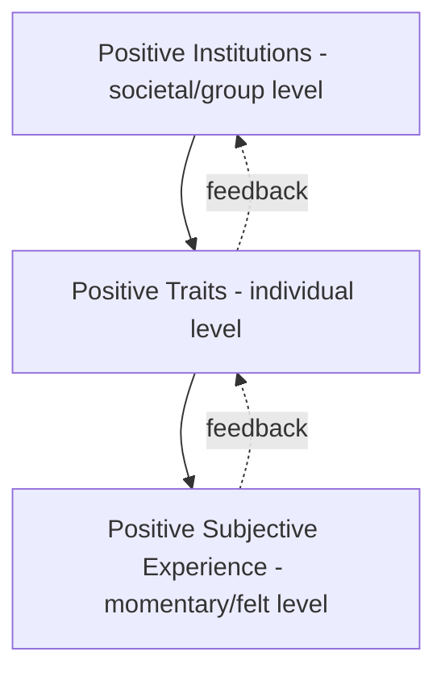

## The Three Pillars: Positive Experience, Positive Traits, Positive Institutions

### Origin and Structural Purpose of the Framework

**Key Points**

- The three-pillar (or three-level) framework was introduced by Seligman and Csikszentmihalyi in their 2000 *American Psychologist* founding paper as positive psychology's foundational organizing structure.
- Its purpose was taxonomic: to give the newly founded field a way of categorizing the otherwise diffuse set of topics (happiness, virtue, civic life) it claimed to study, ensuring the field could be scoped and communicated coherently.
- The three levels are explicitly nested — institutions are theorized to shape the conditions for trait development, and traits are theorized to shape the conditions for positive subjective experience. [Inference — this nested causal logic is implied by the framework's structure but was not always rigorously specified as a formal causal model in the original 2000 paper]

### Pillar 1: Positive Subjective Experience

**Key Points**

- This pillar concerns felt, first-person emotional and experiential states — how life is subjectively experienced across time.
- Seligman organized this pillar temporally: past, present, and future orientations each have distinct associated positive states.

**Temporal breakdown of positive subjective experience:**

| Temporal Orientation | Associated Constructs | Representative Researchers |
| --- | --- | --- |
| Past | Contentment, satisfaction, pride, serenity | Ed Diener (subjective well-being research) |
| Present | Flow, joy, pleasure, sensory gratification | Mihaly Csikszentmihalyi (flow theory) |
| Future | Hope, optimism, confidence, faith | Charles Snyder (hope theory), Seligman (learned optimism) |

**Key constructs under this pillar:**

- **Subjective well-being (SWB)**: A tripartite construct comprising life satisfaction (cognitive judgment), positive affect, and (low) negative affect, most associated with Ed Diener's decades of prior research, which positive psychology absorbed as a founding empirical base.
- **Flow**: A state of complete absorption in an activity, characterized by merged action and awareness, loss of self-consciousness, and intrinsic reward, developed by Csikszentmihalyi prior to positive psychology's formal founding and integrated into it as a present-oriented construct.
- **Hedonic vs. eudaimonic distinction**: A frequently discussed conceptual split within this pillar — hedonic well-being concerns pleasure and pain avoidance, while eudaimonic well-being concerns meaning, purpose, and self-realization. [Inference — this distinction traces to philosophical origins (Aristotle's eudaimonia vs. hedonism) and was incorporated into positive psychology's subjective-experience pillar as an organizing debate rather than a single settled construct]

**Measurement note**: This pillar is the most heavily instrumented of the three, with validated scales including the Satisfaction with Life Scale (SWLS; Diener et al.) and the Positive and Negative Affect Schedule (PANAS; Watson, Clark, & Tellegen), both of which predate positive psychology's formal founding but were adopted as core measurement tools.

### Pillar 2: Positive Individual Traits

**Key Points**

- This pillar concerns relatively stable, enduring characteristics of individuals — as opposed to the transient states covered in Pillar 1.
- The pillar's most significant institutional output is the VIA Classification of Character Strengths and Virtues (Peterson & Seligman, 2004), which operationalized this pillar into a measurable taxonomy.

**Distinguishing traits from states (a foundational conceptual boundary within the framework):**

| Dimension | Positive States (Pillar 1) | Positive Traits (Pillar 2) |
| --- | --- | --- |
| Temporal stability | Transient, situational | Stable across time and context |
| Example | Feeling joyful during a specific activity (flow) | Being a generally curious person (a trait strength) |
| Measurement approach | Momentary/experience sampling, single-occasion scales | Personality inventories, longitudinal trait assessment |

**Core trait constructs within this pillar:**

- **Character strengths** (VIA taxonomy): 24 strengths organized under 6 virtues (wisdom, courage, humanity, justice, temperance, transcendence) — see the VIA framework for full structure.
- **Wisdom**: Studied as an integrative trait combining knowledge, judgment, and perspective-taking under uncertainty.
- **Creativity**: Studied both as a trait capacity and as a component strength within the wisdom virtue cluster.
- **Capacity for love and forgiveness**: Relational traits studied for their role in sustaining positive social bonds.
- **Courage and perseverance ("grit")**: Traits associated with sustained goal pursuit under adversity; later work by Angela Duckworth extended this trait line specifically. [Inference — Duckworth's grit research is generally categorized within this pillar by positive psychology scholars, though it developed partly independently]

**Methodological distinction from Pillar 1**: Trait research in this pillar draws more heavily on personality psychology's psychometric traditions (e.g., factor analysis, test-retest reliability) than on the momentary-experience methodologies common to Pillar 1 research.

### Pillar 3: Positive Institutions

**Key Points**

- This pillar concerns the societal, organizational, and civic structures theorized to enable the development of positive traits and, in turn, positive subjective experience.
- It is the least empirically developed of the three pillars in positive psychology's early years, and is frequently identified in retrospective assessments of the field as its most underdeveloped area of research relative to Pillars 1 and 2. [Inference — this relative underdevelopment is a common observation in review literature and field retrospectives, not a claim from the founding papers themselves]

**Core focus areas within this pillar:**

| Domain | Focus | Related Applied Field |
| --- | --- | --- |
| Family and civic structures | How families and communities cultivate strengths like responsibility and altruism | Positive parenting research |
| Democratic institutions | Civic virtue, tolerance, work ethic as products of institutional design | Political psychology overlaps |
| Organizational structures | Workplace conditions that enable engagement, meaning, and strength use | Positive Organizational Scholarship (POS) |
| Educational institutions | School environments that cultivate character strengths and engagement | Positive Education movement |

**Positive Organizational Scholarship (POS)** emerged as the most developed applied offshoot of this pillar, studying organizational practices (leadership style, culture, structure) that enable employee flourishing, positive deviance, and thriving at work. [Inference — POS is broadly recognized in the literature as institutionally linked to positive psychology's third pillar, though it also draws on independent organizational behavior traditions]

**Positive Education** represents a parallel applied offshoot focused specifically on school-level institutional design — curricula, pedagogy, and school culture intended to cultivate character strengths and wellbeing alongside traditional academic outcomes.

### Interrelationships and Theoretical Tensions Between the Pillars

**Key Points**

- The framework implies a layered causal chain (institutions → traits → experience) but this causal directionality was asserted more than empirically demonstrated in the field's founding literature. [Inference — a recurring methodological critique in review articles assessing positive psychology's theoretical rigor]
- Bidirectional relationships are plausible and are acknowledged in later positive psychology literature: positive subjective experiences (e.g., flow) can reinforce trait development (e.g., persistence), which can in turn shape institutional culture (e.g., a workplace that rewards engaged employees).

**Illustrative worked example across all three pillars (a single scenario traced through the framework):**

A teacher (institution: school) designs a classroom structure that rewards curiosity-driven inquiry rather than rote memorization (institutional design choice). Students in this environment develop stronger trait-level curiosity and perseverance over the school year (Pillar 2: positive traits). During specific class activities designed around this structure, students report frequent flow states and engagement (Pillar 1: positive subjective experience). [Inference — this is an illustrative synthetic example constructed to demonstrate the framework's logic, not a documented case study from a specific published source]

### Empirical and Theoretical Critiques of the Three-Pillar Structure

- **Imbalanced research output**: Empirical output across the three pillars has been notably uneven, with Pillar 1 (subjective experience) and Pillar 2 (traits) accounting for the substantial majority of positive psychology publications, while Pillar 3 (institutions) remains comparatively underexplored. [Inference — a widely repeated observation in field review articles, though exact publication-count statistics require direct bibliometric verification]
- **Boundary ambiguity**: The line between "trait" (Pillar 2) and "institution-shaped behavior" (Pillar 3) is not always cleanly drawn — e.g., civic virtue could be classified as either an individual trait or an institutional outcome depending on framing. [Inference — a conceptual ambiguity noted in critical reviews of positive psychology's taxonomic clarity]
- **Absence of a unifying causal model**: Unlike, for example, a formal systems model with specified feedback coefficients, the three-pillar framework functions primarily as a descriptive taxonomy rather than a predictive or mechanistic model. [Inference — characterization based on the framework's original descriptive presentation in the 2000 paper]

**Next Steps**

- Ed Diener's Subjective Well-Being (SWB) tripartite model in depth
- Mihaly Csikszentmihalyi's Flow theory: structure, conditions, and measurement
- The VIA Classification of Character Strengths and Virtues (Pillar 2 in depth)
- Positive Organizational Scholarship (POS) as the primary Pillar 3 applied field
- The Positive Education movement and school-level institutional design
- Critiques of positive psychology's uneven empirical coverage across its founding framework