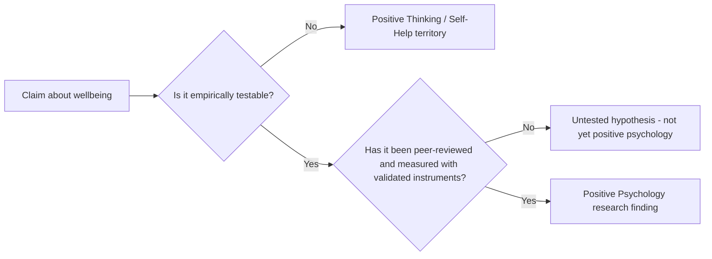

## Distinguishing Positive Psychology from Self-Help and Positive Thinking

### Why This Distinction Was Foundationally Necessary

**Key Points**

- From its earliest institutional moments, positive psychology faced a credibility problem: its subject matter (happiness, virtue, optimism) overlapped heavily with the pre-existing self-help and "positive thinking" publishing industries, which lacked scientific rigor.
- Seligman and colleagues treated this boundary-drawing as an urgent rhetorical and methodological priority, since conflation with self-help risked the field's acceptance within mainstream academic psychology.
- This defensive distinction appears explicitly in the field's founding literature (Seligman & Csikszentmihalyi, 2000), not merely in later popular commentary. [Inference — characterization of a recurring theme across founding-era writing rather than a single quoted passage]

### Historical Precedent: The Positive Thinking Tradition

**Key Points**

- The positive thinking tradition predates positive psychology by decades and includes figures such as Norman Vincent Peale (*The Power of Positive Thinking*, 1952) and Dale Carnegie (*How to Win Friends and Influence People*, 1936).
- This tradition is generally characterized as rooted in motivational rhetoric, religious/spiritual inspiration, and prescriptive anecdote rather than controlled empirical study. [Inference — a standard characterization used in academic critiques distinguishing the two traditions]
- It achieved enormous commercial and cultural reach but existed largely outside, and often without engagement from, academic psychology departments.

**Structural comparison table:**

| Dimension | Positive Thinking / Self-Help | Positive Psychology |
| --- | --- | --- |
| Epistemic basis | Anecdote, testimonial, motivational rhetoric | Peer-reviewed empirical research |
| Falsifiability | Claims typically not testable | Hypotheses designed to be testable and falsifiable |
| Institutional home | Trade publishing, seminars, motivational speaking circuits | University psychology departments, APA-affiliated bodies |
| Peer review | Absent | Central methodological requirement |
| Treatment of negative emotion | Often framed as something to eliminate or suppress via willpower | Studied as functionally important; not framed as simply "bad" |
| Founding figures | Peale, Carnegie, and later self-help authors | Seligman, Csikszentmihalyi, Diener, Peterson |
| Primary output | Prescriptive advice, motivational narrative | Empirical findings, validated measurement instruments |

### Methodological Markers of Differentiation

**Key Points**

- Positive psychology's founders repeatedly emphasized specific methodological commitments intended to signal scientific legitimacy and separate the field from motivational literature.

**Core methodological differentiators:**

1. **Falsifiable hypotheses** — Claims are structured so they can, in principle, be empirically disconfirmed, in contrast to broad motivational assertions that are not designed for testing.
2. **Peer review as gatekeeping** — Findings are published through standard academic peer-review channels (journals like *American Psychologist*, later the *Journal of Positive Psychology*) rather than disseminated directly to consumers via trade books without external validation.
3. **Standardized, validated measurement instruments** — Constructs are operationalized through psychometrically tested tools (e.g., the Satisfaction with Life Scale, the VIA Inventory of Strengths) rather than relying on subjective self-report of "feeling better."
4. **Acknowledgment of negative emotion's function** — Positive psychology explicitly does not claim negative emotions are inherently harmful or should be eliminated; it studies their adaptive functions (e.g., fear's role in threat detection) alongside positive emotion's functions, a stance that contrasts with positive-thinking rhetoric that sometimes frames negativity as a mindset failure to be overcome. [Inference — this is a commonly cited theoretical position in positive psychology writing, e.g., in relation to Barbara Fredrickson's broaden-and-build theory, though not a single universally quoted claim]
5. **Explicit rejection of universal prescriptions** — Academic positive psychology generally frames interventions as empirically tested and context-dependent (e.g., gratitude journaling shown effective in specific studies under specific conditions) rather than offering one-size-fits-all life advice.

### Positive Psychology Interventions (PPIs) as a Case Study in the Distinction

**Key Points**

- Positive Psychology Interventions (PPIs) are structured, manualized activities (e.g., "three good things" journaling, gratitude letters, using signature strengths in new ways) designed by researchers such as Seligman and colleagues.
- What distinguishes PPIs methodologically from superficially similar self-help exercises is that PPIs are typically tested via randomized controlled trials (RCTs) with control groups, pre/post measurement using validated scales, and published effect sizes.

**Illustrative comparison of superficially similar practices:**

| Practice | Self-Help Version | Positive Psychology Version |
| --- | --- | --- |
| Gratitude practice | "Keep a gratitude journal to be happier" (general advice, no testing) | Seligman's "Three Good Things" exercise, tested in RCTs with pre/post SWLS scores and follow-up measurement (Seligman, Steen, Park, & Peterson, 2005) |
| Strength identification | "Discover your inner strengths" (vague, unvalidated) | VIA Inventory of Strengths — a psychometrically validated 240-item (or shorter validated forms) instrument with established reliability data |
| Optimism training | "Think positive and good things will happen" | Seligman's learned optimism techniques, derived from and tested against his earlier learned helplessness research paradigm |

### The Critique That Positive Psychology Sometimes Fails Its Own Standard

**Key Points**

- Despite the field's stated methodological commitments, critics have argued that popular positive psychology dissemination (trade books, media coverage, some corporate wellness applications) sometimes drifts back toward self-help-style overgeneralization, undermining the very distinction the field sought to establish. [Inference — a recurring critique found in academic commentary and some replication-focused reviews of positive psychology's public-facing output]
- The "happiology" critique, associated with some critics of the field (including psychologist Barbara Held and others), argues that positive psychology risks imposing a normative pressure toward positivity that can pathologize negative emotion, echoing the very positive-thinking excesses the field claimed to avoid. [Unverified — attribution and precise framing of this critique vary across sources; direct citation to Held's specific arguments should be verified against her original publications]
- The replication crisis in psychology more broadly (2010s onward) has also affected some well-known positive psychology findings, with certain effect sizes from early studies (including some PPI studies) proving smaller or less robust under later, more rigorous replication attempts. [Inference — general pattern documented in broader psychological replication literature; specific study-level replication outcomes require individual verification]

**Recurring tension summarized:**

| Field's Stated Ideal | Recurring Critique |
| --- | --- |
| Empirically rigorous, falsifiable claims | Popular dissemination sometimes reverts to broad, untested prescriptions |
| Acknowledges functional value of negative emotion | Some applications implicitly frame negativity as a problem to be optimized away |
| Peer-reviewed, replicable findings | Some early flagship effect sizes have faced replication challenges |

### A Practical Heuristic for the Distinction

**Key Points**

- A widely usable heuristic distilled from the above comparisons: a claim belongs to positive psychology (rather than self-help) to the degree it can answer three questions affirmatively — Is it measured with a validated instrument? Has it been tested against a control condition? Is it published through peer review?
- This heuristic is a pedagogical simplification rather than a formal, citable methodological criterion from the founding literature. [Inference — offered here as a synthesized teaching tool, not as a quoted definition from a primary source]

**Next Steps**

- Positive Psychology Interventions (PPIs): mechanisms, RCT evidence, and effect sizes
- Barbara Fredrickson's Broaden-and-Build Theory of positive emotion
- The replication crisis and its specific impact on positive psychology findings
- Critiques of positive psychology: the "happiology" debate and normative positivity pressure
- Seligman's Learned Optimism model and its roots in learned helplessness research