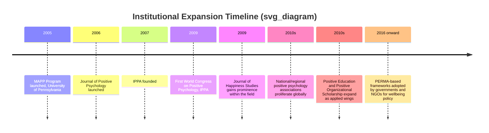
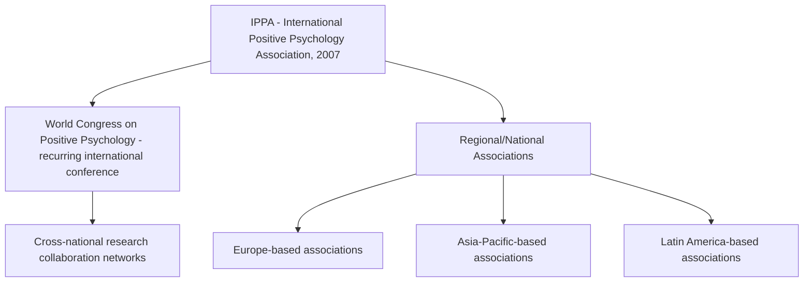

## Growth of Research Centers, Journals, and Global Expansion

### Overview of Institutional Growth Trajectory

**Key Points**

- Following the field's 1998–2004 founding period, positive psychology underwent a rapid institutionalization phase (roughly 2005–2015), converting a small founder-led research agenda into a globally distributed academic infrastructure.
- This expansion followed a recognizable pattern common to emerging academic subfields: training programs → dedicated journals → professional associations → international conferences → regional/national chapters.

### University-Based Research Centers

**Key Points**

- The University of Pennsylvania functioned as the field's institutional epicenter, housing Seligman's own research group and the Positive Psychology Center.
- The Master of Applied Positive Psychology (MAPP) program, launched in 2005, was the first graduate program explicitly dedicated to the field and became a widely cited model subsequently referenced by other universities developing similar programs. [Inference — MAPP's role as a template is a commonly cited characterization in field histories, though a systematic count of directly "MAPP-modeled" programs elsewhere would require independent verification]
- Additional research centers emerged at other universities internationally, generally organized around either general positive psychology research or specific applied subfields (positive education, workplace flourishing, resilience research).

**Illustrative categories of research center specialization (not an exhaustive directory):**

| Center Type | Typical Focus | Example Institutional Pattern |
| --- | --- | --- |
| General positive psychology centers | Broad wellbeing science, PERMA-model research | University-affiliated centers modeled loosely on UPenn's Positive Psychology Center |
| Positive education centers | School-based character strengths and wellbeing curricula | Often partnered directly with K-12 school systems for applied research |
| Resilience-focused centers | Applied resilience training, often military or first-responder contexts | Institutional ties to defense/emergency-service organizations (e.g., programs analogous to the U.S. Army's Comprehensive Soldier Fitness program) |
| Workplace flourishing / POS centers | Organizational behavior intersection with positive psychology | Business school affiliations rather than psychology departments |

[Inference — this categorization is a synthesized typology for organizing the landscape rather than a documented official taxonomy from any single source]

### Dedicated Journals

**Key Points**

- Prior to 2006, positive psychology research was published primarily in general psychology outlets (most notably *American Psychologist*), lacking a dedicated peer-reviewed venue.
- The **Journal of Positive Psychology** (launched 2006) became the field's flagship dedicated journal, providing a peer-reviewed outlet specifically curating positive psychology research.
- The **Journal of Happiness Studies** (earlier founding, gained increasing prominence as an adjacent/overlapping outlet) focused more specifically on subjective well-being and quality-of-life research, overlapping substantially with positive psychology's first pillar (positive subjective experience).

**Comparative table of key journal outlets relevant to the field:**

| Journal | Primary Focus | Relationship to Positive Psychology |
| --- | --- | --- |
| American Psychologist | General psychology | Hosted the field's founding 2000 special issue; not exclusively dedicated to the field |
| Journal of Positive Psychology | Positive psychology specifically | Flagship dedicated journal, launched 2006 |
| Journal of Happiness Studies | Subjective well-being, quality of life | Substantial overlap, predates and runs parallel to positive psychology's formal founding |
| Journal of Positive School Psychology | Positive education applications | Applied subfield-specific outlet |
| Journal of Occupational Health Psychology | Workplace wellbeing (broader than POS alone) | Partial overlap with Positive Organizational Scholarship research |

[Unverified — exact founding dates and current publisher affiliations for some of these secondary/applied journals should be confirmed directly, as journal ownership and indexing status can change]

### Professional Associations and Conferences

**Key Points**

- The **International Positive Psychology Association (IPPA)**, founded in 2007, became the field's primary international governance and coordinating body.
- IPPA organizes the **World Congress on Positive Psychology**, a recurring international conference series (first held in 2009), which functions as the field's largest regular gathering point for researchers globally.
- Beyond IPPA, numerous national and regional positive psychology associations formed in subsequent years, reflecting the field's geographic diffusion beyond its US academic origins. [Inference — the general pattern of national-chapter proliferation is well-documented in field histories; a complete, current list of all national associations would require direct verification as such organizations form, merge, or dissolve over time]

### Global Expansion and Cross-Cultural Research

**Key Points**

- Positive psychology's early research base was heavily concentrated in North American and Western European academic institutions, drawing early methodological criticism regarding generalizability (the broader "WEIRD" — Western, Educated, Industrialized, Rich, Democratic — sample bias critique applied to psychology generally). [Inference — the WEIRD critique is a well-established general critique in psychology (Henrich, Heine, & Norenzayan, 2010) and has been specifically applied to positive psychology by various commentators, though the degree of overlap with positive psychology specifically as opposed to psychology broadly requires care in attribution]
- Subsequent expansion included growing research programs in East Asia, Latin America, the Middle East, and parts of Africa, often examining whether Western-derived constructs (e.g., individualist framings of self-actualization or character strength) translate validly across collectivist cultural contexts. [Inference — general pattern documented in cross-cultural positive psychology literature]
- The VIA Classification of Strengths in particular underwent cross-cultural validation studies across multiple countries, representing one of the field's more systematic attempts at addressing generalizability concerns. [Unverified — specific validation study counts and countries covered should be checked against current VIA Institute publications for accuracy, as this research base continues to expand]

**Illustrative cross-cultural research questions that emerged during global expansion:**

| Question | Relevant Tension |
| --- | --- |
| Does the VIA strength taxonomy hold the same factor structure across cultures? | Individualist vs. collectivist conceptions of virtue |
| Is subjective well-being measured comparably across languages and cultural response styles? | Response bias differences (e.g., acquiescence bias variation by culture) |
| Does self-actualization framing translate to cultures with less individualist self-construals? | Western origin of foundational humanistic constructs (see Maslow/Rogers precursors) |

### Applied Institutional Offshoots

**Key Points**

- **Positive Education**: Expanded significantly at the institutional level, with some national education systems (most notably reported in relation to countries such as Bhutan's Gross National Happiness framework and various school-level pilot programs in Australia and the UK) incorporating wellbeing curricula influenced by positive psychology constructs. [Unverified — specific national policy adoption claims vary in scope and should be verified against current government education policy documents, as these initiatives are subject to political and administrative change]
- **Positive Organizational Scholarship (POS)**: Grew largely through business school affiliations (e.g., associated historically with the University of Michigan's Ross School of Business) rather than psychology departments, reflecting the pillar's cross-disciplinary institutional path.
- **National wellbeing policy applications**: Some governments and international bodies (e.g., OECD's Better Life Index initiatives) have incorporated wellbeing measurement frameworks conceptually adjacent to positive psychology's subjective well-being research, though direct institutional lineage to positive psychology specifically (versus independent economics-of-happiness research traditions) varies by initiative. [Inference — general observation about overlapping but not necessarily identical institutional histories between positive psychology and happiness economics]

### Critiques of the Expansion Pattern

- **Commercialization concerns**: Rapid growth included substantial commercial activity (corporate wellness consulting, coaching certification programs) operating adjacent to, and sometimes without, the empirical rigor associated with the field's academic core, echoing tensions discussed in the self-help/positive-thinking distinction. [Inference — a recurring critique in field-retrospective literature]
- **Uneven global distribution**: Despite expansion, research output and institutional density remain disproportionately concentrated in a relatively small number of well-funded universities, primarily in the US, UK, Australia, and parts of Western Europe. [Inference — general bibliometric pattern noted in reviews of the field's geographic research distribution; precise current concentration statistics would require direct bibliometric analysis]
- **Journal proliferation without proportional quality control**: As with many rapidly growing subfields, the increase in dedicated journals and conferences has raised questions in some methodological critiques about consistency of peer-review rigor across venues of varying prestige. [Inference — general concern applicable to rapidly institutionalizing academic subfields, not a claim specific to any named journal]

**Next Steps**

- The VIA Institute on Character and its ongoing cross-cultural validation research
- Positive Organizational Scholarship (POS): origins at the University of Michigan and core constructs
- The Positive Education movement: curriculum models and national policy adoption
- Bhutan's Gross National Happiness framework as a national wellbeing policy case study
- WEIRD sample bias critique and its specific implications for positive psychology's evidence base
- Cross-cultural validation of the VIA Classification of Strengths