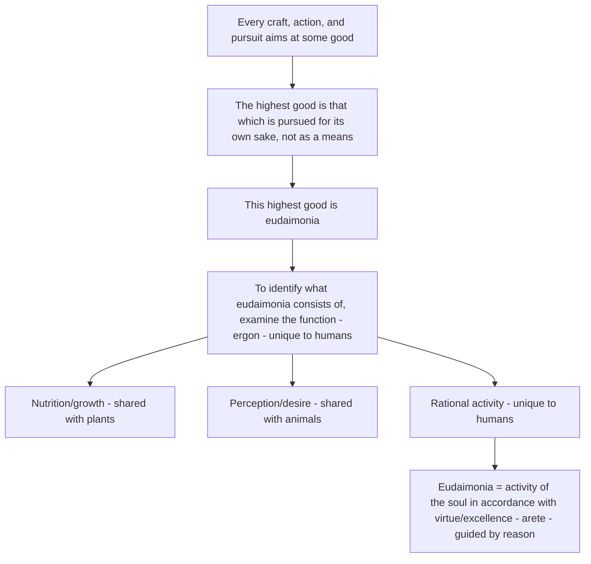

## Aristotle's Eudaimonia and the Concept of the Good Life

### Primary Source and Terminology

**Key Points**

- Aristotle's treatment of eudaimonia is developed primarily in the *Nicomachean Ethics*, with related discussion in the *Eudemian Ethics*.
- The Greek term *eudaimonia* (εὐδαιμονία) is commonly translated as "happiness," but this translation is widely regarded by scholars as inadequate or misleading, since the term more precisely denotes "flourishing," "human thriving," or "living well and doing well." [Inference — this translation caveat is a standard point made across classical scholarship and positive psychology's own secondary literature discussing Aristotle, though the precise preferred translation varies by scholar]
- Positive psychology's adoption of the eudaimonic/hedonic distinction (discussed under Pillar 1: positive subjective experience) traces its philosophical lineage directly to this Aristotelian source.

### The Function Argument (Ergon Argument)

**Key Points**

- Aristotle's central argument for identifying the good life proceeds via the concept of *ergon* (function or characteristic activity).
- The argument's structure: just as a knife's goodness is determined by how well it cuts (its function), and an eye's goodness by how well it sees, human goodness must be determined by the function unique to human beings.
- Aristotle identifies the uniquely human function as rational activity of the soul — specifically, activity in accordance with reason (*logos*), since this is what distinguishes humans from plants (which merely grow and nourish) and animals (which additionally perceive and desire).

**Structure of the function argument:**

### Eudaimonia as Activity, Not a State

**Key Points**

- A central and frequently emphasized point in Aristotelian scholarship: eudaimonia is defined as an *activity* (*energeia*) — an ongoing exercise of virtuous rational capacity — rather than a passive state, feeling, or possession.
- This distinguishes Aristotle's account sharply from purely hedonic conceptions of happiness as a pleasant mental state, since eudaimonia requires doing, not merely feeling.
- Aristotle explicitly rejects the idea that eudaimonia can be equated with pleasure, honor, or wealth, treating these as either instrumental goods or mistaken candidates pursued by different types of people (the "vulgar," the "refined/political," and others, in Aristotle's own categorization from Book I). [Inference — paraphrase of Aristotle's argument structure in Book I of the Nicomachean Ethics, not a direct quotation]

### The Role of Virtue (Arete)

**Key Points**

- Eudaimonia is achieved specifically through activity "in accordance with virtue" (*arete*), where virtue denotes excellence of character and intellect, not merely moral goodness in a narrow modern sense.
- Aristotle distinguishes two broad categories of virtue:

| Virtue Type | Greek Term | Nature | Example Virtues |
| --- | --- | --- | --- |
| Moral/character virtues | *ēthikē aretē* | Developed through habituation and practice, not innate | Courage, temperance, generosity, justice |
| Intellectual virtues | *dianoētikē aretē* | Developed through teaching and experience over time | Practical wisdom (*phronesis*), theoretical wisdom (*sophia*) |

- **The Doctrine of the Mean**: Aristotle's most cited framework for character virtue holds that virtue exists as a mean (*mesotes*) between two vices of excess and deficiency, relative to the individual and situation (not a rigid mathematical midpoint).

**Illustrative examples of the Doctrine of the Mean:**

| Virtue (the Mean) | Vice of Deficiency | Vice of Excess |
| --- | --- | --- |
| Courage | Cowardice | Recklessness |
| Temperance | Insensibility | Self-indulgence |
| Generosity | Stinginess | Prodigality |
| Proper pride/greatness of soul | Undue humility | Vanity |

### Phronesis (Practical Wisdom) as the Governing Intellectual Virtue

**Key Points**

- *Phronesis* (practical wisdom) is treated by Aristotle as the intellectual virtue responsible for correctly discerning the appropriate mean in specific, concrete situations — it is the applied, situational judgment that makes virtuous action possible in practice.
- Phronesis is distinguished from *sophia* (theoretical/philosophical wisdom), which concerns contemplation of unchanging, universal truths rather than practical action.
- This distinction has become directly influential in positive psychology's treatment of wisdom as a character strength (within the VIA Classification's "Wisdom and Knowledge" virtue category), where practical judgment is treated as empirically distinct from raw intelligence or knowledge accumulation. [Inference — this connection between Aristotelian phronesis and modern wisdom research is explicitly drawn in some positive psychology literature (e.g., discussions of wisdom by Robert Sternberg and others), though the strength of direct citation lineage varies by author]

### Eudaimonia's Requirement of External Goods and a Complete Life

**Key Points**

- Aristotle notably qualifies that eudaimonia, while primarily constituted by virtuous activity, also requires certain external goods (adequate health, friendship, resources, and even good fortune) as necessary supporting conditions — a point that distinguishes his view from more austere later Stoic conceptions of virtue as wholly sufficient for happiness. [Inference — this contrast with Stoicism is a standard point of comparison in the history of philosophy, though not itself part of Aristotle's own text]
- Aristotle further argues that eudaimonia can only be properly assessed over the course of a **complete life**, not a momentary state — his famous illustrative caution being that one should "call no man happy until he is dead," reflecting the view that a life's overall flourishing cannot be judged from any single moment or period. [Inference — paraphrase of a widely cited Aristotelian principle regarding the temporal scope of eudaimonia assessment, attributed to Solon in the anecdote Aristotle references, not an exact quotation from Aristotle's own voice]

### Direct Influence on Positive Psychology

**Key Points**

- The hedonic/eudaimonic distinction, foundational to positive psychology's treatment of well-being (see Pillar 1: positive subjective experience), is explicitly traced by well-being researchers back to this Aristotelian source, typically contrasted against hedonism's philosophical lineage (Aristippus, Epicurus).
- **Carol Ryff's Psychological Well-Being (PWB) model** (1989, predating but widely absorbed into positive psychology) is one of the most direct empirical operationalizations of eudaimonic well-being, explicitly citing Aristotelian and humanistic (Maslow/Rogers) sources as theoretical foundations.

**Ryff's six dimensions of eudaimonic psychological well-being (illustrating the philosophical-to-empirical translation):**

| PWB Dimension | Aristotelian Conceptual Echo |
| --- | --- |
| Autonomy | Self-governance through reason |
| Environmental mastery | Practical wisdom applied to one's circumstances |
| Personal growth | Ongoing virtuous activity, not a static end-state |
| Positive relations with others | Aristotle's extensive treatment of friendship (*philia*) in the Ethics |
| Purpose in life | Activity oriented toward the highest good |
| Self-acceptance | Alignment between character and rational self-understanding |

- Martin Seligman's own PERMA model (2011) explicitly incorporates "Meaning" as a distinct pillar, a conceptual descendant of eudaimonic (rather than purely hedonic) well-being, reflecting continued Aristotelian influence in the field's later theoretical development. [Inference — Seligman has discussed this eudaimonic influence in his own writing, though the direct citation trail to Aristotle specifically versus the broader eudaimonic tradition varies across his texts]

### Contested Interpretive Issues

- **Inclusivist vs. dominant-end interpretations**: A long-standing scholarly debate exists over whether Aristotle held that eudaimonia consists of a single dominant activity (intellectual contemplation, per some readings of Book X) or an inclusive combination of virtuous activities across a complete life (the more commonly favored "inclusivist" reading among many contemporary scholars). [Unverified — this remains an active and unresolved debate within Aristotelian scholarship, and characterizing any single position as the definitive consensus would misrepresent the state of the debate]
- **Translation and cultural transferability**: As with the humanistic psychology precursors, some critics of positive psychology's use of eudaimonia argue that Aristotle's framework was developed within, and may not straightforwardly generalize beyond, a specific historical Greek philosophical and social context (e.g., his views on slavery and the exclusion of women and laborers from full eudaimonic flourishing are widely noted as reflecting the limitations of his historical context). [Inference — this critique is a well-established point in critical historiography of philosophy and is sometimes raised in discussions of applying Aristotelian ethics uncritically to modern well-being science]

**Next Steps**

- Carol Ryff's Psychological Well-Being (PWB) model in depth
- The hedonic vs. eudaimonic distinction in modern well-being measurement
- Aristotle's treatment of friendship (*philia*) and its relevance to positive relationships research
- Seligman's PERMA model and its philosophical lineage
- Stoic philosophy (Epictetus, Marcus Aurelius) as an alternative philosophical root of resilience research