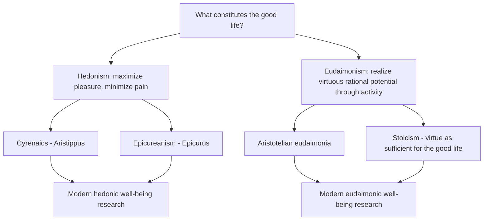
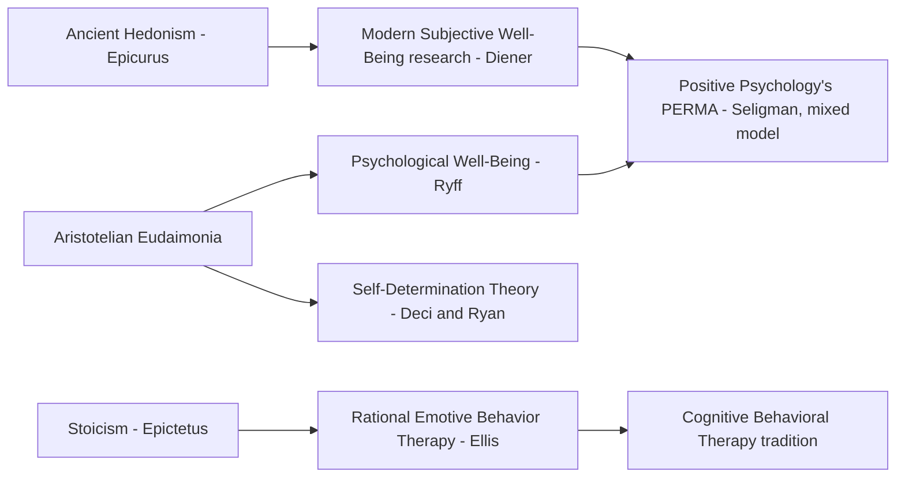

## Hedonism Versus Eudaimonism Across the History of Philosophy

### Defining the Two Traditions

**Key Points**

- Hedonism and eudaimonism represent two long-standing, competing philosophical answers to the question "what constitutes a good or well-lived life?"
- **Hedonism** holds that pleasure (and the absence of pain) is the sole intrinsic good, and that a good life is one that maximizes net positive subjective experience.
- **Eudaimonism** holds that flourishing — realizing one's rational and virtuous potential through activity — constitutes the good life, with pleasure treated as a byproduct or accompaniment rather than the defining criterion.
- Both traditions originate in Ancient Greek philosophy and have persisted, in varying forms, into contemporary well-being science, where they map directly onto positive psychology's hedonic/eudaimonic distinction (see the Aristotle/eudaimonia topic for the eudaimonist branch in depth).

### The Hedonist Lineage

**Cyrenaic Hedonism (Aristippus of Cyrene, c. 435–356 BCE)**

**Key Points**

- Generally regarded as the earliest systematic hedonist school, founded by Aristippus, a student of Socrates.
- Cyrenaic hedonism is characterized as advocating pursuit of immediate, intense bodily pleasure, with less emphasis on long-term calculation or moderation compared to later Epicurean hedonism. [Inference — this characterization is the standard secondary-source summary of Cyrenaic doctrine; primary Cyrenaic texts survive only in fragments and through later doxographical accounts (e.g., Diogenes Laërtius), so direct sourcing carries some uncertainty]
- Often contrasted with Epicureanism as the more "unrefined" or immediate-gratification-oriented branch of ancient hedonism. [Inference — a common contrastive framing in the history-of-philosophy literature]

**Epicurean Hedonism (Epicurus, 341–270 BCE)**

**Key Points**

- Epicurus refined hedonism considerably, arguing that the highest pleasure is not intense sensory indulgence but rather *ataraxia* (tranquility, freedom from mental disturbance) and *aponia* (absence of bodily pain).
- Epicurus explicitly argued that pursuing excessive or unnecessary desires leads to greater long-term pain, and advocated a calculated, moderate approach to pleasure-seeking that carefully weighs short-term pleasure against long-term consequences.
- Epicurean hedonism is frequently distinguished from popular caricatures of "Epicureanism" as indulgent excess — a common point of clarification in philosophical pedagogy, since the colloquial modern usage of "epicurean" (fine dining, luxury) diverges substantially from Epicurus's actual ascetic-leaning philosophy. [Inference — this clarifying distinction is a standard pedagogical point made in introductory philosophy treatments of Epicureanism]

**Epicurus's classification of desires (a structural framework for his moderate hedonism):**

| Desire Category | Description | Recommended Response |
| --- | --- | --- |
| Natural and necessary | Food, water, shelter, basic needs | Pursue and satisfy |
| Natural but unnecessary | Luxury food, elaborate comforts | Pursue cautiously, without dependency |
| Vain and empty | Fame, unlimited wealth, power | Avoid — these desires are inherently unsatisfiable and produce suffering |

### The Eudaimonist Lineage

**Aristotelian Eudaimonia**

See the dedicated topic on Aristotle's eudaimonia for full treatment. In brief: eudaimonia is defined as virtuous rational activity across a complete life, not a pleasurable state, and requires the exercise of both moral virtue (*ēthikē aretē*) and intellectual virtue (*dianoētikē aretē*), particularly practical wisdom (*phronesis*).

**Stoicism (Zeno of Citium, Epictetus, Seneca, Marcus Aurelius)**

**Key Points**

- Stoicism represents a more austere eudaimonist branch, holding that virtue is not merely necessary but wholly *sufficient* for eudaimonia — external goods (health, wealth, reputation) are classified as "indifferents" (*adiaphora*), neither good nor bad in themselves.
- This directly contrasts with Aristotle's own position, which held that some external goods are necessary supporting conditions for eudaimonia, not merely indifferent. [Inference — this is a standard point of philosophical contrast documented in comparative treatments of Aristotelian and Stoic ethics]
- The Stoic dichotomy of control (distinguishing what is "up to us" — judgments, intentions, reactions — from what is not — external events, others' actions, outcomes) is widely cited as a direct conceptual precursor to modern cognitive-behavioral and resilience frameworks. [Inference — this lineage claim (Stoicism → CBT) is commonly made in both popular and some academic resilience literature, most explicitly by Albert Ellis, who directly credited Epictetus as an influence on Rational Emotive Behavior Therapy]

**Comparative table: Aristotelian vs. Stoic eudaimonism:**

| Dimension | Aristotelian Eudaimonism | Stoic Eudaimonism |
| --- | --- | --- |
| Role of external goods | Necessary supporting conditions | Classified as "indifferents" — irrelevant to virtue |
| Emotional stance | Moderate emotion in accordance with the mean (Doctrine of the Mean) | Aim to eliminate destructive passions (*apatheia*) through rational judgment |
| Vulnerability to fortune | Eudaimonia can be affected by severe misfortune | Virtue (and thus eudaimonia) is theoretically immune to external misfortune |

### Structured Comparison of Hedonism and Eudaimonism

| Dimension | Hedonism | Eudaimonism |
| --- | --- | --- |
| Core good | Pleasure / absence of pain | Virtuous rational activity |
| Nature of the good life | A state or balance of subjective feeling | An ongoing activity or process |
| Role of external circumstance | Directly relevant (pleasure is often circumstantially caused) | Variably relevant depending on branch (Aristotle: relevant; Stoicism: largely irrelevant) |
| Time horizon for evaluation | Can be assessed moment-to-moment or aggregated | Requires assessment across a complete life (Aristotle's view) |
| Key ancient proponents | Aristippus, Epicurus | Aristotle, Zeno, Epictetus, Seneca, Marcus Aurelius |

### Translation into Modern Well-Being Science

**Key Points**

- The hedonic/eudaimonic distinction was formally imported into empirical psychology largely through the work of researchers seeking to differentiate subjective well-being research traditions, with the distinction becoming a standard organizing framework by the 1990s-2000s well-being literature. [Inference — general historiographical characterization of how this philosophical distinction entered empirical psychology, without asserting a single point of first introduction]

**Modern empirical operationalizations mapped to their philosophical lineage:**

| Modern Construct | Researcher(s) | Philosophical Lineage |
| --- | --- | --- |
| Subjective Well-Being (SWB) | Ed Diener | Hedonist (life satisfaction + positive/negative affect) |
| Psychological Well-Being (PWB) | Carol Ryff | Eudaimonist (explicitly cites Aristotle) |
| Self-Determination Theory (SDT) | Edward Deci & Richard Ryan | Eudaimonist (autonomy, competence, relatedness as growth needs) |
| PERMA model | Martin Seligman | Mixed — combines hedonic (Positive Emotion) and eudaimonist (Meaning, Accomplishment) elements |
| Rational Emotive Behavior Therapy (REBT) | Albert Ellis | Stoic-eudaimonist (dichotomy of control, cognitive reappraisal) |
| Cognitive Behavioral Therapy (CBT), broadly | Aaron Beck and successors | Partial Stoic lineage via REBT's influence |

### Ongoing Debates and Critiques

- **False dichotomy critique**: Some contemporary well-being researchers argue that treating hedonic and eudaimonic well-being as sharply separate constructs may be empirically and conceptually overstated, since measures of the two often correlate substantially and may reflect overlapping underlying processes rather than fully distinct phenomena. [Inference — this is a live methodological debate in well-being measurement literature; the degree of empirical overlap reported varies across studies and would require direct examination of specific factor-analytic studies to characterize precisely]
- **Which tradition better predicts long-term outcomes**: Some longitudinal research has examined whether eudaimonic or hedonic well-being better predicts outcomes such as physical health or longevity, with mixed and sometimes contested findings across different studies and populations. [Unverified — specific claims about differential predictive validity (e.g., certain widely circulated claims about eudaimonic well-being's health benefits) have faced methodological critique and replication concerns in the literature, and should not be treated as settled without checking current meta-analytic evidence]
- **Cultural applicability**: As with Aristotelian eudaimonia specifically, critics note that both hedonism and eudaimonism as classically formulated emerged from specific Western philosophical traditions, raising questions about whether the dichotomy itself maps cleanly onto non-Western conceptions of well-being (e.g., certain Buddhist or Confucian frameworks that do not map neatly onto either category). [Inference — a recurring critique in cross-cultural well-being research]

**Next Steps**

- Carol Ryff's Psychological Well-Being (PWB) model in depth
- Self-Determination Theory (Deci & Ryan): autonomy, competence, and relatedness
- Stoic philosophy and its direct lineage into Rational Emotive Behavior Therapy and CBT
- Ed Diener's Subjective Well-Being (SWB) tripartite model
- Non-Western philosophical conceptions of flourishing (Buddhist, Confucian) as points of comparison