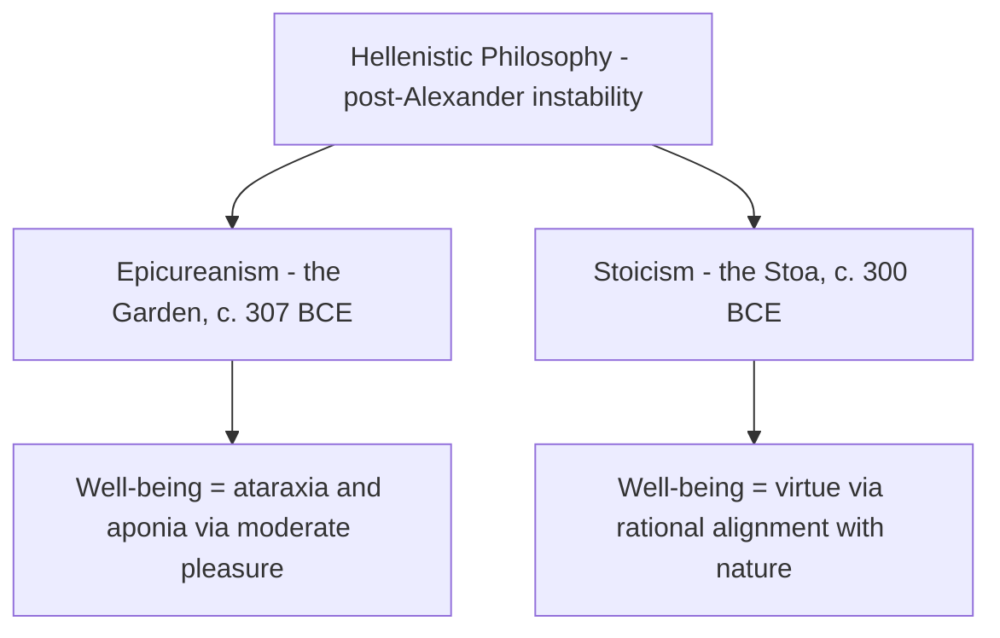
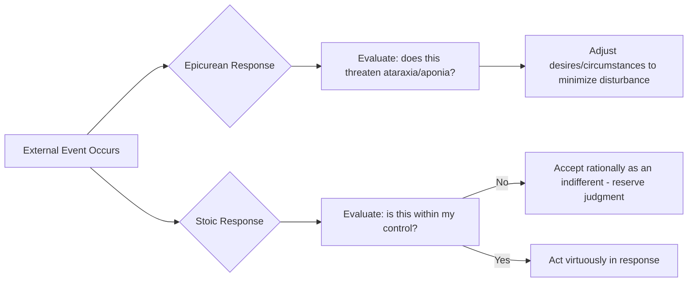

## Stoic and Epicurean Conceptions of Well-Being

### Shared Historical Context

**Key Points**

- Stoicism and Epicureanism both emerged in the Hellenistic period (roughly late 4th century BCE onward), a time of significant political instability following Alexander the Great's death, which is often cited as context for both schools' shared emphasis on individual inner tranquility as a response to external unpredictability. [Inference — this contextual framing is a standard historiographical observation connecting Hellenistic political conditions to Hellenistic philosophy's inward turn, though it should be treated as interpretive context rather than a claim either school explicitly stated as its own motivation]
- Both schools were founded in Athens within a few decades of each other: Epicurus founded his school (known as "the Garden") around 307 BCE; Zeno of Citium founded Stoicism (named for the *Stoa Poikile*, the painted porch where he taught) around 300 BCE.
- Despite this shared context, the two schools arrived at substantially different accounts of what well-being consists of and how it is achieved, making them a productive comparative pair.

### Epicurean Well-Being: Ataraxia and Aponia

**Key Points**

- Epicurus defined the highest good as pleasure, but specifically identified the *highest form* of pleasure as **ataraxia** (freedom from mental disturbance/anxiety) and **aponia** (freedom from bodily pain), rather than active, intense sensory pleasure.
- This positions Epicurean well-being as fundamentally about the *absence* of disturbance rather than the presence of positive stimulation — a "negative" hedonism in technical philosophical terms (absence of pain as the goal), distinct from more "positive" hedonisms that seek to maximize active pleasurable sensation. [Inference — this "negative hedonism" characterization is a standard distinction made in philosophical treatments of Epicurus, though terminology varies across sources]

**Epicurus's Fourfold Remedy (*Tetrapharmakos*)**, a summarized therapeutic framework attributed to Epicurean tradition for achieving ataraxia:

| Fear/Concern | Epicurean Remedy |
| --- | --- |
| Fear of the gods | The gods (if they exist) do not concern themselves with human affairs; no divine punishment to fear |
| Fear of death | Death is the absence of sensation; "when we exist, death is not; when death exists, we do not," so it cannot be experienced as harmful |
| Difficulty in achieving the good | The good (ataraxia) is achievable through simple, natural means, not through wealth or status |
| Difficulty in enduring the bad | Pain, when severe, tends to be brief; when prolonged, it tends to be mild and bearable |

[Unverified — the *Tetrapharmakos* as a formalized four-part summary is preserved primarily through later sources (notably a Herculaneum papyrus fragment attributed to Philodemus) rather than as a verbatim formulation from Epicurus's own surviving texts, so its exact original wording and structure carry some transmission uncertainty]

**Epicurean social and communal practices:**

- The Epicurean community (the Garden) was notable for including women and enslaved people among its members, which is frequently noted by historians as unusual for the social norms of the period. [Unverified — while widely repeated in secondary accounts of Epicurus's school, specific details of membership composition rely on limited surviving evidence and should be treated with appropriate historical caution]
- Epicurus placed substantial emphasis on friendship (*philia*) as one of the most reliable sources of a pleasant, secure life, a point of some conceptual overlap with Aristotle's extensive treatment of friendship despite the schools' broader philosophical differences.

### Stoic Well-Being: Virtue and the Dichotomy of Control

**Key Points**

- Stoicism holds that well-being (*eudaimonia*, a term Stoics also used, though with a distinctly different theoretical structure than Aristotle's) consists entirely in virtue — living "in accordance with nature" and reason.
- Central to Stoic practice is the **dichotomy of control**, most systematically articulated by the later Stoic Epictetus: some things are "up to us" (our judgments, intentions, desires, and reactions), and some things are "not up to us" (external events, other people's actions, our reputation, our health, even our own body in some formulations).
- Well-being, in the Stoic framework, results from directing concern exclusively toward what is "up to us" and cultivating equanimity (not indifference in the colloquial sense, but rational acceptance) toward what is not.

**The Stoic classification of "indifferents" (*adiaphora*):**

| Category | Description | Examples |
| --- | --- | --- |
| Preferred indifferents | Externally desirable but not intrinsically good or necessary for virtue | Health, wealth, reputation, comfort |
| Dispreferred indifferents | Externally undesirable but not intrinsically bad | Illness, poverty, pain, low social standing |
| The truly good | Only virtue itself qualifies | Wisdom, courage, justice, temperance |
| The truly bad | Only vice itself qualifies | Folly, cowardice, injustice, intemperance |

This classification is significant because it means a Stoic sage, in the strict theoretical formulation, retains full well-being (eudaimonia) even amid severe external misfortune, since misfortune concerns only "indifferents," not virtue itself. [Inference — this is the standard theoretical implication drawn from Stoic doctrine in secondary scholarship, acknowledging that ancient Stoics themselves debated how literally to apply this in practice]

**Key Stoic figures and their distinct contributions:**

| Figure | Era | Distinct Contribution |
| --- | --- | --- |
| Zeno of Citium | c. 334–262 BCE | Founder; established core Stoic physics, logic, and ethics |
| Chrysippus | c. 279–206 BCE | Systematized and defended Stoic doctrine extensively; called the school's "second founder" in some accounts |
| Seneca | c. 4 BCE–65 CE | Roman Stoic; practical ethical writing on anger, tranquility, and mortality (*Letters to Lucilius*) |
| Epictetus | c. 50–135 CE | Former enslaved person; most systematic articulation of the dichotomy of control (*Enchiridion*, *Discourses*) |
| Marcus Aurelius | 121–180 CE | Roman Emperor; personal philosophical journal (*Meditations*) applying Stoic practice to daily governance and mortality |

### Structured Comparison: Epicurean vs. Stoic Well-Being

| Dimension | Epicureanism | Stoicism |
| --- | --- | --- |
| Core good | Pleasure (specifically ataraxia/aponia) | Virtue alone |
| Relationship to pain/adversity | Minimize and manage pain; pain is a genuine negative | Reframe adversity as an "indifferent," not genuinely bad |
| Role of external goods | Relevant to comfort but pursued cautiously (see desire classification) | Classified as indifferent; irrelevant to true well-being |
| Social withdrawal vs. engagement | Historically associated with withdrawal from public/political life into a private community | Stoicism generally endorsed active civic and public engagement (e.g., Marcus Aurelius as Emperor) |
| View of death | Something to be rationally defused of fear, not transcended | Something to be accepted as natural and outside one's control |
| Emotional ideal | Tranquility through satisfied, moderated desire | *Apatheia* — freedom from destructive passions through correct judgment |

### Direct Lineage into Modern Psychology and Resilience Research

**Key Points**

- **Albert Ellis** explicitly credited Epictetus's dichotomy of control as a direct philosophical influence on **Rational Emotive Behavior Therapy (REBT)**, particularly the principle that emotional disturbance results from irrational beliefs *about* events rather than the events themselves (paraphrasing Epictetus's *Enchiridion*: "people are disturbed not by things, but by the views which they take of things"). [Inference — Ellis's direct acknowledgment of Stoic influence is documented in his own writing on REBT's origins, though exact citation phrasing should be verified against Ellis's primary texts]
- This Stoic-derived cognitive reappraisal principle became foundational to **Cognitive Behavioral Therapy (CBT)** more broadly (via Aaron Beck's cognitive therapy, developed partly independently but sharing this core reappraisal logic).
- In resilience research specifically, the dichotomy of control maps onto modern constructs such as **locus of control** and **cognitive reappraisal as an emotion regulation strategy**, both empirically studied constructs in contemporary resilience and stress literature. [Inference — this is a conceptual mapping commonly drawn in resilience literature connecting ancient Stoic practice to modern emotion-regulation constructs, rather than a claim of direct historical citation in every instance]
- Epicurean influence on modern positive psychology is comparatively less direct and more diffuse, though some scholars note conceptual echoes in **savoring** research (deliberately attending to and prolonging positive experience) and in simplicity/minimalism-oriented well-being interventions. [Speculation — this connection is more loosely drawn in the literature than the well-documented Stoic-to-CBT lineage, and should be treated as an illustrative conceptual parallel rather than an established citation chain]

### Contemporary Popular Revival and Associated Critiques

- **Modern Stoicism movement**: Stoic philosophy has seen substantial popular revival (self-help book adaptations, "Stoic Week" events, online communities), which some academic philosophers have critiqued for oversimplifying or selectively adapting ancient Stoic doctrine (e.g., stripping out the original Stoic physics and theology while retaining only practical ethical techniques). [Inference — this critique of selective modern adaptation is a recurring point made by classicists and philosophers examining the modern Stoicism revival]
- **Risk of therapeutic misapplication**: Some critics caution that an overly literal application of the dichotomy of control (or the Epicurean minimization of pain as "brief or bearable") could, in certain contexts, risk minimizing legitimate distress or discouraging appropriate help-seeking if misapplied without clinical nuance. [Inference — a general caution raised in discussions of philosophically-derived self-help applications, not a claim about either ancient school's original intent]

**Next Steps**

- Albert Ellis and Rational Emotive Behavior Therapy (REBT) in depth
- Aaron Beck's Cognitive Behavioral Therapy (CBT) and its relationship to Stoic-derived reappraisal
- Locus of control as a modern resilience construct
- Cognitive reappraisal as an emotion regulation strategy
- Marcus Aurelius's *Meditations* as a primary Stoic text for practical application
- The modern Stoicism revival and its critiques from classical scholarship