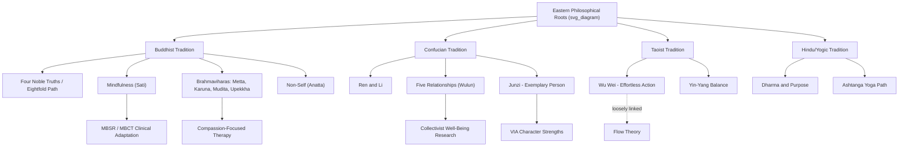

## Buddhist, Confucian, and Other Eastern Contributions to Flourishing

### Overview

Contemporary positive psychology's account of flourishing draws substantially, though often implicitly, on philosophical traditions that predate the field by two millennia or more. Buddhist, Confucian, Taoist, and related Eastern frameworks developed detailed theories of well-being, virtue, suffering, and the cultivated mind long before Seligman's PERMA model or Ryff's psychological well-being dimensions. Understanding these roots clarifies both the conceptual debts of the field and the ways Western positive psychology has sometimes flattened or misread the traditions it borrows from.

### Buddhist Contributions

#### The Four Noble Truths and the Diagnosis of Suffering

Buddhist psychology begins from a claim that looks, at first glance, like the opposite of positive psychology's mandate: that unsatisfactoriness ($dukkha$) is a baseline feature of unexamined existence. The Four Noble Truths structure this diagnosis:

1. **Dukkha** — life involves pervasive unsatisfactoriness, including subtle dissatisfaction even in pleasant states, since they are impermanent.
2. **Samudaya** — the origin of dukkha is craving/attachment ($tanha$), rooted in ignorance of the nature of self and phenomena.
3. **Nirodha** — cessation of dukkha is possible through the cessation of craving.
4. **Magga** — the Eightfold Path is the practical route to that cessation.

**Key Points**

- Buddhist thought does not treat suffering as a deficit to be patched over with positive affect; it treats craving and misperception as the causal mechanism, making the framework closer to a clinical etiology than a mood-boosting program.
- This reframes "flourishing" not as maximized pleasant experience but as reduced reactivity and clearer perception — a distinction that later shaped critiques of hedonic-only well-being models.

#### The Eightfold Path as a Proto-Model of Human Functioning

The Eightfold Path is often grouped into three trainings, which map loosely (and imperfectly) onto modern categories:

| Grouping | Path Factors | Rough Modern Analogue |
| --- | --- | --- |
| Wisdom (paññā) | Right View, Right Intention | Cognitive framing, values clarification |
| Ethical Conduct (sīla) | Right Speech, Right Action, Right Livelihood | Behavioral/moral functioning |
| Mental Discipline (samādhi) | Right Effort, Right Mindfulness, Right Concentration | Self-regulation, attention training |

[Inference] The three-training structure is sometimes presented in secular mindfulness literature as evidence that Buddhism "anticipated" self-regulation science; this is a retrospective mapping rather than a claim the original texts make in those terms, and scholars of Buddhist philosophy caution against over-literal equivalence.

#### Mindfulness (Sati) and Its Psychological Adaptation

The construct most directly imported into positive psychology and clinical practice is *sati*, typically translated as mindfulness — sustained, non-judgmental attention to present-moment experience. Jon Kabat-Zinn's Mindfulness-Based Stress Reduction (MBSR, developed late 1970s) and later Mindfulness-Based Cognitive Therapy (MBCT) extracted the attentional technology from its soteriological context (liberation from suffering and rebirth) and repositioned it as a stress-and-relapse-prevention tool.

**Example**

A basic breath-awareness instruction, secularized from Anapanasati (mindfulness of breathing) practice:

1. Sit with an upright, relaxed posture.
2. Bring attention to the physical sensation of breath at the nostrils or abdomen.
3. When attention wanders (it will, repeatedly), note this without self-criticism and return to the breath.
4. Practice for a fixed duration, gradually increasing over weeks.

[Unverified] Specific effect-size figures for MBSR/MBCT on measures like rumination or relapse rates vary considerably across meta-analyses and populations, so any single number should be treated as study-specific rather than a fixed property of the intervention.

#### Non-Self (Anatta) and Positive Psychology's Self-Focus

A significant tension exists between Buddhist *anatta* (non-self) doctrine and much of positive psychology's emphasis on self-esteem, self-efficacy, and self-actualization. Buddhist philosophy holds that the sense of a fixed, continuous self is itself a source of suffering and misperception; well-being, in this view, involves loosening identification with a stable "self" rather than strengthening it.

[Speculation] Some contemporary researchers argue this tension partially explains why practices like loving-kindness meditation (metta) — which cultivates other-directed care rather than self-enhancement — sometimes show different outcome profiles than self-esteem interventions, though this remains an active area of interpretation rather than settled consensus.

#### Brahmavihārās (The Four Immeasurables)

These four cultivated states form a direct bridge to constructs like Fredrickson's broaden-and-build theory and compassion-focused therapy:

- **Metta** (loving-kindness) — unconditional goodwill toward self and others
- **Karuna** (compassion) — sensitivity to suffering paired with motivation to relieve it
- **Mudita** (sympathetic/vicarious joy) — joy at others' success, functioning as an antidote to envy
- **Upekkha** (equanimity) — even-minded acceptance of pleasant and unpleasant experience alike

**Key Points**

- Mudita in particular has no clean single-word English equivalent and predates, by centuries, positive psychology's more recent interest in "capitalizing" on others' good news as a relationship-strengthening behavior.
- Compassion-Focused Therapy (Paul Gilbert) and loving-kindness meditation research draw substantially on this framework, generally citing it as an explicit historical source.

### Confucian Contributions

#### Ren, Li, and Relational Flourishing

Confucian philosophy locates flourishing not in individual internal states but in the quality of one's relationships and role-fulfillment within a social order. Two central concepts:

- **Ren** (仁) — benevolence, humaneness; the cultivated disposition to treat others with care, often glossed as the master virtue from which other virtues flow.
- **Li** (禮) — ritual propriety; the codified social forms (etiquette, ceremony, role-appropriate conduct) through which *ren* is enacted and social harmony maintained.

This is a fundamentally different starting point from most Western positive psychology, which — even in its more relational strands (e.g., Ryff's "positive relations with others" dimension) — still typically frames well-being as a property of the individual that relationships contribute to, rather than as constituted by relational role fulfillment itself.

#### The Five Relationships (Wulun) and Role-Based Well-Being

Confucian ethics specifies flourishing largely through five paired relationships, each governed by a distinct reciprocal obligation:

1. Ruler–subject
2. Father–son
3. Husband–wife
4. Elder–younger sibling
5. Friend–friend

**Key Points**

- Flourishing here is inseparable from fulfilling one's role obligations well; a person "flourishes" partly *as* a good parent, good friend, or good leader, not merely by feeling subjectively satisfied.
- This has influenced cross-cultural positive psychology research showing that collectivist samples often report well-being more strongly tied to relational harmony and social approval than to individual achievement or autonomy — a consistent finding across numerous cross-cultural studies, though the size and consistency of the effect varies by measure and population. [Inference on magnitude, not on directional pattern]

#### Junzi (The Exemplary Person) as a Character Model

The *junzi* (君子, often translated "gentleman" or "exemplary person") represents a lifelong developmental ideal of moral cultivation, contrasted with the *xiaoren* ("petty person"). Cultivation proceeds through study, self-reflection, and ritual practice rather than sudden transformation.

**Example**

Confucius's own account of staged self-cultivation (Analects 2.4), often cited in positive psychology's lifespan-development literature:

- Age 15: set the will on learning
- Age 30: established, standing firm
- Age 40: no longer confused/doubting
- Age 50: knew the mandate of heaven
- Age 60: ear attuned (received truth easily)
- Age 70: could follow the heart's desires without transgressing what is right

This staged model is frequently invoked, sometimes loosely, as an early analogue to Erikson's psychosocial stages or to modern wisdom-development research (e.g., Baltes' Berlin Wisdom Paradigm), though the analogy is interpretive rather than one the Confucian text itself draws.

#### Confucianism and Character Strengths Taxonomies

Peterson and Seligman's VIA Classification of Character Strengths and Virtues explicitly surveyed Confucian ethics (alongside Aristotelian, Buddhist, Hindu, and other traditions) when constructing its six core virtue categories (wisdom, courage, humanity, justice, temperance, transcendence). Confucian sources contributed particularly to the "humanity" and "justice" clusters, reinforcing the framework's claim to cross-cultural convergence on certain virtues.

[Unverified] The degree to which this convergence reflects genuine universal moral psychology versus selective interpretation by the VIA authors remains debated among cross-cultural philosophers; this is a substantive scholarly disagreement, not a settled matter.

### Taoist and Other Eastern Contributions

#### Wu Wei and Effortless Action

Taoist philosophy (Laozi, Zhuangzi) contributes the concept of *wu wei* (無為), often translated "non-action" or "effortless action" — acting in alignment with the natural flow of circumstances rather than through forced striving. This has been informally linked to flow theory (Csikszentmihalyi), though flow describes an absorbed psychological state during skilled activity, while *wu wei* is a broader ethical-metaphysical stance about non-contention with the natural order. [Inference] Treating these as equivalent overstates the overlap; the resemblance is suggestive rather than definitional.

#### Yin-Yang and Dialectical Well-Being

The yin-yang framework models well-being as dynamic balance between complementary opposites rather than maximization of one pole (e.g., pure positive affect). This has influenced dialectical approaches in positive psychology that treat negative emotions as functionally necessary rather than as failures of flourishing — a view compatible with, though not identical to, findings on "emotional complexity" and the adaptive role of negative affect in appropriate contexts.

#### Hindu and Yogic Contributions

Related but distinct Indian traditions contribute additional constructs frequently absorbed into Western well-being frameworks:

- **Dharma** — duty/purpose aligned with one's nature and social position, related to modern purpose and meaning research
- **Ananda** — bliss or profound contentment, distinguished from ordinary hedonic pleasure
- **The Yoga Sutras' eight limbs (Ashtanga)** — a structured path including ethical restraints (yama), observances (niyama), and meditative absorption (samadhi), structurally parallel to the Buddhist Eightfold Path

### Comparative Structure

### Critiques and Cautions

**Key Points**

- **Decontextualization**: Extracting mindfulness or loving-kindness practices from their soteriological (liberation-oriented) frameworks and repackaging them as stress-management tools has drawn sustained criticism from Buddhist scholars (e.g., critiques of "McMindfulness") as diluting or distorting the source tradition's aims.
- **Selective borrowing**: Positive psychology has tended to import techniques (meditation, gratitude-adjacent practices) more readily than the metaphysical commitments (rebirth, non-self, the illusory nature of the ego) that originally justified them, raising questions about whether the imported techniques function the same way outside their original framework. [Inference]
- **Individualist reframing**: Confucian relational and role-based flourishing is sometimes translated into individualist positive psychology in ways that lose the original's emphasis on obligation and hierarchy, substituting a more egalitarian, choice-based "positive relationships" construct.
- **Essentialism risk**: Treating "Eastern" traditions as a monolith obscures substantial internal disagreement — Theravada, Mahayana, and Zen Buddhism differ significantly from one another, as do the many schools within Confucianism (Mencian vs. Xunzian, Neo-Confucian, etc.).

### Conclusion

Buddhist, Confucian, Taoist, and Hindu/yogic traditions supplied much of the conceptual raw material that positive psychology later formalized into constructs like mindfulness, character strengths, compassion training, and relational well-being. These traditions offer models of flourishing that differ from mainstream Western hedonic and eudaimonic frameworks in important ways — de-emphasizing the self, embedding well-being in relational obligation, and treating suffering as diagnostically central rather than as simple absence of positive states. A historically responsible account of positive psychology treats these as substantive intellectual sources with their own internal logic and critiques, not merely as a inventory of techniques to extract.

**Related Topics**

- Aristotelian eudaimonia and virtue ethics as the Western philosophical counterpart
- The VIA Classification of Character Strengths and its cross-cultural methodology
- Mindfulness-Based Stress Reduction (MBSR) and Mindfulness-Based Cognitive Therapy (MBCT)
- Compassion-Focused Therapy and loving-kindness meditation research
- Cross-cultural psychology of individualism vs. collectivism in well-being
- Self-Determination Theory and its points of convergence/divergence with non-self doctrines
- Wisdom research (Berlin Wisdom Paradigm) and lifespan models of character development
- Critiques of "McMindfulness" and the secularization of contemplative practice