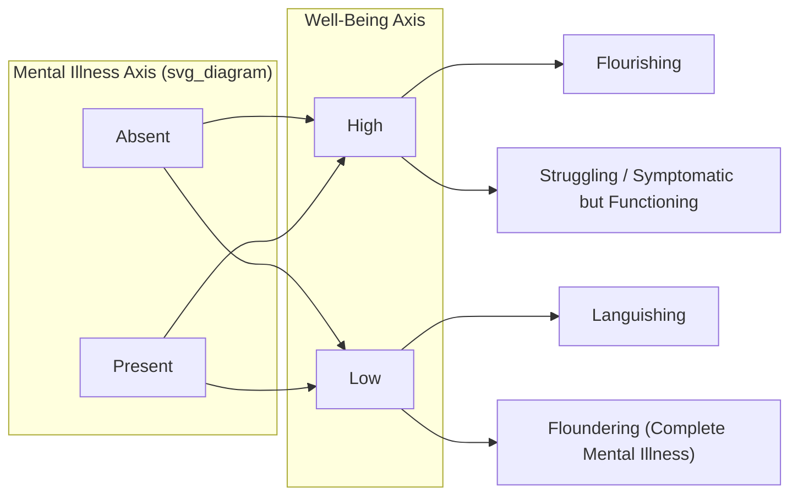

## Defining Happiness, Well-Being, and Flourishing as Constructs

### Overview

Positive psychology's foundational terms — happiness, well-being, and flourishing — are frequently used interchangeably in popular discourse but function as distinct theoretical constructs in the research literature, each with different measurement traditions, philosophical lineages, and empirical predictions. Precision in defining these terms is not merely academic; it determines what gets measured, which interventions are considered effective, and how cross-study comparisons are interpreted.

### Happiness: Hedonic Foundations

#### Subjective Well-Being (SWB) as the Operationalization of Happiness

Ed Diener's tripartite model, introduced in the late 1980s and still the dominant operationalization of "happiness" in empirical research, decomposes the construct into three components:

$$SWB = \text{Life Satisfaction} + \text{Positive Affect} - \text{Negative Affect}$$

| Component | Definition | Typical Measure |
| --- | --- | --- |
| Life Satisfaction | Global cognitive evaluation of one's life as a whole | Satisfaction with Life Scale (SWLS) |
| Positive Affect | Frequency/intensity of pleasant emotional states | Positive and Negative Affect Schedule (PANAS) |
| Negative Affect | Frequency/intensity of unpleasant emotional states | PANAS (negative subscale) |

**Key Points**

- SWB treats happiness as a *judgment plus an emotional balance*, not a single feeling — a person can report high life satisfaction while experiencing frequent negative affect (e.g., a demanding but meaningful job), illustrating that the three components are correlated but empirically separable.
- This model is explicitly hedonic in the philosophical sense: it defines well-being in terms of pleasure/satisfaction versus pain/dissatisfaction, tracing back to Bentham's utilitarian calculus, rather than to any notion of virtue or capability.

#### The Hedonic Treadmill and Set-Point Theory

Brickman and Campbell's hedonic treadmill hypothesis (1971) proposes that individuals adapt to positive and negative life changes, returning over time to a relatively stable baseline level of happiness. Subsequent set-point theory refined this into a claim that a substantial portion of variance in baseline happiness is heritable/stable, with life circumstances contributing comparatively modest additional variance.

[Unverified] Specific percentage breakdowns often cited in popular treatments (e.g., "50% genetic, 10% circumstances, 40% intentional activity") derive from a particular influential synthesis and should not be treated as precise, universally replicated figures; later work has both supported the general adaptation phenomenon and complicated the specific numbers, showing adaptation is incomplete for some events (e.g., unemployment, disability, bereavement) and that set points can shift.

**Example**

A commonly cited illustration: lottery winners and individuals who experience spinal cord injury tend to converge, within one to several years, toward happiness levels closer to (though not always identical to) their pre-event baseline — used to argue against circumstance-focused theories of lasting happiness change. [Inference: the strength of this convergence varies substantially by study and outcome type, and should not be read as implying circumstances are irrelevant.]

### Well-Being: Broader and More Contested

#### Hedonic vs. Eudaimonic Well-Being

"Well-being" is typically used as an umbrella term spanning two philosophically distinct traditions:

- **Hedonic well-being** — defined by pleasure attainment and pain avoidance; operationalized via SWB (above).
- **Eudaimonic well-being** — defined by the realization of one's true nature, potential, or virtue; rooted in Aristotelian *eudaimonia* (often mistranslated simply as "happiness," but closer to "flourishing through virtuous activity").

**Key Points**

- The hedonic/eudaimonic distinction is not merely semantic — factor-analytic studies generally find these to be correlated but separable dimensions, meaning a person can score relatively high on one while scoring lower on the other.
- Waterman, Ryan, and Deci's work on eudaimonia emphasizes *activity engaged in for its own sake, expressing one's true self*, distinguishing it from hedonic enjoyment that may not reflect authentic values.

#### Ryff's Six-Factor Model of Psychological Well-Being (PWB)

Carol Ryff's model (1989) operationalizes eudaimonic well-being through six distinct dimensions, explicitly constructed as an alternative to purely hedonic SWB measures:

1. **Autonomy** — self-determination, independence from social pressure
2. **Environmental Mastery** — competence in managing one's life and surroundings
3. **Personal Growth** — continued development and openness to new experience
4. **Positive Relations with Others** — warm, trusting interpersonal connections
5. **Purpose in Life** — goals and a sense of directedness
6. **Self-Acceptance** — positive attitude toward oneself, including past

[Inference] Ryff's model is frequently presented as empirically distinct from Diener's SWB, but the two show meaningful positive correlations in most studies; the models are better understood as complementary lenses on overlapping territory than as measuring wholly unrelated constructs.

#### Self-Determination Theory's Basic Psychological Needs

Deci and Ryan's Self-Determination Theory (SDT) offers a needs-based definition of well-being: psychological well-being is a function of the satisfaction of three basic, purportedly universal needs:

- **Autonomy** — volition and self-endorsement of one's actions
- **Competence** — effectiveness in interacting with one's environment
- **Relatedness** — connection and belonging with others

SDT treats well-being as an emergent outcome of need satisfaction rather than a directly targetable state — one implication being that interventions aimed directly at "feeling happy" may be less effective than interventions that structurally support autonomy, competence, and relatedness.

### Flourishing: The Integrative, Multidimensional Construct

#### Seligman's PERMA Model

Martin Seligman's 2011 reformulation explicitly moved the field's target construct from "happiness" to "flourishing," arguing that happiness (as SWB) was too narrow a goal for a comprehensive theory of well-being. PERMA specifies five measurable, independently pursuable elements:

- **P**ositive Emotion
- **E**ngagement (including flow states)
- **R**elationships (positive)
- **M**eaning (belonging to and serving something larger than oneself)
- **A**ccomplishment (achievement pursued for its own sake)

**Key Points**

- Seligman's stated criterion for inclusion in PERMA was that each element (a) contributes to well-being, (b) is pursued by many people for its own sake and not merely to get other elements, and (c) is defined and measured independently of the others.
- This is a deliberate break from single-construct models (SWB) toward a multicomponent theory — flourishing, in this framework, is not a single score but a profile across five domains.

#### Keyes' Model of Flourishing vs. Languishing

Corey Keyes' complete state model (2002) defines flourishing as the presence of high levels of both hedonic well-being (positive affect, life satisfaction) and positive functioning (social and psychological well-being), positioning it as the opposite pole from **languishing** (low well-being in the absence of diagnosable mental illness) — with mental illness as a conceptually separate axis.

This **dual-continua model** is a significant conceptual contribution: it implies that the absence of mental illness does not entail flourishing, and that a person can meet diagnostic criteria for a disorder while still exhibiting elements of positive functioning — a claim with direct implications for how clinical and positive psychology research programs relate to one another. [Inference: the practical clinical utility of this distinction remains a subject of ongoing research rather than a settled matter.]

### Comparative Structure of the Three Constructs

| Construct | Primary Tradition | Core Question Answered | Representative Measure(s) |
| --- | --- | --- | --- |
| Happiness (SWB) | Hedonic | "Do I feel good and judge my life favorably?" | SWLS, PANAS |
| Well-Being (PWB/SDT) | Eudaimonic | "Am I functioning well and living authentically?" | Ryff Scales, Basic Needs Satisfaction Scale |
| Flourishing (PERMA/Keyes) | Integrative | "Am I thriving across multiple independent life domains?" | PERMA-Profiler, Mental Health Continuum–Short Form (MHC-SF) |

### Measurement and Methodological Considerations

**Key Points**

- Self-report is the dominant measurement method across all three constructs, introducing well-documented concerns: social desirability bias, mood-at-time-of-response effects, and cultural variation in willingness to report high or low scores.
- Experience Sampling Method (ESM) and Day Reconstruction Method (DRM) were developed partly to address recall bias in global SWB judgments by capturing affect closer to the moment it occurs, generally showing modest but non-trivial divergence from single-timepoint retrospective reports.
- Cross-cultural measurement invariance is a persistent concern: constructs like "autonomy" (central to Ryff and SDT) carry different valence in more individualist versus more collectivist cultural contexts, complicating direct score comparisons across populations. [Inference on degree, not on existence of the effect, which is well-documented]

**Example**

A worked comparison illustrating construct divergence: a hospice chaplain may report low positive affect and only moderate life satisfaction (low hedonic SWB) while scoring high on Ryff's Purpose in Life and Positive Relations dimensions, and high on PERMA's Meaning and Relationships elements — demonstrating why a single-construct measure would misrepresent this person's overall functioning.

### Conclusion

Happiness, well-being, and flourishing are not synonyms but nested and partially overlapping constructs reflecting different philosophical commitments — hedonic, eudaimonic, and integrative, respectively. Choosing which construct to measure is a substantive theoretical decision that shapes both research design and the interventions that field will consider "positive." A methodologically rigorous treatment of any positive psychology intervention should specify which construct is the outcome of interest rather than treating "improving well-being" as a single, self-evident target.

**Related Topics**

- Aristotelian eudaimonia and its influence on eudaimonic well-being theory
- The PERMA-Profiler and PERMA+4 extensions
- Keyes' Mental Health Continuum and dual-continua research
- Hedonic adaptation, set-point theory, and sustainable happiness models (Lyubomirsky)
- Self-Determination Theory: basic psychological needs across cultures
- Cross-cultural psychology of well-being measurement and invariance
- Experience Sampling Method and momentary affect measurement
- Buddhist, Confucian, and other Eastern contributions to flourishing (comparative philosophical roots)