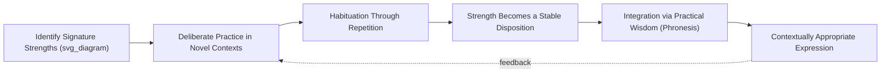

## Virtue Ethics as a Foundation for Character Strengths

### Overview

The VIA Classification of Character Strengths and Virtues (Peterson & Seligman, 2004), positive psychology's most systematic attempt to catalog positive traits, is explicitly grounded in Aristotelian virtue ethics rather than in the trait or consequentialist frameworks more common in mainstream personality and moral psychology. Understanding this philosophical lineage clarifies both the structure of the VIA classification and several of its more debated methodological choices.

### Aristotelian Foundations

#### Eudaimonia and Virtue as Activity, Not State

Aristotle's *Nicomachean Ethics* argues that the highest human good, *eudaimonia* (often translated "flourishing" or "happiness," though closer to "living well" or "faring well"), is achieved not through pleasure-seeking but through virtuous activity of the soul in accordance with reason, sustained over a complete life.

**Key Points**

- Crucially, virtue (*arete*) in this framework is a *disposition to act*, cultivated through habituation, not an innate trait or a momentary feeling. Aristotle's famous claim is that we become just by doing just acts, temperate by doing temperate acts — practice precedes character.
- Eudaimonia is explicitly evaluated over a whole life ("one swallow does not make a summer"), which distinguishes it sharply from momentary happiness or positive affect as measured by hedonic SWB instruments.

#### The Doctrine of the Mean

Aristotle characterizes each virtue as a mean between two vices — a deficiency and an excess of the same underlying trait:

| Virtue (Mean) | Deficiency | Excess |
| --- | --- | --- |
| Courage | Cowardice | Recklessness |
| Temperance | Insensibility | Self-indulgence |
| Generosity | Stinginess | Wastefulness |
| Proper Pride | Undue Humility | Vanity |

[Inference] The doctrine of the mean is occasionally invoked in positive psychology to argue that strengths can be "overused" (e.g., excessive honesty becoming tactlessness), a framing popularized in strengths-based coaching; this is a plausible extension of Aristotelian logic but is not identical to Aristotle's own doctrine, which concerns finding the appropriate point relative to a specific situation and person, not a fixed universal midpoint.

#### Phronesis: Practical Wisdom as the Integrating Virtue

Aristotle assigns a special role to *phronesis* (practical wisdom) — the capacity to discern the right action in a particular situation, integrating the other virtues and adapting them to context. Without phronesis, virtues risk becoming rigid rules applied mechanically rather than genuinely wise responses to circumstance.

**Example**

A person high in the character strength of "honesty" who lacks phronesis might deliver blunt, painful truths in situations where tact and timing matter (e.g., at a funeral), illustrating why VIA researchers treat wisdom-related strengths as playing a coordinating role relative to other strengths clusters, rather than functioning as merely one strength among equals.

### From Virtue Ethics to the VIA Classification

#### Methodology: The Cross-Cultural Virtue Survey

Peterson and Seligman explicitly modeled the VIA project on a virtue-ethics premise: that certain character strengths are valued across historical eras and cultures, suggesting they may reflect something like universal human excellences rather than culturally arbitrary preferences. To identify candidates, they surveyed philosophical and religious traditions including Aristotelian virtue ethics, Confucianism, Buddhism, Hinduism, Judaism, Christianity, Islam, and Athenian philosophy more broadly, looking for convergence.

This produced six proposed core virtues, each instantiated through specific measurable character strengths:

1. **Wisdom and Knowledge** — creativity, curiosity, judgment, love of learning, perspective
2. **Courage** — bravery, perseverance, honesty, zest
3. **Humanity** — love, kindness, social intelligence
4. **Justice** — teamwork, fairness, leadership
5. **Temperance** — forgiveness, humility, prudence, self-regulation
6. **Transcendence** — appreciation of beauty/excellence, gratitude, hope, humor, spirituality

**Key Points**

- The VIA framework treats the six virtues as the abstract, cross-culturally convergent categories, and the 24 strengths as the culturally-specific, measurable *routes* to those virtues — a structure directly analogous to Aristotle's own distinction between virtue as a general excellence and the specific habituated dispositions that express it.
- [Unverified] The claim of genuine cross-cultural universality has been challenged; critics argue the selection and clustering process involved substantial interpretive judgment by the (Western, English-speaking) research team, and that apparent convergence may partly reflect the categories chosen for comparison rather than an independently discovered natural structure.

#### Criteria for Strength Inclusion

Peterson and Seligman specified explicit inclusion criteria for a trait to count as a character strength, several drawn directly from virtue-ethics reasoning:

- **Fulfilling**: contributes to individual flourishing
- **Morally valued in its own right**: valued independent of beneficial outcomes it produces
- **Does not diminish others**: elevates witnesses rather than provoking envy
- **Has a nonfelicitous opposite**: clear antonym is negatively valenced
- **Trait-like**: demonstrates some stability across situations and time
- **Distinct**: not reducible to other strengths in the classification
- **Paragons**: exemplified by identifiable model individuals
- **Prodigies**: sometimes visible precociously in children
- **Selective absence**: notably absent in some individuals
- **Institutions**: supported by societal practices and rituals

[Inference] These criteria functionally operationalize Aristotelian requirements (virtue as intrinsically valued activity, virtue as a stable disposition rather than a one-off act, virtue as socially recognized excellence), though Peterson and Seligman also drew on empirical trait psychology in formulating them, making the VIA criteria a hybrid rather than a pure translation of Aristotle.

### Character Strengths as Habituated Dispositions

#### The Practice-Based Model of Strength Development

Consistent with Aristotelian habituation, VIA-informed interventions typically assume character strengths are *developed through repeated practice* rather than fixed traits measured once and treated as static:

**Example**

A standard VIA-based intervention ("use a signature strength in a new way") asks participants to identify a top strength (e.g., curiosity) via the VIA Inventory of Strengths (VIA-IS) self-report measure, then deliberately apply it in an unfamiliar context (e.g., a curious person exploring an unfamiliar cuisine or striking up conversations with strangers) for one week, tracking effects on well-being measures. [Unverified] Effect sizes reported for this specific intervention vary across replications and should not be generalized as a fixed, universal benefit.

#### Signature Strengths and Eudaimonic Engagement

The VIA framework's construct of "signature strengths" (the handful of strengths most central and effortless to a person's identity) is explicitly linked to eudaimonic rather than hedonic well-being: using a signature strength is theorized to produce authentic engagement and a sense of ownership, distinct from the pleasure derived from an unrelated enjoyable activity.

### Critiques of the Virtue-Ethics Foundation

**Key Points**

- **Situationist challenge**: Social psychology's situationist tradition (drawing on findings like the Milgram and bystander-effect literatures) has challenged the trait-stability assumption underlying virtue ethics generally, arguing behavior is more strongly predicted by situational factors than by stable character traits — a direct challenge to the VIA classification's "trait-like" inclusion criterion. [Inference: the situationist critique is a genuine, long-standing debate in moral psychology, not a fringe objection, though virtue ethicists have offered substantial responses.]
- **Western philosophical bias**: Although the VIA project surveyed non-Western traditions, its foundational structure (six virtues, discrete measurable strengths, individual-level assessment) mirrors Aristotelian categories more closely than, for instance, Confucian relational ethics, which resists decomposition into individually-possessed traits (see the "Buddhist, Confucian, and other Eastern contributions" material for the relational counter-model).
- **Measurement vs. metaphysics gap**: Aristotelian virtue is inseparable from lived practical judgment in context; self-report inventories like the VIA-IS necessarily measure a person's *belief about* their disposition rather than directly observing habituated virtuous action, a limitation acknowledged by strengths researchers themselves.

### Conclusion

Virtue ethics supplies the VIA Classification's core theoretical architecture: virtues as stable, habituated dispositions toward excellence; strengths as the specific culturally-inflected routes to those virtues; and practical wisdom as the integrating capacity that keeps strength expression contextually appropriate rather than rigid. This grounding distinguishes character-strengths research from purely trait-psychological approaches (e.g., the Big Five) by insisting that strengths are not just descriptively present but normatively valuable and developmentally cultivable — while also importing unresolved tensions from virtue ethics itself, including the situationist critique of trait stability and questions about the genuine cross-cultural universality Aristotle's framework is used to claim.

**Related Topics**

- The VIA Classification of Character Strengths and Virtues: full 24-strength taxonomy
- Phronesis (practical wisdom) and its role in wise strength deployment
- Signature strengths interventions and eudaimonic engagement
- The situationist critique of trait-based moral psychology
- Buddhist, Confucian, and other Eastern contributions to flourishing (comparative virtue frameworks)
- Defining happiness, well-being, and flourishing as constructs (hedonic vs. eudaimonic distinctions)
- Strengths-based coaching and organizational applications of VIA
- Critiques of universality claims in cross-cultural virtue research