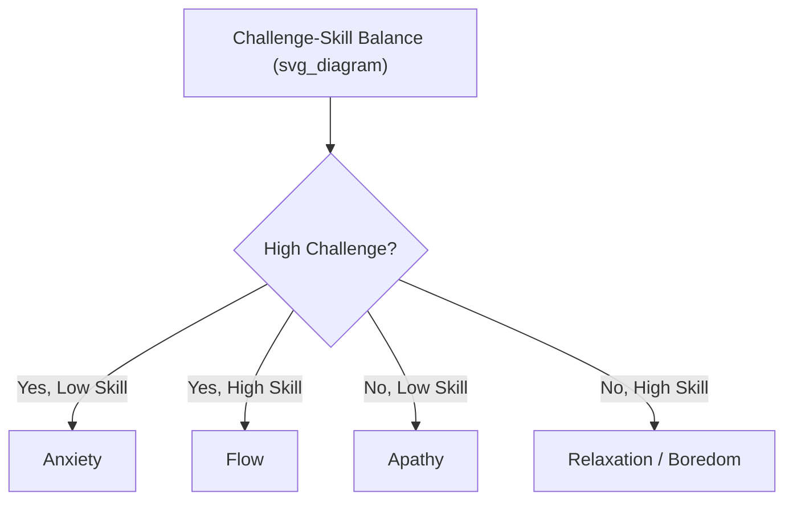

## Seligman's PERMA Model and Its Five Pillars

### Overview

Martin Seligman introduced the PERMA model in his 2011 book *Flourish*, marking a deliberate theoretical pivot from his earlier "authentic happiness" framework (centered on life satisfaction) toward a multidimensional theory of flourishing. PERMA proposes that well-being is not a single measurable entity but a construct composed of five distinct, independently pursued elements, each contributing to flourishing without being reducible to the others.

### Theoretical Rationale for a Multicomponent Model

#### Why Seligman Abandoned "Authentic Happiness" as the Target Construct

Seligman's earlier work had proposed life satisfaction as the gold-standard outcome measure for positive psychology. He later argued this was inadequate on two grounds: life satisfaction judgments are heavily weighted by current mood at the moment of reporting, and a single-score outcome cannot capture the plural, sometimes competing goods that constitute a well-lived life (e.g., a person might sacrifice momentary satisfaction for meaningful accomplishment).

**Key Points**

- This shift reflects a move from a purely hedonic target construct (SWB) toward an explicitly eudaimonic and pluralistic one, aligning PERMA more closely with Aristotelian and Ryff-style well-being models than with Diener's tripartite SWB framework.
- [Inference] The theoretical motivation for choosing exactly five elements (rather than four, six, or another number) reflects Seligman's specific inclusion criteria rather than a claim that five is a natural or mathematically necessary number of well-being dimensions; other researchers have proposed extensions (see PERMA+4 below).

#### Formal Inclusion Criteria

For an element to qualify as a PERMA pillar, Seligman specified it must:

1. Contribute to well-being
2. Be pursued by many people for its own sake, not merely as a means to another PERMA element
3. Be defined and measured independently of the other elements

This criterion set is explicitly borrowed from Aristotelian reasoning about what counts as an intrinsically valuable end (compare the virtue-ethics inclusion criteria used in the VIA Classification of Character Strengths).

### The Five Pillars

#### P — Positive Emotion

The hedonic component of PERMA, encompassing pleasant subjective states: joy, gratitude, serenity, interest, hope, pride, amusement, inspiration, awe, and love (per Barbara Fredrickson's taxonomy of positive emotions, which Seligman draws on directly).

**Key Points**

- Fredrickson's broaden-and-build theory provides the mechanistic backing for this pillar: positive emotions are theorized to broaden momentary thought-action repertoires (e.g., increasing exploratory behavior, creative association) and, over repeated experience, build durable psychological, social, and physical resources.
- Positive emotion is the one PERMA element most closely aligned with traditional hedonic SWB measures, meaning instruments like the PANAS can serve as a rough proxy for this pillar specifically, though PERMA measures it alongside four other elements rather than treating it as the sole outcome.

#### E — Engagement

Engagement refers to psychological absorption in an activity, most closely associated with Mihaly Csikszentmihalyi's flow construct — a state of complete absorption characterized by merged action and awareness, loss of self-consciousness, and distorted time perception.

**Example**

Flow is theorized to occur specifically at the intersection of high perceived challenge and high perceived skill:

[Inference] While flow is the dominant theoretical lens for the Engagement pillar, "engagement" in the PERMA-Profiler questionnaire is operationalized more broadly (e.g., items about absorption and losing track of time during daily activities) and does not require the full, relatively rare, "optimal experience" intensity of classic flow states — a distinction sometimes elided in popular treatments.

#### R — Relationships

Positive relationships refers to feeling supported, loved, and valued by others, reflecting decades of convergent evidence that social connection is among the most consistent predictors of well-being across populations and life stages.

**Key Points**

- Seligman explicitly cites the near-universal finding across well-being research that people rate their best moments, their greatest achievements, and their times of resilience as involving other people, making relationships a strong candidate for an intrinsically pursued good rather than merely an instrumental one.
- This pillar overlaps conceptually with Ryff's "Positive Relations with Others" dimension and with SDT's "relatedness" need, though PERMA does not adopt SDT's specific need-satisfaction mechanism as its explanatory model.

#### M — Meaning

Meaning involves belonging to and serving something larger than the self — a cause, a community, a spiritual or religious framework, or an institution that transcends individual interest.

**Key Points**

- Meaning is philosophically distinct from Positive Emotion: activities generating a strong sense of meaning (e.g., caregiving for a chronically ill family member, activism under adverse conditions) do not necessarily generate positive affect in the moment and may co-occur with significant distress, illustrating why PERMA treats these as separable pillars rather than a single hedonic-eudaimonic blend.
- Meaning research frequently distinguishes three sub-components: coherence (life makes sense), purpose (having overarching goals), and significance/mattering (life is inherently valuable) — a decomposition developed more fully outside PERMA (e.g., by Martela and Steger) but relevant to unpacking what the "M" pillar operationally contains.

#### A — Accomplishment

Accomplishment (sometimes rendered "Achievement") refers to the pursuit of success, mastery, and competence for its own sake — winning, achieving a goal, or completing something difficult — independent of whether it produces positive emotion, meaning, or relational benefit.

**Example**

Seligman's own illustrative case: competitive activities such as chess tournaments or amateur sports leagues, where participants report pursuing victory and mastery as ends in themselves, sometimes even in the absence of significant enjoyment during the effortful process itself.

[Inference] Accomplishment is arguably the pillar with the least independent theoretical development within positive psychology relative to the other four (each of which draws on a substantial pre-existing research program: Fredrickson for positive emotion, Csikszentmihalyi for engagement, decades of social-support research for relationships, and meaning-in-life research for meaning) — a point raised by some critics as a reason the "A" pillar can feel less theoretically grounded than the other four.

### Measurement: The PERMA-Profiler

Butler and Kern's PERMA-Profiler (2016) is the most widely used validated instrument operationalizing the model, comprising items across the five core pillars plus supplementary items for overall happiness, physical health, negative emotion, and loneliness (included as convergent/discriminant validity checks rather than as additional PERMA pillars).

| Domain | Sample Item Focus |
| --- | --- |
| Positive Emotion | Frequency of feeling joyful, contented |
| Engagement | Absorption, losing track of time |
| Relationships | Feeling loved, supported by others |
| Meaning | Sense of direction, worthwhile life |
| Accomplishment | Progress toward goals, sense of achievement |

[Unverified] Specific psychometric properties (internal consistency coefficients, test-retest reliability figures) vary by translated version and sample population; general factor structure has received support across multiple validation studies, but exact reliability statistics should be checked against the specific version and population in question rather than assumed to be fixed constants.

### Extensions and Critiques

#### PERMA+4 and Workplace/Organizational Extensions

Seligman and colleagues have proposed extensions incorporating additional elements relevant to specific domains (notably workplace flourishing), sometimes referred to as PERMA+4, adding factors such as physical health, mindset, environment, and economic security as contextual supports for the original five pillars rather than as core intrinsic elements themselves.

#### Structural and Conceptual Critiques

**Key Points**

- **Independence assumption challenged**: Critics note that the five pillars correlate substantially with one another in most empirical studies, raising the question of whether they represent genuinely distinct dimensions or facets of an underlying general well-being factor — a live psychometric debate rather than a settled matter. [Inference on the strength/interpretation of correlations, not on their existence, which is documented]
- **Absence of negative states**: PERMA is a model of positive functioning and does not directly incorporate the role of negative emotion, adversity, or resilience-under-stress, which some argue makes it an incomplete account of flourishing relative to dual-continua models (see Keyes) that explicitly position flourishing against illness and languishing.
- **Cultural specificity concerns**: Several pillars — particularly Accomplishment as an intrinsically pursued good, and Positive Emotion as a primary well-being target — may reflect individualist cultural assumptions not equally salient across collectivist contexts (compare the Confucian relational-flourishing model, where achievement and positive affect are more thoroughly embedded in role fulfillment rather than treated as separable personal goods).
- **The "for its own sake" criterion is difficult to verify empirically**: Whether a given person pursues, say, accomplishment purely for its own sake versus instrumentally (for relationships, status, or positive emotion) is not straightforwardly measurable via self-report, weakening the empirical testability of Seligman's formal inclusion criteria.

### Applications

**Example**

Workplace flourishing audits commonly map organizational interventions onto individual PERMA pillars: recognition programs (Accomplishment), team-building and psychological safety initiatives (Relationships), job redesign for absorption and autonomy (Engagement), mission/purpose communication (Meaning), and wellness or positive-culture initiatives (Positive Emotion). [Inference] The effectiveness of mapping interventions this cleanly onto single pillars in applied organizational settings is more asserted in practitioner literature than rigorously demonstrated in controlled workplace trials.

### Conclusion

PERMA reframed positive psychology's target outcome from a single hedonic construct (life satisfaction) to a five-dimensional profile of flourishing, explicitly incorporating both hedonic (Positive Emotion) and eudaimonic (Engagement, Meaning, Accomplishment) elements alongside the social dimension of Relationships. Its influence on applied positive psychology — particularly in education, workplace well-being, and coaching — has been substantial, though the model's assumption of pillar independence, absence of a negative-state dimension, and degree of cross-cultural generalizability remain active areas of empirical and theoretical scrutiny.

**Related Topics**

- Fredrickson's broaden-and-build theory of positive emotions
- Csikszentmihalyi's flow theory and the challenge-skill balance model
- Meaning in life: coherence, purpose, and significance frameworks
- The PERMA-Profiler: development, validation, and cross-cultural adaptations
- Keyes' dual-continua model of flourishing and languishing
- Defining happiness, well-being, and flourishing as constructs
- Virtue ethics as a foundation for character strengths
- Workplace and organizational applications of positive psychology models