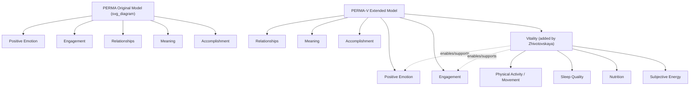

## Extensions to PERMA: PERMA-V and Physical Vitality

### Overview

PERMA-V is an extension of Seligman's original five-pillar PERMA model that adds a sixth element, **Vitality**, addressing physical health, energy, sleep, nutrition, and movement as a distinct contributor to flourishing. The Vitality component was added by Emiliya Zhivotovskaya, a positive psychology practitioner and founder of the Flourishing Center, rather than by Seligman himself, making PERMA-V a practitioner-driven extension rather than a revision to Seligman's original theoretical text. [Amazon](https://core-docs.s3.us-east-1.amazonaws.com/documents/asset/uploaded_file/4473/BCSSSD/3836821/Applied_Positive_Psychology_-_BCSSSD_-_PERMA-V_Model_.pdf)

### Rationale for Adding Vitality

#### The Gap in the Original PERMA Model

Seligman's original PERMA model is composed entirely of psychological and social constructs — none of the five original pillars (Positive Emotion, Engagement, Relationships, Meaning, Accomplishment) directly addresses the body as a distinct domain of flourishing, despite substantial independent evidence linking physical health behaviors to well-being outcomes.

**Key Points**

- Vitality is concerned with physical health and whether a person is moving throughout the day, along with overall physical feeling — positioning it as a body-based counterpart to the more cognitively- and emotionally-oriented original five pillars. [UMN Extension](https://extension.umn.edu/two-you-video-series/your-well-being-perma-v)
- The PERMA-V framework describes itself as covering emotional, physical, and relational aspects of life, explicitly framing Vitality as filling the "physical" gap left open by the original model. [Davidson Institute](https://www.davidsongifted.org/gifted-blog/perma-v-framework/)
- [Inference] Because Vitality was introduced as a practitioner and applied-coaching extension rather than through Seligman's own peer-reviewed theoretical work, it does not carry the same formal academic pedigree as the original five PERMA pillars, and should be understood as an influential adaptation rather than an official update to Seligman's published model.

#### Empirical Motivation: Correlations Between PERMA and Physical Health

Independent of the formal PERMA-V extension, empirical PERMA research had already identified physical health as an important correlate of the model's core elements. Research has shown significant positive associations between each of the PERMA components and physical health, vitality, job satisfaction, life satisfaction, and organizational commitment (Kern, Waters, Alder, & White, 2014), providing an empirical basis for treating vitality as conceptually adjacent to, though originally external to, the core PERMA architecture. [Positive Psychology](https://positivepsychology.com/perma-model/)

### The Sixth Pillar: Vitality Defined

The PERMA-V model expands the original PERMA framework to include a sixth component, Vitality, in acknowledgment of the importance of physical health and energy levels in maintaining overall well-being. This addition is intended to provide a more holistic and integrated approach to cultivating happiness and personal fulfillment. [The Pathfinder Coach](https://thepathfinder.org/perma-v-model/)[The Pathfinder Coach](https://thepathfinder.org/perma-v-model/)

**Key Points**

- Vitality is typically operationalized across several sub-domains: physical activity/movement, sleep quality and quantity, nutrition, and subjective energy levels — a broader construct than exercise alone.
- Unlike the original five pillars, which Seligman explicitly required to be pursued "for their own sake" as intrinsic goods, Vitality functions more as a *foundational enabling resource*: adequate sleep, movement, and nutrition are theorized to support capacity for engagement, positive emotion, and relationship quality, rather than necessarily being pursued as an intrinsic end in the way accomplishment or meaning are.
- [Inference] This distinction suggests Vitality may occupy a different theoretical role than the original five pillars — closer to a moderating or enabling condition for flourishing than a co-equal, independently-pursued element — though PERMA-V practitioner literature generally presents it as a peer pillar alongside the original five rather than drawing this distinction explicitly.

### Structural Comparison: PERMA vs. PERMA-V

### Related Extensions: PERMA-H and Other Variants

The proliferation of PERMA extensions reflects a broader pattern of researchers and practitioners adapting the base model for specific populations or domains:

| Variant | Added Element(s) | Typical Context |
| --- | --- | --- |
| PERMA-V | Vitality (physical health/energy) | Coaching, applied wellness programs |
| PERMA-H | Happiness/Health (varies by source) | Positive education research in school settings |
| PERMA+4 | Physical health, mindset, environment, economic security | Workplace/organizational flourishing |

[Unverified] Naming and composition of these variants is inconsistent across sources — "H" in PERMA-H, for instance, is defined differently by different research groups (sometimes "Health," sometimes "Happiness" as a general outcome measure) — so any specific PERMA-variant acronym should be checked against the specific source using it rather than assumed to have a single canonical definition.

### Applications in Clinical and Applied Settings

**Example**

PERMA-based positive psychology interventions have been trialed in clinical populations where physical vitality is directly compromised by illness, implicitly testing the relevance of a vitality-adjacent dimension even without formally adopting the PERMA-V label:

- A PERMA model-based intervention was tested in a randomized controlled trial for fear of stroke recurrence, producing significant reductions in fear alongside improvements in psychological capital, well-being, and quality of life. [nih](https://www.ncbi.nlm.nih.gov/pmc/articles/PMC11897238/)
- A PERMA-model intervention trial in inflammatory bowel disease patients found resilience and quality-of-life scores were significantly higher in the intervention group at the two-week post-discharge mark, with continued positive trends as the intervention duration increased. [nih](https://www.ncbi.nlm.nih.gov/pmc/articles/PMC12460469/)
- A PERMA-based intervention in perioperative patients with co-occurring conditions produced lower cancer-related fatigue scores and better overall health and functional domain scores after twelve weeks relative to a control group. [nih](https://www.ncbi.nlm.nih.gov/pmc/articles/PMC9377935/)

**Key Points**

- These clinical trials generally apply the *original* five-pillar PERMA framework rather than the formal PERMA-V extension, but their outcome measures (fatigue, quality of life, physical functioning) are precisely the domains PERMA-V's Vitality pillar is designed to make explicit — suggesting convergent practical interest in the psychological-physical link even where the formal six-pillar model isn't named.
- [Inference] The consistent involvement of physical-health-adjacent outcome measures across PERMA clinical trials indirectly supports the practical rationale for the PERMA-V extension, even though these specific studies were not designed as tests of the Vitality pillar itself.

### Critiques and Open Questions

**Key Points**

- **Boundary-drawing problem**: If Vitality is added because physical health influences well-being, a similar argument could justify adding many other domains (financial security, environmental quality, spiritual practice), raising the question of what principled boundary determines which enabling factors become formal "pillars" versus remaining background conditions — a concern paralleling critiques of PERMA+4's four additional factors.
- **Conflation of enabling conditions with intrinsic goods**: Seligman's original criteria required each PERMA element be pursued "for its own sake." Physical vitality is more plausibly instrumental (supporting other pillars) for most people, rather than an intrinsically pursued end in itself — a tension not fully resolved in PERMA-V practitioner literature. [Inference]
- **Lack of formal psychometric validation comparable to the PERMA-Profiler**: The original five-pillar model has a well-validated dedicated instrument (the PERMA-Profiler, Butler & Kern, 2016); PERMA-V, as an applied/coaching extension, does not appear to have an equivalently validated standalone measurement instrument in the same peer-reviewed tradition. [Unverified — absence of evidence is not conclusive, and this should be checked against current instrument-validation literature before being treated as a fixed limitation.]

### Conclusion

PERMA-V extends Seligman's original five-pillar model by adding Vitality — physical health, movement, sleep, and energy — as a sixth flourishing domain, addressing a body-focused gap in the original psychologically- and socially-oriented framework. Introduced by practitioner Emiliya Zhivotovskaya rather than by Seligman, PERMA-V has gained substantial traction in applied coaching and wellness contexts, and its practical relevance is indirectly supported by clinical PERMA intervention trials that consistently track physical-health-adjacent outcomes. It remains, however, a practitioner-driven adaptation rather than a formally validated academic revision, with open questions about its theoretical fit within Seligman's original "pursued for its own sake" criteria and about boundary-setting relative to other candidate enabling factors (as seen in competing extensions like PERMA-H and PERMA+4).

**Related Topics**

- Seligman's PERMA model and its five pillars (foundational framework)
- The PERMA-Profiler: development, validation, and measurement structure
- PERMA+4 and organizational/workplace flourishing extensions
- Physical activity, sleep, and nutrition research within positive psychology
- Broaden-and-build theory and the mechanism linking positive emotion to physical resources
- Positive psychology interventions in clinical and chronic-illness populations
- Cross-cultural and domain-specific adaptations of PERMA (e.g., PERMA-H in education)
- Defining happiness, well-being, and flourishing as constructs