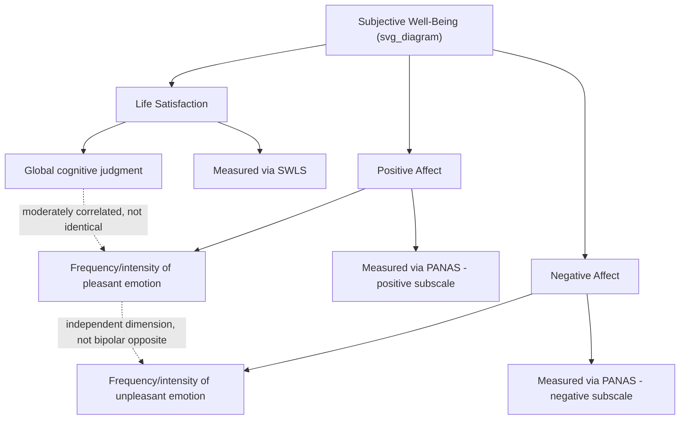

## Hedonic Well-Being and the Tripartite Model of Subjective Well-Being

### Overview

The tripartite model of subjective well-being (SWB), developed principally by Ed Diener beginning in the late 1970s and 1980s, is the dominant operationalization of hedonic well-being in psychological science. It decomposes "happiness" into three empirically distinguishable components — life satisfaction, positive affect, and negative affect — and has served as the primary outcome construct for a large share of positive psychology research prior to, and alongside, later multidimensional models like PERMA.

### Philosophical Grounding: Hedonism as a Well-Being Theory

#### The Hedonic Tradition

Hedonic well-being theory traces to philosophical hedonism, particularly Bentham's utilitarian felicific calculus, which holds that well-being consists in the balance of pleasure over pain. In this tradition, a good life is, by definition, one with more pleasant experience and evaluative satisfaction than unpleasant experience — there is no additional criterion (virtue, self-realization, meaning) required beyond this balance.

**Key Points**

- This positions hedonic well-being in direct philosophical contrast to eudaimonic theories (Aristotelian virtue ethics, Ryff's psychological well-being, SDT), which hold that a person could report high momentary pleasure while still living an unflourishing or inauthentic life.
- Diener's key methodological contribution was not inventing hedonism as a philosophy, but rather constructing a psychometrically rigorous, empirically tractable operationalization of it suitable for large-scale survey research.

### The Three Components

#### Component 1: Life Satisfaction (Cognitive-Evaluative)

Life satisfaction is a global cognitive judgment of one's life as a whole, evaluated against self-generated standards rather than externally imposed criteria. It is deliberately distinct from momentary affect — a person judges their life *as a whole*, integrating memory, comparison, and aspiration.

**Key Points**

- The dominant measurement instrument is Diener, Emmons, Larsen, and Griffin's Satisfaction with Life Scale (SWLS, 1985), a brief five-item self-report scale asking respondents to evaluate global life satisfaction (e.g., agreement with statements like "In most ways my life is close to my ideal").
- Life satisfaction judgments are influenced by comparison standards, which can shift depending on recent experience, social comparison targets, and cultural norms — meaning the same objective life circumstances can produce different satisfaction scores depending on the standard against which a respondent evaluates them. [Inference on the general mechanism; specific comparison-standard effects vary by study and context.]

#### Component 2: Positive Affect (Emotional)

Positive affect refers to the frequency and, to a lesser degree, intensity of pleasant emotional states experienced over a given reference period (momentary, daily, or over recent weeks, depending on the measure).

**Example**

The Positive and Negative Affect Schedule (PANAS; Watson, Clark, & Tellegen, 1988) operationalizes positive affect through adjective checklists (e.g., "interested," "excited," "enthusiastic," "proud," "inspired"), typically asking respondents to rate the extent to which they have felt each emotion over a specified time window.

**Key Points**

- Research consistently finds that the *frequency* of positive affective episodes predicts overall SWB more strongly than their *intensity* — experiencing mild positive emotion often is generally associated with higher SWB than experiencing intense positive emotion rarely. [Unverified: exact strength of this frequency-over-intensity effect varies across studies and should not be treated as a fixed numerical relationship.]

#### Component 3: Negative Affect (Emotional)

Negative affect refers to the frequency and intensity of unpleasant emotional states (e.g., sadness, anxiety, anger, guilt, fear) over the same reference period.

**Key Points**

- Positive and negative affect are measured as separate, only moderately (and sometimes weakly) correlated dimensions rather than as two poles of a single bipolar scale — a person can, in principle, report both high positive affect and high negative affect within the same time window (an "emotionally intense" profile), or low levels of both (a "flat affect" profile).
- This bidimensional structure (rather than a single pleasant-unpleasant continuum) is one of Diener's more influential methodological contributions, distinguishing SWB measurement from earlier single-dimension mood scales.

### The Tripartite Formula

The overall SWB score is conventionally computed as:

$$SWB = \text{Life Satisfaction} + \text{Positive Affect} - \text{Negative Affect}$$

**Key Points**

- Each component is measured and can be reported *independently*: the tripartite structure allows researchers to distinguish, for example, a person who is generally satisfied with life but experiences low daily positive affect (a stoic, low-arousal profile) from a person with high momentary positive affect but low overall life satisfaction (an impulsive, present-focused profile).
- Factor-analytic work supports treating these as related but distinguishable latent factors rather than a single unified "happiness" factor, which is the core empirical justification for the tripartite structure over a single-item happiness measure.

### Measurement Methodology

#### Global Retrospective Reports vs. Momentary Sampling

**Key Points**

- Standard SWB measurement (SWLS, PANAS administered as trait-level or recent-period recall) relies on retrospective self-report, which is subject to well-documented biases: current mood at the time of the survey can color recalled judgments (mood-congruent recall), and salient recent events can disproportionately weight a global judgment relative to the actual time-weighted average experience.
- The Experience Sampling Method (ESM) and Day Reconstruction Method (DRM), developed partly by Kahneman and colleagues, address these limitations by capturing affect at or near the moment of experience (ESM, via repeated prompts throughout the day) or through structured reconstruction of the previous day episode-by-episode (DRM), generally showing measurable divergence from single-timepoint global reports. [Inference: the degree of divergence varies by study population and measurement window, and should not be treated as a fixed correction factor.]

**Example**

A DRM administration typically asks a respondent to divide the previous day into discrete episodes (e.g., "commuting," "working on a project," "having dinner with family"), then rate affect experienced during each episode separately — producing a time-weighted affect profile that can then be compared against that same person's single global life-satisfaction judgment.

#### Cross-Cultural Measurement Considerations

[Unverified] Cross-national comparisons of SWLS and PANAS scores are complicated by documented cultural differences in response style (e.g., some cultures show a stronger tendency toward moderate/midpoint responding, others toward extreme responding) and by cultural variation in the desirability of expressing high positive affect; researchers generally recommend caution in direct cross-national score comparisons rather than treating raw scores as directly equivalent across cultures.

### Stability and Change: The Hedonic Treadmill

#### Set-Point Theory

Brickman and Campbell's hedonic treadmill hypothesis (1971) and subsequent set-point theory propose that SWB has a substantial trait-like, stable component — individuals tend to return toward a characteristic baseline following both positive and negative life events, implying that circumstantial interventions may produce only temporary SWB shifts.

**Key Points**

- Evidence for adaptation is strong for many common life events (income changes within a moderate range, moving to a nicer home, minor health changes) but notably weaker or absent for some major events — chronic unemployment, bereavement, and certain forms of disability have shown less complete adaptation in longitudinal studies than the strong version of set-point theory would predict.
- [Inference] This has led many contemporary researchers to favor a "soft" version of set-point theory (a meaningful stable component to SWB, with genuine but bounded potential for durable change) over the "hard" original version implying near-total inevitable reversion to baseline.

### Relationship to Other Well-Being Constructs

**Key Points**

- SWB (hedonic) is empirically correlated with, but conceptually and statistically distinguishable from, eudaimonic constructs like Ryff's Psychological Well-Being and SDT's need-satisfaction measures — factor-analytic studies generally find these load on related but separable factors rather than a single global well-being dimension.
- Within Seligman's PERMA model, the SWB tripartite structure maps most directly onto the single "Positive Emotion" pillar; PERMA's other four elements (Engagement, Relationships, Meaning, Accomplishment) are explicitly intended to capture aspects of flourishing that a purely hedonic SWB measure would miss.
- Keyes' dual-continua model of flourishing/languishing incorporates hedonic well-being (positive affect, life satisfaction) as one necessary component of "flourishing," but requires it to co-occur with positive social and psychological functioning — treating hedonic SWB as necessary but not sufficient for his definition of flourishing.

### Critiques of the Hedonic/Tripartite Approach

**Key Points**

- **Narrowness critique**: Critics (including Seligman himself, in motivating the shift to PERMA) argue that maximizing a hedonic SWB score does not capture goods like meaning or accomplishment that people pursue even at the cost of momentary satisfaction or pleasant affect.
- **Adaptation undermines circumstantial validity**: If SWB substantially reverts to a stable baseline regardless of life circumstances, this raises questions about the sensitivity of SWB as an outcome measure for evaluating policy interventions or life-circumstance changes, since apparent null long-term effects may reflect measurement/adaptation dynamics rather than a true absence of welfare impact. [Inference]
- **Response-style and cultural confounds**: As noted above, cross-cultural and even within-culture individual differences in response style can introduce systematic measurement noise into SWB comparisons that is sometimes underacknowledged in applied research using these instruments.

### Conclusion

The tripartite model of subjective well-being operationalizes hedonic well-being through three empirically distinguishable components — life satisfaction, positive affect, and negative affect — providing the dominant quantitative framework for happiness research since the late twentieth century. While methodologically rigorous and extensively validated, the model's philosophical hedonism (defining well-being purely in terms of pleasure and satisfaction) has drawn sustained critique from eudaimonic and multidimensional theorists, motivating later frameworks like Ryff's Psychological Well-Being model, Self-Determination Theory, and Seligman's PERMA — each of which retains a role for hedonic SWB (typically as one component among several) while arguing it is insufficient as a complete account of flourishing.

**Related Topics**

- Defining happiness, well-being, and flourishing as constructs
- The Satisfaction with Life Scale (SWLS) and PANAS: development and psychometrics
- Set-point theory and the hedonic treadmill hypothesis
- Experience Sampling Method and Day Reconstruction Method
- Ryff's six-factor model of psychological well-being (eudaimonic counterpart)
- Seligman's PERMA model and its five pillars
- Keyes' dual-continua model of flourishing and languishing
- Cross-cultural measurement invariance in well-being research