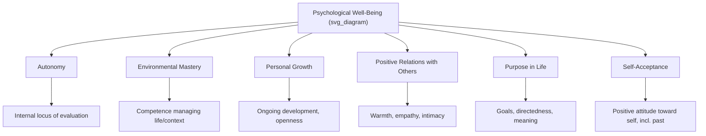

## Ryff's Six-Factor Model of Psychological Well-Being

### Overview

Carol Ryff's model of Psychological Well-Being (PWB), introduced in 1989, is one of the most influential and empirically validated eudaimonic well-being frameworks in positive psychology. It was constructed explicitly as a theoretically-grounded alternative to atheoretical hedonic well-being measures, synthesizing multiple strands of humanistic, developmental, and clinical psychology into six distinct dimensions of positive psychological functioning.

### Theoretical Origins and Motivation

#### Critique of Existing Well-Being Measurement

Ryff's foundational argument was that dominant well-being measures of the 1980s — chiefly Diener-style subjective well-being scales assessing life satisfaction and affect balance — lacked an explicit theoretical account of what psychological well-being actually consists of. She argued these measures were constructed largely through empirical item clustering rather than derived from a substantive theory of positive human functioning.

**Key Points**

- Ryff's response was to synthesize existing theories of positive functioning that, while individually well-established in clinical and developmental psychology, had not previously been integrated into a single empirically testable model.
- The resulting six dimensions were derived by identifying convergent themes across the source theories described below, then constructing measurable operationalizations of each theme.

#### Source Theories Synthesized into the Model

| Source Theory | Theorist | Contribution to PWB Model |
| --- | --- | --- |
| Self-actualization | Maslow | Personal Growth, Purpose in Life |
| Fully-functioning person | Rogers | Self-Acceptance, Autonomy |
| Individuation | Jung | Personal Growth, integration of self |
| Psychosocial stage theory | Erikson | Purpose in Life (generativity/integrity), Positive Relations |
| Maturity | Allport | Autonomy, Positive Relations, Purpose |
| Mental health criteria | Jahoda | Environmental Mastery, Self-Acceptance |
| Eudaimonia | Aristotle | Overarching framework — well-being as realized potential, not pleasure |

[Inference] This synthesis approach means the six PWB dimensions are not derived from a single unified theory but represent Ryff's judgment about which recurring themes across multiple, independently-developed theories of positive functioning deserved inclusion — a strength in terms of convergent theoretical support, but also a point where critics have argued the selection process involved unavoidable interpretive choices.

### The Six Dimensions in Detail

#### 1. Autonomy

Self-determination and independence; the capacity to resist social pressure and evaluate oneself by internal rather than externally imposed standards.

**Key Points**

- High scorers are described as self-determining, independent, and able to resist social pressures to think or act in certain ways; they regulate behavior from within and evaluate themselves by personal standards.
- Low scorers are concerned with others' expectations and evaluations, rely on others' judgments to make important decisions, and conform to social pressure to think and act in certain ways.
- [Inference] Autonomy in Ryff's sense should not be conflated with social isolation or independence from relationships — it concerns the *source of one's evaluative standards*, not the presence or absence of close relationships, a distinction sometimes lost in casual discussion of the construct.

#### 2. Environmental Mastery

The sense of competence in managing one's life and effectively navigating and shaping one's surrounding context to suit personal needs and values.

**Key Points**

- High scorers have a sense of mastery and competence in managing the environment, control complex arrays of external activities, make effective use of surrounding opportunities, and are able to choose or create contexts suitable to their personal needs and values.
- Low scorers have difficulty managing everyday affairs, feel unable to change or improve their surrounding context, are unaware of surrounding opportunities, and lack a sense of control over the external world.

#### 3. Personal Growth

A sense of continued development, openness to new experience, and realization of one's potential over time.

**Key Points**

- High scorers have a feeling of continued development, see themselves as growing and expanding, are open to new experiences, and have a sense of realizing their potential, with continual improvement seen in the self and behavior over time.
- Low scorers have a sense of personal stagnation, lack a feeling of improvement or expansion over time, feel bored and uninterested with life, and feel unable to develop new attitudes or behaviors.
- [Inference] Personal Growth is the dimension most explicitly tied to a developmental, process-oriented (rather than static, trait-like) conception of well-being — it treats ongoing change and improvement as intrinsically valuable, distinguishing it from dimensions that assess a person's current stable state (e.g., Self-Acceptance).

#### 4. Positive Relations with Others

Warm, satisfying, trusting relationships with others, and the capacity for empathy, affection, and intimacy.

**Key Points**

- High scorers have warm, satisfying, trusting relationships with others, are concerned about the welfare of others, are capable of strong empathy, affection, and intimacy, and understand the give-and-take of human relationships.
- Low scorers have few close, trusting relationships with others, find it difficult to be warm, open, and concerned about others, are isolated and frustrated in interpersonal relationships, and are unwilling to make compromises to sustain important ties with others.

#### 5. Purpose in Life

A sense that life is meaningful and directed, with goals that give life significance.

**Key Points**

- High scorers have goals in life and a sense of directedness, feel there is meaning to present and past life, hold beliefs that give life purpose, and have aims and objectives for living.
- Low scorers lack a sense of meaning in life, have few goals or aims, lack a sense of direction, do not see purpose in their past life, and have no outlook or beliefs that give life meaning.

#### 6. Self-Acceptance

A positive attitude toward oneself, including acknowledgment and acceptance of multiple aspects of the self — both positive and negative — and of one's past life.

**Key Points**

- High scorers possess a positive attitude toward themselves, acknowledge and accept multiple aspects of self, including good and bad qualities, and feel positive about their past life.
- Low scorers feel dissatisfied with themselves, are disappointed with what has occurred in their past life, are troubled about certain personal qualities, and wish to be different than what they are.
- This dimension most directly parallels humanistic psychology's concept of unconditional positive self-regard, distinguishing it from self-esteem measures that may be more contingent on specific achievements or external validation.

### Structural Overview

### Measurement: The Ryff Scales of Psychological Well-Being

#### Instrument Structure and Versions

The Ryff Scales exist in several lengths — from a very brief 3-items-per-dimension version (18 items total) to a longer 20-items-per-dimension version (120 items total), with intermediate versions (e.g., 9 items per dimension) also in common use. Each item is rated on a Likert-type agreement scale, and items are balanced with both positively- and negatively-worded statements per dimension to reduce acquiescence response bias.

**Key Points**

- The tradeoff between scale length versions is a standard psychometric one: shorter versions reduce respondent burden and survey length but typically show somewhat lower internal consistency reliability per subscale than longer versions.
- [Unverified] Specific reliability coefficients (e.g., Cronbach's alpha) for each subscale and version vary meaningfully across published studies and populations; any specific number should be checked against the particular scale version and sample in question rather than treated as a fixed property of "the Ryff Scales" as a whole.

#### Factor Structure Debates

**Key Points**

- While the six-factor structure has received broad support across numerous studies, some psychometric investigations have found that certain dimension pairs — most commonly Self-Acceptance and Environmental Mastery, and separately Purpose in Life and Personal Growth — show stronger inter-correlations than the theoretically fully independent six-factor model would predict, leading some researchers to propose higher-order or reduced-factor alternatives.
- [Inference] This does not invalidate the six-dimension conceptual framework, which remains theoretically useful for identifying specific areas of strength or difficulty in applied and clinical contexts, but it does suggest the six factors may not be fully orthogonal (statistically independent) in the way an idealized six-factor model would require.

### Applications

#### Clinical and Health Psychology

Ryff's model has been extensively used in health psychology research, including studies linking PWB dimensions to biological markers of health (e.g., cortisol regulation, inflammatory markers, cardiovascular risk factors) in the "biopsychosocial" tradition of well-being research — most notably through Ryff's own long-running involvement in the MIDUS (Midlife in the United States) longitudinal study.

**Example**

A clinical application: an older adult presenting with low Purpose in Life and low Personal Growth scores despite adequate Environmental Mastery and Self-Acceptance might be a candidate for a targeted intervention (e.g., a life-review or generativity-focused program) rather than a broad, undifferentiated well-being intervention — illustrating the practical value of the six-dimension structure for diagnostic specificity relative to a single global well-being score.

#### Positive Aging Research

The model has been particularly influential in gerontological and lifespan-development research, where dimensions like Purpose in Life and Personal Growth have been studied in relation to successful aging, given that these dimensions do not assume a trajectory of continuous external achievement, unlike some accomplishment-oriented well-being frameworks.

### Comparison to Other Well-Being Frameworks

| Framework | Structural Approach | Overlap with Ryff's PWB |
| --- | --- | --- |
| Diener's SWB (hedonic) | 3 components: life satisfaction, positive affect, negative affect | Correlated but conceptually distinct; PWB is explicitly eudaimonic |
| Self-Determination Theory | 3 basic needs: autonomy, competence, relatedness | Shares "Autonomy" terminology; SDT proposes causal mechanism, Ryff describes outcome dimensions |
| Seligman's PERMA | 5 pursued elements: positive emotion, engagement, relationships, meaning, accomplishment | Partial overlap (Relationships↔Positive Relations, Meaning↔Purpose in Life); PERMA includes hedonic element PWB does not |
| Keyes' Mental Health Continuum | Combines hedonic + social + psychological well-being | Directly incorporates Ryff's PWB dimensions as its "psychological well-being" component |

**Key Points**

- Keyes' influential dual-continua flourishing model explicitly incorporates Ryff's six PWB dimensions (alongside social well-being dimensions and hedonic SWB) as one of three components required for a "flourishing" classification, representing one of the more direct integrations of Ryff's framework into a broader flourishing model.

### Critiques and Limitations

**Key Points**

- **Individualist framing of Autonomy**: As with SDT and PERMA, the centrality of Autonomy (defined via internal evaluative standards and resistance to social pressure) has drawn cross-cultural critique, particularly relative to more relationally-embedded or role-based conceptions of maturity found in Confucian and other collectivist frameworks, where deference to social expectation and relational role fulfillment may be positively valued rather than treated as an indicator of lower psychological well-being.
- **Selection of source theories**: Because the six dimensions were synthesized from a specific set of largely mid-twentieth-century Western humanistic and developmental theories, some critics argue the model reflects the theoretical commitments of that particular era and tradition rather than a culture-neutral account of psychological flourishing. [Inference]
- **Dimension non-independence**: As discussed above, several dimension pairs show stronger empirical correlation than a fully orthogonal six-factor model would predict, an ongoing subject of psychometric refinement rather than a settled critique.

### Conclusion

Ryff's six-factor model of Psychological Well-Being operationalizes eudaimonic flourishing through a theoretically synthesized set of dimensions — Autonomy, Environmental Mastery, Personal Growth, Positive Relations with Others, Purpose in Life, and Self-Acceptance — each grounded in an established tradition of humanistic or developmental psychology and unified under an Aristotelian eudaimonic framework. Its explicit theoretical derivation, extensive validation history (including biological correlates via studies like MIDUS), and integration into later frameworks like Keyes' dual-continua model have made it one of the most enduring and widely applied well-being instruments in the field, notwithstanding ongoing debates about dimension independence and cross-cultural applicability of its individualist assumptions.

**Related Topics**

- Eudaimonic well-being and psychological functioning (broader theoretical context)
- Self-Determination Theory: organismic integration and motivation types
- Hedonic well-being and the tripartite model of subjective well-being
- Keyes' dual-continua model of flourishing and languishing
- Virtue ethics as a foundation for character strengths
- MIDUS and biopsychosocial well-being research
- Positive aging and lifespan development frameworks
- Cross-cultural critiques of individualist well-being frameworks