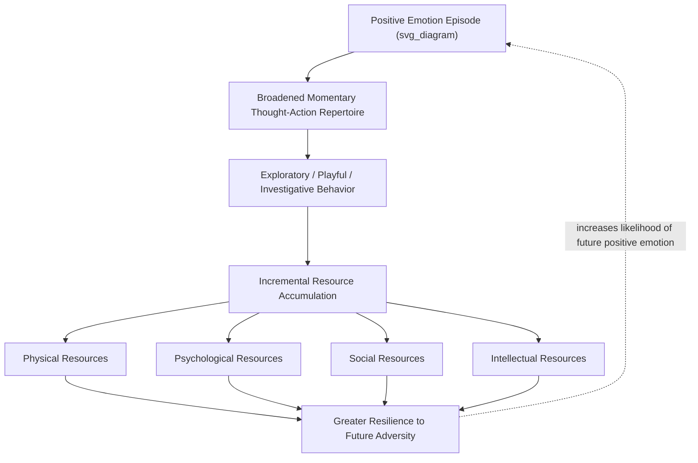

## Broaden-and-Build Theory of Positive Emotions

### Overview

Broaden-and-build theory, developed by Barbara Fredrickson beginning in the late 1990s, is the dominant functional account of positive emotions within positive psychology. It proposes that positive emotions, unlike negative emotions, broaden an individual's momentary thought-action repertoire and, through repeated experience over time, build durable personal resources — psychological, social, intellectual, and physical — that outlast the initiating emotional episode itself.

### Theoretical Motivation

#### The Problem: Existing Emotion Theory Was Built for Negative Emotions

Classical functionalist accounts of emotion (rooted in evolutionary psychology) explain negative emotions well through specific action tendencies: fear prompts flight, anger prompts attack, disgust prompts expulsion — each a narrow, evolutionarily adaptive response to a specific threat requiring rapid, focused action.

**Key Points**

- Fredrickson observed that this specific-action-tendency model fits negative emotions naturally but fails to explain positive emotions, which do not map onto equally narrow, specific action tendencies — joy does not prompt a single specific behavior in the way fear prompts flight.
- This mismatch motivated Fredrickson to propose a distinct functional model for positive emotions rather than attempting to force them into the negative-emotion action-tendency template.

### The Broaden Hypothesis

#### Core Claim

Fredrickson's central theoretical claim is that positive emotions broaden an individual's momentary thought-action repertoire — the range of cognitions and behaviors that come to mind as options in a given moment — in contrast to negative emotions, which narrow this repertoire toward a specific, survival-relevant response.

| Emotion Type | Momentary Effect on Thought-Action Repertoire | Example |
| --- | --- | --- |
| Fear | Narrows toward escape-related cognitions/actions | Urge to flee, narrowed visual attention to threat |
| Anger | Narrows toward attack-related cognitions/actions | Urge to confront, narrowed focus on antagonist |
| Joy | Broadens toward exploratory, playful cognitions/actions | Urge to play, explore, engage creatively |
| Interest | Broadens toward information-seeking, exploratory engagement | Urge to investigate, learn, absorb |
| Contentment | Broadens toward savoring, integrative reflection | Urge to savor current circumstances, integrate experience |

**Example**

Fredrickson and Branigan's (2005) experimental paradigm used brief film clips to induce specific emotions, then measured participants' generated lists of things they would like to do in that moment (a "twenty statements" style measure of thought-action repertoire breadth). Participants in induced joy and contentment conditions generated broader, more varied action lists than those in neutral, fear, or anger conditions, supporting the broadening hypothesis experimentally. [Unverified: exact effect sizes and replication rates for this specific paradigm vary across the broader experimental literature and should be checked against current meta-analytic evidence rather than treated as a single fixed effect.]

#### Broadened Attention and Cognition

**Key Points**

- Positive emotion inductions have been associated in experimental studies with broadened visual attention (e.g., increased global relative to local processing on perceptual tasks) and more flexible, inclusive categorization on cognitive tasks, consistent with the broadening hypothesis at the level of basic cognitive processing, not only self-reported behavioral intentions.
- [Inference] The precise boundary conditions under which broadening effects reliably occur (e.g., emotion intensity thresholds, individual difference moderators) are an active area of ongoing research rather than fully specified in the original theory.

### The Build Hypothesis

#### From Momentary Broadening to Durable Resources

The theory's second, longer-timescale claim is that the broadened cognitive and behavioral exploration prompted by positive emotions, repeated across many discrete emotional episodes over time, incrementally builds durable resources that persist well beyond the initiating emotional state.

#### The Four Resource Categories

- **Physical resources** — e.g., cardiovascular health and physical skill developed through positive-emotion-driven play and exploratory physical activity in childhood and beyond
- **Psychological resources** — e.g., resilience, optimism, sense of identity, and coping flexibility developed through varied cognitive and emotional exploration
- **Social resources** — e.g., friendships, social support networks, and attachment bonds developed through play-driven and affiliative social exploration prompted by positive emotion
- **Intellectual resources** — e.g., knowledge, problem-solving skill, and cognitive complexity developed through curiosity-driven exploratory learning

**Key Points**

- The build hypothesis reframes positive emotions from being merely pleasant end-states to being *functionally instrumental*: they are theorized to have been evolutionarily selected because the resources they help build increase an organism's long-term survival and reproductive fitness, distinguishing this from a purely hedonic account where positive emotion has value only in the moment it is felt.
- This resource-building process is theorized to operate largely outside conscious awareness or explicit intention — a child at play is not consciously building future social skill, but the exploratory behavior positive emotion prompts has this effect as a byproduct.

### The Upward Spiral Hypothesis

#### Positive Emotions and Resources as Mutually Reinforcing

Fredrickson and colleagues extended the theory with the "upward spiral" hypothesis: because built resources (resilience, social support, skill) make future positive emotional experiences more likely, and those future positive emotions build further resources, a self-reinforcing cycle can develop over time, in principle predicting a compounding, longitudinal trajectory of increasing well-being for individuals who experience sufficient early positive emotion.

**Key Points**

- Longitudinal studies testing this hypothesis have generally found supportive evidence for reciprocal relationships between positive emotion and resource growth (e.g., resilience, social connectedness) over time, though [Inference] the strength, consistency, and generalizability of "spiral" effects across different populations and timescales remains an area of ongoing empirical refinement rather than a fully established universal law.
- The upward spiral concept has direct clinical and intervention relevance: it provides a theoretical rationale for why relatively brief positive emotion interventions (e.g., gratitude exercises, loving-kindness meditation) might, in principle, produce effects that compound over time rather than remaining limited to the immediate post-intervention period.

### The Undoing Hypothesis

#### Positive Emotions as a Physiological Antidote to Negative Emotion

A related extension, the "undoing hypothesis," proposes that positive emotions can help "undo" the lingering cardiovascular and physiological aftereffects of negative emotional arousal (e.g., elevated heart rate and blood pressure following stress or fear) by prompting a faster return to physiological baseline.

**Example**

In a representative experimental paradigm, participants are first exposed to a stress-inducing task (elevating cardiovascular arousal), then shown film clips designed to induce either a positive emotion (contentment, amusement), a neutral state, or continued negative/sad affect; participants in the positive-emotion conditions have shown faster cardiovascular recovery to baseline relative to neutral or negative-emotion conditions in multiple published studies. [Unverified: specific recovery-time figures and effect magnitudes vary across studies and should be checked against the specific paradigm and population before being cited as a fixed quantity.]

**Key Points**

- The undoing hypothesis provides one of broaden-and-build theory's more direct physiological, non-self-report-dependent lines of supporting evidence, strengthening the theory's empirical grounding beyond purely subjective or behavioral-intention measures.

### The Positivity Ratio Controversy

#### Fredrickson and Losada's Original Claim

A widely publicized extension of broaden-and-build theory, developed with mathematician Marcial Losada, proposed a specific quantitative "positivity ratio" (frequently cited as approximately 3:1, positive-to-negative emotional experiences) as a tipping point above which individuals and teams would experience flourishing, derived using nonlinear dynamics modeling.

**Key Points**

- This specific quantitative claim was subsequently subjected to serious mathematical critique. Nick Brown, Alan Sokal, and Harris Friedman published a detailed 2013 critique arguing that the mathematical modeling underlying the specific 3:1 ratio was invalid — the nonlinear dynamics equations borrowed from fluid dynamics were argued to have been applied to psychological data in a manner without theoretical or empirical justification for the specific numerical threshold.
- Following this critique, Fredrickson herself publicly acknowledged that the specific mathematical modeling supporting the exact 3:1 ratio was unsound, while maintaining that the broader, non-quantified claim that a favorable ratio of positive to negative emotion is beneficial for flourishing remains supported by other lines of evidence.
- [Unverified] The current standing of any *specific* positivity ratio number in the broader field is contested, and readers should treat claims of a precise universal numerical threshold (e.g., "you need X positive emotions per negative emotion") with substantial skepticism, distinct from the more general and better-supported broaden-and-build claims described above regarding directional, non-quantified effects of positive emotion frequency.

**Key Points**

- This episode is frequently cited as a cautionary case study in positive psychology regarding the risks of over-extending an otherwise well-supported qualitative theory into precise, opaque mathematical formalism without sufficiently transparent statistical justification — while properly not undermining the broader broaden-and-build framework itself, which rests on separate and more robust experimental and physiological evidence.

### Relationship to Other Positive Psychology Frameworks

**Key Points**

- Broaden-and-build theory provides the primary mechanistic explanation underlying the "Positive Emotion" pillar of Seligman's PERMA model, giving that pillar a specific functional account beyond simply "feeling good."
- The theory is frequently invoked as the mechanistic rationale for gratitude interventions, loving-kindness meditation, and savoring practices — techniques theorized to work partly by increasing the frequency of momentary positive emotional episodes, which in turn (per the build hypothesis) accumulate into durable resources over time.
- The theory's resource-building claim resonates with, though is distinct from, Ryff's Personal Growth and SDT's competence-need constructs, in that all three frameworks treat ongoing development and capacity-building as central to well-being, albeit through different mechanisms.

### Applications

**Example**

A resilience-building intervention grounded in broaden-and-build theory might combine daily brief positive-emotion-inducing practices (e.g., structured gratitude journaling, savoring exercises, brief loving-kindness meditation) delivered consistently over an extended period, on the theoretical rationale that repeated, even mild, positive emotional episodes will incrementally build psychological and social resources rather than expecting any single session to produce a durable effect.

### Critiques and Limitations

**Key Points**

- **The positivity ratio controversy** (above) represents the most prominent specific critique, though it targets a particular quantitative extension rather than the qualitative broaden-and-build framework itself.
- **Correlational limits on long-term "build" claims**: While experimental evidence robustly supports the short-term broaden hypothesis (e.g., film-clip-induced broadening of attention and cognition), the longer-timescale build and upward-spiral claims rely more heavily on longitudinal correlational designs, which cannot fully rule out reverse-causal or third-variable explanations (e.g., that people with more resources simply experience more positive emotion, rather than the reverse). [Inference on the relative strength of causal evidence at different theoretical timescales; the existence of this evidentiary asymmetry is a recognized methodological point in the literature.]
- **Potential in some contexts for maladaptive positivity**: Critics of broader "positivity" trends within positive psychology (not specific to Fredrickson's theory alone) have raised concerns that an uncritical emphasis on maximizing positive emotion could, in some contexts, discourage appropriate processing of genuinely difficult circumstances — a concern more directly addressed by dual-continua and negative-emotion-inclusive models (e.g., Keyes' framework, or research on the adaptive functions of negative emotion) than by broaden-and-build theory itself, which does not claim negative emotions are dysfunctional.

### Conclusion

Broaden-and-build theory provides positive psychology's leading functional account of why positive emotions matter beyond momentary pleasure: they broaden thought-action repertoires in the moment and, cumulatively, build durable physical, psychological, social, and intellectual resources that support long-term resilience and well-being. While its central broaden and build hypotheses retain substantial experimental and physiological support (including the undoing hypothesis's cardiovascular evidence), the theory's most publicized quantitative extension — the Losada positivity ratio — was subject to a well-documented mathematical retraction, serving as an important case study in the need for methodological caution when translating qualitative psychological theory into precise numerical claims.

**Related Topics**

- Seligman's PERMA model and its five pillars (Positive Emotion pillar mechanism)
- Csikszentmihalyi's flow theory and the challenge-skill balance model
- Gratitude interventions and savoring practices
- Loving-kindness meditation and compassion-focused practices
- The Losada positivity ratio controversy and methodological critique
- Resilience theory and resource-based models of coping
- Keyes' dual-continua model of flourishing and languishing
- Hedonic well-being and the tripartite model of subjective well-being