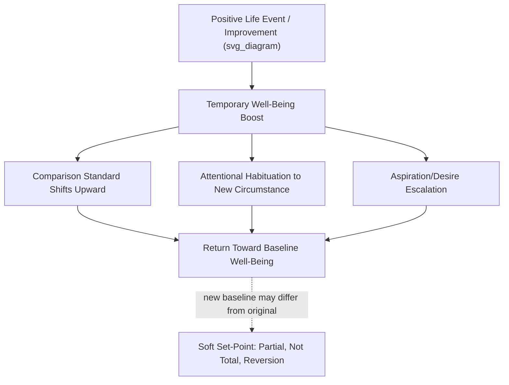

## Hedonic Adaptation, the Happiness Set-Point, and Sustainable Happiness Models

### Overview

Hedonic adaptation research addresses one of positive psychology's most consequential empirical questions: why do people tend to return toward baseline levels of happiness after both positive and negative life changes, and what does this imply for the possibility of durably increasing well-being? This body of work spans the original hedonic treadmill hypothesis, subsequent set-point theory refinements, and later sustainable happiness models that attempt to identify which interventions can produce lasting, rather than merely temporary, well-being gains.

### The Hedonic Treadmill Hypothesis

#### Origins: Brickman and Campbell (1971)

Philip Brickman and Donald Campbell proposed the hedonic treadmill (originally termed the "hedonic relativism" position) to explain a puzzling empirical pattern: objectively significant positive and negative life events often produced smaller and shorter-lived effects on reported well-being than intuition would predict.

**Key Points**

- The core metaphor is a treadmill: people work to improve their circumstances (income, possessions, status), and while achieving these improvements can produce a temporary boost in well-being, continued adaptation eventually returns subjective experience to something resembling the prior baseline — analogous to walking on a treadmill without net forward progress.
- The theoretical mechanism proposed was that judgments of well-being are relative rather than absolute — people evaluate current circumstances against an internal, adapting reference point shaped by prior experience, rather than against a fixed external standard.

#### The Lottery Winners and Accident Victims Study

**Example**

Brickman, Coates, and Janoff-Bulman's frequently cited 1978 study compared lottery winners, individuals who had experienced paralyzing accidents (paraplegia/quadriplegia), and a control group on measures of present happiness and anticipated future happiness. Contrary to strong intuitive predictions of large lasting differences, lottery winners were not found to be dramatically happier than controls, and accident victims — while reporting lower current happiness than controls — retained relatively high ratings of anticipated future happiness. [Unverified: this specific classic study has a small sample size by contemporary standards and its precise numerical findings should be treated as illustrative of the broader adaptation phenomenon rather than as a definitive, precisely replicated effect size; the general adaptation pattern it illustrates, however, is corroborated by considerably larger subsequent literatures.]

**Key Points**

- This study became one of positive psychology's most widely cited illustrations of hedonic adaptation, though its role in popular science writing has sometimes overstated the certainty and magnitude of its specific findings relative to what the original small-sample study can support.

### Set-Point Theory: A More Formal Development

#### The Trait-Like Component of Well-Being

Subsequent research, particularly drawing on twin and longitudinal studies, proposed that a substantial portion of variance in baseline subjective well-being reflects a stable, trait-like component — sometimes attributed partly to heritable temperament — around which momentary well-being fluctuates in response to life events before reverting.

**Key Points**

- [Unverified] Specific percentage breakdowns of variance attributable to genetic/temperamental factors versus life circumstances versus intentional activity (e.g., commonly cited figures like "50% genetic, 10% circumstances, 40% intentional activity") derive from a particular influential theoretical synthesis rather than a single definitive study, and later researchers — including some of the original proponents — have cautioned against treating these specific percentages as precise, universally applicable constants.
- Twin studies examining heritability of subjective well-being generally find a meaningful heritable component, though heritability estimates are population-and-method-dependent statistics describing variance within a specific studied population, not fixed properties of "happiness" as a trait, and should not be interpreted as claiming a fixed percentage of any individual's happiness is unchangeable.

#### Evidence Against a "Hard" Universal Set-Point

**Key Points**

- Longitudinal panel studies conducted in subsequent decades have found that set-point reversion is not universal across all life events: some categories of experience — including prolonged unemployment, the death of a spouse or child, and certain forms of chronic disability or chronic pain — have shown incomplete adaptation over multi-year follow-up periods in various studies, with well-being remaining measurably below pre-event baseline longer than the original strong treadmill hypothesis would predict.
- Individual differences in adaptation rate and completeness have also been documented — not all individuals return to baseline at the same rate or to the same degree following comparable events, undermining a strictly uniform, individual-invariant set-point model.
- [Inference] These findings have led the field toward a "soft" version of set-point theory: there is a meaningful, at least partly stable component to individual baseline well-being, but the degree, universality, and permanence of reversion following major life events is more variable and event-specific than the original strong hedonic treadmill formulation proposed.

### Mechanisms of Hedonic Adaptation

#### Comparison-Standard Shifts

One proposed mechanism is that the internal standard against which a person evaluates their circumstances shifts to incorporate the new circumstance as a baseline, such that a formerly novel positive change (e.g., a nicer home) eventually becomes the new "normal" against which further changes are judged, reducing its ongoing hedonic impact.

#### Attention and Habituation

**Key Points**

- A second proposed mechanism involves attentional habituation: repeated or constant exposure to a stimulus (positive or negative) tends to reduce the amount of conscious attention allocated to it over time, and since positive affect is theorized to depend partly on active, attended appraisal of circumstances, reduced attention to an unchanging positive circumstance is proposed to reduce its ongoing affective impact. [Inference: this is one proposed cognitive mechanism among several under discussion in the adaptation literature, not a single confirmed sole cause.]

#### Aspiration Escalation (The "Hedonic Treadmill" in the Narrower Sense)

A related but distinct mechanism specific to material and achievement-related circumstances: as a person's circumstances improve, their aspirations and desires may escalate correspondingly (e.g., a raise leading to a taste for a higher standard of living that itself becomes a new baseline expectation), meaning the *gap* between current state and aspiration — theorized by some models to be a proximal driver of satisfaction — does not necessarily narrow even as absolute circumstances improve.

### Sustainable Happiness Models

#### Lyubomirsky, Sheldon, and Schkade's Architecture of Sustainable Change

Sonja Lyubomirsky, Kennon Sheldon, and David Schkade's influential model proposes that not all sources of happiness are equally susceptible to adaptation, distinguishing between:

- **Circumstances** — relatively static life conditions (income level, marital status, geographic location, physical attractiveness) theorized to be highly susceptible to adaptation because they are typically constant, singular states rather than ongoing varied experiences.
- **Intentional activities** — chosen, effortful practices and behaviors (gratitude practice, kindness acts, goal pursuit, savoring) theorized to be comparatively more resistant to adaptation because they can be varied, actively chosen, and repeated in different forms over time, preventing the habituation associated with static circumstances.

**Key Points**

- The theoretical rationale for why intentional activities resist adaptation more than circumstances centers on variability and effortful engagement: a person can vary *how* they express gratitude or kindness from day to day, while a fixed circumstance (e.g., a particular salary level or house) presents an unchanging stimulus that habituation processes act upon more readily.
- [Unverified] The proposed division of variance across this model (frequently summarized in popular accounts using specific percentage splits attributed to genetics, circumstances, and intentional activity) should be treated with the same caution noted above regarding precise heritability/variance percentages — the qualitative distinction between circumstance-based and activity-based happiness sources has received more consistent empirical support than any specific numerical partition of variance.

#### Implications for Positive Psychology Interventions

**Key Points**

- This model provides the primary theoretical justification for positive psychology's emphasis on intentional practice-based interventions (gratitude journaling, acts of kindness, savoring exercises, strength-use interventions) over circumstance-based approaches (income increases, material acquisition) as strategies for producing durable rather than merely temporary well-being change.
- [Inference] Empirical support for the *durability* of specific intentional-activity interventions varies considerably by study, intervention type, dosage, and follow-up duration — some randomized controlled trials show effects persisting at follow-up assessments, others show effects that fade over time similarly to circumstance-based changes, meaning the sustainable-happiness model's core prediction (activities resist adaptation better than circumstances) should be treated as a general, well-motivated hypothesis under continued empirical testing rather than a uniformly confirmed law with guaranteed durability for any given intervention.

### Variety and Novelty as Adaptation-Resistant Strategies

**Example**

Research on variety-based interventions has tested whether varying the specific form of a positive activity (e.g., performing a different type of kind act each week rather than the same act repeatedly) slows adaptation relative to a fixed, repeated version of the same activity — a design directly derived from the sustainable happiness model's variability rationale. [Unverified: findings across specific variety-intervention studies are mixed, and the degree to which introduced variety meaningfully slows adaptation compared to a well-matched control condition varies by study design and outcome measure.]

### Relationship to Other Well-Being Constructs

**Key Points**

- Hedonic adaptation research is most directly relevant to hedonic subjective well-being (Diener's tripartite model), since adaptation processes are most clearly documented for life satisfaction and affect measures; the degree to which eudaimonic well-being constructs (Ryff's PWB, SDT's need satisfaction) show equivalent adaptation dynamics has received comparatively less direct research attention. [Inference]
- The soft set-point model is broadly compatible with Keyes' dual-continua flourishing model in that both frameworks accommodate meaningful individual stability in baseline functioning while allowing for genuine, non-trivial change under the right conditions — neither model requires treating well-being as either fully fixed or fully malleable.

### Critiques and Limitations

**Key Points**

- **Overgeneralization risk in popular treatments**: Popular science writing has sometimes presented set-point theory and specific variance percentages as more settled and precise than the underlying research literature supports, a pattern noted by several researchers within the field itself, including some of the theory's original proponents in later, more qualified writings.
- **Incomplete adaptation for major negative events**: As noted above, the strong version of the hedonic treadmill hypothesis is not well supported for certain major negative life events, meaning claims that "people always return to baseline" should be treated as an overstatement of the actual longitudinal evidence.
- **Difficulty separating adaptation from other explanations**: Apparent "adaptation" in longitudinal data can be difficult to cleanly distinguish from other explanations, such as measurement regression to the mean, cohort effects, or genuine cognitive reappraisal/coping (which may represent adaptive psychological growth rather than mere hedonic numbing) — the interpretation of a given adaptation pattern is not always straightforward. [Inference]

### Conclusion

Hedonic adaptation research demonstrates that subjective well-being is substantially, though not entirely, self-correcting following both positive and negative life changes — a finding with significant implications for how positive psychology approaches intervention design. The field has moved from Brickman and Campbell's original strong hedonic treadmill hypothesis toward a more nuanced "soft" set-point model acknowledging incomplete adaptation for major negative events and meaningful individual variation, while Lyubomirsky and colleagues' sustainable happiness model provides the leading theoretical framework explaining why intentional, variable activities may produce more durable well-being gains than static circumstantial improvements — a distinction that continues to shape the design and evaluation of positive psychology interventions.

**Related Topics**

- Hedonic well-being and the tripartite model of subjective well-being
- Positive psychology interventions: gratitude, kindness, and savoring practices
- Twin studies and heritability research on subjective well-being
- Keyes' dual-continua model of flourishing and languishing
- Broaden-and-build theory of positive emotions
- Cognitive appraisal and coping theory
- Longitudinal panel methods in well-being research
- Eudaimonic well-being and psychological functioning