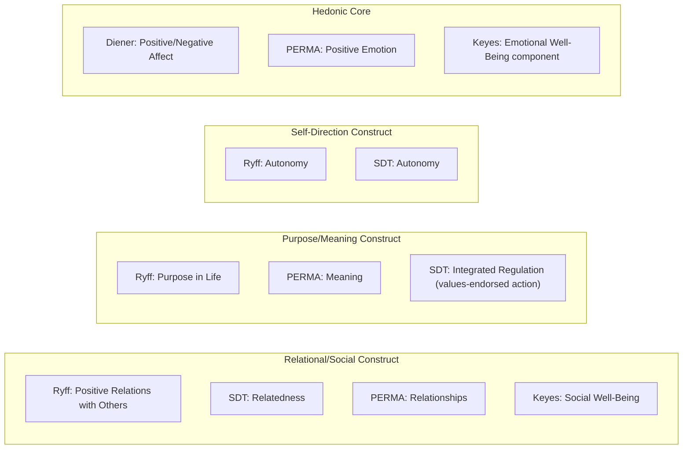

## Comparing and Integrating Competing Models of Flourishing

### Overview

Positive psychology has produced multiple, partially overlapping theoretical models of flourishing — hedonic SWB, Ryff's Psychological Well-Being, Self-Determination Theory, Seligman's PERMA, and Keyes' dual-continua model, among others — each developed with different philosophical commitments, inclusion criteria, and measurement traditions. This section synthesizes the preceding models into a comparative framework and examines the major attempts to integrate them into a more unified account of flourishing.

### Why Multiple Models Persist

#### Different Starting Questions Produce Different Models

**Key Points**

- Each major model was constructed to answer a somewhat different underlying question: Diener's SWB asks "how does this person evaluate and feel about their life?"; Ryff's PWB asks "what does good psychological functioning look like?"; SDT asks "what causal conditions produce good functioning?"; PERMA asks "what are the intrinsically pursued goods that, together, constitute flourishing?"; Keyes asks "how do we classify someone's overall mental health status?"
- [Inference] This divergence in founding questions, rather than pure empirical disagreement about facts, explains much of why the field has not converged on a single dominant model — the frameworks are not strictly competing explanations of the same phenomenon so much as differently-scoped theoretical projects that happen to overlap substantially in subject matter.

### Comparative Table of Major Models

| Model | Philosophical Tradition | Structure | Core Mechanism/Claim | Primary Measure |
| --- | --- | --- | --- | --- |
| SWB (Diener) | Hedonic | 3 components (life satisfaction, positive affect, negative affect) | Well-being = evaluative judgment + affect balance | SWLS, PANAS |
| PWB (Ryff) | Eudaimonic | 6 dimensions of functioning | Well-being = realized potential across specific domains | Ryff Scales |
| SDT (Deci & Ryan) | Eudaimonic | 3 basic needs | Needs satisfaction causally produces well-being | Basic Needs Satisfaction Scale |
| PERMA (Seligman) | Mixed hedonic/eudaimonic | 5 independently pursued elements | Flourishing = profile across 5 intrinsically valued goods | PERMA-Profiler |
| Dual-Continua (Keyes) | Integrative/clinical | 2 orthogonal axes (mental illness, mental health) | Flourishing = high hedonic + social + psychological functioning, illness absent or present independently | Mental Health Continuum–Short Form |

### Structural Overlaps Across Models

#### Mapping Shared Constructs

Despite differing origins, several constructs recur across models under different names, suggesting partial convergence on similar underlying territory even where formal theoretical integration has not occurred:

**Key Points**

- The recurrence of relational, purpose/meaning, self-direction, and hedonic-affect constructs across nearly every major model provides indirect convergent evidence that these represent genuinely important dimensions of flourishing, largely independent of which specific theoretical lineage a researcher started from.
- [Inference] However, apparent terminological overlap (e.g., "Autonomy" in both Ryff and SDT) does not guarantee full conceptual equivalence — Ryff's Autonomy describes a stable trait-like outcome dimension, while SDT's Autonomy describes a need whose satisfaction is theorized to causally produce that and other outcomes; researchers should verify operational definitions rather than assuming identical constructs merely because labels match.

### Points of Genuine Theoretical Tension

#### Hedonic Inclusion vs. Exclusion

**Key Points**

- A central point of disagreement is whether hedonic positive affect belongs as a core, intrinsically valuable component of flourishing (as in PERMA and Keyes' model) or should be treated as analytically separate from "true" eudaimonic flourishing (a stance closer to strict Aristotelian purism, and implicit in some readings of Ryff's model, which does not include a dedicated hedonic-affect dimension).
- This is not merely semantic: it has direct measurement consequences, since a purely eudaimonic instrument (like the Ryff Scales) could classify someone as high in psychological well-being despite low positive affect, while PERMA or Keyes-based measures would weight that low affect as a genuine deficit.

#### Independence vs. Interdependence of Dimensions

**Key Points**

- PERMA's formal inclusion criteria require that each pillar be measurable and pursued independently of the others; empirically, however, PERMA pillars show substantial intercorrelation, similarly to the dimension non-independence debates noted for Ryff's six factors. This raises a shared methodological question across multiple models: are these genuinely orthogonal (statistically independent) dimensions, or facets of a smaller number of broader underlying factors (e.g., a general "flourishing" factor with some specific facet variance)? [Inference: this remains a live psychometric question rather than one with a single settled answer across all models.]

#### Individual-Level vs. Relational/Role-Based Flourishing

**Key Points**

- Nearly all major Western positive psychology models (SWB, PWB, SDT, PERMA) locate flourishing primarily within the individual, even when relationships are included as a component (e.g., PERMA's Relationships pillar, Ryff's Positive Relations dimension) — flourishing is still fundamentally a property attributed to a person.
- This contrasts with Confucian and other relationally-embedded philosophical frameworks (see the Eastern philosophical roots material), where flourishing is constituted through role fulfillment within relationships rather than merely supported by good relationships as one input among several to an individually-owned outcome.
- [Inference] This represents one of the more significant unresolved tensions in cross-cultural applications of Western flourishing models, rather than a purely academic distinction, since it can affect measurement validity and intervention design in more collectivist cultural contexts.

### Attempts at Integration

#### Keyes' Dual-Continua Model as a Partial Integration

Keyes' framework represents the most direct formal attempt to integrate multiple prior constructs: it explicitly incorporates hedonic well-being (emotional well-being, drawing on SWB-style measures), Ryff's psychological well-being dimensions, and a distinct category of social well-being (belonging, contribution, coherence, actualization, and acceptance at the societal level) into a single "flourishing" classification, while keeping mental illness status as a conceptually separate, non-mutually-exclusive axis.

**Key Points**

- This integration is structural rather than fully theoretical — Keyes combines existing validated components into a composite classification system, rather than deriving a new unified causal theory explaining why these specific components, and not others, constitute flourishing.
- The Mental Health Continuum–Short Form (MHC-SF), the primary measurement instrument for this model, has become one of the more widely used integrative flourishing measures precisely because it operationalizes multiple prior theoretical traditions (hedonic, Ryff-style eudaimonic, and social well-being) within a single instrument.

#### PERMA as an Attempted Comprehensive Synthesis

Seligman's PERMA model can itself be read as an integration attempt: it deliberately incorporates a hedonic element (Positive Emotion) alongside eudaimonic elements (Engagement, drawing on flow theory; Meaning, drawing on purpose research; Accomplishment, drawing on achievement motivation) and a relational element (Relationships), aiming for comprehensiveness within a five-element structure.

[Inference] Whether PERMA succeeds as a genuine theoretical integration, versus a pragmatically useful checklist assembled for applied and coaching contexts, remains debated; its formal inclusion criteria (each element pursued for its own sake, independently measurable) provide a principled rationale for the five-element structure, but critics note the criteria are difficult to empirically verify and the specific choice of exactly five elements (rather than four, six, or a different combination) has not been derived from a single overarching mechanism in the way SDT's three needs are derived from organismic-dialectical theory.

#### A General Latent Well-Being Factor Hypothesis

**Key Points**

- Some psychometric researchers have proposed that the substantial intercorrelations observed both within models (e.g., across Ryff's six dimensions, or PERMA's five pillars) and across models (e.g., between SWB and PWB measures) may partly reflect a single, broad underlying "general well-being" factor, with the specific named dimensions/pillars representing narrower facets of that broader factor plus model-specific measurement variance.
- [Unverified] The extent to which a single general factor can adequately account for cross-model correlations, versus these correlations reflecting genuinely important but related distinct constructs, is an active empirical and statistical debate (paralleling debates in personality psychology about general factors versus specific traits), and should not be treated as a settled conclusion in either direction.

### A Practical Framework for Choosing Among Models

**Key Points**

- **Research or clinical classification purposes** (e.g., population mental health surveillance, distinguishing flourishing from languishing from illness): Keyes' dual-continua model and MHC-SF are typically favored for their explicit clinical-classification structure and incorporation of illness status as a separate axis.
- **Applied coaching, workplace, or educational intervention design**: PERMA and its extensions (PERMA-V, PERMA+4) are frequently favored for their intuitive, actionable five-to-six element structure suited to intervention planning, despite weaker formal psychometric independence than some alternatives.
- **Basic research on causal mechanisms of motivation and functioning**: SDT is typically favored for its explicit, testable causal mechanism (needs satisfaction) and extensive experimental and cross-domain literature.
- **Research emphasizing developmental or lifespan psychological functioning**: Ryff's PWB model remains a strong choice given its extensive validation history and connections to biological and health-outcome research (e.g., via MIDUS).
- **Cross-cultural or non-Western contexts**: Researchers increasingly recommend supplementing or adapting any of the above individually-centered models with attention to relational and role-based flourishing constructs drawn from non-Western philosophical traditions, given the individualist assumptions embedded in most standard instruments. [Inference on the strength of this recommendation as a field-wide consensus, though the underlying concern about individualist bias is well-documented in the cross-cultural literature.]

### Conclusion

No single model of flourishing has achieved uncontested dominance in positive psychology, and this plurality reflects genuine differences in the theoretical questions each model was built to answer rather than simple empirical disagreement. Comparative analysis reveals substantial convergence on core dimensions — relational connection, purpose/meaning, self-direction, and hedonic affect recur across nearly every framework — while also surfacing persistent tensions around whether hedonic and eudaimonic well-being should be integrated or kept conceptually distinct, whether proposed dimensions are genuinely independent or facets of a broader general factor, and whether individually-centered Western models adequately capture relationally-embedded conceptions of flourishing found in other philosophical traditions. Practical model selection is best guided by the specific research, clinical, or applied purpose at hand rather than by seeking a single universally superior framework.

**Related Topics**

- Defining happiness, well-being, and flourishing as constructs
- Keyes' dual-continua model of flourishing and languishing
- Seligman's PERMA model and its five pillars
- Ryff's six-factor model of psychological well-being
- Self-Determination Theory: autonomy, competence, and relatedness
- Buddhist, Confucian, and other Eastern contributions to flourishing
- Cross-cultural measurement invariance in well-being research
- General factor models in personality and well-being psychometrics