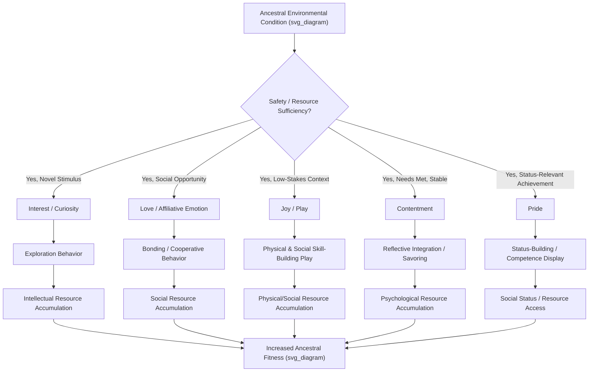

## The Function and Evolutionary Significance of Positive Emotions

### Overview

Evolutionary approaches to positive emotion ask a question distinct from purely descriptive or phenomenological accounts: why would natural selection have favored the capacity to experience joy, interest, contentment, pride, or love, given the substantial metabolic and cognitive costs of maintaining an emotional system at all? This chapter examines the major evolutionary-functional theories of positive emotion, their proposed adaptive mechanisms, and the methodological challenges inherent in testing evolutionary claims about subjective experience.

### The Evolutionary Puzzle of Positive Emotion

#### Why Negative Emotions Were Easier to Explain First

Evolutionary psychology developed compelling functional accounts of negative emotions well before doing the same for positive emotions. Fear's function (prompting rapid escape from threat), disgust's function (prompting avoidance of contamination), and anger's function (prompting assertive response to violation) map onto clear, specific survival-relevant action tendencies with obvious fitness benefits.

**Key Points**

- Positive emotions resisted this same specific-action-tendency framework: joy does not correspond to one specific adaptive behavior in the way fear corresponds to flight, making an evolutionary account of positive emotion's function a genuinely harder theoretical problem than the negative-emotion case.
- This asymmetry in tractability is part of why systematic evolutionary theorizing about positive emotion emerged later and remains, in some respects, less settled than corresponding negative-emotion theory. [Inference: this is a claim about the historical development and relative maturity of the two research programs, not a claim that negative-emotion evolutionary theory is itself fully settled or uncontroversial.]

### Broaden-and-Build Theory as an Evolutionary Account

#### Fredrickson's Fitness-Based Rationale

Barbara Fredrickson's broaden-and-build theory (detailed in the preceding chapter) is explicitly framed as an evolutionary-functional account: positive emotions are proposed to have been selected because the broadened thought-action repertoires and resource-building behaviors they prompt (play, exploration, affiliation, savoring) reliably increased ancestral survival and reproductive fitness over evolutionary time, even though the immediate hedonic experience is not itself the fitness-relevant outcome.

**Key Points**

- Under this account, positive emotion is theorized to function as a proximate psychological mechanism whose ultimate (evolutionary) function is resource accumulation — physical fitness through play, social bonds through affiliative positive emotion, and knowledge/skill through curiosity-driven exploration — rather than as an end unto itself from a fitness perspective.
- [Inference] This framing positions pleasure itself as evolutionarily incidental to (rather than the direct target of) selection — selection is theorized to have acted on the behaviors positive emotion motivates, with the subjective pleasantness serving as the proximate psychological lever that reliably produces those behaviors, a distinction with some conceptual similarity to debates in evolutionary biology more broadly about proximate versus ultimate causation.

### Specific Positive Emotions and Their Proposed Evolved Functions

#### Joy and Play

**Key Points**

- Joy is theorized to have evolved in connection with safe, resource-secure conditions, motivating play behavior that, particularly in juveniles across many mammalian species, builds physical coordination, social skill, and creative problem-solving capacity without the immediate pressure of survival-critical stakes.
- Comparative and developmental research on play behavior across species (not exclusive to positive-psychology research specifically) provides convergent, cross-species evidence for the general adaptive-play hypothesis, lending some support to joy's proposed evolutionary function via a broader biological literature beyond human self-report studies. [Inference on the precise degree of continuity between animal play research and specifically human joy, which involves some interpretive extrapolation across species.]

#### Interest and Curiosity

**Key Points**

- Interest is theorized to motivate exploration and information-seeking behavior under conditions of novelty and manageable uncertainty, building knowledge and skill (intellectual resources, in broaden-and-build terms) that provide downstream survival advantages in unpredictable environments.
- This connects to broader evolutionary theorizing about the adaptive value of exploratory behavior and information-gathering in variable environments, a concept with parallels in behavioral ecology's exploration-exploitation tradeoff research on foraging behavior in non-human animals.

#### Contentment

**Key Points**

- Contentment is theorized to arise under conditions of safety and resource sufficiency, motivating savoring, integration, and consolidation of recent experience into a coherent worldview and self-concept, rather than continued active striving — functioning, in this account, as a signal that immediate needs are met and that reflective, integrative cognitive processing can safely occur.

#### Love and Attachment-Related Positive Emotion

**Key Points**

- Love (encompassing romantic attachment, parental bonding, and broader affiliative positive emotion) is theorized to have evolved to promote and maintain the durable social bonds necessary for successful long-term pair-bonding, cooperative offspring-rearing, and broader social alliance formation — all of which have well-established evolutionary fitness benefits in social species, supported by a large independent literature in evolutionary and attachment psychology beyond positive-psychology-specific research.
- [Inference] The precise boundary between "love" as a single evolved emotional category versus a cluster of related but evolutionarily distinct sub-mechanisms (romantic attraction, pair-bond maintenance, parental attachment, platonic affiliation) remains an active area of theoretical discussion in affective and evolutionary psychology, rather than a fully resolved taxonomic matter.

#### Pride

**Key Points**

- Pride is theorized by some evolutionary psychologists to function as an internally-experienced status-tracking signal, motivating behaviors that build and display socially valued competence or achievement, with downstream implications for social status and, in ancestral environments, associated access to resources and mating opportunities. Some researchers additionally distinguish "authentic" pride (linked to effort/achievement) from "hubristic" pride (linked to global self-aggrandizement), proposing these may have partially distinct evolutionary and social functions. [Unverified: the authentic/hubristic pride distinction and its specific evolutionary mechanisms remain an active research program rather than uniformly settled findings.]

### Structural Summary

### Methodological Challenges in Testing Evolutionary Claims

#### The General Problem of Testing Evolutionary Psychological Hypotheses

**Key Points**

- Evolutionary claims about psychological traits face a well-documented methodological challenge across the broader field of evolutionary psychology (not specific to positive emotion research): ancestral environments cannot be directly observed or experimentally manipulated, meaning evolutionary functional hypotheses are typically supported by convergent indirect evidence (cross-species comparison, cross-cultural universality, developmental emergence patterns, physiological mechanisms) rather than by direct experimental tests of the original selective pressures.
- [Inference] This means evolutionary-functional accounts of positive emotion, including broaden-and-build theory's evolutionary framing, should be understood as well-motivated and evidence-consistent theoretical narratives rather than as directly experimentally proven historical claims about specific ancestral selective pressures — a limitation broadly acknowledged within evolutionary psychology as a field, not a criticism unique to positive-emotion research specifically.

#### Cross-Cultural Universality as Indirect Evolutionary Evidence

**Key Points**

- One common evidentiary strategy is demonstrating cross-cultural universality of basic positive emotion expression and recognition (facial expression research in the tradition of Ekman and colleagues, though this research tradition has itself faced methodological critique and revision over time), on the logic that traits shared across highly diverse cultural contexts are more plausibly evolved rather than purely culturally constructed.
- [Unverified] The strength and interpretation of cross-cultural facial-expression-recognition findings has been a subject of significant methodological debate in recent decades, including questions about experimental design (e.g., forced-choice emotion labeling tasks) and the degree to which apparent universality reflects genuine evolved commonality versus methodological artifacts of the research paradigms used; this is an active area of revision within affective science rather than settled consensus in either direction.

### Distinguishing Evolutionary Function from Present-Day Adaptiveness

**Key Points**

- A conceptually important distinction in evolutionary theorizing generally, directly relevant to positive emotion research: a trait's proposed evolutionary function (why it was selected in ancestral environments) does not guarantee the trait remains equally adaptive in contemporary environments, which differ substantially from the ancestral conditions under which the trait evolved (a mismatch commonly discussed in evolutionary psychology under the concept of "evolutionary mismatch").
- [Inference] For example, even if pride's proposed status-signaling function was ancestrally adaptive, its expression and consequences in modern social-media-mediated status competition may operate under substantially different dynamics than the ancestral small-group contexts in which the mechanism is theorized to have evolved — an extrapolation, not a directly established empirical finding specific to positive-emotion research.

### Relationship to Broader Positive Psychology Theory

**Key Points**

- Evolutionary-functional theorizing about positive emotion provides the deepest causal-explanatory layer beneath broaden-and-build theory, offering an "ultimate cause" account (why positive emotions exist at all, from a selection perspective) that complements broaden-and-build's more proximate, mechanistic account (how positive emotions function moment-to-moment and cumulatively within an individual's lifespan).
- This evolutionary framing also provides an implicit rationale for why positive emotions are not simply hedonic "bonuses" but are proposed to have played a functionally important role in ancestral survival and reproduction — supporting positive psychology's broader argument that positive emotion deserves serious scientific study in its own right, rather than being treated merely as the absence of negative emotion or as psychologically peripheral relative to threat-response systems.

### Critiques and Open Questions

**Key Points**

- **Adaptationist overreach risk**: As with evolutionary psychology generally, there is a risk of constructing plausible-sounding "just-so" adaptive narratives for any observed trait without sufficiently rigorous, falsifiable empirical testing — a general methodological caution raised by critics of evolutionary psychology as a field, applicable to positive-emotion-specific evolutionary claims as well.
- **Underdetermination of specific mechanisms**: Multiple, sometimes conflicting, evolutionary accounts can often be constructed to explain the same observed positive emotion pattern, and current evidence frequently underdetermines which specific evolutionary narrative is correct relative to plausible alternatives. [Inference]
- **Cultural variation complicates universal claims**: While cross-cultural convergence is often cited as evidence for evolved status, meaningful cultural variation in the triggers, expression norms, and social consequences of specific positive emotions (e.g., pride's social acceptability varies considerably across individualist versus collectivist cultural contexts) complicates any simple universal evolutionary narrative and requires more nuanced gene-culture interaction models than a purely universal-adaptation account would suggest.

### Conclusion

Evolutionary approaches to positive emotion propose that joy, interest, contentment, love, and pride were favored by natural selection not because pleasant subjective experience is itself the target of selection, but because these emotions reliably motivate behaviors — play, exploration, bonding, savoring, status-building — that build resources with genuine ancestral fitness value, a claim most fully developed within Fredrickson's broaden-and-build framework. While this evolutionary layer provides a compelling "ultimate cause" complement to more proximate mechanistic theories of positive emotion, it inherits the broader methodological challenges of evolutionary psychology as a field: the difficulty of directly testing claims about ancestral selective pressures, the risk of underdetermined or overly flexible adaptive narratives, and the need to reconcile claims of universal evolved function with substantial documented cross-cultural variation in emotional expression and meaning.

**Related Topics**

- Broaden-and-build theory of positive emotions
- Cross-cultural research on emotional expression and recognition
- Evolutionary psychology methodology and the adaptationist debate
- Play behavior and its developmental functions across species
- Attachment theory and the evolutionary psychology of love and bonding
- Pride, shame, and status-signaling emotions
- Positive emotions and physiological stress recovery (the undoing hypothesis)
- Comparing and integrating competing models of flourishing