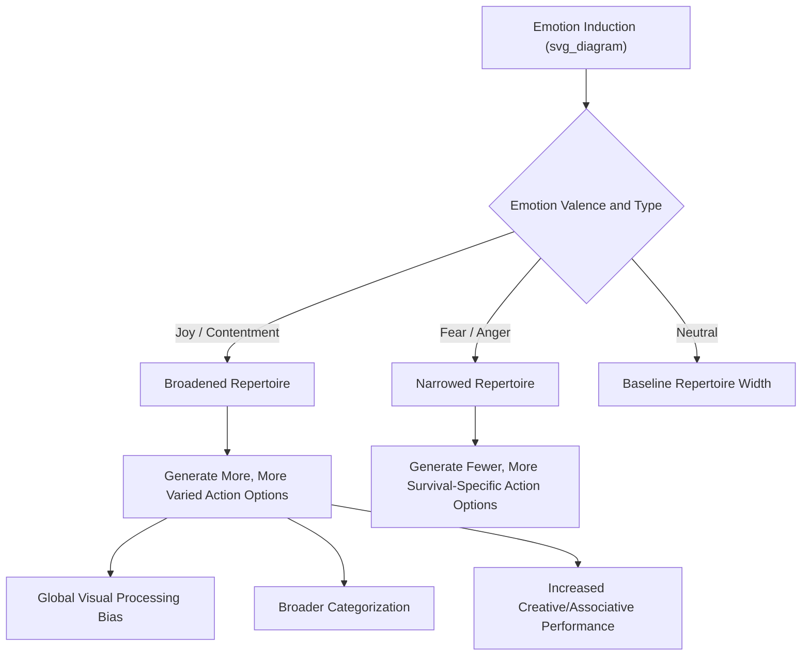

## Broaden-and-Build Theory in Depth: Broadening Cognition and Building Resources

### Overview

This chapter provides a deeper technical examination of broaden-and-build theory's two core mechanisms — the broadening of cognitive processing and the building of durable resources — extending beyond the general theoretical overview to focus on the specific cognitive paradigms, experimental measures, and resource-accumulation pathways through which the theory has been empirically tested.

### Broadening Cognition: Detailed Mechanisms

#### Global vs. Local Visual Attention

One of the most extensively studied cognitive markers of broadening involves the balance between global (whole-pattern, gestalt-level) and local (detail-level) visual processing, typically assessed using Navon-type hierarchical figures — large letters or shapes composed of smaller constituent letters or shapes.

**Example**

In a standard Navon paradigm, participants view a large letter (e.g., a large "H") composed of many small letters (e.g., small "S"s), and are asked to identify either the global letter or the local letter under time pressure. Positive emotion inductions preceding this task have been associated in multiple studies with a relative shift toward faster or more accurate global-level processing, consistent with the broadening hypothesis, while negative emotion inductions have been associated with a relative shift toward local-level processing, consistent with narrowing. [Unverified: the size and consistency of this specific effect vary across studies and moderating variables, and should be checked against current meta-analytic evidence rather than treated as a uniform, fixed-magnitude finding.]

#### Category Breadth and Inclusiveness

**Key Points**

- A second cognitive marker involves category-breadth tasks, in which participants rate how typical or representative a given exemplar is of a broader category (e.g., rating how good an example "camel" is of the category "vehicle," an atypical/borderline categorization). Positive-emotion-induced participants have shown, in multiple published studies, a tendency toward broader, more inclusive categorization — rating atypical exemplars as more representative of a category than participants in neutral or negative emotion conditions.
- [Inference] This broadened categorization is theorized to reflect the same underlying broadened cognitive processing style measured by the global/local attention paradigm, though the two paradigms measure conceptually distinct cognitive operations (perceptual attention allocation versus semantic/conceptual categorization), and their convergence is taken as support for a general broadening construct rather than a single narrow cognitive mechanism.

#### Creative and Associative Thinking

**Key Points**

- Positive emotion inductions have been associated with improved performance on some creativity and flexible-thinking measures, including tasks requiring novel or unusual associations between concepts (e.g., variants of the Remote Associates Test or unusual-uses tasks), consistent with the broadening hypothesis extended into higher-order cognitive domains beyond basic perceptual attention.
- [Unverified] The replication robustness of specific creativity-and-positive-emotion findings has been debated within the broader creativity research literature, which has faced replication challenges on several classic paradigms; specific published effect sizes in this domain should be treated with appropriate caution rather than assumed to generalize uniformly across all creativity task types and positive emotion inductions.

#### Behavioral Thought-Action Repertoire Breadth

The original Fredrickson and Branigan (2005) paradigm measured broadening more directly at the level of self-generated behavioral intentions, using a "twenty statements"-style task asking participants what they would like to do right now, following an emotion-induction film clip.

### Building Resources: Detailed Pathways

#### Physical Resource Building

**Key Points**

- The proposed physical-resource pathway operates primarily through play behavior in childhood and continued physical activity across the lifespan, motivated by joy and related positive emotions, building cardiovascular fitness, motor coordination, and physical skill that provide direct survival and functional advantages independent of any given moment's emotional state.
- [Inference] Direct longitudinal evidence specifically linking childhood positive-emotion-driven play to adult physical resource outcomes, isolated from other confounding factors (parental investment, socioeconomic status, general activity opportunity), is more limited than the cross-sectional and developmental-psychology evidence supporting the broader link between play and physical/motor skill development generally.

#### Psychological Resource Building

**Key Points**

- The psychological-resource pathway is theorized to operate through the accumulation of resilience, optimism, and ego-strength via varied positive emotional experience over time — the broadened cognitive and behavioral exploration prompted by repeated positive emotion episodes is proposed to build a more flexible, adaptable psychological repertoire for handling future adversity.
- Fredrickson and colleagues' longitudinal work (including研究 following individuals through significant stressors) has examined whether trait resilience and positive emotion show reciprocal, mutually reinforcing relationships over time, generally finding support for resilience predicting subsequent positive emotion and positive emotion predicting subsequent resilience gains, consistent with (though not definitively proving strong causal direction for) the build hypothesis. [Unverified: causal directionality in longitudinal correlational designs remains difficult to fully establish, and reciprocal-relationship findings, while consistent with the theory, do not rule out alternative explanations involving shared third variables.]

#### Social Resource Building

**Key Points**

- The social-resource pathway operates through affiliative positive emotions (love, amusement shared with others, gratitude expressed toward others) motivating approach and bonding behaviors that build durable relationships, social support networks, and reciprocal trust over time.
- This pathway has some of the strongest independent empirical grounding outside positive-emotion-specific research, given the extensive separate literature on social support as a predictor of both mental and physical health outcomes — broaden-and-build theory provides one candidate explanatory mechanism (positive emotion as the proximate driver of relationship-building behavior) for a already well-established downstream outcome (social support's protective health effects).

#### Intellectual Resource Building

**Key Points**

- The intellectual-resource pathway operates through interest and curiosity motivating exploratory learning and information-seeking, building knowledge, skill, and cognitive complexity over time — a pathway with conceptual overlap with intrinsic motivation research within Self-Determination Theory, though broaden-and-build theory frames the underlying mechanism specifically in terms of emotion-driven cognitive broadening rather than SDT's needs-satisfaction framework.

### The Undoing Hypothesis: Physiological Resource Recovery

#### Cardiovascular Recovery Paradigm

The undoing hypothesis extends broaden-and-build theory into physiological territory, proposing that positive emotions help the body recover more quickly from the cardiovascular arousal produced by negative emotion, effectively "undoing" lingering stress-related physiological activation.

**Example**

A representative experimental sequence: (1) induce cardiovascular arousal via a stress or fear-inducing task while measuring heart rate and blood pressure; (2) randomly assign participants to view film clips designed to induce contentment, amusement, sadness, or a neutral state; (3) measure time-to-baseline recovery of cardiovascular measures across conditions. Multiple published studies using this general paradigm have found faster cardiovascular recovery in positive-emotion conditions relative to neutral or continued-negative-emotion conditions. [Unverified: specific recovery-time magnitudes and the robustness of this effect across different stressor types and populations vary by study, and any single quoted recovery-time figure should be checked against the specific paradigm cited.]

**Key Points**

- The undoing hypothesis provides broaden-and-build theory with a physiological, non-self-report measurement channel, strengthening the theory's empirical base beyond subjective report and behavioral-intention measures, and connecting it to the broader cardiovascular stress-recovery literature in health psychology.

### Boundary Conditions and Moderators

#### Emotion Intensity and Context Dependence

**Key Points**

- [Inference] Broadening effects are not universally observed at all emotion intensities or in all contexts; very high-intensity positive emotional arousal (e.g., extreme excitement) may not produce the same broadening pattern as moderate-intensity positive emotion (e.g., calm contentment), and the specific boundary conditions under which broadening most reliably occurs remain an area of ongoing refinement rather than fully specified in the original theoretical statements.
- Individual difference variables (e.g., trait anxiety, cultural background, baseline cognitive style) have been proposed as potential moderators of broadening effects, though the current evidence base for specific moderators varies in strength and consistency across studies. [Unverified]

#### The Positivity Ratio Extension and Its Retraction

As detailed more fully in the broader broaden-and-build theory overview, the Fredrickson–Losada positivity ratio (approximately 3:1) extending the build-hypothesis into a precise quantitative tipping-point claim was subject to a documented mathematical critique (Brown, Sokal, and Friedman, 2013) demonstrating that the nonlinear dynamics modeling underlying the specific ratio was not validly applied to psychological data; Fredrickson subsequently acknowledged the mathematical modeling issue while maintaining the broader qualitative claim that a favorable balance of positive to negative emotion supports flourishing. This distinction — between the well-supported qualitative broaden/build mechanisms detailed in this chapter and the specifically retracted quantitative ratio claim — is important to maintain when discussing the theory's current empirical standing.

### Applications Building on the Detailed Mechanisms

**Example**

Resilience-training interventions grounded in the detailed broadening mechanism often incorporate brief perspective-broadening exercises (e.g., prompting participants to generate multiple, varied ways of viewing a stressful situation) alongside standard positive-emotion-induction techniques (gratitude practice, savoring), on the theoretical rationale that directly training broadened cognitive style may accelerate or reinforce the resource-building process beyond what positive emotion induction alone would produce. [Inference: the incremental benefit of explicitly combining cognitive-broadening training with positive emotion induction, relative to positive emotion induction alone, has not been extensively isolated in controlled trials specific to this combined approach.]

### Conclusion

The detailed mechanisms underlying broaden-and-build theory span multiple levels of analysis — perceptual attention (global/local processing), semantic categorization, creative cognition, self-reported behavioral intention, and cardiovascular physiology (via the undoing hypothesis) — providing convergent, multi-method support for the broadening component of the theory. The building component, while theoretically well-specified across physical, psychological, social, and intellectual resource pathways, relies more heavily on longitudinal correlational evidence for its longer-timescale claims, an evidentiary asymmetry that researchers and practitioners should keep in view when citing the theory's build-related predictions, particularly following the well-documented retraction of the theory's most publicized quantitative extension, the Losada positivity ratio.

**Related Topics**

- Broaden-and-build theory of positive emotions (foundational overview)
- The function and evolutionary significance of positive emotions
- The Losada positivity ratio controversy and methodological critique
- Cardiovascular stress recovery and the undoing hypothesis
- Navon paradigm and global/local visual attention research
- Resilience theory and resource-based models of coping
- Creativity research and the flexible-thinking literature
- Positive psychology interventions: gratitude, kindness, and savoring practices