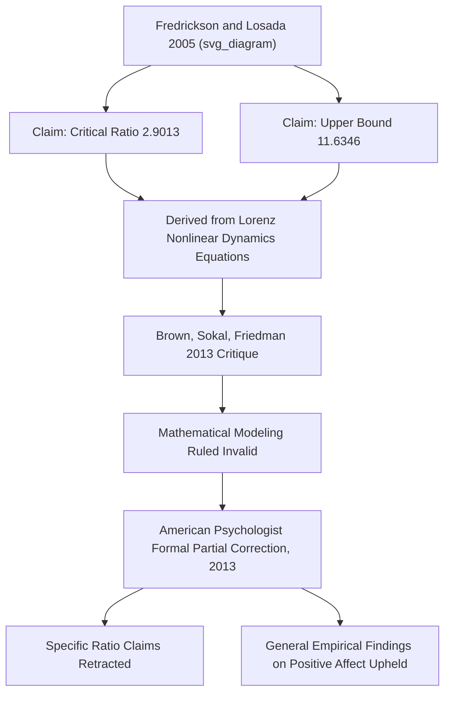

## The Positivity Ratio Debate and Its Critiques

### Overview

The critical positivity ratio controversy stands as one of positive psychology's most consequential public methodological episodes: a widely cited, precisely quantified claim about the ratio of positive to negative emotion required for flourishing was published, popularized in a bestselling book, cited hundreds of times, and then subjected to a detailed mathematical critique demonstrating the underlying modeling was invalid — leading to a formal partial correction of the original paper. This case is frequently used as a teaching example regarding the risks of over-formalizing psychological theory with imported mathematical machinery.

### The Original Claim

#### Fredrickson and Losada (2005)

Barbara Fredrickson and Brazilian organizational consultant Marcial Losada published a paper in *American Psychologist* in 2005 proposing that a ratio of positive to negative affect at or above 2.9 would characterize individuals in flourishing mental health, with a specific upper bound around 11.6 beyond which excessive positivity was theorized to become counterproductive. The paper predicted that a ratio of positive to negative affect at or above 2.9 would characterize individuals in flourishing mental health. [Retraction Watch](https://retractionwatch.com/2013/09/19/fredrickson-losada-positivity-ratio-paper-partially-withdrawn/)

**Key Points**

- The specific ratio figures, precisely 2.9013 and 11.6346, were derived using the Lorenz equations — a set of nonlinear differential equations originally developed to model atmospheric convection in fluid dynamics — applied by Losada to team-interaction and individual affect data. Brown, Sokal, and Friedman later characterized this as claiming the model provided theoretical support for a pair of critical positivity-ratio values, 2.9013 and 11.6346, such that individuals whose ratios fell between these values would flourish, while those outside this range would languish. [ResearchGate](https://www.researchgate.net/publication/265787806_The_Persistence_of_Wishful_Thinking)
- The paper's influence was substantial: it had been cited hundreds of times in the years following publication, with one account noting 360 citations according to Thomson Scientific's Web of Knowledge, and a separate count on Google Scholar found the paper cited nearly a thousand times. [Retraction Watch](https://retractionwatch.com/2013/09/19/fredrickson-losada-positivity-ratio-paper-partially-withdrawn/)[Discover Magazine](https://www.discovermagazine.com/positivity-ratio-criticized-in-new-sokal-affair-9437)
- The specific 3:1 ratio was popularized well beyond academic psychology through Fredrickson's 2009 book, Positivity, subtitled around the claim of a 3-to-1 ratio said to change readers' lives, bringing the specific numerical claim into mainstream self-help and organizational consulting contexts. [Retraction Watch](https://retractionwatch.com/2013/09/19/fredrickson-losada-positivity-ratio-paper-partially-withdrawn/)

### The Mathematical Critique

#### Brown, Sokal, and Friedman (2013)

A detailed critique was published by Nick Brown (at the time a psychology graduate student), physicist and mathematician Alan Sokal (known for the 1996 "Sokal affair" hoax paper exposing weak standards in a cultural-studies journal), and psychologist Harris Friedman.

**Key Points**

- The critique concluded that the critical positivity ratio was more than merely problematic, characterizing the mathematical claim itself as fundamentally unsound. [Sage Journals](https://journals.sagepub.com/doi/full/10.1177/0022167818762227)
- A central objection concerned the implausibility of applying equations originally derived as a simplified model of fluid convection directly to human emotional data, with the critique suggesting it was more plausible that the derivation process had been shaped to produce an apparent fit between limited empirical data and an impressive-sounding mathematical framework than that human emotion genuinely followed the same dynamics as fluid convection. [Discover Magazine](https://www.discovermagazine.com/positivity-ratio-criticized-in-new-sokal-affair-9437)
- The critique specifically targeted the *mathematical modeling* — the claim that nonlinear dynamics equations validly derived the specific numerical thresholds — rather than the more general, separately-supported empirical claim that positive emotion frequency correlates with better well-being outcomes.

#### The Formal Correction

**Key Points**

- In September 2013 (with print publication in December 2013), American Psychologist issued a formal correction to the 2005 paper, retracting the mathematical modeling section that had derived the specific positivity ratios, including both the 2.9013 flourishing threshold and the 11.6346 figure referenced from Losada's earlier team-performance research. [Grokipedia](https://grokipedia.com/page/Critical_positivity_ratio)
- The correction notice explicitly stated that the paper's empirical findings regarding positive affect and human flourishing remained valid and were unaffected by the identified mathematical flaws — distinguishing the retracted formal mathematical claims from the paper's separate observational data. [Grokipedia](https://grokipedia.com/page/Critical_positivity_ratio)
- In direct response to the critique, Losada withdrew the nonlinear dynamics model, and this position was affirmed in a joint 2013 response from Fredrickson and Losada. [ResearchGate](https://www.researchgate.net/publication/265787806_The_Persistence_of_Wishful_Thinking)

### Fredrickson's Response and Subsequent Developments

#### Acceptance of the Mathematical Critique

**Key Points**

- Fredrickson's published response conveyed that although she had previously accepted Losada's modeling as valid, she had come to question it following the critique. [Retraction Watch](https://retractionwatch.com/2013/09/19/fredrickson-losada-positivity-ratio-paper-partially-withdrawn/)
- In her formal response article, "Updated Thinking on Positivity Ratios," Fredrickson concluded that mathematical claims for a critical tipping-point positivity ratio were unfounded, while maintaining that ample evidence, even when the disputed mathematical modeling is set aside, continues to support the conclusion that higher positivity ratios are associated with flourishing mental health and other beneficial outcomes, within some bounds. [Semantic Scholar](https://www.semanticscholar.org/paper/Updated-thinking-on-positivity-ratios.-Fredrickson/9b14c9ed2e779c0137d277b7916d8b3555f9a3d0)
- This response illustrates the important distinction maintained by Fredrickson herself: rejecting the specific, precisely quantified tipping-point claim (2.9013) while continuing to defend the more general, non-quantified directional claim that a favorable balance of positive-to-negative emotion is beneficial — a position that has itself drawn further critique, discussed below.

#### Losada's Later Reversal

**Key Points**

- [Unverified — reported by a single secondary source rather than independently corroborated across multiple primary accounts] Losada reportedly issued a 2014 statement recanting his earlier 2013 withdrawal and reaffirming his original mathematical claims, in the process invoking the names of prominent mathematicians as supporters, including a Fields Medal recipient. [Sage Journals](https://journals.sagepub.com/doi/full/10.1177/0022167818762227)
- When one of the invoked mathematicians was directly contacted regarding this claimed endorsement, he stated he had never been contacted by Losada and that the claimed connection was not accurate. This episode is cited by Brown and Friedman as evidence of continued resistance to fully retracting the discredited claim even after the formal journal correction. [Sage Journals](https://journals.sagepub.com/doi/full/10.1177/0022167818762227)

### The Broader Critique: Persistence of the Debunked Claim

#### Continued Citation and Softened Characterizations

Brown and Friedman's later work documented a pattern of concern regarding how the academic literature continued to characterize the critique even after its publication.

**Key Points**

- Brown and Friedman expressed concern that subsequent literature sometimes portrayed the fundamental problems identified in the original paper as merely minor mathematical inaccuracies rather than as the more serious foundational flaw they had documented, citing specific published examples describing the matter as an ongoing "debate" whose "status" remained unresolved, or as a "fresh debate" about the relative strength of positive versus negative affect, or as merely "advanced math" that had "come" under question. [Sage Journals](https://journals.sagepub.com/doi/full/10.1177/0022167818762227)
- [Inference] This pattern — of a mathematically discredited claim continuing to be cited with hedged, softened language rather than being clearly identified as invalid — is presented by the critics as a case study in how quantitative claims, once popularized, can be difficult to fully dislodge from a field's citation practices even following a clear, published, and journal-endorsed correction.

### What Remains Empirically Supported vs. What Was Retracted

| Claim | Status |
| --- | --- |
| A precise numerical tipping point (2.9013) separates flourishing from languishing | **Retracted** — mathematical derivation shown invalid; formally corrected in the journal |
| An upper-bound ratio (11.6346) beyond which positivity becomes counterproductive | **Retracted** — derived from the same invalidated modeling |
| The Lorenz equations (fluid dynamics) validly model human emotional dynamics | **Retracted** — central target of the Brown, Sokal, and Friedman critique |
| Higher ratios of positive to negative affect are generally associated with better well-being outcomes | Maintained by Fredrickson as separately supported by other empirical evidence, though the *precise, universal* form of this claim remains contested |
| Broaden-and-build theory's core (non-quantified) mechanisms — broadening cognition, building resources | Not directly targeted by this critique; supported by a separate, broader experimental literature (see the broaden-and-build chapters) |

**Key Points**

- [Inference] It is important to distinguish the specific, now-discredited quantitative ratio claim from the qualitative broaden-and-build theoretical framework more broadly — the critique targeted Losada's specific nonlinear dynamics modeling, not the separate body of experimental evidence (attention-broadening paradigms, categorization studies, the undoing hypothesis) supporting broaden-and-build theory's core mechanisms.
- Even Fredrickson's own retained position — that higher positivity ratios are "within bounds" predictive of flourishing — is a considerably weaker and less precise claim than the original 2005 paper's specific numerical thresholds, and this weaker residual claim has itself not been established with the same quantitative precision the original paper claimed.

### Why the Episode Matters Beyond This Specific Case

#### Lessons for Psychological Theory and Mathematical Formalism

**Key Points**

- Brown, Sokal, and Friedman's critique explicitly cautioned that researchers should exercise particular care when applying advanced mathematical tools such as nonlinear dynamics to psychological phenomena, emphasizing the importance of verifying that the basic conditions required for valid application of such tools have actually been met before drawing scientific conclusions from them. [Discover Magazine](https://www.discovermagazine.com/positivity-ratio-criticized-in-new-sokal-affair-9437)
- [Inference] The episode is frequently cited in discussions of methodological rigor in positive psychology and psychology more broadly as a cautionary example of the risk of "physics envy" — importing mathematically sophisticated-looking frameworks from other disciplines in ways that lend an appearance of rigor without the underlying assumptions of those frameworks actually being satisfied.
- The rapid uptake of the original claim into popular self-help literature, corporate consulting, and educational materials, prior to and even following its mathematical correction, illustrates a broader pattern of concern regarding the translation of preliminary or contested psychological findings into prescriptive, precisely-quantified public guidance.

### Implications for Practitioners and Educators

**Key Points**

- Practitioners, coaches, and educators who may have previously cited a specific "3:1 positivity ratio" as an actionable target should be aware that the specific numerical claim has been formally retracted by the originating journal, and should instead frame any positivity-ratio-related guidance in terms of the more general, qualitative, and still-debated claim that a favorable balance of positive to negative emotion is associated with better outcomes, without asserting a specific numerical threshold.
- [Inference] Given the ongoing, documented citation of the discredited specific ratio in some secondary and applied literature, practitioners encountering the "3:1 ratio" or similar precise figures in training materials or popular positive-psychology content should treat such figures with skepticism and verify against primary sources describing the 2013 correction.

### Conclusion

The critical positivity ratio controversy represents a significant case study in positive psychology's history: a specific, precisely quantified claim about the ratio of positive to negative emotion required for flourishing — derived from a mathematically invalid application of fluid-dynamics equations to psychological data — was published, widely cited, and popularized before being subjected to a rigorous critique that led to a formal journal correction retracting the mathematical modeling, while the underlying paper's more general empirical observations were left standing. The episode illustrates both the value of rigorous post-publication critique in correcting the scientific record and the practical difficulty of fully dislodging a popularized, precisely-quantified claim from ongoing citation and applied use even after a clear, published retraction.

**Related Topics**

- Broaden-and-build theory of positive emotions
- Broaden-and-build theory in depth: broadening cognition and building resources
- Methodological rigor and replication concerns in positive psychology
- The function and evolutionary significance of positive emotions
- Positive psychology interventions: gratitude, kindness, and savoring practices
- Comparing and integrating competing models of flourishing
- Nonlinear dynamics and its (mis)application across scientific disciplines
- Critiques of popularized psychology and self-help translations of research